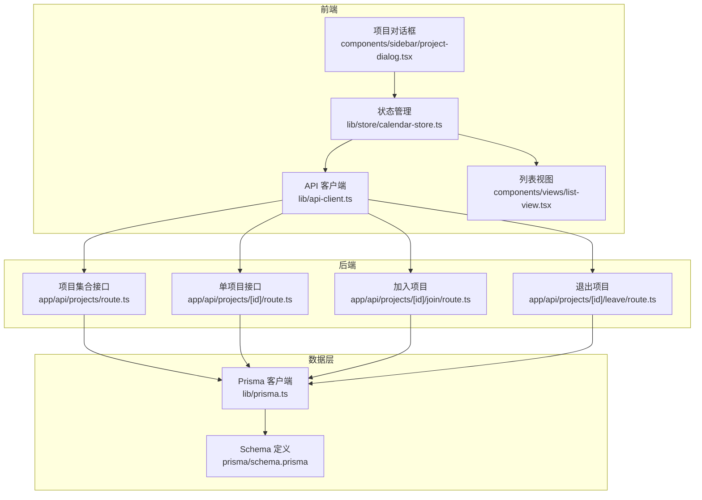
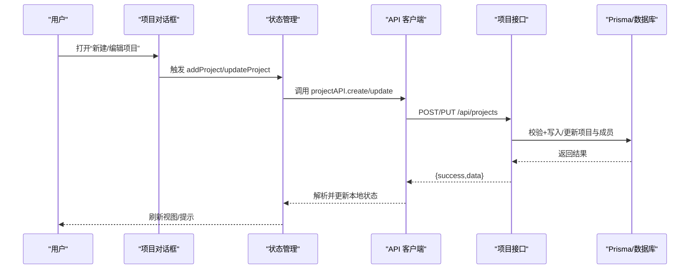
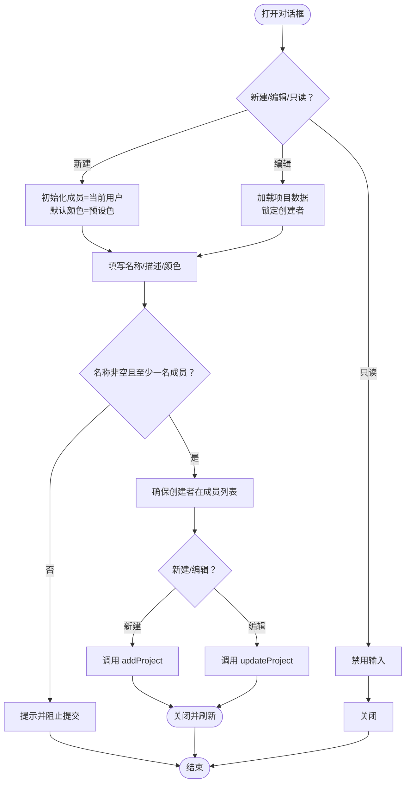
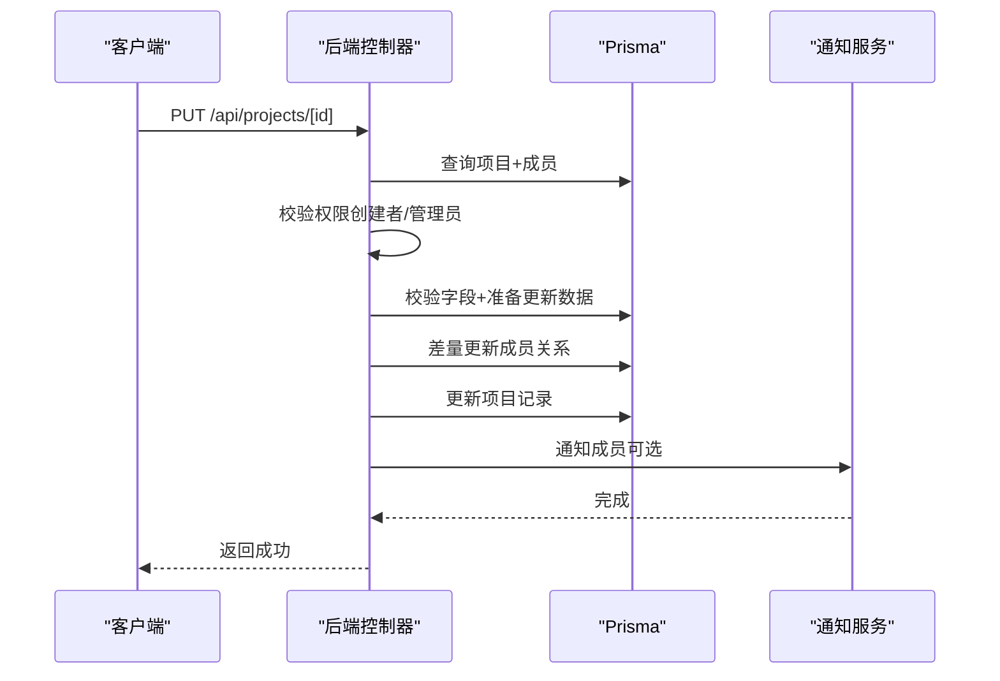
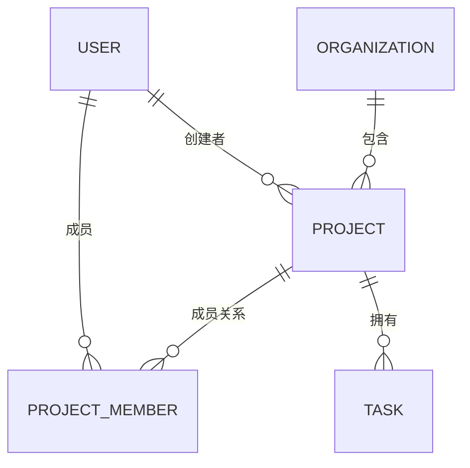
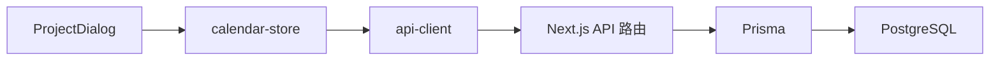

# 项目管理

<cite>
**本文引用的文件**
- [components/sidebar/project-dialog.tsx](file://components/sidebar/project-dialog.tsx)
- [app/api/projects/route.ts](file://app/api/projects/route.ts)
- [app/api/projects/[id]/route.ts](file://app/api/projects/[id]/route.ts)
- [app/api/projects/[id]/join/route.ts](file://app/api/projects/[id]/join/route.ts)
- [app/api/projects/[id]/leave/route.ts](file://app/api/projects/[id]/leave/route.ts)
- [lib/prisma.ts](file://lib/prisma.ts)
- [prisma/schema.prisma](file://prisma/schema.prisma)
- [lib/store/calendar-store.ts](file://lib/store/calendar-store.ts)
- [lib/types.ts](file://lib/types.ts)
- [lib/utils/permission-utils.ts](file://lib/utils/permission-utils.ts)
- [lib/api-client.ts](file://lib/api-client.ts)
- [components/views/list-view.tsx](file://components/views/list-view.tsx)
</cite>

## 目录
1. [简介](#简介)
2. [项目结构](#项目结构)
3. [核心组件](#核心组件)
4. [架构总览](#架构总览)
5. [详细组件分析](#详细组件分析)
6. [依赖分析](#依赖分析)
7. [性能考虑](#性能考虑)
8. [故障排查指南](#故障排查指南)
9. [结论](#结论)
10. [附录](#附录)

## 简介
本文件面向项目管理系统中的“项目对话框”组件，系统性阐述其设计与实现，覆盖项目创建、编辑、删除的完整流程；解释项目与团队的关系、项目成员管理、项目权限控制机制；说明项目颜色管理、描述编辑、时间规划等能力；给出项目数据模型、关联关系与状态管理的代码路径；并解释在多组织/多团队环境下的权限控制与数据隔离机制，以及项目搜索、筛选、排序的实现细节。

## 项目结构
项目采用前后端分离的 Next.js 应用结构，前端通过 Zustand 状态管理与 API 客户端交互，后端通过 Prisma 访问 PostgreSQL 数据库。项目对话框位于前端侧，负责收集用户输入并调用后端 API；后端 API 控制器负责鉴权、校验、业务规则与数据库操作；Prisma Schema 描述实体与关系。

图表来源
- [components/sidebar/project-dialog.tsx](file://components/sidebar/project-dialog.tsx#L1-L243)
- [lib/store/calendar-store.ts](file://lib/store/calendar-store.ts#L1-L1457)
- [lib/api-client.ts](file://lib/api-client.ts#L1-L200)
- [app/api/projects/route.ts](file://app/api/projects/route.ts#L1-L231)
- [app/api/projects/[id]/route.ts](file://app/api/projects/[id]/route.ts#L1-L283)
- [app/api/projects/[id]/join/route.ts](file://app/api/projects/[id]/join/route.ts#L1-L103)
- [app/api/projects/[id]/leave/route.ts](file://app/api/projects/[id]/leave/route.ts#L1-L93)
- [lib/prisma.ts](file://lib/prisma.ts#L1-L12)
- [prisma/schema.prisma](file://prisma/schema.prisma#L118-L136)

章节来源
- [components/sidebar/project-dialog.tsx](file://components/sidebar/project-dialog.tsx#L1-L243)
- [lib/store/calendar-store.ts](file://lib/store/calendar-store.ts#L1-L1457)
- [lib/api-client.ts](file://lib/api-client.ts#L1-L200)
- [app/api/projects/route.ts](file://app/api/projects/route.ts#L1-L231)
- [app/api/projects/[id]/route.ts](file://app/api/projects/[id]/route.ts#L1-L283)
- [app/api/projects/[id]/join/route.ts](file://app/api/projects/[id]/join/route.ts#L1-L103)
- [app/api/projects/[id]/leave/route.ts](file://app/api/projects/[id]/leave/route.ts#L1-L93)
- [lib/prisma.ts](file://lib/prisma.ts#L1-L12)
- [prisma/schema.prisma](file://prisma/schema.prisma#L118-L136)

## 核心组件
- 项目对话框（ProjectDialog）：负责项目创建/编辑的表单渲染与提交，支持颜色选择、成员选择、协同权限设置、创建者变更等。
- 项目 API 控制器：提供项目集合查询、创建、单项目查询、更新、删除，以及加入/退出项目的接口。
- 状态管理（Zustand）：封装项目数据加载、增删改、项目过滤（多选/全选/清空）、权限检查触发等。
- 权限工具：提供项目/团队任务权限检查与错误消息生成。
- Prisma Schema：定义 Project、ProjectMember、Organization、User 等实体及关系。

章节来源
- [components/sidebar/project-dialog.tsx](file://components/sidebar/project-dialog.tsx#L1-L243)
- [app/api/projects/route.ts](file://app/api/projects/route.ts#L1-L231)
- [app/api/projects/[id]/route.ts](file://app/api/projects/[id]/route.ts#L1-L283)
- [lib/store/calendar-store.ts](file://lib/store/calendar-store.ts#L1-L1457)
- [lib/utils/permission-utils.ts](file://lib/utils/permission-utils.ts#L1-L72)
- [prisma/schema.prisma](file://prisma/schema.prisma#L118-L136)

## 架构总览
项目对话框通过状态管理器发起 API 调用，后端控制器进行鉴权与业务校验，Prisma 执行数据库操作，并在必要时发送站内通知。权限控制贯穿前端 UI 交互与后端接口，确保数据隔离与最小权限原则。

图表来源
- [components/sidebar/project-dialog.tsx](file://components/sidebar/project-dialog.tsx#L62-L98)
- [lib/store/calendar-store.ts](file://lib/store/calendar-store.ts#L129-L138)
- [lib/api-client.ts](file://lib/api-client.ts#L44-L100)
- [app/api/projects/route.ts](file://app/api/projects/route.ts#L117-L230)

章节来源
- [components/sidebar/project-dialog.tsx](file://components/sidebar/project-dialog.tsx#L62-L98)
- [lib/store/calendar-store.ts](file://lib/store/calendar-store.ts#L129-L138)
- [lib/api-client.ts](file://lib/api-client.ts#L44-L100)
- [app/api/projects/route.ts](file://app/api/projects/route.ts#L117-L230)

## 详细组件分析

### 项目对话框（ProjectDialog）
- 表单字段与行为
  - 名称：必填校验，非空即提交。
  - 描述：可选文本域。
  - 颜色：预设颜色集合，支持选择并高亮当前颜色。
  - 成员：多选成员，新建时默认包含当前用户；编辑时可锁定创建者。
  - 协同权限：RadioGroup 选择 ALL_MEMBERS 或 CREATOR_ONLY。
  - 创建者：仅编辑模式可见，需具备编辑权限（创建者或管理员）。
- 提交流程
  - 新建：构造项目对象（含 color、memberIds、creatorId、taskPermission），调用 addProject。
  - 编辑：构造更新对象，调用 updateProject。
  - 成员一致性：确保创建者始终在成员列表中。
- UI 交互
  - 只读模式：禁用输入与提交按钮。
  - 成员锁定：查看模式下锁定全部成员，编辑模式下锁定创建者。

图表来源
- [components/sidebar/project-dialog.tsx](file://components/sidebar/project-dialog.tsx#L40-L98)

章节来源
- [components/sidebar/project-dialog.tsx](file://components/sidebar/project-dialog.tsx#L22-L243)

### 项目 API（集合/单个/加入/退出）
- 集合接口
  - GET /api/projects：按当前组织返回项目列表，包含成员与创建者信息，按创建时间升序。
  - POST /api/projects：创建项目，校验组织内名称唯一、创建者必须在组织内、默认协同权限为 ALL_MEMBERS。
- 单项目接口
  - GET /api/projects/[id]：仅项目成员可查看。
  - PUT /api/projects/[id]：创建者或管理员可更新；支持变更创建者（仅限存在性校验）；成员变更通过差量计算增删。
  - DELETE /api/projects/[id]：项目创建者、组织创建者或管理员可删除；需无任务且级联删除成员关系，同时向成员发送删除通知。
- 加入/退出
  - POST /api/projects/[id]/join：非成员可加入，重复加入报错。
  - POST /api/projects/[id]/leave：创建者不可退出；成员可退出并向创建者发送通知。

图表来源
- [app/api/projects/[id]/route.ts](file://app/api/projects/[id]/route.ts#L64-L187)

章节来源
- [app/api/projects/route.ts](file://app/api/projects/route.ts#L6-L114)
- [app/api/projects/route.ts](file://app/api/projects/route.ts#L116-L231)
- [app/api/projects/[id]/route.ts](file://app/api/projects/[id]/route.ts#L13-L62)
- [app/api/projects/[id]/route.ts](file://app/api/projects/[id]/route.ts#L64-L187)
- [app/api/projects/[id]/route.ts](file://app/api/projects/[id]/route.ts#L189-L283)
- [app/api/projects/[id]/join/route.ts](file://app/api/projects/[id]/join/route.ts#L11-L103)
- [app/api/projects/[id]/leave/route.ts](file://app/api/projects/[id]/leave/route.ts#L11-L93)

### 项目数据模型与关联关系
- 实体与字段
  - Project：id、name、color、description、organizationId、creatorId、taskPermission、createdAt/updatedAt。
  - ProjectMember：多对多关系，连接 User 与 Project。
  - Organization：包含 Projects。
  - User：包含 createdProjects、projectMembers。
- 关系图

图表来源
- [prisma/schema.prisma](file://prisma/schema.prisma#L118-L136)
- [prisma/schema.prisma](file://prisma/schema.prisma#L207-L219)
- [prisma/schema.prisma](file://prisma/schema.prisma#L16-L35)

章节来源
- [prisma/schema.prisma](file://prisma/schema.prisma#L118-L136)
- [prisma/schema.prisma](file://prisma/schema.prisma#L207-L219)
- [prisma/schema.prisma](file://prisma/schema.prisma#L16-L35)

### 项目权限控制与数据隔离
- 前端权限
  - 任务权限检查：canManageTaskInProject 根据项目 taskPermission 与成员身份判定。
  - UI 级别：编辑模式下仅创建者或管理员可变更创建者；查看模式下成员锁定。
- 后端权限
  - 查看：仅项目成员可 GET 单项目。
  - 更新：项目创建者或管理员可 PUT；变更创建者需校验新创建者存在。
  - 删除：项目创建者、组织创建者或管理员可 DELETE；需无任务。
  - 加入/退出：加入需非成员；退出需非创建者。
- 数据隔离
  - 项目属于组织，查询项目列表时基于当前组织上下文；创建项目时强制要求创建者在当前组织内。

章节来源
- [lib/utils/permission-utils.ts](file://lib/utils/permission-utils.ts#L11-L30)
- [components/sidebar/project-dialog.tsx](file://components/sidebar/project-dialog.tsx#L58-L60)
- [app/api/projects/[id]/route.ts](file://app/api/projects/[id]/route.ts#L51-L57)
- [app/api/projects/[id]/route.ts](file://app/api/projects/[id]/route.ts#L94-L97)
- [app/api/projects/[id]/route.ts](file://app/api/projects/[id]/route.ts#L233-L240)
- [app/api/projects/route.ts](file://app/api/projects/route.ts#L142-L156)

### 项目成员管理与协同权限
- 成员管理
  - 新建：默认包含当前用户；编辑时可增删成员；确保创建者在成员列表。
  - 加入/退出：通过专用接口完成，退出时向创建者发送通知。
- 协同权限
  - ALL_MEMBERS：项目成员可互相创建/编辑/删除任务。
  - CREATOR_ONLY：仅创建者可管理任务。
  - 前端错误提示：根据权限生成友好提示消息。

章节来源
- [components/sidebar/project-dialog.tsx](file://components/sidebar/project-dialog.tsx#L47-L54)
- [components/sidebar/project-dialog.tsx](file://components/sidebar/project-dialog.tsx#L191-L225)
- [lib/utils/permission-utils.ts](file://lib/utils/permission-utils.ts#L66-L71)
- [app/api/projects/[id]/join/route.ts](file://app/api/projects/[id]/join/route.ts#L45-L57)
- [app/api/projects/[id]/leave/route.ts](file://app/api/projects/[id]/leave/route.ts#L36-L51)

### 项目颜色管理、描述编辑、时间规划
- 颜色管理：预设颜色集合，支持选择并持久化到项目记录。
- 描述编辑：Textarea 输入，支持空值清理。
- 时间规划：项目本身不直接存储起止时间，但与任务（Task）关联；任务的时间范围由任务实体维护。

章节来源
- [components/sidebar/project-dialog.tsx](file://components/sidebar/project-dialog.tsx#L28-L38)
- [components/sidebar/project-dialog.tsx](file://components/sidebar/project-dialog.tsx#L127-L140)
- [prisma/schema.prisma](file://prisma/schema.prisma#L138-L164)

### 项目搜索、筛选、排序
- 项目筛选（前端）
  - 支持多选项目过滤、全选/清空；根据 selectedProjectIds 过滤任务列表。
- 任务筛选（与项目联动）
  - 列表视图根据导航模式与项目过滤条件，对任务进行过滤与分组。
- 排序
  - 项目列表按 createdAt 升序排列。

章节来源
- [lib/store/calendar-store.ts](file://lib/store/calendar-store.ts#L1057-L1088)
- [components/views/list-view.tsx](file://components/views/list-view.tsx#L79-L114)
- [app/api/projects/route.ts](file://app/api/projects/route.ts#L84-L86)

## 依赖分析
- 组件耦合
  - ProjectDialog 依赖状态管理器与用户选择器组件，负责表单与提交。
  - 状态管理器封装 API 客户端调用，统一处理错误与刷新。
- 外部依赖
  - Prisma 作为 ORM，负责数据库访问与事务。
  - Next.js API 路由作为后端入口，配合中间件进行鉴权。

图表来源
- [components/sidebar/project-dialog.tsx](file://components/sidebar/project-dialog.tsx#L1-L243)
- [lib/store/calendar-store.ts](file://lib/store/calendar-store.ts#L1-L1457)
- [lib/api-client.ts](file://lib/api-client.ts#L1-L200)
- [app/api/projects/route.ts](file://app/api/projects/route.ts#L1-L231)
- [lib/prisma.ts](file://lib/prisma.ts#L1-L12)

章节来源
- [components/sidebar/project-dialog.tsx](file://components/sidebar/project-dialog.tsx#L1-L243)
- [lib/store/calendar-store.ts](file://lib/store/calendar-store.ts#L1-L1457)
- [lib/api-client.ts](file://lib/api-client.ts#L1-L200)
- [app/api/projects/route.ts](file://app/api/projects/route.ts#L1-L231)
- [lib/prisma.ts](file://lib/prisma.ts#L1-L12)

## 性能考虑
- 前端
  - 使用 Zustand 管理轻量状态，避免不必要的重渲染。
  - API 调用采用并发加载策略，减少首屏等待。
- 后端
  - 查询项目列表时使用 include 一次性加载成员与创建者，减少往返。
  - 删除项目使用事务保证一致性，并批量创建通知。
- 数据库
  - 为 Project、ProjectMember、Organization 等关键字段建立索引，提升查询效率。

## 故障排查指南
- 403 无权访问
  - 场景：非项目成员查看单项目、非项目成员/管理员更新/删除项目。
  - 排查：确认用户是否在项目成员列表；确认用户是否为创建者或管理员。
- 409 同名冲突
  - 场景：创建项目时组织内已存在同名项目。
  - 排查：更换项目名称或切换组织。
- 400 参数校验失败
  - 场景：名称或颜色为空；创建者不存在；成员列表为空。
  - 排查：补齐必填项；确保成员存在且至少一名。
- 404 项目不存在
  - 场景：操作不存在的项目。
  - 排查：确认项目 ID 正确；检查路由参数。
- 400 仍有任务无法删除
  - 场景：删除项目前项目下存在任务。
  - 排查：先清理任务或迁移任务后再删除。

章节来源
- [app/api/projects/[id]/route.ts](file://app/api/projects/[id]/route.ts#L51-L57)
- [app/api/projects/[id]/route.ts](file://app/api/projects/[id]/route.ts#L94-L97)
- [app/api/projects/[id]/route.ts](file://app/api/projects/[id]/route.ts#L233-L240)
- [app/api/projects/route.ts](file://app/api/projects/route.ts#L122-L130)
- [app/api/projects/route.ts](file://app/api/projects/route.ts#L158-L174)
- [app/api/projects/[id]/route.ts](file://app/api/projects/[id]/route.ts#L242-L245)

## 结论
项目对话框组件以简洁直观的表单为核心，结合前端状态管理与后端严格的权限控制，实现了项目创建、编辑、删除的完整闭环。通过协同权限与成员管理，系统在多团队/多组织环境下提供了灵活而安全的任务协作能力。建议持续优化前端筛选与排序体验，增强错误提示与回滚机制，进一步提升可用性与稳定性。

## 附录
- 类型定义参考：Project、TaskPermission、User 等类型在类型文件中定义，确保前后端一致。
- API 客户端：统一处理 Token、错误与响应格式，简化调用方逻辑。

章节来源
- [lib/types.ts](file://lib/types.ts#L96-L106)
- [lib/types.ts](file://lib/types.ts#L3)
- [lib/api-client.ts](file://lib/api-client.ts#L44-L100)