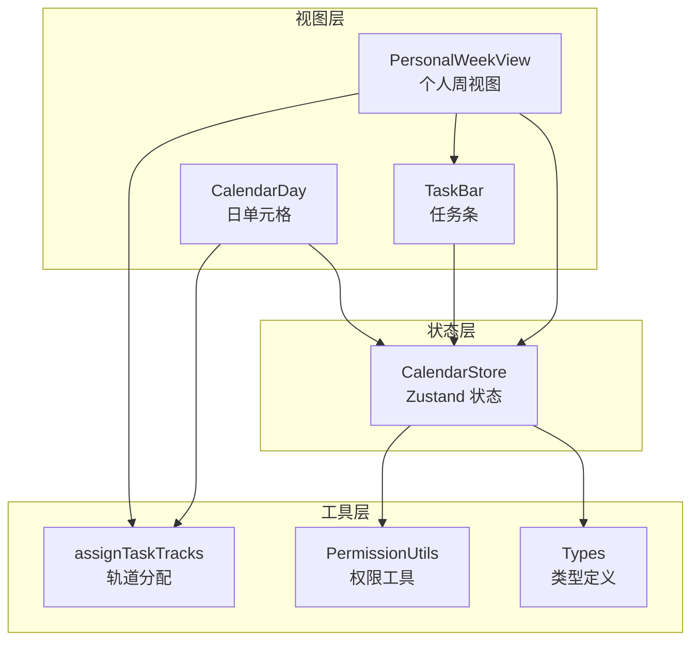
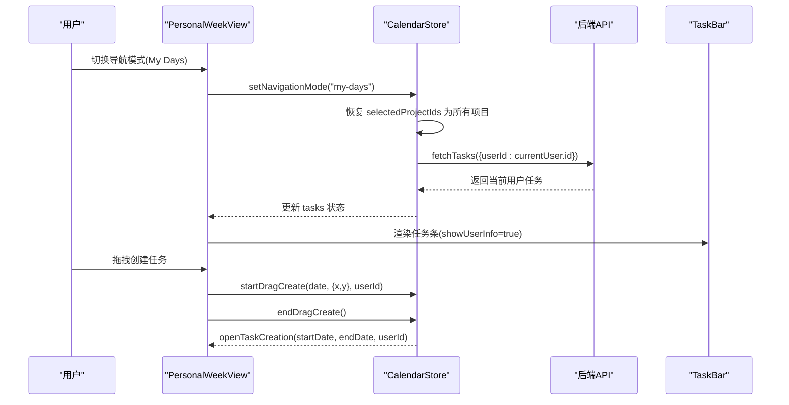
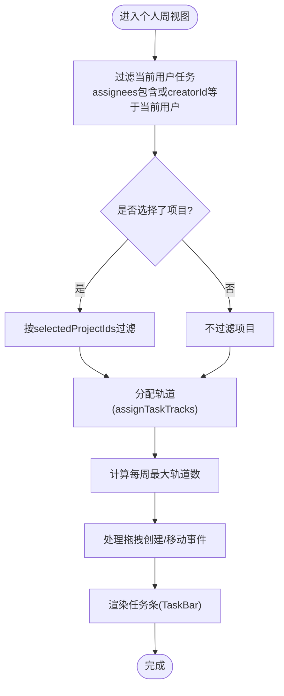
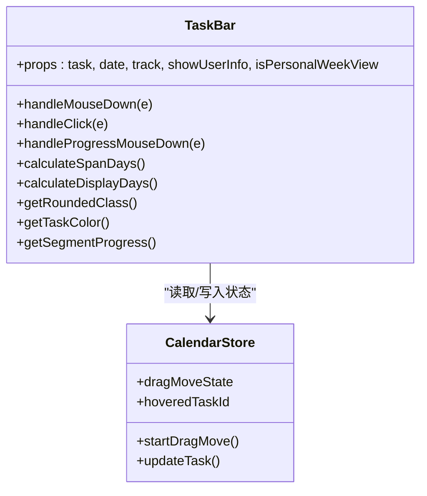
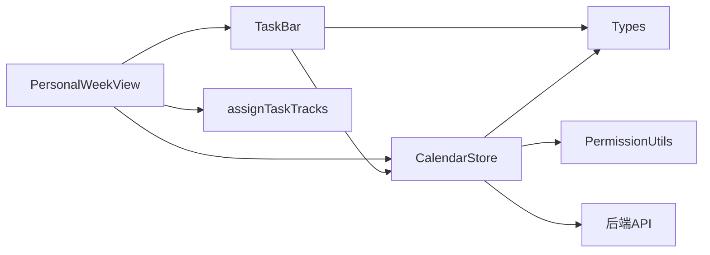

# 个人视图组件

<cite>
**本文档引用的文件**
- [personal-week-view.tsx](file://components/calendar/personal-week-view.tsx)
- [task-bar.tsx](file://components/calendar/task-bar.tsx)
- [calendar-day.tsx](file://components/calendar/calendar-day.tsx)
- [calendar-store.ts](file://lib/store/calendar-store.ts)
- [task-layout.ts](file://lib/utils/task-layout.ts)
- [types.ts](file://lib/types.ts)
- [team-member-row.tsx](file://components/calendar/team-member-row.tsx)
- [week-view.tsx](file://components/calendar/week-view.tsx)
- [permission-utils.ts](file://lib/utils/permission-utils.ts)
- [MY_DAYS_BUG_FIX.md](file://MY_DAYS_BUG_FIX.md)
- [task-form-panel.tsx](file://components/task/task-form-panel.tsx)
</cite>

## 目录
1. [简介](#简介)
2. [项目结构](#项目结构)
3. [核心组件](#核心组件)
4. [架构概览](#架构概览)
5. [详细组件分析](#详细组件分析)
6. [依赖关系分析](#依赖关系分析)
7. [性能考量](#性能考量)
8. [故障排除指南](#故障排除指南)
9. [结论](#结论)
10. [附录](#附录)

## 简介
本文档深入解析个人视图组件的实现原理，重点涵盖：
- My Days 导航模式的处理机制
- 个人任务筛选逻辑与权限验证
- 时间线布局与轨道分配算法
- 个人视图与团队视图的差异对比
- 任务条渲染实现（颜色、进度、交互、右键菜单）
- 拖拽创建任务在个人视图中的特殊处理（默认分配、项目过滤）
- 自定义样式、复杂任务关系处理与大数据量渲染优化

## 项目结构
个人视图位于日历模块中，采用“视图组件 + 状态管理 + 工具函数”的分层架构：
- 视图层：个人周视图、任务条、日单元格
- 状态层：Zustand 状态存储，统一管理导航模式、任务数据、拖拽状态
- 工具层：任务布局算法、类型定义、权限工具

**图表来源**
- [personal-week-view.tsx](file://components/calendar/personal-week-view.tsx#L1-L200)
- [task-bar.tsx](file://components/calendar/task-bar.tsx#L1-L700)
- [calendar-day.tsx](file://components/calendar/calendar-day.tsx#L1-L164)
- [calendar-store.ts](file://lib/store/calendar-store.ts#L1-L800)
- [task-layout.ts](file://lib/utils/task-layout.ts#L1-L77)
- [types.ts](file://lib/types.ts#L1-L141)
- [permission-utils.ts](file://lib/utils/permission-utils.ts#L1-L72)

**章节来源**
- [personal-week-view.tsx](file://components/calendar/personal-week-view.tsx#L1-L200)
- [calendar-store.ts](file://lib/store/calendar-store.ts#L1-L800)

## 核心组件
- 个人周视图（PersonalWeekView）：渲染一周内当前用户的任务，支持拖拽创建、拖拽移动、轨道分配与时间线布局。
- 任务条（TaskBar）：渲染单个任务条，包含颜色、进度、用户信息、拖拽交互、进度拖拽手柄等。
- 日单元格（CalendarDay）：通用日单元格组件，支持拖拽创建与任务渲染（团队/项目视图使用）。
- 状态存储（CalendarStore）：集中管理导航模式、任务数据、拖拽状态、用户信息、项目过滤等。
- 任务布局（assignTaskTracks）：为重叠任务分配轨道，确保在同一时间段的任务不互相遮挡。
- 权限工具（PermissionUtils）：基于项目/团队的协同权限进行任务管理权限校验。

**章节来源**
- [personal-week-view.tsx](file://components/calendar/personal-week-view.tsx#L10-L200)
- [task-bar.tsx](file://components/calendar/task-bar.tsx#L20-L700)
- [calendar-day.tsx](file://components/calendar/calendar-day.tsx#L22-L164)
- [calendar-store.ts](file://lib/store/calendar-store.ts#L33-L198)
- [task-layout.ts](file://lib/utils/task-layout.ts#L28-L77)
- [permission-utils.ts](file://lib/utils/permission-utils.ts#L11-L72)

## 架构概览
个人视图与团队视图的关键差异体现在数据过滤规则、权限验证与任务可见性控制：
- 导航模式：My Days（个人）、Team（团队）、Project（项目）
- 数据过滤：My Days 模式下按“当前用户负责或创建”过滤；团队/项目模式按成员或项目成员过滤
- 权限验证：基于项目/团队的 taskPermission 设置，区分“所有成员”与“仅创建者”
- 任务可见性：My Days 模式下支持项目过滤与个人任务筛选；团队/项目模式下按成员可见性控制

**图表来源**
- [personal-week-view.tsx](file://components/calendar/personal-week-view.tsx#L114-L144)
- [calendar-store.ts](file://lib/store/calendar-store.ts#L1282-L1320)
- [task-form-panel.tsx](file://components/task/task-form-panel.tsx#L116-L122)

**章节来源**
- [week-view.tsx](file://components/calendar/week-view.tsx#L9-L109)
- [team-member-row.tsx](file://components/calendar/team-member-row.tsx#L18-L40)
- [calendar-store.ts](file://lib/store/calendar-store.ts#L220-L231)

## 详细组件分析

### 个人周视图（PersonalWeekView）
职责与特性：
- 基于当前日期生成一周日期序列（可隐藏周末）
- 过滤当前用户的任务：assignees 包含当前用户或 creatorId 等于当前用户
- 项目过滤：若选择了项目，则仅显示所选项目中的任务
- 轨道分配：对用户任务应用 assignTaskTracks 算法，避免重叠遮挡
- 时间线布局：计算每周最大轨道数，动态设置容器高度
- 拖拽创建：支持在日单元格内拖拽创建任务，默认分配给当前用户
- 拖拽移动：支持在任务条上拖拽移动任务，全局 mouseup 事件清理状态

关键实现要点：
- 任务筛选逻辑：使用 useMemo 缓存过滤结果，避免重复计算
- 轨道分配：先按开始/结束时间排序，再逐个分配最低可用轨道
- 拖拽范围高亮：根据 dragState 的起止日期高亮目标区域
- 交互事件：mousedown 开始拖拽、mouseenter 更新范围、mouseup 结束并打开创建面板

**图表来源**
- [personal-week-view.tsx](file://components/calendar/personal-week-view.tsx#L31-L94)
- [task-layout.ts](file://lib/utils/task-layout.ts#L28-L68)

**章节来源**
- [personal-week-view.tsx](file://components/calendar/personal-week-view.tsx#L10-L200)
- [task-layout.ts](file://lib/utils/task-layout.ts#L28-L77)

### 任务条（TaskBar）
职责与特性：
- 渲染任务条的外观：颜色、圆角、进度背景、文本
- 用户信息显示：单人、多人、无负责人时的不同展示策略
- 进度显示与拖拽：支持日常任务的进度拖拽手柄，实时计算段内进度到总进度的映射
- 拖拽移动：支持在任务条上拖拽移动，全局状态控制跨段高亮
- 交互细节：左键拖拽、点击打开编辑、hover 状态跨段高亮

关键实现要点：
- 圆角策略：开始段左圆角、结束段右圆角、跨段两端圆角
- 进度计算：按段内进度推导总进度，避免跨段误差
- 用户头像堆叠：优先显示当前用户，最多显示3个头像
- 乐观更新：进度拖拽时设置乐观状态，等待后端确认后清除

**图表来源**
- [task-bar.tsx](file://components/calendar/task-bar.tsx#L20-L700)
- [calendar-store.ts](file://lib/store/calendar-store.ts#L72-L95)

**章节来源**
- [task-bar.tsx](file://components/calendar/task-bar.tsx#L20-L700)

### 日单元格（CalendarDay）
职责与特性：
- 通用日单元格组件，支持拖拽创建与任务渲染
- 任务过滤：在当前日期开始或周一跨周继续的任务
- 拖拽创建：支持在日单元格内拖拽创建任务
- 高亮与展开：拖拽范围高亮、悬停高亮、展开模式

注意：个人周视图使用独立的渲染逻辑，日单元格主要用于团队/项目视图。

**章节来源**
- [calendar-day.tsx](file://components/calendar/calendar-day.tsx#L22-L164)

### 状态存储（CalendarStore）
职责与特性：
- 导航模式：my-days、team、project
- 任务数据：tasks、users、projects、teams
- 拖拽状态：dragState、dragMoveState
- 项目过滤：selectedProjectIds
- 用户信息：currentUser
- 行为方法：fetchTasks、addTask、updateTask、deleteTask、openTaskCreation、openTaskEdit 等

关键实现要点：
- setNavigationMode：切换到 My Days 时恢复 selectedProjectIds 并加载当前用户任务
- fetchAllData：初始化加载用户、团队、项目数据，并根据导航模式加载对应任务
- openTaskCreation：在 My Days 模式下默认选中个人事务项目

**章节来源**
- [calendar-store.ts](file://lib/store/calendar-store.ts#L220-L231)
- [calendar-store.ts](file://lib/store/calendar-store.ts#L541-L546)
- [calendar-store.ts](file://lib/store/calendar-store.ts#L1282-L1320)

### 任务布局算法（assignTaskTracks）
职责与特性：
- 输入：任务数组（按开始时间排序）
- 输出：每个任务附加轨道 track
- 算法：逐个任务寻找最低可用轨道，避免与同一轨道上的重叠任务冲突

复杂度分析：
- 时间复杂度：O(n^2)，其中 n 为任务数量
- 空间复杂度：O(n)

优化建议：
- 对于大数据量，可在前端缓存轨道分配结果，避免重复计算
- 可考虑使用区间树等数据结构优化重叠检测

**章节来源**
- [task-layout.ts](file://lib/utils/task-layout.ts#L28-L68)

### 权限验证（PermissionUtils）
职责与特性：
- canManageTaskInProject：基于项目 taskPermission 判断是否可管理任务
- canManageTaskInTeam：基于团队 taskPermission 判断是否可管理任务
- getPermissionDeniedMessage：生成权限不足的错误消息

权限规则：
- ALL_MEMBERS：所有成员均可管理（包括修改负责人、归属项目等）
- CREATOR_ONLY：仅创建者可管理

**章节来源**
- [permission-utils.ts](file://lib/utils/permission-utils.ts#L11-L72)

## 依赖关系分析

**图表来源**
- [personal-week-view.tsx](file://components/calendar/personal-week-view.tsx#L1-L200)
- [task-bar.tsx](file://components/calendar/task-bar.tsx#L1-L700)
- [calendar-store.ts](file://lib/store/calendar-store.ts#L1-L800)
- [types.ts](file://lib/types.ts#L61-L82)
- [permission-utils.ts](file://lib/utils/permission-utils.ts#L1-L72)

**章节来源**
- [personal-week-view.tsx](file://components/calendar/personal-week-view.tsx#L1-L200)
- [task-bar.tsx](file://components/calendar/task-bar.tsx#L1-L700)
- [calendar-store.ts](file://lib/store/calendar-store.ts#L1-L800)

## 性能考量
- 任务筛选与轨道分配：使用 useMemo 缓存过滤结果与轨道分配，避免重复计算
- 大数据量优化：
  - 任务条高度与间距：紧凑型 24px，宽松型 30px，减少 DOM 节点高度带来的重排成本
  - 跨段高亮：通过全局 hoveredTaskId 实现，避免每段单独维护 hover 状态
  - 拖拽进度：使用乐观更新与闭包优化，减少不必要的 re-render
- 渲染策略：个人周视图采用单行布局，减少滚动与重绘开销

[本节为一般性指导，无需特定文件引用]

## 故障排除指南
常见问题与解决方案：
- My Days 数据加载不一致：切换导航模式后数据不显示
  - 修复：setNavigationMode 切换到 My Days 时恢复 selectedProjectIds 并加载当前用户任务
  - 参考：[MY_DAYS_BUG_FIX.md](file://MY_DAYS_BUG_FIX.md#L19-L41)
- 任务条缺少头像与进度：My Days 模式下任务条不显示用户信息
  - 修复：在 My Days 模式下也启用 showUserInfo
  - 参考：[MY_DAYS_BUG_FIX.md](file://MY_DAYS_BUG_FIX.md#L61-L79)
- 拖拽创建任务默认分配：个人视图拖拽创建任务应默认分配给当前用户
  - 实现：startDragCreate 传入 userId，endDragCreate 后 openTaskCreation 传入 userId
  - 参考：[personal-week-view.tsx](file://components/calendar/personal-week-view.tsx#L114-L144)
- 个人事务项目默认负责人：创建/编辑个人事务项目时自动设置当前用户为负责人
  - 实现：useEffect 中设置 assigneeIds 为 [currentUser.id]
  - 参考：[task-form-panel.tsx](file://components/task/task-form-panel.tsx#L116-L122)

**章节来源**
- [MY_DAYS_BUG_FIX.md](file://MY_DAYS_BUG_FIX.md#L1-L195)
- [personal-week-view.tsx](file://components/calendar/personal-week-view.tsx#L114-L144)
- [task-form-panel.tsx](file://components/task/task-form-panel.tsx#L116-L122)

## 结论
个人视图组件通过清晰的分层架构与完善的权限控制，实现了高效、直观的个人任务管理体验。其核心优势在于：
- My Days 导航模式的稳定数据加载与项目过滤
- 基于轨道分配的时间线布局，确保复杂任务关系的可读性
- 丰富的交互能力（拖拽创建、拖拽移动、进度拖拽）提升用户体验
- 与团队视图的差异化设计满足不同场景需求

[本节为总结性内容，无需特定文件引用]

## 附录

### 个人视图与团队视图的区别
- 数据过滤规则
  - My Days：按当前用户负责或创建过滤，支持项目过滤
  - Team：按团队成员过滤，显示团队成员各自的任务
  - Project：按项目成员过滤，显示项目成员各自的任务
- 权限验证
  - My Days：基于项目 taskPermission 判断当前用户是否可管理任务
  - Team/Project：分别基于团队/项目的 taskPermission 判断
- 任务可见性控制
  - My Days：支持项目过滤与个人任务筛选
  - Team/Project：按成员可见性控制，拖拽创建时限制用户 ID

**章节来源**
- [week-view.tsx](file://components/calendar/week-view.tsx#L29-L51)
- [team-member-row.tsx](file://components/calendar/team-member-row.tsx#L22-L37)
- [permission-utils.ts](file://lib/utils/permission-utils.ts#L11-L72)

### 任务条渲染实现要点
- 颜色与进度
  - 颜色：根据任务类型与自定义颜色配置决定
  - 进度：日常任务显示进度圈，支持拖拽调整
- 点击交互
  - 非拖拽状态下点击打开编辑面板
- 右键菜单
  - 当前实现未包含右键菜单，如需扩展可在 TaskBar 上添加 contextmenu 事件处理

**章节来源**
- [task-bar.tsx](file://components/calendar/task-bar.tsx#L233-L270)
- [task-bar.tsx](file://components/calendar/task-bar.tsx#L272-L278)

### 拖拽创建任务的特殊处理
- 默认分配给当前用户：startDragCreate 传入 userId，endDragCreate 后 openTaskCreation 传入 userId
- 项目过滤：My Days 模式下默认选中个人事务项目，确保任务归属正确

**章节来源**
- [personal-week-view.tsx](file://components/calendar/personal-week-view.tsx#L114-L144)
- [calendar-store.ts](file://lib/store/calendar-store.ts#L1282-L1320)

### 自定义样式与复杂任务关系
- 自定义样式
  - 通过 TASK_COLORS 配置任务颜色，支持边框、浅色背景与文字颜色组合
  - 任务条尺寸：紧凑型/宽松型，影响高度与头像尺寸
- 复杂任务关系
  - 使用 assignTaskTracks 算法确保重叠任务在不同轨道
  - 跨段进度拖拽：将段内进度映射到总进度，保证一致性

**章节来源**
- [types.ts](file://lib/types.ts#L133-L139)
- [task-bar.tsx](file://components/calendar/task-bar.tsx#L383-L435)
- [task-layout.ts](file://lib/utils/task-layout.ts#L28-L68)