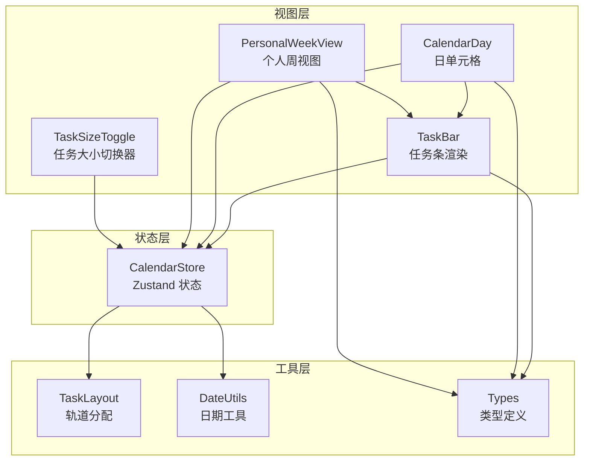
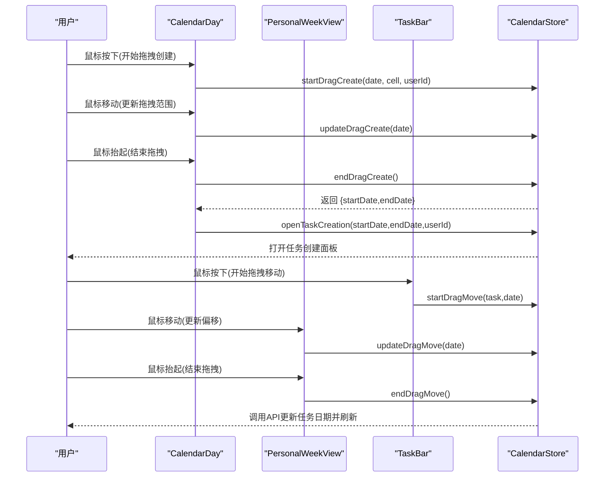
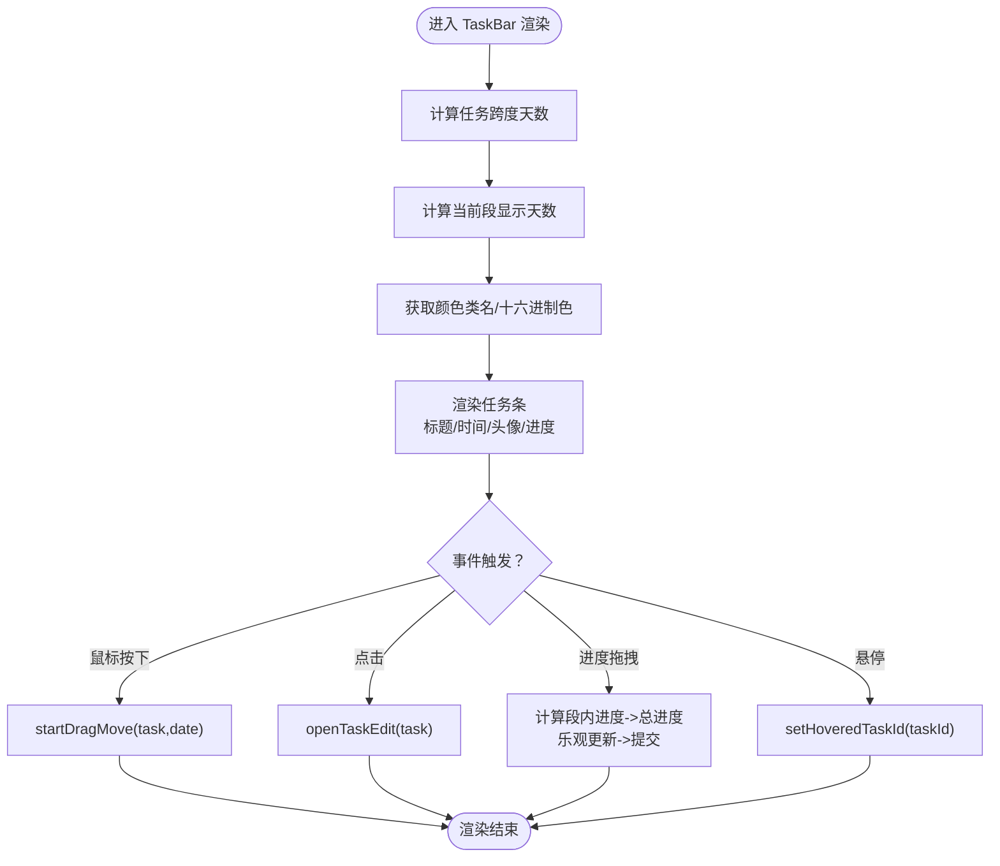
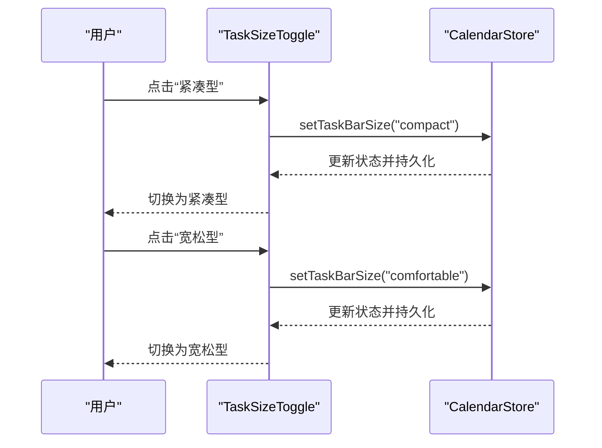
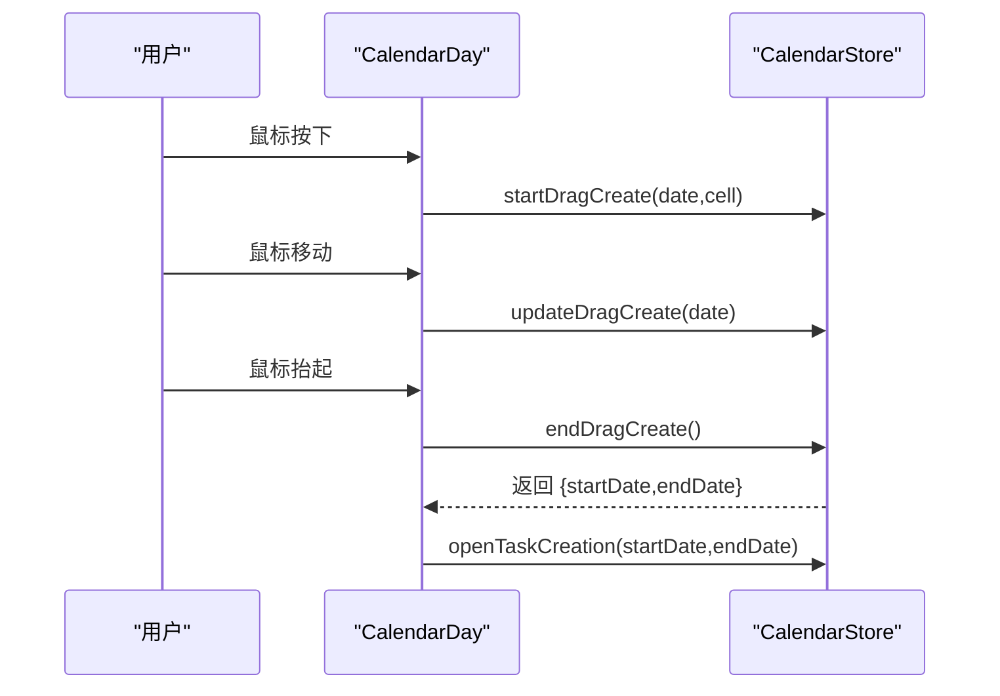
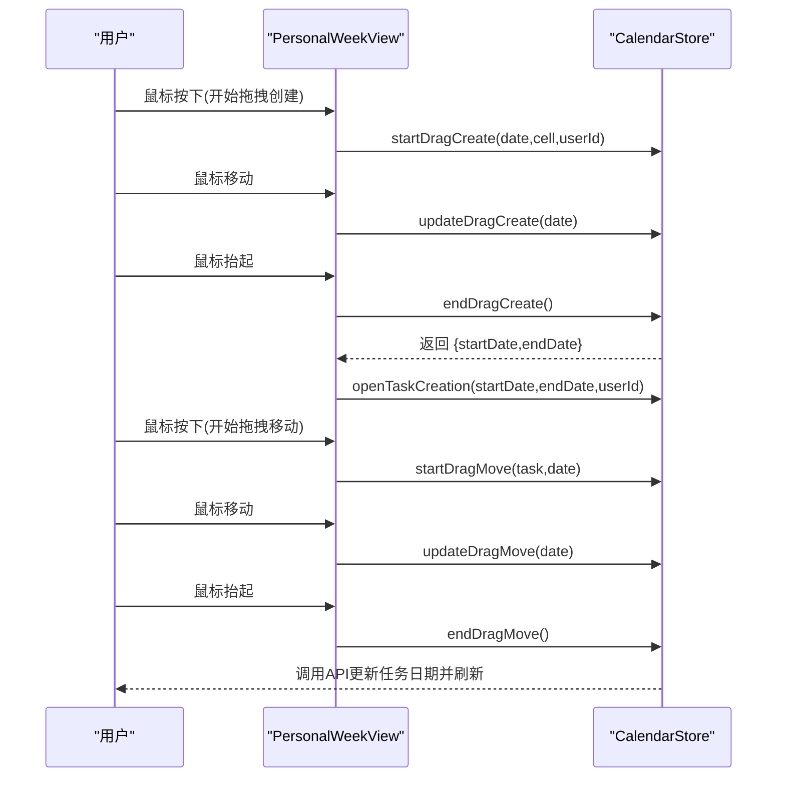
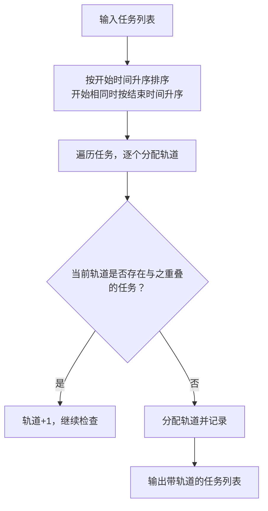
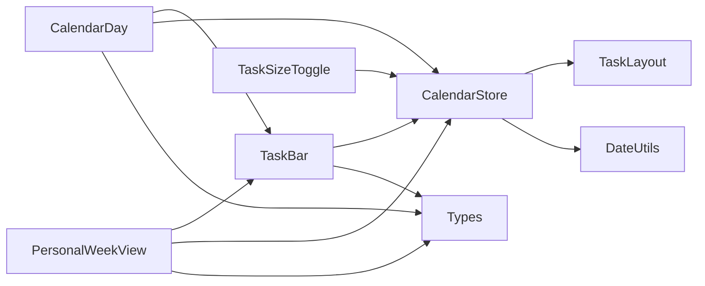

# 任务交互组件

<cite>
**本文引用的文件**
- [components/calendar/task-bar.tsx](file://components/calendar/task-bar.tsx)
- [components/calendar/task-size-toggle.tsx](file://components/calendar/task-size-toggle.tsx)
- [components/calendar/calendar-day.tsx](file://components/calendar/calendar-day.tsx)
- [components/calendar/personal-week-view.tsx](file://components/calendar/personal-week-view.tsx)
- [components/task/progress-circle.tsx](file://components/task/progress-circle.tsx)
- [lib/store/calendar-store.ts](file://lib/store/calendar-store.ts)
- [lib/utils/task-layout.ts](file://lib/utils/task-layout.ts)
- [lib/utils/date-utils.ts](file://lib/utils/date-utils.ts)
- [lib/types.ts](file://lib/types.ts)
</cite>

## 目录
1. [简介](#简介)
2. [项目结构](#项目结构)
3. [核心组件](#核心组件)
4. [架构总览](#架构总览)
5. [详细组件分析](#详细组件分析)
6. [依赖关系分析](#依赖关系分析)
7. [性能考量](#性能考量)
8. [故障排查指南](#故障排查指南)
9. [结论](#结论)
10. [附录](#附录)

## 简介
本技术文档围绕任务交互组件展开，重点覆盖以下方面：
- 任务条的渲染实现：任务信息显示、颜色编码、进度条、点击事件处理
- 任务大小切换器：紧凑模式与宽松模式的切换逻辑、布局调整与性能优化
- 任务拖拽交互：拖拽创建、拖拽移动、拖拽调整大小（进度）的完整机制
- 高级交互：双击编辑、右键菜单（快速添加）、快捷键支持（建议）
- 自定义样式与复杂拖拽逻辑的实践路径

## 项目结构
任务交互组件主要分布在以下模块：
- 视图层：任务条渲染、日/周视图、任务大小切换器
- 状态层：日历状态管理（拖拽、任务编辑、尺寸切换等）
- 工具层：任务轨道分配、日期工具、类型定义

图表来源
- [components/calendar/task-bar.tsx](file://components/calendar/task-bar.tsx#L1-L700)
- [components/calendar/calendar-day.tsx](file://components/calendar/calendar-day.tsx#L1-L164)
- [components/calendar/personal-week-view.tsx](file://components/calendar/personal-week-view.tsx#L1-L200)
- [components/calendar/task-size-toggle.tsx](file://components/calendar/task-size-toggle.tsx#L1-L40)
- [lib/store/calendar-store.ts](file://lib/store/calendar-store.ts#L1-L1457)
- [lib/utils/task-layout.ts](file://lib/utils/task-layout.ts#L1-L77)
- [lib/utils/date-utils.ts](file://lib/utils/date-utils.ts#L1-L86)
- [lib/types.ts](file://lib/types.ts#L1-L141)

章节来源
- [components/calendar/task-bar.tsx](file://components/calendar/task-bar.tsx#L1-L700)
- [components/calendar/calendar-day.tsx](file://components/calendar/calendar-day.tsx#L1-L164)
- [components/calendar/personal-week-view.tsx](file://components/calendar/personal-week-view.tsx#L1-L200)
- [components/calendar/task-size-toggle.tsx](file://components/calendar/task-size-toggle.tsx#L1-L40)
- [lib/store/calendar-store.ts](file://lib/store/calendar-store.ts#L1-L1457)
- [lib/utils/task-layout.ts](file://lib/utils/task-layout.ts#L1-L77)
- [lib/utils/date-utils.ts](file://lib/utils/date-utils.ts#L1-L86)
- [lib/types.ts](file://lib/types.ts#L1-L141)

## 核心组件
- 任务条 TaskBar：负责单个任务在日/周视图中的渲染、进度显示、拖拽移动、进度拖拽、悬停高亮、点击编辑等
- 日单元格 CalendarDay：承载任务条，处理拖拽创建、拖拽移动的鼠标事件传播
- 个人周视图 PersonalWeekView：聚合一周内的任务条，统一处理拖拽生命周期与轨道分配
- 任务大小切换器 TaskSizeToggle：切换紧凑/宽松两种任务条尺寸
- 状态中心 CalendarStore：集中管理任务、拖拽状态、尺寸、用户信息、权限等
- 工具函数 TaskLayout：为重叠任务分配轨道，计算最大轨道数
- 工具函数 DateUtils：周/月日期集合、同日判断、格式化等
- 类型定义 Types：任务、项目、团队、用户、颜色等类型

章节来源
- [components/calendar/task-bar.tsx](file://components/calendar/task-bar.tsx#L1-L700)
- [components/calendar/calendar-day.tsx](file://components/calendar/calendar-day.tsx#L1-L164)
- [components/calendar/personal-week-view.tsx](file://components/calendar/personal-week-view.tsx#L1-L200)
- [components/calendar/task-size-toggle.tsx](file://components/calendar/task-size-toggle.tsx#L1-L40)
- [lib/store/calendar-store.ts](file://lib/store/calendar-store.ts#L1-L1457)
- [lib/utils/task-layout.ts](file://lib/utils/task-layout.ts#L1-L77)
- [lib/utils/date-utils.ts](file://lib/utils/date-utils.ts#L1-L86)
- [lib/types.ts](file://lib/types.ts#L1-L141)

## 架构总览
任务交互由“视图层-状态层-工具层”三层协作完成：
- 视图层：TaskBar、CalendarDay、PersonalWeekView、TaskSizeToggle
- 状态层：CalendarStore 提供拖拽创建/移动、任务编辑、尺寸切换、用户/项目/团队数据
- 工具层：TaskLayout 分配轨道，DateUtils 计算周/月日期，Types 定义数据结构

图表来源
- [components/calendar/calendar-day.tsx](file://components/calendar/calendar-day.tsx#L88-L115)
- [components/calendar/personal-week-view.tsx](file://components/calendar/personal-week-view.tsx#L113-L144)
- [components/calendar/task-bar.tsx](file://components/calendar/task-bar.tsx#L102-L110)
- [lib/store/calendar-store.ts](file://lib/store/calendar-store.ts#L1089-L1153)
- [lib/store/calendar-store.ts](file://lib/store/calendar-store.ts#L1166-L1280)

## 详细组件分析

### 任务条渲染与交互（TaskBar）
- 渲染内容
  - 任务标题、开始时间、负责人头像/名称（可选）
  - 进度条背景（按段内进度绘制）
  - 进度拖拽手柄（仅日常任务，CSS group-hover 控制显示）
  - 圆角样式：开始段左圆角、结束段右圆角、跨段两端圆角
- 颜色编码
  - 任务类型映射：daily/meeting/vacation
  - 自定义颜色：daily 类型支持 TASK_COLORS
- 交互行为
  - 鼠标按下：启动拖拽移动
  - 点击：若非拖拽状态则打开编辑面板
  - 进度拖拽：计算段内进度到总进度的映射，提交更新并乐观渲染
  - 悬停高亮：使用全局 hoveredTaskId 实现跨段高亮
- 布局与尺寸
  - 根据 taskBarSize 切换高度、头像尺寸、字号
  - 个人周视图下宽度计算考虑跨段拼接

图表来源
- [components/calendar/task-bar.tsx](file://components/calendar/task-bar.tsx#L102-L110)
- [components/calendar/task-bar.tsx](file://components/calendar/task-bar.tsx#L272-L278)
- [components/calendar/task-bar.tsx](file://components/calendar/task-bar.tsx#L280-L381)
- [components/calendar/task-bar.tsx](file://components/calendar/task-bar.tsx#L462-L698)
- [lib/store/calendar-store.ts](file://lib/store/calendar-store.ts#L1166-L1280)

章节来源
- [components/calendar/task-bar.tsx](file://components/calendar/task-bar.tsx#L1-L700)
- [lib/store/calendar-store.ts](file://lib/store/calendar-store.ts#L1166-L1280)
- [lib/types.ts](file://lib/types.ts#L132-L139)

### 任务大小切换器（TaskSizeToggle）
- 功能：在紧凑型与宽松型之间切换
- 行为：点击按钮更新 CalendarStore 中的 taskBarSize，并持久化
- 视觉：当前模式按钮高亮

图表来源
- [components/calendar/task-size-toggle.tsx](file://components/calendar/task-size-toggle.tsx#L8-L39)
- [lib/store/calendar-store.ts](file://lib/store/calendar-store.ts#L149-L150)

章节来源
- [components/calendar/task-size-toggle.tsx](file://components/calendar/task-size-toggle.tsx#L1-L40)
- [lib/store/calendar-store.ts](file://lib/store/calendar-store.ts#L149-L150)

### 日单元格拖拽创建（CalendarDay）
- 阻止在任务条上触发拖拽创建
- 鼠标按下：startDragCreate
- 鼠标移动：updateDragCreate
- 鼠标抬起：endDragCreate 并打开任务创建面板

图表来源
- [components/calendar/calendar-day.tsx](file://components/calendar/calendar-day.tsx#L88-L115)
- [lib/store/calendar-store.ts](file://lib/store/calendar-store.ts#L1089-L1153)

章节来源
- [components/calendar/calendar-day.tsx](file://components/calendar/calendar-day.tsx#L1-L164)
- [lib/store/calendar-store.ts](file://lib/store/calendar-store.ts#L1089-L1153)

### 个人周视图拖拽移动（PersonalWeekView）
- 全局鼠标抬起：取消拖拽创建或结束拖拽移动
- 鼠标按下：startDragCreate（个人周视图限定当前用户）
- 鼠标移动：updateDragCreate/updateDragMove
- 鼠标抬起：endDragCreate/openTaskCreation 或 endDragMove

图表来源
- [components/calendar/personal-week-view.tsx](file://components/calendar/personal-week-view.tsx#L113-L144)
- [lib/store/calendar-store.ts](file://lib/store/calendar-store.ts#L1166-L1280)

章节来源
- [components/calendar/personal-week-view.tsx](file://components/calendar/personal-week-view.tsx#L1-L200)
- [lib/store/calendar-store.ts](file://lib/store/calendar-store.ts#L1166-L1280)

### 任务轨道分配与布局（TaskLayout）
- 重叠检测：按开始/结束时间判断
- 轨道分配：为每个任务分配最小可用轨道，保证同一轨道内无重叠
- 最大轨道：用于确定容器高度

图表来源
- [lib/utils/task-layout.ts](file://lib/utils/task-layout.ts#L28-L68)

章节来源
- [lib/utils/task-layout.ts](file://lib/utils/task-layout.ts#L1-L77)
- [components/calendar/personal-week-view.tsx](file://components/calendar/personal-week-view.tsx#L46-L47)

### 日期工具（DateUtils）
- 周/月日期集合：支持隐藏周末
- 同日判断、格式化、周日名称映射

章节来源
- [lib/utils/date-utils.ts](file://lib/utils/date-utils.ts#L1-L86)

### 类型系统（Types）
- 任务类型、权限、组织/团队/项目/用户、任务颜色常量等

章节来源
- [lib/types.ts](file://lib/types.ts#L1-L141)

## 依赖关系分析
- TaskBar 依赖 CalendarStore（拖拽、编辑、尺寸、用户、项目、进度更新）
- CalendarDay/PersonalWeekView 依赖 TaskBar 与 CalendarStore
- TaskSizeToggle 依赖 CalendarStore
- TaskLayout 与 DateUtils 作为纯函数被视图层调用
- 类型定义贯穿各层

图表来源
- [components/calendar/task-bar.tsx](file://components/calendar/task-bar.tsx#L1-L700)
- [components/calendar/calendar-day.tsx](file://components/calendar/calendar-day.tsx#L1-L164)
- [components/calendar/personal-week-view.tsx](file://components/calendar/personal-week-view.tsx#L1-L200)
- [components/calendar/task-size-toggle.tsx](file://components/calendar/task-size-toggle.tsx#L1-L40)
- [lib/store/calendar-store.ts](file://lib/store/calendar-store.ts#L1-L1457)
- [lib/utils/task-layout.ts](file://lib/utils/task-layout.ts#L1-L77)
- [lib/utils/date-utils.ts](file://lib/utils/date-utils.ts#L1-L86)
- [lib/types.ts](file://lib/types.ts#L1-L141)

## 性能考量
- 乐观渲染：进度拖拽时先设置乐观状态，避免回弹，待后端确认后再清理
- 事件防抖：拖拽移动时按天计算偏移，避免频繁重渲染
- 样式优化：进度拖拽时禁用过渡动画，提升响应速度
- 轨道分配：O(n^2) 的重叠检测在任务量适中时可接受，必要时可引入区间树优化
- 事件委托：日视图通过父容器统一处理拖拽生命周期，减少子元素监听

章节来源
- [components/calendar/task-bar.tsx](file://components/calendar/task-bar.tsx#L40-L57)
- [components/calendar/task-bar.tsx](file://components/calendar/task-bar.tsx#L380-L381)
- [lib/store/calendar-store.ts](file://lib/store/calendar-store.ts#L1166-L1280)

## 故障排查指南
- 拖拽创建无效
  - 检查是否在任务条上触发（CalendarDay 已阻止）
  - 确认 startDragCreate/updateDragCreate/endDragCreate 流程未被中断
- 拖拽移动失败
  - 确认 endDragMove 是否调用 API 成功，失败时会回退刷新
- 进度拖拽异常
  - 检查 isProgressDragging 状态与乐观进度同步
  - 确认段内进度到总进度的换算逻辑
- 颜色显示不正确
  - 检查 TASK_COLORS 与任务类型/自定义颜色映射
- 轨道重叠
  - 检查 doTasksOverlap 与 assignTaskTracks 的排序逻辑

章节来源
- [components/calendar/calendar-day.tsx](file://components/calendar/calendar-day.tsx#L88-L115)
- [components/calendar/personal-week-view.tsx](file://components/calendar/personal-week-view.tsx#L113-L144)
- [lib/store/calendar-store.ts](file://lib/store/calendar-store.ts#L1230-L1280)
- [lib/utils/task-layout.ts](file://lib/utils/task-layout.ts#L10-L22)
- [lib/types.ts](file://lib/types.ts#L132-L139)

## 结论
任务交互组件通过清晰的三层架构实现了丰富的交互能力：任务条渲染、颜色编码、进度可视化、拖拽创建与移动、进度拖拽、跨段高亮与尺寸切换。状态中心统一管理拖拽生命周期与用户数据，工具层提供轨道分配与日期计算。整体设计注重性能与可维护性，适合进一步扩展右键菜单、快捷键与更复杂的拖拽逻辑。

## 附录

### 自定义任务条样式
- 颜色方案：通过 TASK_COLORS 与任务类型映射，支持自定义颜色
- 尺寸控制：TaskSizeToggle 切换 compact/comfortable，影响高度、头像与字号
- 进度显示：ProgressCircle 支持颜色与尺寸参数，可按需显示数字

章节来源
- [lib/types.ts](file://lib/types.ts#L132-L139)
- [components/calendar/task-size-toggle.tsx](file://components/calendar/task-size-toggle.tsx#L8-L39)
- [components/task/progress-circle.tsx](file://components/task/progress-circle.tsx#L1-L102)

### 实现复杂拖拽逻辑的建议
- 拖拽创建：在日/周视图统一入口处理，避免在任务条上触发
- 拖拽移动：按天计算偏移，实时更新本地任务日期，完成后调用 API
- 进度拖拽：段内进度到总进度的换算，结合乐观渲染与回滚策略
- 右键菜单与快捷键：可在 CalendarDay/PersonalWeekView 上扩展，注意移动端长按与键盘事件

章节来源
- [components/calendar/calendar-day.tsx](file://components/calendar/calendar-day.tsx#L88-L115)
- [components/calendar/personal-week-view.tsx](file://components/calendar/personal-week-view.tsx#L113-L144)
- [components/calendar/task-bar.tsx](file://components/calendar/task-bar.tsx#L280-L381)
- [lib/store/calendar-store.ts](file://lib/store/calendar-store.ts#L1166-L1280)