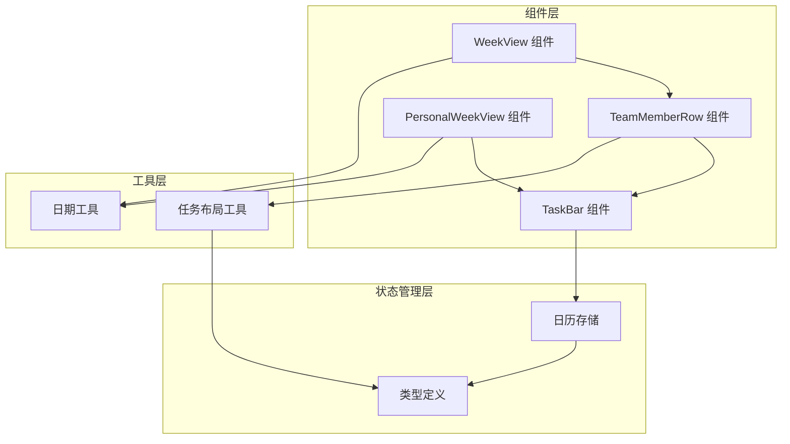
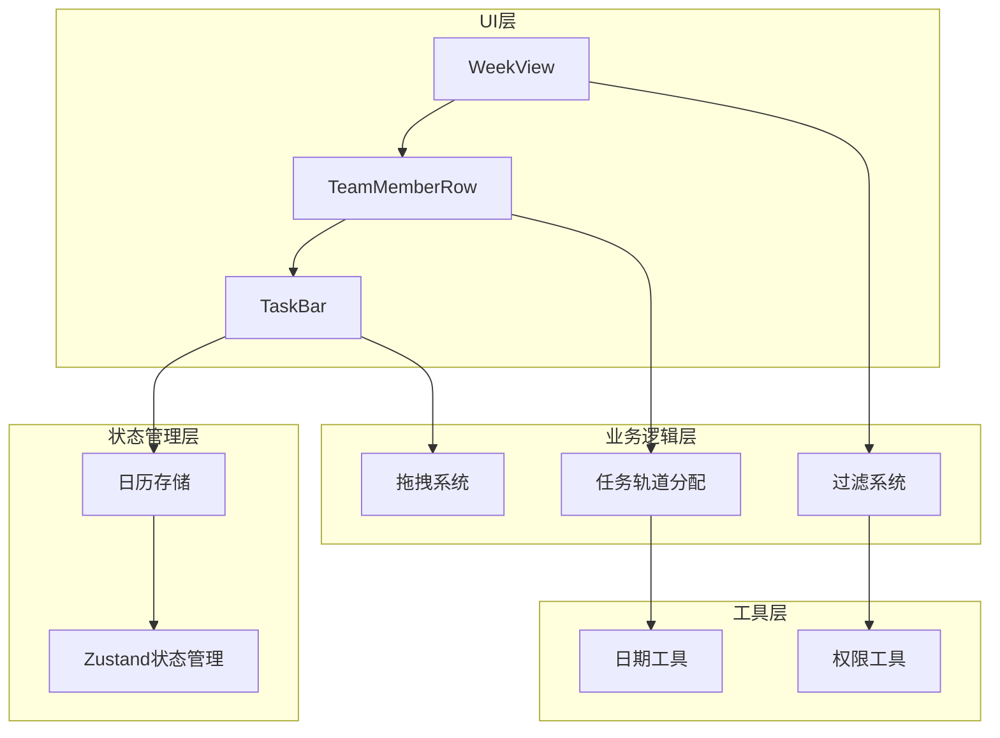
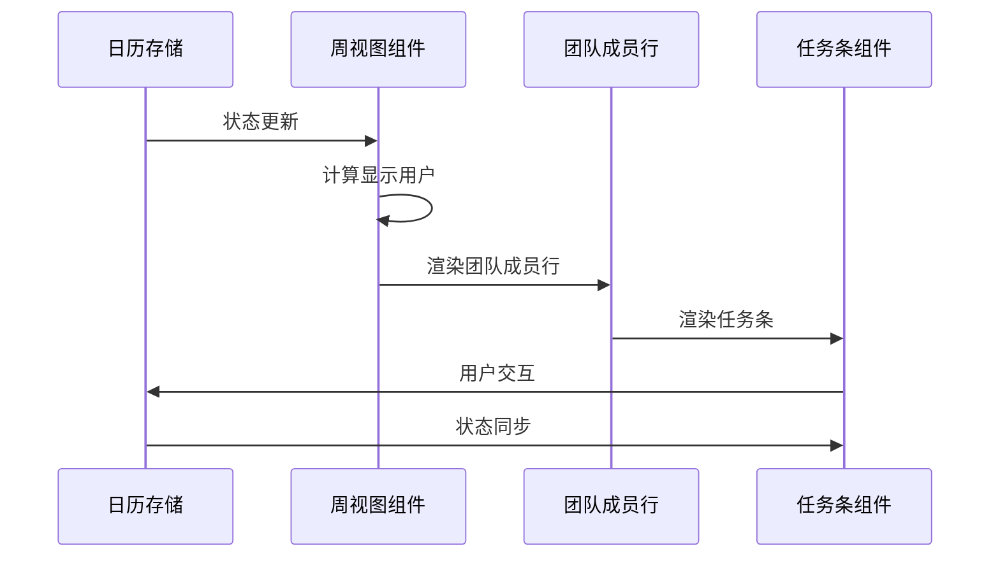
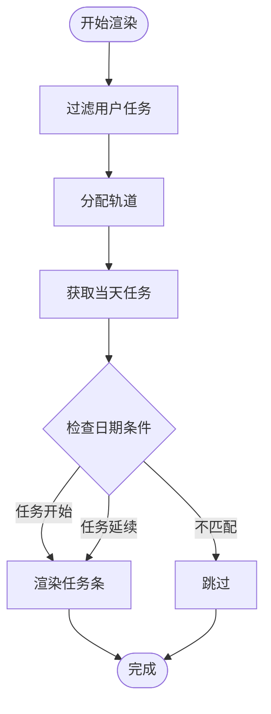
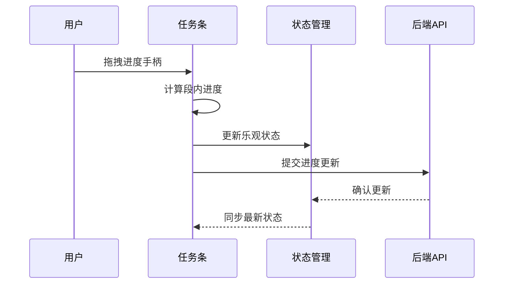
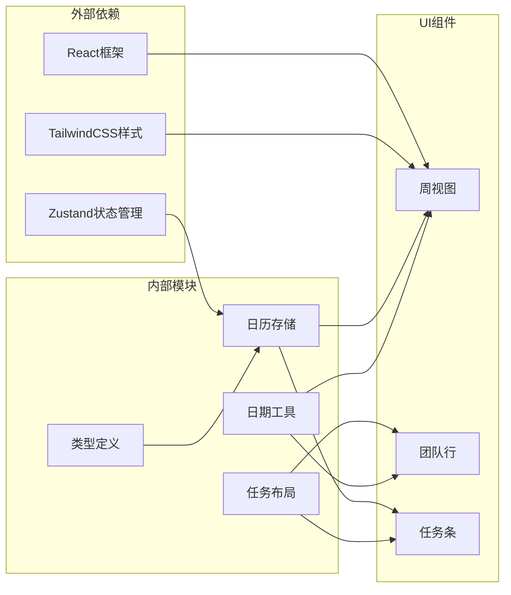

# 周视图组件

<cite>
**本文档引用的文件**
- [week-view.tsx](file://components/calendar/week-view.tsx)
- [team-member-row.tsx](file://components/calendar/team-member-row.tsx)
- [task-bar.tsx](file://components/calendar/task-bar.tsx)
- [personal-week-view.tsx](file://components/calendar/personal-week-view.tsx)
- [task-layout.ts](file://lib/utils/task-layout.ts)
- [date-utils.ts](file://lib/utils/date-utils.ts)
- [calendar-store.ts](file://lib/store/calendar-store.ts)
- [types.ts](file://lib/types.ts)
</cite>

## 目录
1. [简介](#简介)
2. [项目结构](#项目结构)
3. [核心组件](#核心组件)
4. [架构概览](#架构概览)
5. [详细组件分析](#详细组件分析)
6. [依赖关系分析](#依赖关系分析)
7. [性能考虑](#性能考虑)
8. [故障排除指南](#故障排除指南)
9. [结论](#结论)

## 简介

周视图组件是日历任务管理系统中的核心功能模块，提供了团队协作和任务管理的可视化界面。该组件实现了复杂的时间轴布局、团队成员行渲染、任务条绘制等核心功能，并支持拖拽调整任务时间、重叠任务处理、轨道分配策略等高级特性。

## 项目结构

周视图组件采用模块化设计，主要由以下几个核心文件组成：



**图表来源**
- [week-view.tsx](file://components/calendar/week-view.tsx#L1-L109)
- [team-member-row.tsx](file://components/calendar/team-member-row.tsx#L1-L211)
- [task-bar.tsx](file://components/calendar/task-bar.tsx#L1-L700)
- [personal-week-view.tsx](file://components/calendar/personal-week-view.tsx#L1-L200)

**章节来源**
- [week-view.tsx](file://components/calendar/week-view.tsx#L1-L109)
- [team-member-row.tsx](file://components/calendar/team-member-row.tsx#L1-L211)
- [task-bar.tsx](file://components/calendar/task-bar.tsx#L1-L700)
- [personal-week-view.tsx](file://components/calendar/personal-week-view.tsx#L1-L200)

## 核心组件

### 时间轴布局系统

周视图组件的核心是基于日期的网格布局系统，支持工作日和完整周两种显示模式：

- **工作日模式**：显示周一至周五，适合企业工作场景
- **完整周模式**：显示完整的七天周期
- **动态宽度计算**：根据屏幕尺寸和显示模式自动调整列宽

### 团队成员行渲染

每个团队成员行包含以下关键元素：
- **用户头像**：70x70像素的大头像，支持占位符
- **用户信息**：姓名和邮箱的悬停显示
- **任务区域**：每周7天的任务渲染区域
- **拖拽支持**：支持任务创建和移动的拖拽操作

### 任务条绘制引擎

任务条组件实现了复杂的视觉渲染和交互逻辑：

- **多类型任务支持**：日常任务、会议、假期等不同类型
- **进度可视化**：圆形进度指示器和进度条
- **负责人显示**：支持1-4个负责人的头像展示
- **拖拽手柄**：仅日常任务显示进度拖拽手柄

**章节来源**
- [week-view.tsx](file://components/calendar/week-view.tsx#L70-L109)
- [team-member-row.tsx](file://components/calendar/team-member-row.tsx#L150-L211)
- [task-bar.tsx](file://components/calendar/task-bar.tsx#L462-L700)

## 架构概览

周视图组件采用分层架构设计，各层职责明确：



**图表来源**
- [calendar-store.ts](file://lib/store/calendar-store.ts#L1-L800)
- [task-layout.ts](file://lib/utils/task-layout.ts#L1-L77)
- [date-utils.ts](file://lib/utils/date-utils.ts#L1-L86)

## 详细组件分析

### 周视图组件 (WeekView)

WeekView组件是团队视图的核心，负责管理整个周视图的渲染和交互：

#### 核心功能

1. **导航模式适配**
   - 支持团队模式、项目模式和个人模式
   - 根据导航模式动态过滤用户显示

2. **全局事件处理**
   - 监听全局鼠标抬起事件
   - 自动清理拖拽状态，防止内存泄漏

3. **响应式布局**
   - 根据是否隐藏周末动态调整列数
   - 使用CSS类名实现灵活的样式控制

#### 数据流分析



**图表来源**
- [week-view.tsx](file://components/calendar/week-view.tsx#L9-L51)
- [team-member-row.tsx](file://components/calendar/team-member-row.tsx#L18-L41)

**章节来源**
- [week-view.tsx](file://components/calendar/week-view.tsx#L1-L109)

### 团队成员行组件 (TeamMemberRow)

TeamMemberRow组件负责单个团队成员的渲染和交互：

#### 用户信息展示

1. **头像系统**
   - 70x70像素大头像
   - 支持真实头像和占位符
   - 悬停显示用户邮箱

2. **信息布局**
   - 居中对齐的头像和姓名
   - 响应式设计适应不同屏幕尺寸

#### 任务渲染逻辑



**图表来源**
- [team-member-row.tsx](file://components/calendar/team-member-row.tsx#L42-L68)

#### 拖拽创建机制

1. **拖拽范围计算**
   - 支持跨多天的拖拽选择
   - 实时高亮拖拽范围

2. **用户权限控制**
   - 团队视图中限制跨用户拖拽
   - 仅允许拖拽到当前用户的行

**章节来源**
- [team-member-row.tsx](file://components/calendar/team-member-row.tsx#L1-L211)

### 任务条组件 (TaskBar)

TaskBar组件是最复杂的子组件，实现了丰富的交互功能：

#### 任务定位算法

1. **跨段显示计算**
   ```mermaid
flowchart TD
Start([计算显示天数]) --> CountDays[计算总跨度]
CountDays --> CalcWeekEnd[计算到周末天数]
CalcWeekEnd --> MinCalc[取两者最小值]
MinCalc --> SpanDays[得到显示天数]
```

2. **圆角样式策略**
   - 开始段：左圆角
   - 结束段：右圆角
   - 完整段：两端圆角
   - 中间段：无圆角

3. **轨道高度计算**
   - 紧凑模式：24px高度 + 4px间距
   - 宽松模式：30px高度 + 4px间距
   - 最小高度：120px，确保基本可读性

#### 进度拖拽系统



**图表来源**
- [task-bar.tsx](file://components/calendar/task-bar.tsx#L280-L381)

#### 负责人显示策略

1. **单负责人**：显示头像和姓名
2. **2-3负责人**：显示头像堆叠
3. **4个以上负责人**：显示前3个头像 + "等N人"
4. **无负责人**：显示创建者头像

**章节来源**
- [task-bar.tsx](file://components/calendar/task-bar.tsx#L1-L700)

### 个人周视图组件 (PersonalWeekView)

PersonalWeekView是My Days模式下的简化版本：

#### 核心差异

1. **单行布局**
   - 仅显示当前用户的任务
   - 省略团队成员信息列

2. **增强的用户信息**
   - 在任务条中显示负责人信息
   - 支持更详细的用户标识

3. **简化交互**
   - 移除了跨用户拖拽限制
   - 简化的权限检查

**章节来源**
- [personal-week-view.tsx](file://components/calendar/personal-week-view.tsx#L1-L200)

## 依赖关系分析

### 核心依赖链



**图表来源**
- [calendar-store.ts](file://lib/store/calendar-store.ts#L1-L800)
- [task-layout.ts](file://lib/utils/task-layout.ts#L1-L77)
- [date-utils.ts](file://lib/utils/date-utils.ts#L1-L86)

### 组件耦合度分析

| 组件 | 内聚性 | 耦合度 | 主要依赖 |
|------|--------|--------|----------|
| WeekView | 高 | 中等 | CalendarStore, DateUtils |
| TeamMemberRow | 高 | 高 | TaskLayout, CalendarStore |
| TaskBar | 中等 | 高 | CalendarStore, Types |
| PersonalWeekView | 高 | 低 | CalendarStore, DateUtils |

**章节来源**
- [week-view.tsx](file://components/calendar/week-view.tsx#L1-L109)
- [team-member-row.tsx](file://components/calendar/team-member-row.tsx#L1-L211)
- [task-bar.tsx](file://components/calendar/task-bar.tsx#L1-L700)

## 性能考虑

### 渲染优化策略

1. **记忆化计算**
   - 使用`useMemo`缓存计算结果
   - 避免不必要的重新渲染

2. **虚拟滚动**
   - 仅渲染可见区域的任务
   - 支持大量任务的高效显示

3. **事件委托**
   - 使用事件冒泡减少监听器数量
   - 优化拖拽事件处理

### 内存管理

1. **全局事件清理**
   - 自动移除全局鼠标事件监听
   - 防止内存泄漏

2. **状态清理**
   - 拖拽完成后及时清理状态
   - 避免残留的DOM引用

## 故障排除指南

### 常见问题及解决方案

#### 任务重叠显示异常

**问题描述**：任务条重叠显示，无法正确分配轨道

**解决步骤**：
1. 检查任务时间范围计算
2. 验证轨道分配算法
3. 确认任务排序逻辑

**相关代码路径**：
- [task-layout.ts](file://lib/utils/task-layout.ts#L28-L68)

#### 拖拽功能失效

**问题描述**：拖拽创建或移动任务时无响应

**解决步骤**：
1. 检查全局事件监听器
2. 验证拖拽状态管理
3. 确认权限检查逻辑

**相关代码路径**：
- [calendar-store.ts](file://lib/store/calendar-store.ts#L1130-L1280)

#### 性能问题

**问题描述**：大量任务时渲染缓慢

**解决步骤**：
1. 实施虚拟滚动
2. 优化记忆化计算
3. 减少不必要的重渲染

**相关代码路径**：
- [team-member-row.tsx](file://components/calendar/team-member-row.tsx#L39-L41)

**章节来源**
- [task-layout.ts](file://lib/utils/task-layout.ts#L1-L77)
- [calendar-store.ts](file://lib/store/calendar-store.ts#L1130-L1280)

## 结论

周视图组件是一个功能完整、架构清晰的日历任务管理界面。其核心优势包括：

1. **模块化设计**：各组件职责明确，便于维护和扩展
2. **高性能渲染**：采用多种优化策略确保流畅体验
3. **丰富的交互**：支持拖拽、进度调整等多种用户操作
4. **灵活的布局**：适应不同视图模式和屏幕尺寸

该组件为团队协作提供了强大的可视化工具，通过合理的状态管理和算法设计，能够有效处理复杂的任务调度需求。