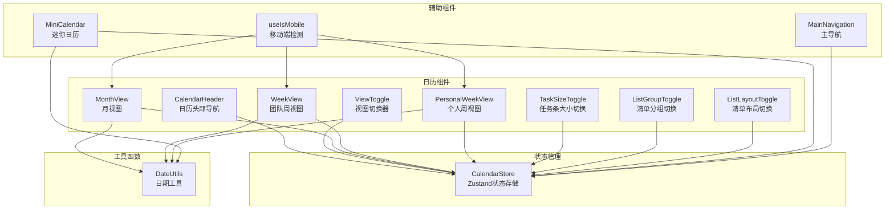
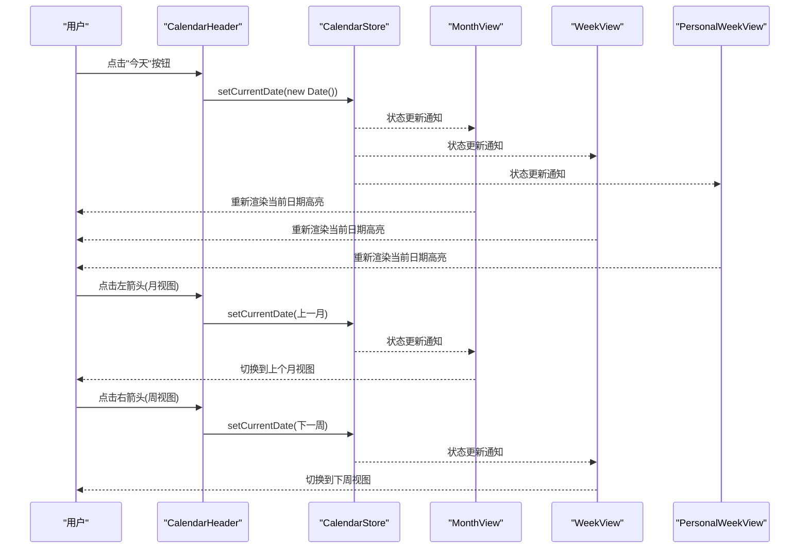
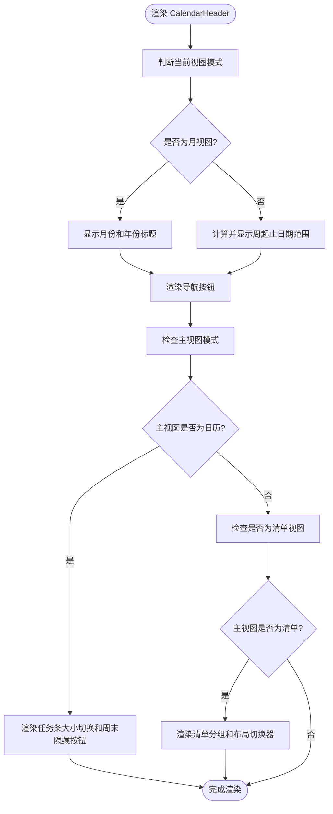
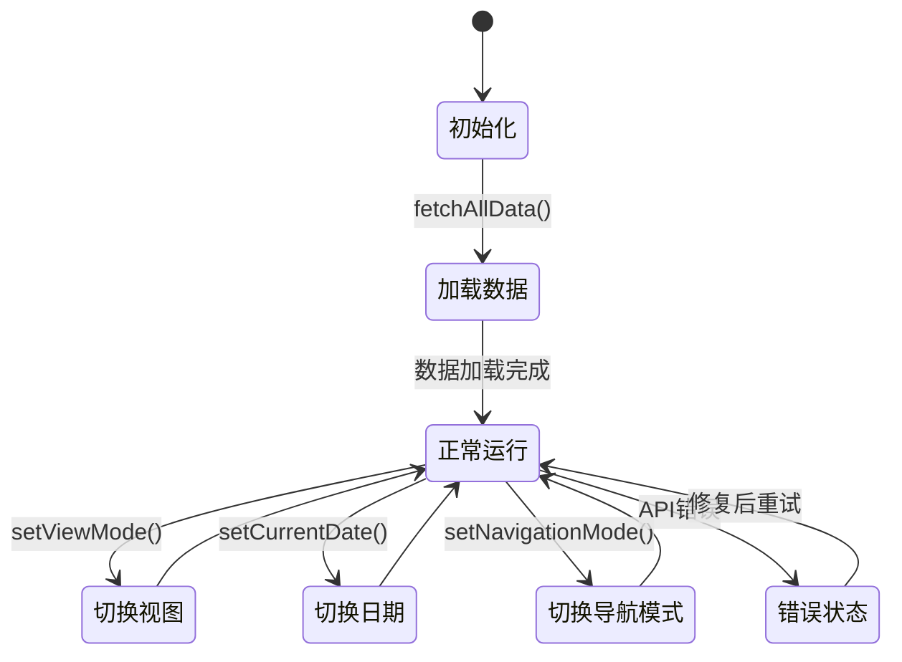
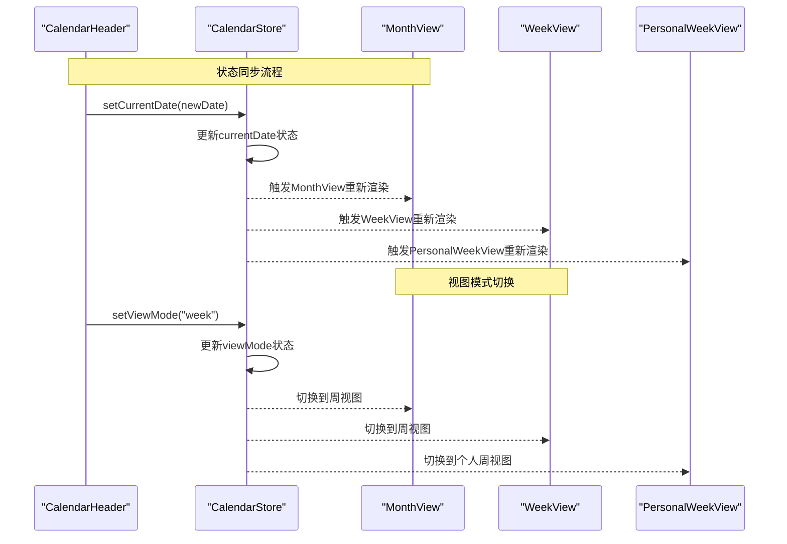
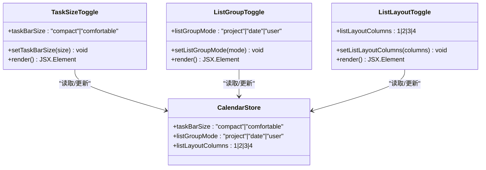
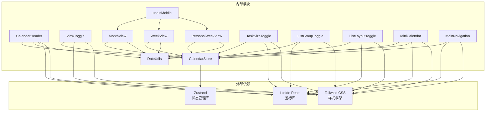

# 日历导航组件

<cite>
**本文档引用的文件**
- [components/calendar/calendar-header.tsx](file://components/calendar/calendar-header.tsx)
- [components/calendar/view-toggle.tsx](file://components/calendar/view-toggle.tsx)
- [lib/store/calendar-store.ts](file://lib/store/calendar-store.ts)
- [lib/utils/date-utils.ts](file://lib/utils/date-utils.ts)
- [components/calendar/month-view.tsx](file://components/calendar/month-view.tsx)
- [components/calendar/week-view.tsx](file://components/calendar/week-view.tsx)
- [components/calendar/personal-week-view.tsx](file://components/calendar/personal-week-view.tsx)
- [components/calendar/task-size-toggle.tsx](file://components/calendar/task-size-toggle.tsx)
- [components/views/list-group-toggle.tsx](file://components/views/list-group-toggle.tsx)
- [components/views/list-layout-toggle.tsx](file://components/views/list-layout-toggle.tsx)
- [components/sidebar/mini-calendar.tsx](file://components/sidebar/mini-calendar.tsx)
- [components/navigation/main-navigation.tsx](file://components/navigation/main-navigation.tsx)
- [hooks/use-mobile.ts](file://hooks/use-mobile.ts)
- [lib/types.ts](file://lib/types.ts)
</cite>

## 目录
1. [简介](#简介)
2. [项目结构](#项目结构)
3. [核心组件](#核心组件)
4. [架构概览](#架构概览)
5. [详细组件分析](#详细组件分析)
6. [依赖关系分析](#依赖关系分析)
7. [性能考虑](#性能考虑)
8. [故障排除指南](#故障排除指南)
9. [结论](#结论)
10. [附录](#附录)

## 简介
本文件为日历导航组件的技术文档，深入解析日历头部导航的实现机制，涵盖月份切换、年份导航、今天按钮等功能；详细说明视图切换器的工作原理，包括月视图、周视图、个人视图之间的切换逻辑、状态保存、动画过渡效果；解释导航组件与主日历视图的通信机制，包括事件传递、状态同步、重新渲染触发等。同时包含键盘快捷键支持、触摸手势适配、响应式布局等用户体验优化，并提供具体的代码示例路径，展示如何自定义导航样式、添加新的导航选项、实现智能的导航行为。

## 项目结构
日历导航组件位于 components/calendar 目录下，配合 lib/store 中的状态管理、lib/utils 中的工具函数以及 components/views 和 components/sidebar 中的相关组件共同构成完整的日历导航体系。



**图表来源**
- [components/calendar/calendar-header.tsx](file://components/calendar/calendar-header.tsx#L1-L127)
- [components/calendar/view-toggle.tsx](file://components/calendar/view-toggle.tsx#L1-L52)
- [lib/store/calendar-store.ts](file://lib/store/calendar-store.ts#L1-L1457)
- [lib/utils/date-utils.ts](file://lib/utils/date-utils.ts#L1-L86)
- [components/calendar/month-view.tsx](file://components/calendar/month-view.tsx#L1-L306)
- [components/calendar/week-view.tsx](file://components/calendar/week-view.tsx#L1-L109)
- [components/calendar/personal-week-view.tsx](file://components/calendar/personal-week-view.tsx#L1-L200)
- [components/sidebar/mini-calendar.tsx](file://components/sidebar/mini-calendar.tsx#L1-L48)
- [components/navigation/main-navigation.tsx](file://components/navigation/main-navigation.tsx#L1-L37)
- [hooks/use-mobile.ts](file://hooks/use-mobile.ts#L1-L20)

**章节来源**
- [components/calendar/calendar-header.tsx](file://components/calendar/calendar-header.tsx#L1-L127)
- [lib/store/calendar-store.ts](file://lib/store/calendar-store.ts#L1-L1457)

## 核心组件
本节概述日历导航系统的核心组件及其职责：
- CalendarHeader：负责显示当前日期范围、提供导航按钮、条件性渲染任务条大小切换和周末隐藏功能
- ViewToggle：提供月视图和周视图之间的快速切换
- CalendarStore：集中管理日历状态（当前日期、视图模式、导航模式、任务数据等），提供状态持久化
- DateUtils：提供日期计算、周起始日确定、月份天数生成等工具方法
- 视图组件：MonthView、WeekView、PersonalWeekView 根据当前视图模式渲染相应内容
- 辅助切换器：TaskSizeToggle、ListGroupToggle、ListLayoutToggle 提供额外的视图定制能力

**章节来源**
- [components/calendar/calendar-header.tsx](file://components/calendar/calendar-header.tsx#L12-L127)
- [components/calendar/view-toggle.tsx](file://components/calendar/view-toggle.tsx#L7-L52)
- [lib/store/calendar-store.ts](file://lib/store/calendar-store.ts#L33-L198)
- [lib/utils/date-utils.ts](file://lib/utils/date-utils.ts#L1-L86)

## 架构概览
日历导航采用状态驱动的架构模式，CalendarStore 作为单一事实来源，各组件通过订阅状态变化进行渲染。导航组件与视图组件之间通过状态同步实现松耦合通信。



**图表来源**
- [components/calendar/calendar-header.tsx](file://components/calendar/calendar-header.tsx#L15-L41)
- [lib/store/calendar-store.ts](file://lib/store/calendar-store.ts#L147-L148)
- [components/calendar/month-view.tsx](file://components/calendar/month-view.tsx#L31-L32)
- [components/calendar/week-view.tsx](file://components/calendar/week-view.tsx#L27-L27)

**章节来源**
- [lib/store/calendar-store.ts](file://lib/store/calendar-store.ts#L200-L270)
- [components/calendar/calendar-header.tsx](file://components/calendar/calendar-header.tsx#L12-L127)

## 详细组件分析

### 日历头部导航组件（CalendarHeader）
CalendarHeader 是日历界面顶部的核心导航区域，负责：
- 显示当前日期范围标题（月视图显示月份和年份，周视图显示周起止日期和年份）
- 提供"今天"按钮，一键跳转到当前日期
- 提供左右导航按钮，支持月视图的月份切换和周视图的周切换
- 条件性渲染：在日历视图模式下显示任务条大小切换和周末隐藏按钮，在清单视图模式下显示清单分组和布局切换器



**图表来源**
- [components/calendar/calendar-header.tsx](file://components/calendar/calendar-header.tsx#L12-L127)
- [lib/utils/date-utils.ts](file://lib/utils/date-utils.ts#L49-L61)

**章节来源**
- [components/calendar/calendar-header.tsx](file://components/calendar/calendar-header.tsx#L12-L127)
- [lib/utils/date-utils.ts](file://lib/utils/date-utils.ts#L49-L61)

### 视图切换器（ViewToggle）
ViewToggle 提供月视图和周视图之间的快速切换，支持个人周视图的特殊处理。切换逻辑基于 CalendarStore 中的 viewMode 状态，通过 setViewMode 更新状态并触发视图重渲染。

```mermaid
classDiagram
class ViewToggle {
+props : ViewToggleProps
+setViewMode(mode) void
+render() JSX.Element
}
class CalendarStore {
+viewMode : ViewMode
+setViewMode(mode) void
+setCurrentDate(date) void
}
class ViewMode {
<<enumeration>>
"month"
"week"
"personal"
}
ViewToggle --> CalendarStore : "读取/更新"
CalendarStore --> ViewMode : "维护"
```

**图表来源**
- [components/calendar/view-toggle.tsx](file://components/calendar/view-toggle.tsx#L7-L52)
- [lib/store/calendar-store.ts](file://lib/store/calendar-store.ts#L143-L143)
- [lib/types.ts](file://lib/types.ts#L127-L127)

**章节来源**
- [components/calendar/view-toggle.tsx](file://components/calendar/view-toggle.tsx#L7-L52)
- [lib/store/calendar-store.ts](file://lib/store/calendar-store.ts#L143-L143)

### 状态管理（CalendarStore）
CalendarStore 使用 Zustand 实现状态管理，提供以下关键功能：
- 状态持久化：使用 persist 中间件将状态保存到本地存储
- 数据加载：异步加载任务、项目、用户、团队数据
- 导航控制：管理当前日期、视图模式、导航模式等
- 任务操作：创建、更新、删除任务
- 视图定制：任务条大小、清单分组模式、布局列数等



**图表来源**
- [lib/store/calendar-store.ts](file://lib/store/calendar-store.ts#L200-L546)
- [lib/store/calendar-store.ts](file://lib/store/calendar-store.ts#L140-L157)

**章节来源**
- [lib/store/calendar-store.ts](file://lib/store/calendar-store.ts#L200-L546)

### 日期工具（DateUtils）
DateUtils 提供核心日期计算功能：
- getMonthDays：生成指定月份的完整日期数组，支持周末隐藏逻辑
- getWeekDays：生成指定日期所在周的完整日期数组
- isSameDay：比较两个日期是否为同一天
- formatDate/formatTime：格式化日期和时间
- getMonthName/getWeekDayName：获取月份和星期的中文名称

**章节来源**
- [lib/utils/date-utils.ts](file://lib/utils/date-utils.ts#L1-L86)

### 视图组件通信机制
各视图组件通过 CalendarStore 实现统一的状态管理和事件传递：



**图表来源**
- [components/calendar/calendar-header.tsx](file://components/calendar/calendar-header.tsx#L15-L41)
- [lib/store/calendar-store.ts](file://lib/store/calendar-store.ts#L147-L148)
- [lib/store/calendar-store.ts](file://lib/store/calendar-store.ts#L143-L143)

**章节来源**
- [components/calendar/month-view.tsx](file://components/calendar/month-view.tsx#L9-L25)
- [components/calendar/week-view.tsx](file://components/calendar/week-view.tsx#L9-L25)
- [components/calendar/personal-week-view.tsx](file://components/calendar/personal-week-view.tsx#L10-L11)

### 视图切换器工作原理
日历提供了多种视图切换器以满足不同用户需求：



**图表来源**
- [components/calendar/task-size-toggle.tsx](file://components/calendar/task-size-toggle.tsx#L8-L39)
- [components/views/list-group-toggle.tsx](file://components/views/list-group-toggle.tsx#L8-L38)
- [components/views/list-layout-toggle.tsx](file://components/views/list-layout-toggle.tsx#L8-L38)
- [lib/store/calendar-store.ts](file://lib/store/calendar-store.ts#L62-L58)

**章节来源**
- [components/calendar/task-size-toggle.tsx](file://components/calendar/task-size-toggle.tsx#L8-L39)
- [components/views/list-group-toggle.tsx](file://components/views/list-group-toggle.tsx#L8-L38)
- [components/views/list-layout-toggle.tsx](file://components/views/list-layout-toggle.tsx#L8-L38)

## 依赖关系分析
日历导航组件的依赖关系呈现清晰的层次结构：



**图表来源**
- [lib/store/calendar-store.ts](file://lib/store/calendar-store.ts#L3-L4)
- [components/calendar/calendar-header.tsx](file://components/calendar/calendar-header.tsx#L3-L10)
- [components/calendar/view-toggle.tsx](file://components/calendar/view-toggle.tsx#L3-L5)

**章节来源**
- [lib/store/calendar-store.ts](file://lib/store/calendar-store.ts#L3-L4)
- [components/calendar/calendar-header.tsx](file://components/calendar/calendar-header.tsx#L3-L10)

## 性能考虑
日历导航组件在性能方面采用了多项优化策略：
- 状态持久化：使用 Zustand persist 中间件减少页面刷新后的状态丢失
- 计算结果缓存：useMemo 用于缓存视图计算结果，避免重复渲染
- 条件渲染：根据主视图模式和视图模式进行条件性渲染，减少不必要的DOM节点
- 异步数据加载：使用 Promise.all 并行加载多类数据，提升初始化速度
- 内存优化：全局鼠标事件监听在组件卸载时正确清理，防止内存泄漏

## 故障排除指南
常见问题及解决方案：
- 导航按钮无响应：检查 CalendarStore 的 setCurrentDate 方法是否正确绑定
- 视图切换异常：确认 viewMode 状态值是否在允许范围内（"month"|"week"|"personal"）
- 日期显示错误：验证 DateUtils 的日期计算逻辑，特别是周末隐藏功能
- 性能问题：检查是否有过多的强制重渲染，合理使用 useMemo 和 useCallback

**章节来源**
- [lib/store/calendar-store.ts](file://lib/store/calendar-store.ts#L200-L546)
- [lib/utils/date-utils.ts](file://lib/utils/date-utils.ts#L1-L86)

## 结论
日历导航组件通过清晰的架构设计和状态管理模式，实现了灵活的导航功能和良好的用户体验。组件间的松耦合设计使得扩展和维护变得简单，而状态持久化和性能优化策略确保了应用的稳定性和响应性。未来可以进一步增强键盘快捷键支持、触摸手势适配和响应式布局，以提供更加完善的用户体验。

## 附录

### 自定义导航样式的代码示例路径
- 修改导航按钮样式：[components/calendar/calendar-header.tsx](file://components/calendar/calendar-header.tsx#L63-L125)
- 自定义视图切换器样式：[components/calendar/view-toggle.tsx](file://components/calendar/view-toggle.tsx#L10-L50)
- 调整任务条大小切换样式：[components/calendar/task-size-toggle.tsx](file://components/calendar/task-size-toggle.tsx#L11-L38)

### 添加新的导航选项的步骤
1. 在 CalendarStore 中添加新的状态字段
2. 在 types.ts 中定义新的类型枚举
3. 在相应的组件中添加状态读取和更新逻辑
4. 在 UI 组件中添加新的导航按钮或切换器

### 智能导航行为的实现要点
- 使用 DateUtils 进行智能日期计算
- 结合 useIsMobile 实现响应式导航
- 通过状态持久化实现导航历史记录
- 利用 useMemo 优化复杂计算的性能

**章节来源**
- [lib/types.ts](file://lib/types.ts#L127-L141)
- [hooks/use-mobile.ts](file://hooks/use-mobile.ts#L1-L20)