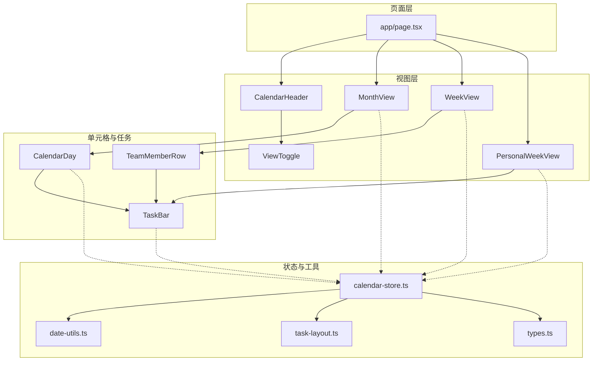
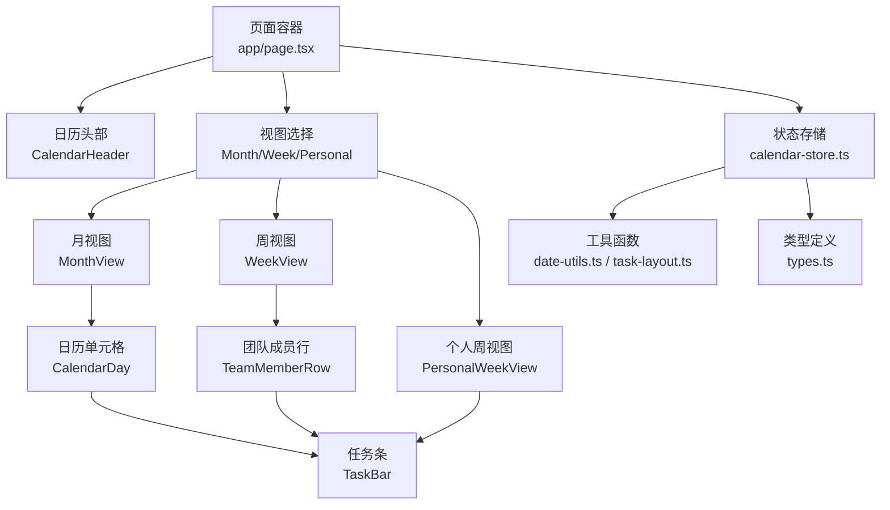
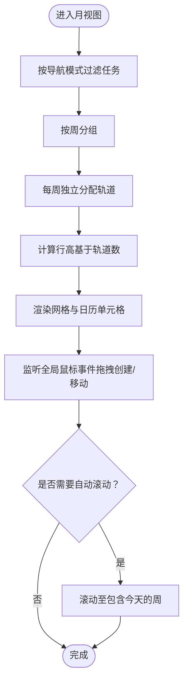
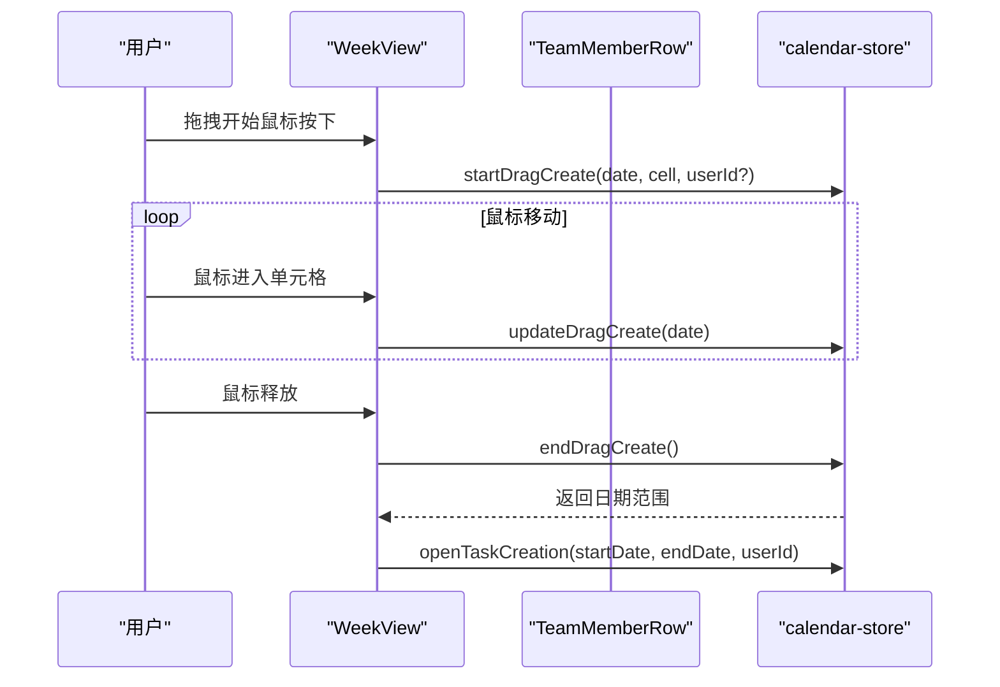
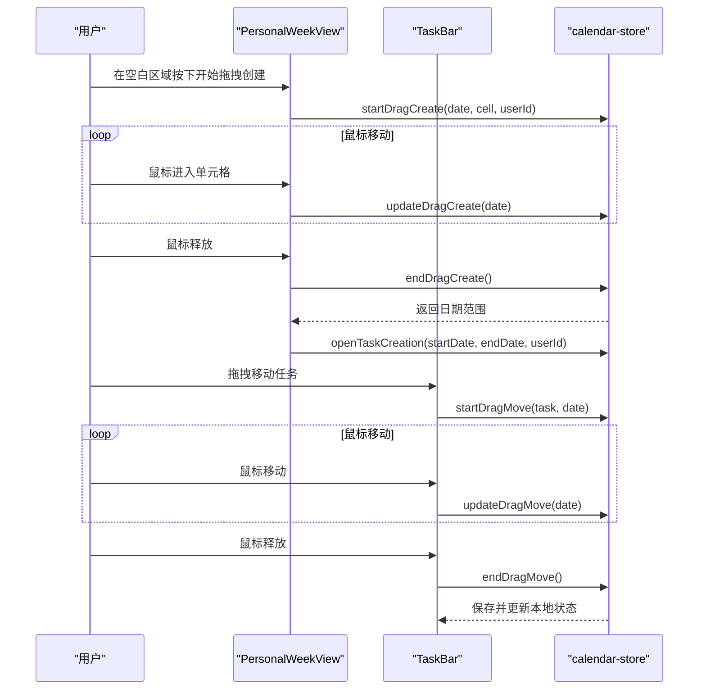
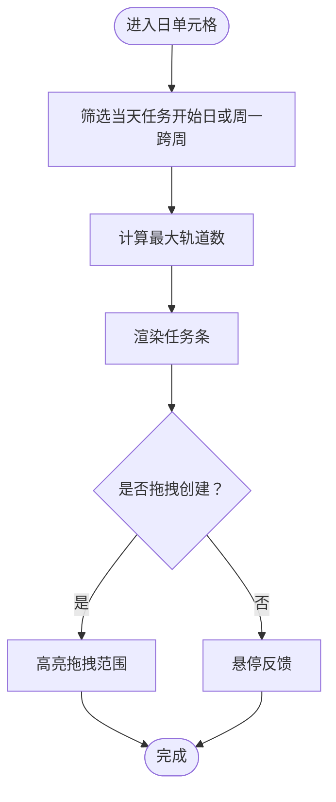
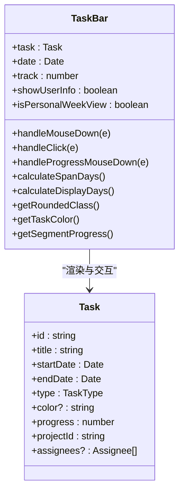
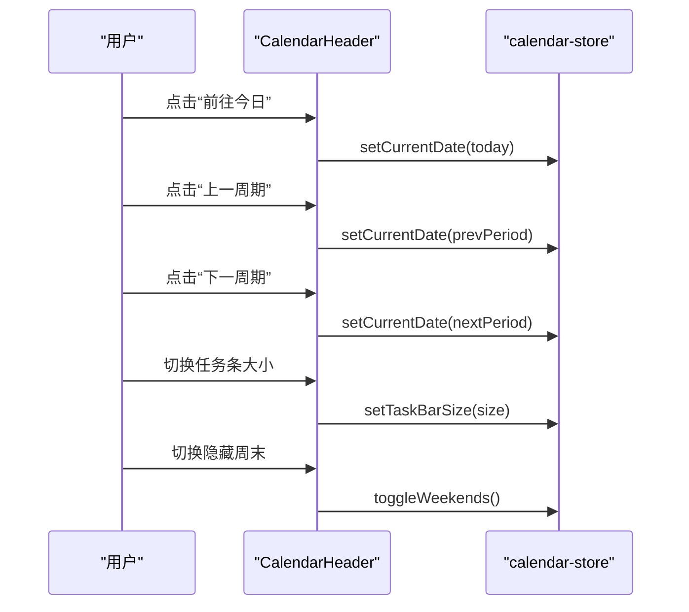
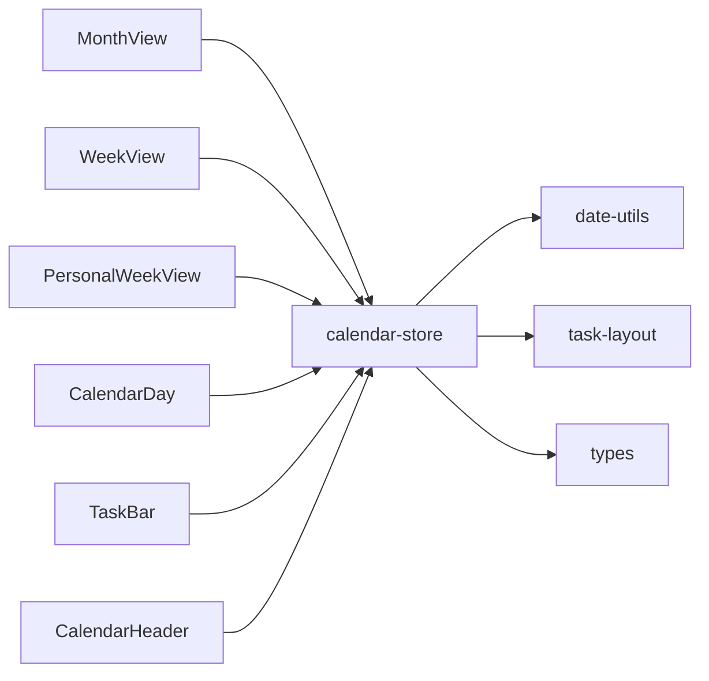

# 日历视图系统

<cite>
**本文档引用的文件**
- [app/page.tsx](file://app/page.tsx)
- [components/calendar/calendar-header.tsx](file://components/calendar/calendar-header.tsx)
- [components/calendar/month-view.tsx](file://components/calendar/month-view.tsx)
- [components/calendar/week-view.tsx](file://components/calendar/week-view.tsx)
- [components/calendar/personal-week-view.tsx](file://components/calendar/personal-week-view.tsx)
- [components/calendar/team-member-row.tsx](file://components/calendar/team-member-row.tsx)
- [components/calendar/calendar-day.tsx](file://components/calendar/calendar-day.tsx)
- [components/calendar/task-bar.tsx](file://components/calendar/task-bar.tsx)
- [components/calendar/view-toggle.tsx](file://components/calendar/view-toggle.tsx)
- [components/calendar/task-size-toggle.tsx](file://components/calendar/task-size-toggle.tsx)
- [lib/store/calendar-store.ts](file://lib/store/calendar-store.ts)
- [lib/utils/task-layout.ts](file://lib/utils/task-layout.ts)
- [lib/utils/date-utils.ts](file://lib/utils/date-utils.ts)
- [lib/types.ts](file://lib/types.ts)
</cite>

## 目录
1. [简介](#简介)
2. [项目结构](#项目结构)
3. [核心组件](#核心组件)
4. [架构概览](#架构概览)
5. [详细组件分析](#详细组件分析)
6. [依赖关系分析](#依赖关系分析)
7. [性能考量](#性能考量)
8. [故障排查指南](#故障排查指南)
9. [结论](#结论)
10. [附录](#附录)

## 简介
本技术文档面向日历视图系统，围绕月视图、周视图与个人视图的实现原理与组件架构进行深入解析。文档涵盖日历头部导航、视图切换器、任务条渲染、团队成员行等核心组件的功能与交互逻辑，详细说明拖拽创建任务、任务大小切换、日期选择等用户交互的实现细节，并提供组件间通信机制、状态管理与性能优化策略。同时，文档包含配置选项、自定义扩展方法以及响应式设计与移动端适配方案。

## 项目结构
日历视图系统采用“页面容器 + 组件库 + 状态存储 + 工具函数”的分层架构：
- 页面容器负责路由与主视图模式切换，按需渲染日历视图或列表/统计视图
- 组件库包含日历头部、月视图、周视图、个人周视图、团队成员行、日历单元格、任务条等
- 状态存储使用 Zustand 管理任务、项目、用户、团队、视图状态与拖拽状态
- 工具函数提供日期计算、任务轨道分配等通用能力

图表来源
- [app/page.tsx](file://app/page.tsx#L104-L117)
- [components/calendar/calendar-header.tsx](file://components/calendar/calendar-header.tsx#L63-L125)
- [components/calendar/month-view.tsx](file://components/calendar/month-view.tsx#L256-L305)
- [components/calendar/week-view.tsx](file://components/calendar/week-view.tsx#L70-L108)
- [components/calendar/personal-week-view.tsx](file://components/calendar/personal-week-view.tsx#L146-L199)
- [components/calendar/team-member-row.tsx](file://components/calendar/team-member-row.tsx#L149-L210)
- [components/calendar/calendar-day.tsx](file://components/calendar/calendar-day.tsx#L117-L163)
- [components/calendar/task-bar.tsx](file://components/calendar/task-bar.tsx#L462-L699)
- [lib/store/calendar-store.ts](file://lib/store/calendar-store.ts#L200-L1457)
- [lib/utils/date-utils.ts](file://lib/utils/date-utils.ts#L1-L86)
- [lib/utils/task-layout.ts](file://lib/utils/task-layout.ts#L1-L77)
- [lib/types.ts](file://lib/types.ts#L61-L141)

章节来源
- [app/page.tsx](file://app/page.tsx#L104-L117)
- [lib/store/calendar-store.ts](file://lib/store/calendar-store.ts#L200-L1457)

## 核心组件
- 日历头部导航：提供“前往今日/上一周期/下一周期”、视图模式切换、任务条大小切换、隐藏周末等功能入口
- 月视图：按周网格渲染日历单元格，支持展开、拖拽创建任务、按导航模式过滤任务
- 周视图：团队/项目模式下的多行团队成员视图，每行展示成员头像与任务条
- 个人周视图：当前用户的单行周视图，支持拖拽移动任务与进度拖拽
- 日历单元格：封装单日任务渲染、拖拽范围高亮、悬停反馈
- 任务条：渲染单个任务，支持拖拽移动、进度拖拽、跨段显示与用户信息展示
- 视图切换器：切换月/周视图
- 任务条大小切换器：切换紧凑/宽松两种尺寸

章节来源
- [components/calendar/calendar-header.tsx](file://components/calendar/calendar-header.tsx#L12-L127)
- [components/calendar/month-view.tsx](file://components/calendar/month-view.tsx#L9-L306)
- [components/calendar/week-view.tsx](file://components/calendar/week-view.tsx#L9-L109)
- [components/calendar/personal-week-view.tsx](file://components/calendar/personal-week-view.tsx#L10-L200)
- [components/calendar/calendar-day.tsx](file://components/calendar/calendar-day.tsx#L22-L164)
- [components/calendar/task-bar.tsx](file://components/calendar/task-bar.tsx#L20-L700)
- [components/calendar/view-toggle.tsx](file://components/calendar/view-toggle.tsx#L7-L52)
- [components/calendar/task-size-toggle.tsx](file://components/calendar/task-size-toggle.tsx#L8-L40)

## 架构概览
日历视图系统采用“容器组件 + 展示组件 + 状态存储 + 工具函数”的分层设计：
- 容器组件（页面）负责主视图模式与子视图的渲染决策
- 展示组件负责具体UI与交互，如拖拽、悬停、进度调整
- 状态存储统一管理任务、项目、用户、团队、视图状态与拖拽状态
- 工具函数提供日期计算、任务轨道分配等纯函数能力

图表来源
- [app/page.tsx](file://app/page.tsx#L104-L117)
- [components/calendar/month-view.tsx](file://components/calendar/month-view.tsx#L256-L305)
- [components/calendar/week-view.tsx](file://components/calendar/week-view.tsx#L70-L108)
- [components/calendar/personal-week-view.tsx](file://components/calendar/personal-week-view.tsx#L146-L199)
- [components/calendar/calendar-day.tsx](file://components/calendar/calendar-day.tsx#L117-L163)
- [components/calendar/task-bar.tsx](file://components/calendar/task-bar.tsx#L462-L699)
- [lib/store/calendar-store.ts](file://lib/store/calendar-store.ts#L200-L1457)
- [lib/utils/date-utils.ts](file://lib/utils/date-utils.ts#L1-L86)
- [lib/utils/task-layout.ts](file://lib/utils/task-layout.ts#L1-L77)
- [lib/types.ts](file://lib/types.ts#L61-L141)

## 详细组件分析

### 月视图（MonthView）
- 导航模式过滤：支持 My Days、团队、项目三种导航模式，按模式过滤任务集合
- 任务轨道分配：对每周任务独立分配轨道，避免重叠遮挡
- 行高计算：根据最大轨道数与任务条尺寸动态计算行高
- 拖拽创建：全局鼠标事件监听，支持跨日拖拽创建任务
- 自动滚动：首次加载或月份切换时自动滚动至包含今天的周

图表来源
- [components/calendar/month-view.tsx](file://components/calendar/month-view.tsx#L50-L174)
- [components/calendar/month-view.tsx](file://components/calendar/month-view.tsx#L191-L249)

章节来源
- [components/calendar/month-view.tsx](file://components/calendar/month-view.tsx#L9-L306)
- [lib/utils/task-layout.ts](file://lib/utils/task-layout.ts#L28-L68)

### 周视图（WeekView）
- 用户过滤：根据导航模式过滤显示用户（团队/项目/全部）
- 团队成员行：逐行渲染团队成员，左侧头像区，右侧周任务区
- 拖拽创建：支持跨日拖拽创建任务，团队视图中限制用户ID匹配

图表来源
- [components/calendar/week-view.tsx](file://components/calendar/week-view.tsx#L53-L68)
- [components/calendar/team-member-row.tsx](file://components/calendar/team-member-row.tsx#L109-L141)
- [lib/store/calendar-store.ts](file://lib/store/calendar-store.ts#L1090-L1164)

章节来源
- [components/calendar/week-view.tsx](file://components/calendar/week-view.tsx#L9-L109)
- [components/calendar/team-member-row.tsx](file://components/calendar/team-member-row.tsx#L18-L211)

### 个人周视图（PersonalWeekView）
- 任务过滤：仅显示当前用户的任务（负责人或创建者）
- 轨道分配：对用户任务分配轨道，计算最大轨道数决定行高
- 拖拽移动：支持拖拽移动任务，实时更新本地任务日期并异步保存
- 进度拖拽：仅日常任务支持段内进度拖拽，转换为总进度并乐观更新

图表来源
- [components/calendar/personal-week-view.tsx](file://components/calendar/personal-week-view.tsx#L113-L144)
- [components/calendar/task-bar.tsx](file://components/calendar/task-bar.tsx#L101-L110)
- [components/calendar/task-bar.tsx](file://components/calendar/task-bar.tsx#L1167-L1270)
- [lib/store/calendar-store.ts](file://lib/store/calendar-store.ts#L1090-L1164)
- [lib/store/calendar-store.ts](file://lib/store/calendar-store.ts#L1167-L1270)

章节来源
- [components/calendar/personal-week-view.tsx](file://components/calendar/personal-week-view.tsx#L10-L200)
- [components/calendar/task-bar.tsx](file://components/calendar/task-bar.tsx#L20-L700)

### 日历单元格（CalendarDay）
- 任务筛选：仅显示任务开始日或周一跨周继续的任务
- 轨道计算：按日期计算最大轨道数，决定容器最小高度
- 拖拽创建：阻止在任务条或按钮上触发拖拽
- 展开模式：支持点击展开为大格子，便于查看任务详情

图表来源
- [components/calendar/calendar-day.tsx](file://components/calendar/calendar-day.tsx#L38-L86)
- [components/calendar/calendar-day.tsx](file://components/calendar/calendar-day.tsx#L88-L115)

章节来源
- [components/calendar/calendar-day.tsx](file://components/calendar/calendar-day.tsx#L22-L164)
- [lib/utils/task-layout.ts](file://lib/utils/task-layout.ts#L73-L77)

### 任务条（TaskBar）
- 圆角与截断：根据任务开始/结束段计算圆角样式，支持周末隐藏场景下的周截断
- 跨段进度：计算段内进度并转换为总进度，支持拖拽更新
- 用户信息：根据负责人数量与当前用户显示头像与名称
- 拖拽移动：仅响应左键，拖拽时禁用其他任务交互
- 进度拖拽：仅日常任务显示拖拽手柄，拖拽时禁用过渡动画提升响应

图表来源
- [components/calendar/task-bar.tsx](file://components/calendar/task-bar.tsx#L12-L699)
- [lib/types.ts](file://lib/types.ts#L61-L82)

章节来源
- [components/calendar/task-bar.tsx](file://components/calendar/task-bar.tsx#L20-L700)
- [lib/types.ts](file://lib/types.ts#L61-L82)

### 日历头部导航（CalendarHeader）
- 导航控制：支持月/周视图下的“上一周期/下一周期/前往今日”
- 视图模式：根据主视图模式显示任务条大小切换或隐藏周末按钮
- 分组与布局：在清单视图下显示分组切换与布局切换

图表来源
- [components/calendar/calendar-header.tsx](file://components/calendar/calendar-header.tsx#L15-L41)
- [components/calendar/calendar-header.tsx](file://components/calendar/calendar-header.tsx#L92-L108)
- [lib/store/calendar-store.ts](file://lib/store/calendar-store.ts#L1051-L1054)

章节来源
- [components/calendar/calendar-header.tsx](file://components/calendar/calendar-header.tsx#L12-L127)
- [lib/store/calendar-store.ts](file://lib/store/calendar-store.ts#L1051-L1054)

### 视图切换器（ViewToggle）与任务条大小切换器（TaskSizeToggle）
- 视图切换器：在月/周视图之间切换
- 任务条大小切换器：在紧凑/宽松两种尺寸间切换，影响任务条高度与间距

章节来源
- [components/calendar/view-toggle.tsx](file://components/calendar/view-toggle.tsx#L7-L52)
- [components/calendar/task-size-toggle.tsx](file://components/calendar/task-size-toggle.tsx#L8-L40)

## 依赖关系分析
- 组件依赖：各视图组件依赖状态存储以获取任务、项目、用户、团队与视图状态；任务条依赖工具函数进行轨道分配与日期计算
- 状态耦合：拖拽创建与拖拽移动状态在全局存储中维护，避免跨组件传递复杂状态
- 数据流：页面容器负责加载初始数据，视图组件通过存储读取与更新状态

图表来源
- [components/calendar/month-view.tsx](file://components/calendar/month-view.tsx#L9-L25)
- [components/calendar/week-view.tsx](file://components/calendar/week-view.tsx#L9-L25)
- [components/calendar/personal-week-view.tsx](file://components/calendar/personal-week-view.tsx#L11-L47)
- [components/calendar/calendar-day.tsx](file://components/calendar/calendar-day.tsx#L34-L35)
- [components/calendar/task-bar.tsx](file://components/calendar/task-bar.tsx#L27-L39)
- [components/calendar/calendar-header.tsx](file://components/calendar/calendar-header.tsx#L13-L13)
- [lib/store/calendar-store.ts](file://lib/store/calendar-store.ts#L200-L1457)
- [lib/utils/date-utils.ts](file://lib/utils/date-utils.ts#L1-L86)
- [lib/utils/task-layout.ts](file://lib/utils/task-layout.ts#L1-L77)
- [lib/types.ts](file://lib/types.ts#L61-L141)

章节来源
- [lib/store/calendar-store.ts](file://lib/store/calendar-store.ts#L200-L1457)
- [lib/utils/date-utils.ts](file://lib/utils/date-utils.ts#L1-L86)
- [lib/utils/task-layout.ts](file://lib/utils/task-layout.ts#L1-L77)
- [lib/types.ts](file://lib/types.ts#L61-L141)

## 性能考量
- 任务轨道分配：使用改进的轨道分配算法，按开始/结束时间排序，减少冲突检测成本
- 日期计算：使用纯函数进行日期范围判断与周/月网格生成，避免重复计算
- 拖拽性能：任务条进度拖拽时禁用过渡动画，提升响应速度；拖拽移动时仅更新本地状态，异步保存
- 渲染优化：按周/按日分组渲染，避免一次性渲染大量DOM节点；自动滚动仅在必要时触发
- 状态持久化：Zustand 持久化仅保存视图相关配置，避免存储大数据集

章节来源
- [lib/utils/task-layout.ts](file://lib/utils/task-layout.ts#L28-L68)
- [components/calendar/task-bar.tsx](file://components/calendar/task-bar.tsx#L318-L381)
- [lib/store/calendar-store.ts](file://lib/store/calendar-store.ts#L1423-L1454)

## 故障排查指南
- 认证失败：页面容器检测到缺少用户或令牌时跳转登录页，并清理无效状态
- API错误：状态存储捕获API错误并显示Toast提示，必要时重置导航状态
- 拖拽异常：全局鼠标事件监听确保拖拽状态在任意位置释放时都能正确结束
- 数据不一致：拖拽移动后若保存失败会回滚本地状态并重新加载任务

章节来源
- [app/page.tsx](file://app/page.tsx#L46-L92)
- [lib/store/calendar-store.ts](file://lib/store/calendar-store.ts#L321-L341)
- [lib/store/calendar-store.ts](file://lib/store/calendar-store.ts#L1230-L1270)

## 结论
日历视图系统通过清晰的分层架构与完善的拖拽交互，实现了灵活的月/周/个人视图切换与丰富的任务管理功能。状态存储统一管理视图与业务状态，工具函数提供稳定的日期与轨道计算能力。系统在性能与用户体验方面进行了多项优化，适合在团队协作与个人任务管理场景中高效使用。

## 附录

### 组件间通信机制
- 全局状态：Zustand 管理任务、项目、用户、团队、视图与拖拽状态
- 组件订阅：各视图组件通过 store hook 订阅状态变化并触发重渲染
- 事件传播：拖拽事件在组件内部处理并通过 store 更新状态

章节来源
- [lib/store/calendar-store.ts](file://lib/store/calendar-store.ts#L200-L1457)

### 状态管理与持久化
- 持久化键：calendar-storage-v2
- 持久化字段：主视图模式、分组模式、布局列数、视图模式、导航模式、选中项目IDs、选中团队/项目ID、隐藏周末、任务条尺寸、设置、当前日期、选中日期
- 日期还原：反序列化时将字符串日期转换为 Date 对象

章节来源
- [lib/store/calendar-store.ts](file://lib/store/calendar-store.ts#L1423-L1454)

### 用户交互实现细节
- 拖拽创建：在空白区域按下开始，移动过程中更新拖拽范围，释放时打开任务创建面板
- 拖拽移动：左键按下开始，移动过程中实时更新本地任务日期，释放后异步保存
- 任务大小切换：切换紧凑/宽松尺寸，影响任务条高度与间距
- 日期选择：通过头部导航或日历单元格点击进行日期选择

章节来源
- [components/calendar/personal-week-view.tsx](file://components/calendar/personal-week-view.tsx#L113-L144)
- [components/calendar/task-bar.tsx](file://components/calendar/task-bar.tsx#L101-L110)
- [components/calendar/task-size-toggle.tsx](file://components/calendar/task-size-toggle.tsx#L8-L40)
- [components/calendar/calendar-header.tsx](file://components/calendar/calendar-header.tsx#L15-L41)

### 响应式设计与移动端适配
- 布局：侧边导航固定宽度，主内容区域自适应；视图切换器与头部控件在窄屏下仍保持可用
- 交互：触摸设备支持拖拽创建与拖拽移动；紧凑尺寸更适合小屏幕显示
- 日期网格：根据是否隐藏周末动态调整网格列数，保证在小屏上的可读性

章节来源
- [app/page.tsx](file://app/page.tsx#L147-L234)
- [components/calendar/month-view.tsx](file://components/calendar/month-view.tsx#L34-L36)
- [components/calendar/week-view.tsx](file://components/calendar/week-view.tsx#L27-L51)