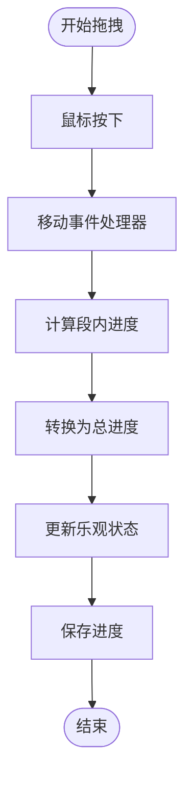

# 月视图组件

<cite>
**本文档引用的文件**
- [components/calendar/month-view.tsx](file://components/calendar/month-view.tsx)
- [components/calendar/calendar-day.tsx](file://components/calendar/calendar-day.tsx)
- [components/calendar/task-bar.tsx](file://components/calendar/task-bar.tsx)
- [lib/utils/task-layout.ts](file://lib/utils/task-layout.ts)
- [lib/utils/date-utils.ts](file://lib/utils/date-utils.ts)
- [lib/store/calendar-store.ts](file://lib/store/calendar-store.ts)
- [lib/types.ts](file://lib/types.ts)
- [app/globals.css](file://app/globals.css)
</cite>

## 目录
1. [简介](#简介)
2. [项目结构](#项目结构)
3. [核心组件](#核心组件)
4. [架构概览](#架构概览)
5. [详细组件分析](#详细组件分析)
6. [依赖关系分析](#依赖关系分析)
7. [性能考量](#性能考量)
8. [故障排除指南](#故障排除指南)
9. [结论](#结论)
10. [附录](#附录)

## 简介
月视图组件是日历应用的核心视图之一，负责以月为单位展示任务安排。它实现了完整的日期网格生成、任务布局算法、轨道分配机制，并提供了拖拽创建任务、响应式设计和滚动定位到当前周等高级功能。本文档将深入解析其实现原理和最佳实践。

## 项目结构
月视图组件位于 `components/calendar/` 目录下，采用模块化设计，各组件职责清晰：

**图表来源**
- [components/calendar/month-view.tsx](file://components/calendar/month-view.tsx#L1-L306)
- [components/calendar/calendar-day.tsx](file://components/calendar/calendar-day.tsx#L1-L164)
- [components/calendar/task-bar.tsx](file://components/calendar/task-bar.tsx#L1-L700)

**章节来源**
- [components/calendar/month-view.tsx](file://components/calendar/month-view.tsx#L1-L306)
- [lib/store/calendar-store.ts](file://lib/store/calendar-store.ts#L1-L1457)

## 核心组件
月视图组件由三个主要部分组成：

### 1. 月视图主组件 (MonthView)
负责整体布局和状态管理，实现以下核心功能：
- 日期网格生成和周分组
- 任务过滤和轨道分配
- 拖拽创建任务机制
- 响应式设计和滚动控制

### 2. 日单元格组件 (CalendarDay)
处理单个日期单元格的渲染和交互：
- 任务筛选和显示
- 拖拽创建任务的鼠标事件处理
- 日期选择验证和高亮显示

### 3. 任务条组件 (TaskBar)
渲染单个任务条并支持交互：
- 任务进度拖拽更新
- 任务拖拽移动
- 多负责人头像显示

**章节来源**
- [components/calendar/month-view.tsx](file://components/calendar/month-view.tsx#L9-L306)
- [components/calendar/calendar-day.tsx](file://components/calendar/calendar-day.tsx#L22-L164)
- [components/calendar/task-bar.tsx](file://components/calendar/task-bar.tsx#L20-L700)

## 架构概览
月视图采用分层架构设计，确保关注点分离和代码可维护性：

**图表来源**
- [lib/store/calendar-store.ts](file://lib/store/calendar-store.ts#L200-L1457)
- [lib/utils/task-layout.ts](file://lib/utils/task-layout.ts#L1-L77)
- [lib/utils/date-utils.ts](file://lib/utils/date-utils.ts#L1-L86)

## 详细组件分析

### 月视图主组件 (MonthView)
MonthView 是月视图的核心组件，实现了完整的月度日历渲染逻辑。

#### 数据流处理
组件通过 `useCalendarStore` 获取全局状态，实现以下数据流：

**图表来源**
- [components/calendar/month-view.tsx](file://components/calendar/month-view.tsx#L31-L174)
- [lib/utils/date-utils.ts](file://lib/utils/date-utils.ts#L1-L41)
- [lib/utils/task-layout.ts](file://lib/utils/task-layout.ts#L28-L68)

#### 任务过滤机制
支持三种导航模式的任务过滤：

| 导航模式 | 过滤条件 | 示例 |
|---------|---------|------|
| My Days | 当前用户负责或创建的任务 | `task.assignees.some(a => a.userId === currentUser.id) || task.creatorId === currentUser.id` |
| Team | 团队成员的任务 | `team.memberIds.includes(task.creatorId) || task.assignees.some(a => team.memberIds.includes(a.userId))` |
| Project | 项目成员的任务 | `project.memberIds.includes(task.creatorId) || task.assignees.some(a => project.memberIds.includes(a.userId))` |

**章节来源**
- [components/calendar/month-view.tsx](file://components/calendar/month-view.tsx#L50-L101)

#### 周分组算法
月视图将连续的日期按周进行分组，支持隐藏周末功能：

**图表来源**
- [components/calendar/month-view.tsx](file://components/calendar/month-view.tsx#L104-L111)
- [lib/utils/date-utils.ts](file://lib/utils/date-utils.ts#L29-L38)

#### 轨道分配机制
使用改进的轨道分配算法确保重叠任务在不同轨道上显示：

**图表来源**
- [lib/utils/task-layout.ts](file://lib/utils/task-layout.ts#L28-L68)

**章节来源**
- [lib/utils/task-layout.ts](file://lib/utils/task-layout.ts#L1-L77)

### 日单元格组件 (CalendarDay)
CalendarDay 负责单个日期单元格的渲染和交互处理。

#### 任务筛选逻辑
组件实现精确的任务筛选，确保只显示与当前日期相关的任务：

**图表来源**
- [components/calendar/calendar-day.tsx](file://components/calendar/calendar-day.tsx#L38-L78)

#### 拖拽创建任务机制
实现完整的拖拽创建流程：

**图表来源**
- [components/calendar/calendar-day.tsx](file://components/calendar/calendar-day.tsx#L88-L115)
- [lib/store/calendar-store.ts](file://lib/store/calendar-store.ts#L1090-L1164)

**章节来源**
- [components/calendar/calendar-day.tsx](file://components/calendar/calendar-day.tsx#L88-L115)

### 任务条组件 (TaskBar)
TaskBar 负责渲染单个任务条并提供丰富的交互功能。

#### 任务进度拖拽
实现精确的进度拖拽功能，支持跨段进度计算：

**图表来源**
- [components/calendar/task-bar.tsx](file://components/calendar/task-bar.tsx#L280-L381)

#### 任务拖拽移动
支持任务的拖拽移动功能，实现实时更新：

**图表来源**
- [components/calendar/task-bar.tsx](file://components/calendar/task-bar.tsx#L102-L110)
- [lib/store/calendar-store.ts](file://lib/store/calendar-store.ts#L1167-L1280)

**章节来源**
- [components/calendar/task-bar.tsx](file://components/calendar/task-bar.tsx#L280-L381)
- [lib/store/calendar-store.ts](file://lib/store/calendar-store.ts#L1167-L1280)

## 依赖关系分析

### 组件依赖图
月视图组件之间的依赖关系清晰明确：

**图表来源**
- [components/calendar/month-view.tsx](file://components/calendar/month-view.tsx#L3-L7)
- [components/calendar/calendar-day.tsx](file://components/calendar/calendar-day.tsx#L3-L6)
- [components/calendar/task-bar.tsx](file://components/calendar/task-bar.tsx#L3-L10)

### 状态管理集成
月视图通过 Zustand 状态管理实现高效的状态共享：

**图表来源**
- [lib/store/calendar-store.ts](file://lib/store/calendar-store.ts#L33-L198)

**章节来源**
- [lib/store/calendar-store.ts](file://lib/store/calendar-store.ts#L200-L1457)

## 性能考量

### 渲染优化策略
月视图采用了多项性能优化措施：

1. **Memoization 优化**
   - 使用 `useMemo` 缓存计算结果
   - 避免不必要的重新渲染

2. **虚拟滚动**
   - 月视图采用真实滚动而非虚拟滚动
   - 通过计算每周高度实现高效的滚动体验

3. **任务轨道缓存**
   - 每周独立计算轨道，避免全局重新计算

### 内存管理
- 使用 `useRef` 管理 DOM 引用
- 合理清理事件监听器
- 避免内存泄漏

### 响应式设计
月视图支持多种屏幕尺寸：

**图表来源**
- [components/calendar/month-view.tsx](file://components/calendar/month-view.tsx#L143-L174)
- [components/calendar/task-bar.tsx](file://components/calendar/task-bar.tsx#L383-L391)

**章节来源**
- [components/calendar/month-view.tsx](file://components/calendar/month-view.tsx#L143-L174)
- [components/calendar/task-bar.tsx](file://components/calendar/task-bar.tsx#L383-L391)

## 故障排除指南

### 常见问题及解决方案

#### 1. 任务轨道重叠问题
**症状**: 重叠任务显示在同一轨道上
**解决方案**: 检查 `assignTaskTracks` 函数的重叠检测逻辑

#### 2. 拖拽创建任务无效
**症状**: 拖拽后无法创建任务
**排查步骤**:
1. 检查 `dragState.isCreating` 状态
2. 验证 `endDragCreate()` 返回值
3. 确认 `openTaskCreation` 调用

#### 3. 任务进度拖拽异常
**症状**: 进度拖拽不准确
**排查步骤**:
1. 检查 `calculateSpanDays` 函数
2. 验证 `countDays` 函数的日期计算
3. 确认 `segmentProgress` 计算逻辑

#### 4. 周滚动定位问题
**症状**: 无法自动滚动到当前周
**解决方案**: 检查 `useEffect` 中的滚动逻辑和 DOM 渲染时机

**章节来源**
- [lib/utils/task-layout.ts](file://lib/utils/task-layout.ts#L10-L22)
- [lib/store/calendar-store.ts](file://lib/store/calendar-store.ts#L1118-L1153)

## 结论
月视图组件展现了现代前端开发的最佳实践，通过合理的架构设计、完善的算法实现和优秀的用户体验，为用户提供了一个功能强大且易于使用的月度日历视图。其模块化的组件设计、高效的性能优化和灵活的扩展能力，使其成为日历应用中的核心组件。

## 附录

### 自定义样式指南
月视图支持丰富的样式定制选项：

1. **任务条样式定制**
   - 通过 `taskBarSize` 属性调整任务条高度
   - 使用 CSS 变量自定义颜色主题

2. **轨道分配优化**
   - 调整 `TASK_HEIGHT` 和 `TASK_GAP` 参数
   - 优化 `weekHeights` 计算逻辑

3. **响应式布局**
   - 使用媒体查询适配不同屏幕尺寸
   - 调整 `hideWeekends` 参数控制周末显示

### 性能优化建议
1. **懒加载策略**: 对于大量任务的情况，考虑实现虚拟滚动
2. **缓存机制**: 缓存计算结果，避免重复计算
3. **事件节流**: 对高频事件进行节流处理
4. **内存监控**: 定期检查内存使用情况，及时清理无用引用

### 扩展功能建议
1. **多语言支持**: 添加国际化支持
2. **主题切换**: 实现深色/浅色主题切换
3. **打印功能**: 添加月视图打印样式
4. **导出功能**: 支持任务数据导出