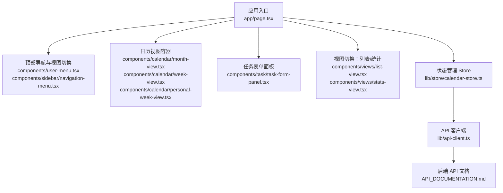
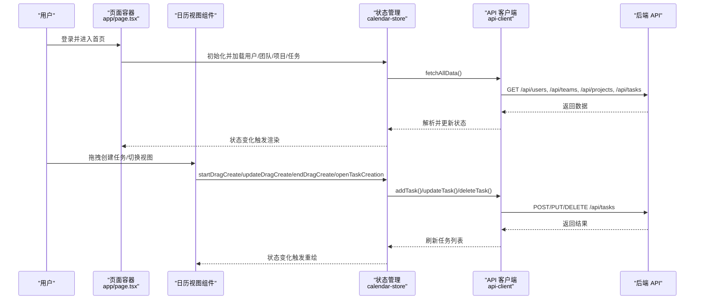
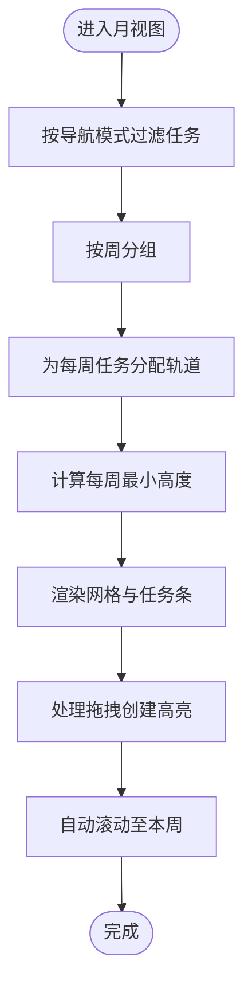
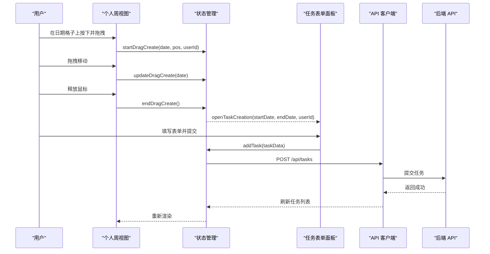
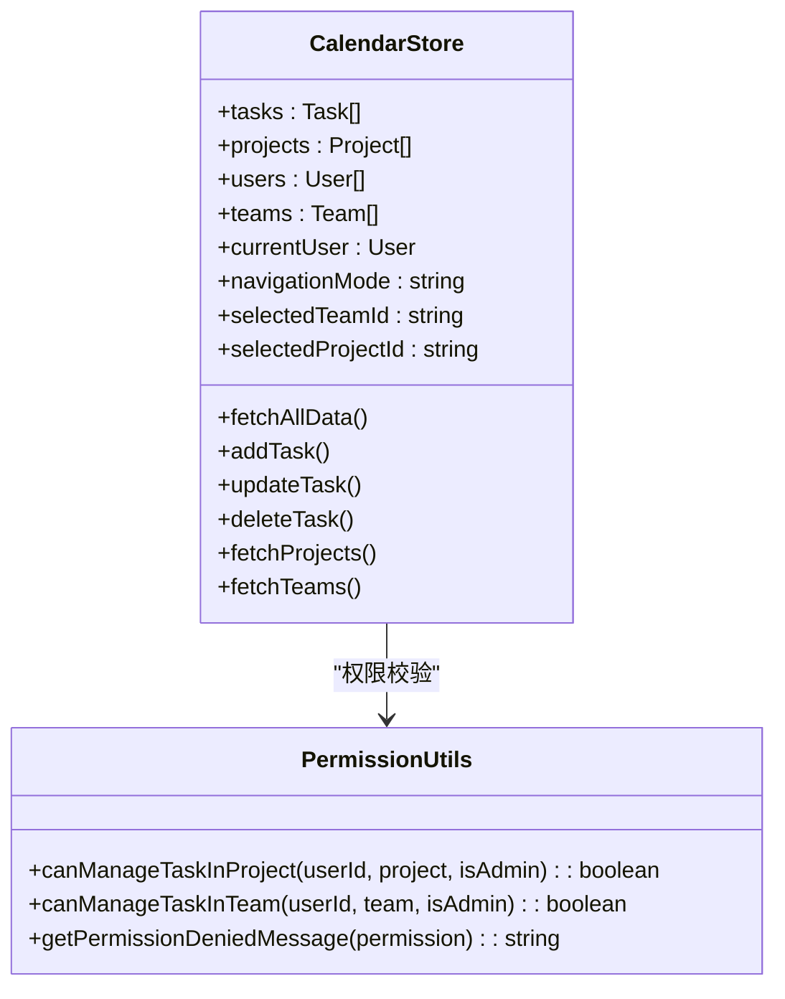
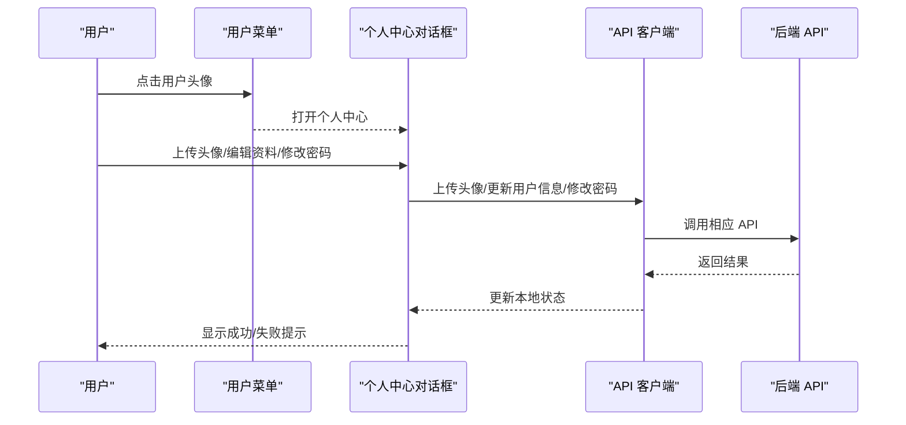
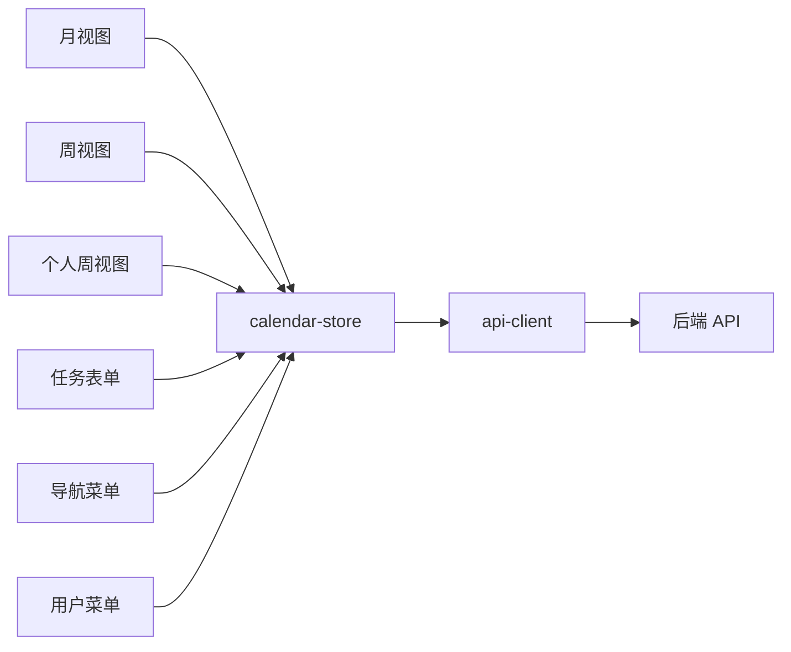

# 核心功能模块

<cite>
**本文引用的文件**
- [app/page.tsx](file://app/page.tsx)
- [components/calendar/month-view.tsx](file://components/calendar/month-view.tsx)
- [components/calendar/week-view.tsx](file://components/calendar/week-view.tsx)
- [components/calendar/personal-week-view.tsx](file://components/calendar/personal-week-view.tsx)
- [components/calendar/team-member-row.tsx](file://components/calendar/team-member-row.tsx)
- [components/taske/task-form-panel.tsx](file://components/task/task-form-panel.tsx)
- [components/views/list-view.tsx](file://components/views/list-view.tsx)
- [components/views/stats-view.tsx](file://components/views/stats-view.tsx)
- [components/user-menu.tsx](file://components/user-menu.tsx)
- [components/sidebar/navigation-menu.tsx](file://components/sidebar/navigation-menu.tsx)
- [components/user-profile-dialog.tsx](file://components/user-profile-dialog.tsx)
- [lib/store/calendar-store.ts](file://lib/store/calendar-store.ts)
- [lib/types.ts](file://lib/types.ts)
- [lib/utils/permission-utils.ts](file://lib/utils/permission-utils.ts)
- [lib/api-client.ts](file://lib/api-client.ts)
- [API_DOCUMENTATION.md](file://API_DOCUMENTATION.md)
</cite>

## 目录
1. [简介](#简介)
2. [项目结构](#项目结构)
3. [核心组件](#核心组件)
4. [架构总览](#架构总览)
5. [详细组件分析](#详细组件分析)
6. [依赖分析](#依赖分析)
7. [性能考虑](#性能考虑)
8. [故障排除指南](#故障排除指南)
9. [结论](#结论)
10. [附录](#附录)

## 简介
本文件面向日历任务管理系统的四大核心功能模块，提供深入的技术文档与使用指南。内容覆盖：
- 日历视图系统：月视图、周视图、个人视图与拖拽创建、进度调整、任务类型
- 任务管理系统：拖拽创建、进度调整、任务类型、权限控制
- 团队协作系统：团队管理、项目管理、权限控制
- 用户管理系统：用户界面、个人资料、设置

文档解释模块间的交互关系与数据流转，提供实现细节、使用模式、最佳实践、配置选项以及无障碍访问建议，并为开发者提供扩展与定制指导。

## 项目结构
系统采用 Next.js 客户端应用结构，前端通过 Zustand 状态管理统一调度数据与交互，后端通过 REST API 提供任务、用户、团队、项目等资源服务。页面入口位于应用根部，日历视图与侧边导航在主界面中组合呈现。

图表来源
- [app/page.tsx](file://app/page.tsx#L1-L234)
- [components/user-menu.tsx](file://components/user-menu.tsx#L1-L114)
- [components/sidebar/navigation-menu.tsx](file://components/sidebar/navigation-menu.tsx#L1-L561)
- [components/calendar/month-view.tsx](file://components/calendar/month-view.tsx#L1-L306)
- [components/calendar/week-view.tsx](file://components/calendar/week-view.tsx#L1-L109)
- [components/calendar/personal-week-view.tsx](file://components/calendar/personal-week-view.tsx#L1-L200)
- [components/task/task-form-panel.tsx](file://components/task/task-form-panel.tsx#L1-L627)
- [components/views/list-view.tsx](file://components/views/list-view.tsx#L1-L374)
- [components/views/stats-view.tsx](file://components/views/stats-view.tsx#L1-L309)
- [lib/store/calendar-store.ts](file://lib/store/calendar-store.ts#L1-L800)
- [lib/api-client.ts](file://lib/api-client.ts#L1-L525)
- [API_DOCUMENTATION.md](file://API_DOCUMENTATION.md#L1-L200)

章节来源
- [app/page.tsx](file://app/page.tsx#L1-L234)

## 核心组件
- 日历视图系统
  - 月视图：按周分组、轨道分配、周末隐藏、拖拽创建高亮、自动滚动至本周
  - 周视图：团队成员行、按导航模式过滤显示用户、拖拽取消与移动
  - 个人周视图：单行展示当前用户任务、拖拽创建、轨道分配、任务条尺寸
- 任务管理系统
  - 任务表单面板：标题、描述、时间范围、负责人、项目/团队、任务类型、颜色与进度、权限校验
  - 拖拽创建：开始/更新/结束拖拽、打开创建面板、权限与项目约束
  - 进度调整：进度滑块、颜色选择器（日常任务）
  - 任务类型：日常、会议、假期
- 团队协作系统
  - 导航菜单：My Days、My Teams、My Projects、团队/项目 CRUD、加入/退出、默认团队设置
  - 权限控制：项目/团队任务权限（所有成员/仅创建者）、权限校验与错误提示
- 用户管理系统
  - 用户菜单：头像、个人中心、空间管理、退出登录
  - 个人中心：头像上传、编辑资料、修改密码、团队/项目列表、加入/退出、默认团队设置

章节来源
- [components/calendar/month-view.tsx](file://components/calendar/month-view.tsx#L1-L306)
- [components/calendar/week-view.tsx](file://components/calendar/week-view.tsx#L1-L109)
- [components/calendar/personal-week-view.tsx](file://components/calendar/personal-week-view.tsx#L1-L200)
- [components/task/task-form-panel.tsx](file://components/task/task-form-panel.tsx#L1-L627)
- [components/sidebar/navigation-menu.tsx](file://components/sidebar/navigation-menu.tsx#L1-L561)
- [components/user-menu.tsx](file://components/user-menu.tsx#L1-L114)
- [components/user-profile-dialog.tsx](file://components/user-profile-dialog.tsx#L1-L816)
- [lib/utils/permission-utils.ts](file://lib/utils/permission-utils.ts#L1-L72)
- [lib/store/calendar-store.ts](file://lib/store/calendar-store.ts#L1-L800)

## 架构总览
系统采用“页面容器 + 组件 + 状态管理 + API 客户端”的分层架构。页面容器负责路由与视图切换，组件负责具体交互与展示，状态管理集中处理数据加载、筛选、拖拽与设置，API 客户端封装后端调用与错误处理。

图表来源
- [app/page.tsx](file://app/page.tsx#L1-L234)
- [lib/store/calendar-store.ts](file://lib/store/calendar-store.ts#L1-L800)
- [lib/api-client.ts](file://lib/api-client.ts#L1-L525)
- [API_DOCUMENTATION.md](file://API_DOCUMENTATION.md#L1-L200)

## 详细组件分析

### 日历视图系统
- 月视图
  - 功能要点：按周分组、轨道分配算法、周末隐藏、拖拽创建高亮、自动滚动至本周、按导航模式过滤任务
  - 关键流程：过滤任务 → 分配轨道 → 计算每周高度 → 渲染网格与任务条
- 周视图
  - 功能要点：按导航模式过滤显示用户、全局鼠标事件处理、拖拽取消与移动
  - 关键流程：过滤用户 → 渲染成员行 → 渲染任务条
- 个人周视图
  - 功能要点：单行展示当前用户任务、拖拽创建、轨道分配、任务条尺寸
  - 关键流程：过滤当前用户任务 → 分配轨道 → 渲染日期格子与任务条

图表来源
- [components/calendar/month-view.tsx](file://components/calendar/month-view.tsx#L1-L306)

章节来源
- [components/calendar/month-view.tsx](file://components/calendar/month-view.tsx#L1-L306)
- [components/calendar/week-view.tsx](file://components/calendar/week-view.tsx#L1-L109)
- [components/calendar/personal-week-view.tsx](file://components/calendar/personal-week-view.tsx#L1-L200)

### 任务管理系统
- 任务表单面板
  - 功能要点：必填字段校验、负责人选择、项目/团队选择、任务类型、颜色与进度、权限校验、提交与删除
  - 关键流程：表单验证 → 权限校验 → API 调用 → 成功提示与状态刷新
- 拖拽创建
  - 功能要点：开始/更新/结束拖拽、打开创建面板、权限与项目约束
  - 关键流程：鼠标按下 → 拖拽范围更新 → 鼠标释放 → 打开创建面板
- 进度调整与任务类型
  - 功能要点：进度滑块、颜色选择器（日常任务）、任务类型标签

图表来源
- [components/calendar/personal-week-view.tsx](file://components/calendar/personal-week-view.tsx#L1-L200)
- [components/task/task-form-panel.tsx](file://components/task/task-form-panel.tsx#L1-L627)
- [lib/store/calendar-store.ts](file://lib/store/calendar-store.ts#L1-L800)
- [lib/api-client.ts](file://lib/api-client.ts#L1-L525)
- [API_DOCUMENTATION.md](file://API_DOCUMENTATION.md#L1-L200)

章节来源
- [components/task/task-form-panel.tsx](file://components/task/task-form-panel.tsx#L1-L627)
- [lib/store/calendar-store.ts](file://lib/store/calendar-store.ts#L1-L800)

### 团队协作系统
- 导航菜单
  - 功能要点：My Days、My Teams、My Projects、团队/项目 CRUD、加入/退出、默认团队设置
  - 关键流程：加载团队/项目 → 过滤当前用户 → 展示与操作
- 权限控制
  - 功能要点：项目/团队任务权限（所有成员/仅创建者）、权限校验与错误提示
  - 关键流程：读取项目/团队权限 → 校验当前用户 → 控制编辑/删除能力

图表来源
- [lib/store/calendar-store.ts](file://lib/store/calendar-store.ts#L1-L800)
- [lib/utils/permission-utils.ts](file://lib/utils/permission-utils.ts#L1-L72)

章节来源
- [components/sidebar/navigation-menu.tsx](file://components/sidebar/navigation-menu.tsx#L1-L561)
- [lib/utils/permission-utils.ts](file://lib/utils/permission-utils.ts#L1-L72)
- [lib/store/calendar-store.ts](file://lib/store/calendar-store.ts#L1-L800)

### 用户管理系统
- 用户菜单
  - 功能要点：头像、个人中心、空间管理、退出登录
- 个人中心
  - 功能要点：头像上传、编辑资料、修改密码、团队/项目列表、加入/退出、默认团队设置

图表来源
- [components/user-menu.tsx](file://components/user-menu.tsx#L1-L114)
- [components/user-profile-dialog.tsx](file://components/user-profile-dialog.tsx#L1-L816)
- [lib/api-client.ts](file://lib/api-client.ts#L1-L525)
- [API_DOCUMENTATION.md](file://API_DOCUMENTATION.md#L1-L200)

章节来源
- [components/user-menu.tsx](file://components/user-menu.tsx#L1-L114)
- [components/user-profile-dialog.tsx](file://components/user-profile-dialog.tsx#L1-L816)

## 依赖分析
- 组件耦合
  - 页面容器与视图组件：通过状态管理解耦，视图组件仅订阅所需状态
  - 视图组件与状态管理：通过 Store 的动作方法进行数据操作与刷新
  - 任务表单与权限：依赖权限工具进行权限校验
- 外部依赖
  - API 客户端：封装请求与错误处理，统一鉴权头
  - 后端 API：遵循统一响应格式与 OpenAPI 规范

图表来源
- [components/calendar/month-view.tsx](file://components/calendar/month-view.tsx#L1-L306)
- [components/calendar/week-view.tsx](file://components/calendar/week-view.tsx#L1-L109)
- [components/calendar/personal-week-view.tsx](file://components/calendar/personal-week-view.tsx#L1-L200)
- [components/task/task-form-panel.tsx](file://components/task/task-form-panel.tsx#L1-L627)
- [components/sidebar/navigation-menu.tsx](file://components/sidebar/navigation-menu.tsx#L1-L561)
- [components/user-menu.tsx](file://components/user-menu.tsx#L1-L114)
- [lib/store/calendar-store.ts](file://lib/store/calendar-store.ts#L1-L800)
- [lib/api-client.ts](file://lib/api-client.ts#L1-L525)

章节来源
- [lib/store/calendar-store.ts](file://lib/store/calendar-store.ts#L1-L800)
- [lib/api-client.ts](file://lib/api-client.ts#L1-L525)

## 性能考虑
- 渲染优化
  - 使用 useMemo 与 memo 化任务过滤与轨道分配，减少不必要的重渲染
  - 月视图按周分组与轨道计算，结合动态行高，避免超大容器导致的重排
- 数据加载
  - 并行加载用户、团队、项目与任务，缩短首屏时间
  - 加载延迟与最小显示时间保障，提升体验一致性
- 拖拽性能
  - 全局 mouseup 事件清理拖拽状态，避免内存泄漏
  - 拖拽范围高亮与任务条渲染按需更新

[本节为通用指导，无需列出章节来源]

## 故障排除指南
- 认证失败
  - 现象：出现认证相关错误提示并跳转登录页
  - 处理：清除本地用户信息与 token，重新登录
- 权限不足
  - 现象：尝试编辑/删除任务时报错
  - 处理：检查项目/团队任务权限设置，确认当前用户角色
- API 错误
  - 现象：网络异常或后端错误
  - 处理：查看 API 文档与错误消息，必要时重试或联系管理员

章节来源
- [app/page.tsx](file://app/page.tsx#L79-L92)
- [lib/store/calendar-store.ts](file://lib/store/calendar-store.ts#L550-L748)
- [lib/api-client.ts](file://lib/api-client.ts#L502-L525)
- [API_DOCUMENTATION.md](file://API_DOCUMENTATION.md#L1-L200)

## 结论
系统通过清晰的模块划分与状态管理，实现了日历视图、任务管理、团队协作与用户管理的完整闭环。权限控制与拖拽交互提升了协作效率与用户体验。建议在扩展时遵循现有模式，保持状态集中、API 统一与权限一致。

[本节为总结性内容，无需列出章节来源]

## 附录

### 使用模式与最佳实践
- 拖拽创建
  - 在个人周视图或团队周视图中，于日期格子按下并拖拽以选择时间范围，释放后打开任务表单
  - 注意：团队视图中拖拽目标用户需匹配当前用户
- 任务类型与进度
  - 日常任务支持颜色与进度；会议与假期任务用于可视化区分
- 视图切换
  - 通过顶部导航切换日历/列表/统计视图，配合列表分组与列数设置提升阅读效率
- 权限管理
  - 项目/团队任务权限建议设为“所有成员”以提升协作效率；仅在敏感场景启用“仅创建者”

[本节为通用指导，无需列出章节来源]

### 配置选项
- 视图设置
  - 任务条尺寸：紧凑/宽松
  - 周末显示：隐藏/显示
  - 列表布局列数：1-4 列
- 项目/团队设置
  - 任务权限：所有成员/仅创建者
  - 默认团队：个人中心设置

章节来源
- [lib/store/calendar-store.ts](file://lib/store/calendar-store.ts#L1-L800)
- [lib/types.ts](file://lib/types.ts#L1-L141)

### API 参考
- 任务
  - 获取列表、获取单个、创建、更新、删除
- 用户
  - 获取列表、获取当前用户、更新当前用户、上传头像、修改密码
- 项目/团队
  - 获取列表、获取单个、创建、更新、删除、加入/退出

章节来源
- [API_DOCUMENTATION.md](file://API_DOCUMENTATION.md#L1-L200)
- [lib/api-client.ts](file://lib/api-client.ts#L1-L525)