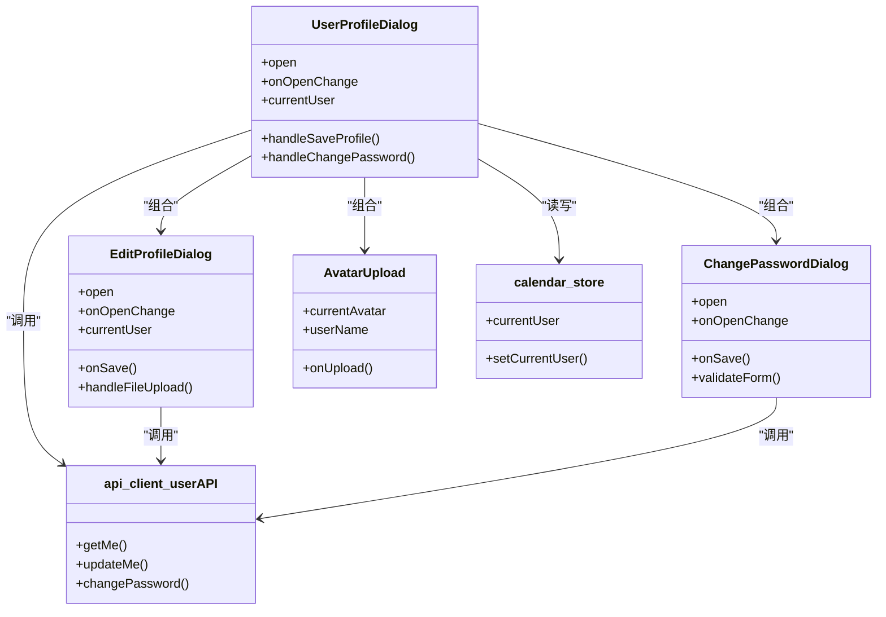

# 个人资料管理

<cite>
**本文引用的文件**
- [components/edit-profile-dialog.tsx](file://components/edit-profile-dialog.tsx)
- [components/change-password-dialog.tsx](file://components/change-password-dialog.tsx)
- [components/user-profile-dialog.tsx](file://components/user-profile-dialog.tsx)
- [components/avatar-upload.tsx](file://components/avatar-upload.tsx)
- [app/api/users/me/route.ts](file://app/api/users/me/route.ts)
- [app/api/users/change-password/route.ts](file://app/api/users/change-password/route.ts)
- [lib/api-client.ts](file://lib/api-client.ts)
- [lib/types.ts](file://lib/types.ts)
- [lib/validation.ts](file://lib/validation.ts)
- [lib/image-utils.ts](file://lib/image-utils.ts)
- [lib/store/calendar-store.ts](file://lib/store/calendar-store.ts)
- [lib/toast.ts](file://lib/toast.ts)
- [components/user-menu.tsx](file://components/user-menu.tsx)
</cite>

## 目录
1. [简介](#简介)
2. [项目结构](#项目结构)
3. [核心组件](#核心组件)
4. [架构总览](#架构总览)
5. [详细组件分析](#详细组件分析)
6. [依赖关系分析](#依赖关系分析)
7. [性能考量](#性能考量)
8. [故障排查指南](#故障排查指南)
9. [结论](#结论)
10. [附录](#附录)

## 简介
本技术文档围绕个人资料管理功能进行全面解析，涵盖以下方面：
- 个人资料编辑对话框：表单验证、数据绑定、头像上传与实时预览
- 用户资料对话框：只读信息展示、编辑入口、权限控制、数据同步机制
- 密码修改对话框：安全实现（旧密码校验、新密码强度、加密存储）
- 表单字段配置、验证规则、错误处理指南
- 隐私保护、数据安全与用户体验优化最佳实践

## 项目结构
个人资料管理涉及前端组件、API 后端接口、状态管理与工具库协同工作：
- 前端对话框组件：编辑资料、修改密码、用户中心、头像上传
- API 接口：获取/更新用户资料、修改密码
- 工具库：类型定义、验证、图片压缩、Toast 提示
- 状态管理：Zustand store 管理当前用户与全局数据

图表来源
- [components/user-profile-dialog.tsx](file://components/user-profile-dialog.tsx#L62-L816)
- [components/edit-profile-dialog.tsx](file://components/edit-profile-dialog.tsx#L38-L299)
- [components/change-password-dialog.tsx](file://components/change-password-dialog.tsx#L23-L249)
- [components/avatar-upload.tsx](file://components/avatar-upload.tsx#L17-L102)
- [lib/api-client.ts](file://lib/api-client.ts#L184-L281)
- [lib/validation.ts](file://lib/validation.ts#L1-L168)
- [lib/image-utils.ts](file://lib/image-utils.ts#L8-L92)
- [lib/store/calendar-store.ts](file://lib/store/calendar-store.ts#L200-L287)
- [lib/toast.ts](file://lib/toast.ts#L3-L35)
- [app/api/users/me/route.ts](file://app/api/users/me/route.ts#L16-L115)
- [app/api/users/change-password/route.ts](file://app/api/users/change-password/route.ts#L15-L74)

章节来源
- [components/user-profile-dialog.tsx](file://components/user-profile-dialog.tsx#L62-L816)
- [lib/api-client.ts](file://lib/api-client.ts#L184-L281)

## 核心组件
- 用户资料对话框（UserProfileDialog）：聚合展示用户基本信息、团队与项目列表，并提供“编辑资料”“修改密码”的入口；负责数据加载、刷新与同步。
- 个人资料编辑对话框（EditProfileDialog）：表单驱动的数据绑定、字段验证、头像上传与魔法棒生成、提交保存。
- 密码修改对话框（ChangePasswordDialog）：表单验证（旧密码、新密码长度、一致性、与旧密码不同）、提交流程与错误处理。
- 头像上传组件（AvatarUpload）：文件类型与大小校验、触发上传回调、上传中状态与提示。

章节来源
- [components/user-profile-dialog.tsx](file://components/user-profile-dialog.tsx#L62-L816)
- [components/edit-profile-dialog.tsx](file://components/edit-profile-dialog.tsx#L38-L299)
- [components/change-password-dialog.tsx](file://components/change-password-dialog.tsx#L23-L249)
- [components/avatar-upload.tsx](file://components/avatar-upload.tsx#L17-L102)

## 架构总览
前端组件通过 API 客户端发起请求，后端接口进行鉴权与业务校验，最终更新数据库并返回统一响应格式。状态管理负责维护当前用户信息与全局数据，确保 UI 与数据一致。

图表来源
- [components/user-profile-dialog.tsx](file://components/user-profile-dialog.tsx#L154-L182)
- [components/edit-profile-dialog.tsx](file://components/edit-profile-dialog.tsx#L64-L82)
- [components/change-password-dialog.tsx](file://components/change-password-dialog.tsx#L74-L96)
- [lib/api-client.ts](file://lib/api-client.ts#L204-L281)
- [app/api/users/me/route.ts](file://app/api/users/me/route.ts#L52-L115)
- [app/api/users/change-password/route.ts](file://app/api/users/change-password/route.ts#L15-L74)

## 详细组件分析

### 个人资料编辑对话框（EditProfileDialog）
- 数据绑定与表单控件
  - 姓名、邮箱、性别、职业、头像字段均通过受控组件绑定状态。
  - 职业支持预设枚举与自定义输入切换。
- 实时预览与头像处理
  - 头像上传采用前端压缩（256x256 正方形裁剪），失败时降级为直接读取 Base64。
  - “魔法棒”按钮通过服务端配置动态拼接头像 API，模拟加载动画。
- 表单验证与提交
  - 提交前对必填字段进行 trim 与非空校验，禁用按钮直至满足条件。
  - 异步提交，捕获错误并保持对话框打开以便用户修正。
- 生命周期与状态同步
  - 对话框打开时从父组件传入的 currentUser 重建本地状态，保证与最新数据一致。

图表来源
- [components/edit-profile-dialog.tsx](file://components/edit-profile-dialog.tsx#L38-L132)
- [lib/image-utils.ts](file://lib/image-utils.ts#L8-L92)

章节来源
- [components/edit-profile-dialog.tsx](file://components/edit-profile-dialog.tsx#L38-L299)
- [lib/image-utils.ts](file://lib/image-utils.ts#L8-L92)

### 用户资料对话框（UserProfileDialog）
- 信息展示与入口
  - 展示头像、姓名、用户名、邮箱、性别、默认团队、职业、积分等级等只读信息。
  - 提供“编辑资料”“修改密码”按钮进入相应对话框。
- 数据加载与刷新
  - 首次打开时异步加载全部团队与项目列表，并过滤个人事务项目。
  - 通过 userAPI.getMe 刷新当前用户信息，更新本地状态与 localStorage。
- 操作流程
  - 头像上传：前端压缩 -> 调用后端更新 -> 更新本地状态 -> Toast 提示。
  - 保存资料：调用后端更新 -> 同步本地状态 -> Toast 提示。
  - 修改密码：调用后端修改 -> Toast 提示。
- 权限与交互
  - 团队/项目列表根据成员身份显示加入/退出/设为默认/编辑/删除等操作按钮。
  - 使用确认对话框防止误操作。

图表来源
- [components/user-menu.tsx](file://components/user-menu.tsx#L33-L45)
- [components/user-profile-dialog.tsx](file://components/user-profile-dialog.tsx#L112-L182)
- [components/avatar-upload.tsx](file://components/avatar-upload.tsx#L26-L54)
- [lib/api-client.ts](file://lib/api-client.ts#L204-L241)
- [lib/store/calendar-store.ts](file://lib/store/calendar-store.ts#L285-L287)

章节来源
- [components/user-profile-dialog.tsx](file://components/user-profile-dialog.tsx#L62-L816)
- [components/avatar-upload.tsx](file://components/avatar-upload.tsx#L17-L102)
- [lib/store/calendar-store.ts](file://lib/store/calendar-store.ts#L200-L287)

### 密码修改对话框（ChangePasswordDialog）
- 表单字段与验证规则
  - 旧密码、新密码、确认密码三字段必填。
  - 新密码长度至少 6 位；新旧密码不能相同；两次输入需一致。
  - 输入时即时清除对应错误信息。
- 提交流程
  - 校验通过后调用 userAPI.changePassword，成功显示成功提示并关闭对话框；失败由父组件通过 Toast 显示。
- 安全要点
  - 前端仅做 UI 校验，后端严格校验旧密码、新密码强度与与旧密码一致性，并使用哈希加密存储。

图表来源
- [components/change-password-dialog.tsx](file://components/change-password-dialog.tsx#L46-L96)
- [lib/validation.ts](file://lib/validation.ts#L27-L58)
- [app/api/users/change-password/route.ts](file://app/api/users/change-password/route.ts#L25-L38)

章节来源
- [components/change-password-dialog.tsx](file://components/change-password-dialog.tsx#L23-L249)
- [lib/validation.ts](file://lib/validation.ts#L27-L58)
- [app/api/users/change-password/route.ts](file://app/api/users/change-password/route.ts#L15-L74)

### 头像上传组件（AvatarUpload）
- 文件校验
  - 类型限制为图片；大小不超过 5MB。
- 上传流程
  - 触发 onUpload 回调（通常来自 UserProfileDialog），内部执行前端压缩与后端更新。
  - 上传中显示加载图标，完成后清空文件输入以支持重复上传。
- 错误处理
  - 格式/大小错误通过 Toast 提示；网络异常在回调中捕获并记录。

章节来源
- [components/avatar-upload.tsx](file://components/avatar-upload.tsx#L17-L102)

## 依赖关系分析
- 组件依赖
  - UserProfileDialog 依赖 EditProfileDialog、ChangePasswordDialog、AvatarUpload、calendar-store、api-client、toast。
  - EditProfileDialog 依赖 image-utils、api-client、validation。
  - ChangePasswordDialog 依赖 api-client、validation、toast。
- API 依赖
  - userAPI.getMe/updateMe/changePassword 统一通过 fetchAPI 发起请求，自动携带 Authorization。
- 数据模型
  - User 类型定义包含基础字段与可选扩展字段，前后端字段映射需保持一致。

图表来源
- [components/user-profile-dialog.tsx](file://components/user-profile-dialog.tsx#L62-L816)
- [components/edit-profile-dialog.tsx](file://components/edit-profile-dialog.tsx#L31-L36)
- [components/change-password-dialog.tsx](file://components/change-password-dialog.tsx#L17-L21)
- [components/avatar-upload.tsx](file://components/avatar-upload.tsx#L10-L15)
- [lib/api-client.ts](file://lib/api-client.ts#L184-L281)
- [lib/store/calendar-store.ts](file://lib/store/calendar-store.ts#L285-L287)

章节来源
- [lib/types.ts](file://lib/types.ts#L108-L121)
- [lib/api-client.ts](file://lib/api-client.ts#L184-L281)

## 性能考量
- 图片压缩与裁剪
  - 前端压缩至 256x256 正方形，减少传输体积与服务器压力；失败降级为直接读取，保证可用性。
- 并发加载
  - 用户中心首次打开时并发加载团队与项目列表，缩短等待时间。
- 状态同步
  - 更新用户信息后立即更新本地状态与 localStorage，避免二次请求带来的闪烁。
- 提示与反馈
  - 上传与修改密码过程中显示加载状态与 Toast，提升感知性能与用户信心。

章节来源
- [lib/image-utils.ts](file://lib/image-utils.ts#L8-L92)
- [components/user-profile-dialog.tsx](file://components/user-profile-dialog.tsx#L96-L121)
- [lib/toast.ts](file://lib/toast.ts#L3-L35)

## 故障排查指南
- 头像上传失败
  - 检查文件类型与大小限制；确认 onUpload 回调是否正确执行；查看网络面板与控制台错误。
- 保存资料失败
  - 确认邮箱格式与性别/职业字段合法性；查看后端返回的错误信息；检查本地状态是否已更新。
- 修改密码失败
  - 确认旧密码正确且新密码长度≥6；新旧密码不能相同；查看后端返回的错误原因。
- 登录态失效
  - 若出现 401，前端会清除 token 并抛出错误；建议重新登录并检查网络代理与 Cookie 设置。

章节来源
- [components/avatar-upload.tsx](file://components/avatar-upload.tsx#L30-L40)
- [lib/api-client.ts](file://lib/api-client.ts#L72-L82)
- [app/api/users/me/route.ts](file://app/api/users/me/route.ts#L62-L71)
- [app/api/users/change-password/route.ts](file://app/api/users/change-password/route.ts#L53-L57)

## 结论
个人资料管理模块通过清晰的组件职责划分、完善的表单验证与错误处理、前后端一致的 API 设计以及良好的状态同步机制，实现了稳定、安全、易用的用户资料编辑与密码修改体验。配合头像压缩、并发加载与提示反馈，进一步提升了性能与用户体验。

## 附录

### 表单字段配置与验证规则
- 个人资料编辑
  - 姓名/邮箱：必填，前端 trim；后端校验邮箱格式。
  - 性别：枚举值（未设置/男/女/其他）。
  - 职业：支持预设枚举与自定义输入。
  - 头像：图片文件，最大 5MB；前端压缩为 256x256。
- 密码修改
  - 旧密码：必填。
  - 新密码：必填且长度≥6；与旧密码不同。
  - 确认密码：与新密码一致。

章节来源
- [components/edit-profile-dialog.tsx](file://components/edit-profile-dialog.tsx#L201-L278)
- [components/change-password-dialog.tsx](file://components/change-password-dialog.tsx#L46-L72)
- [app/api/users/me/route.ts](file://app/api/users/me/route.ts#L62-L78)
- [app/api/users/change-password/route.ts](file://app/api/users/change-password/route.ts#L25-L38)
- [lib/validation.ts](file://lib/validation.ts#L6-L9)

### 数据安全与隐私保护
- 传输安全：统一通过 HTTPS 与 Bearer Token 传递认证信息。
- 存储安全：密码使用哈希算法加密存储，不暴露明文。
- 隐私最小化：仅返回必要的用户字段，避免泄露敏感信息。
- 用户同意：删除/退出团队/项目等操作使用确认对话框，降低误操作风险。

章节来源
- [lib/api-client.ts](file://lib/api-client.ts#L50-L65)
- [app/api/users/change-password/route.ts](file://app/api/users/change-password/route.ts#L59-L66)