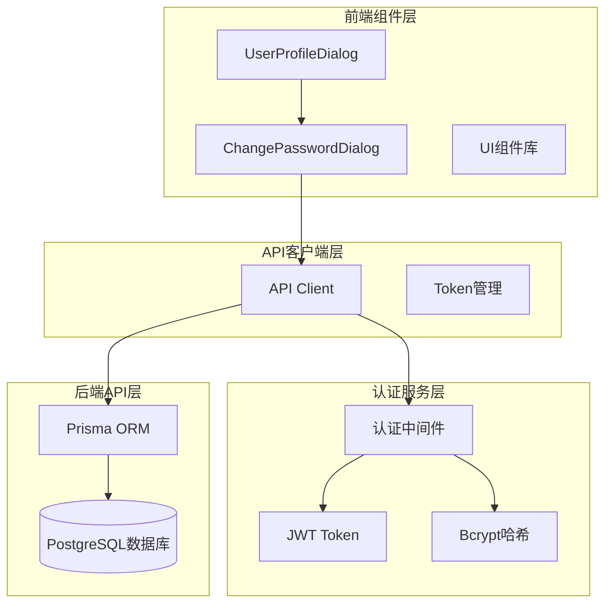
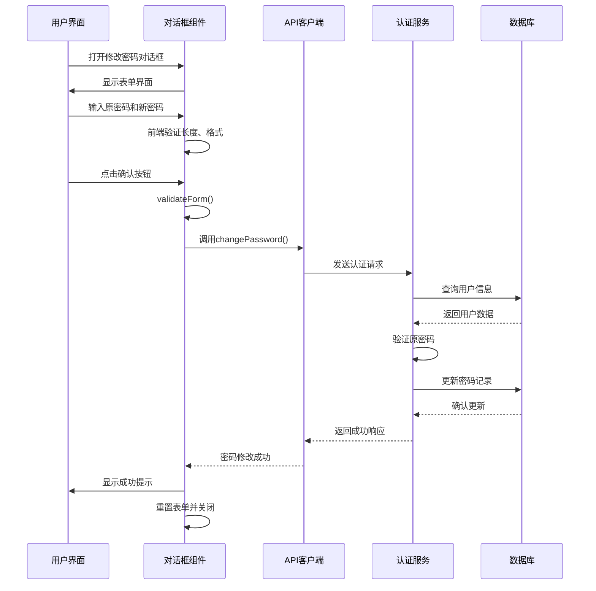
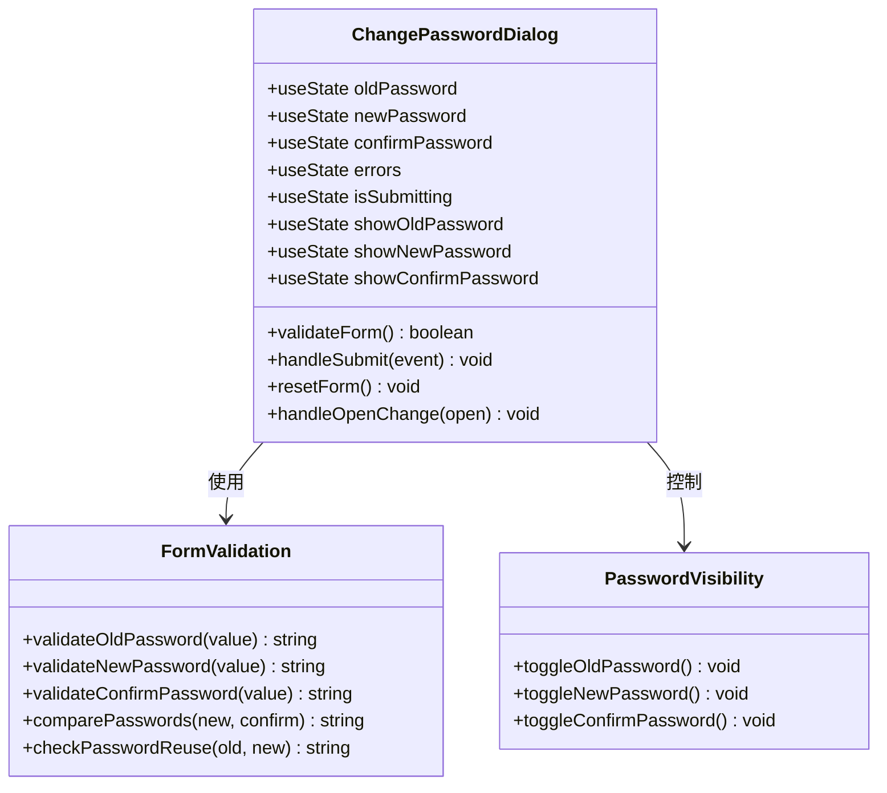
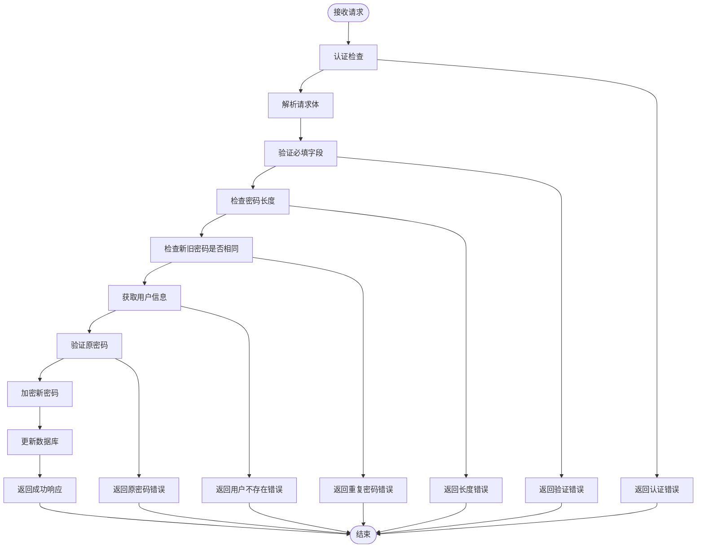
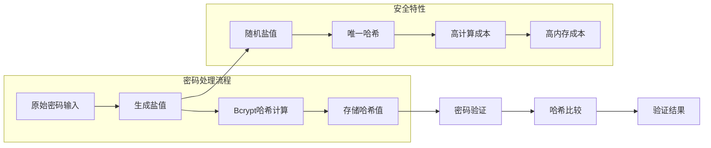
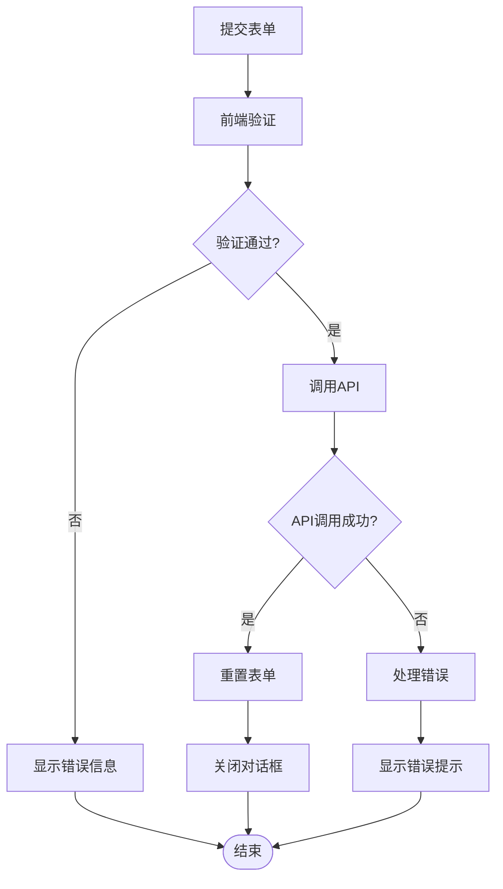
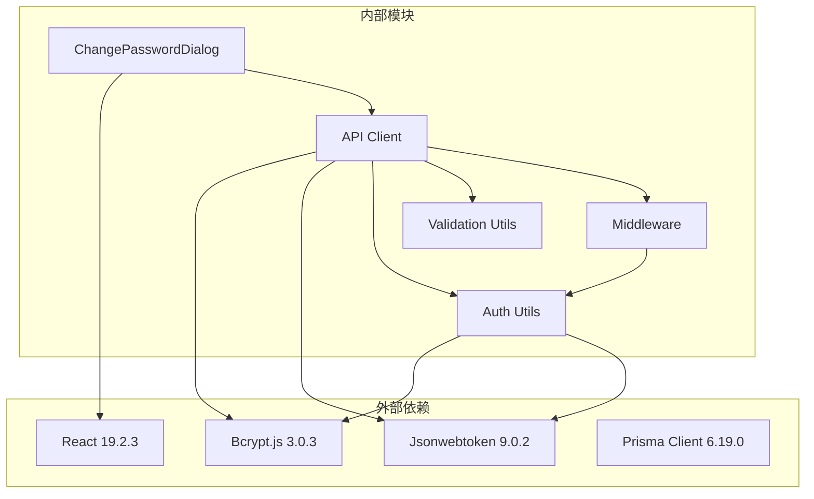

# 修改密码对话框

<cite>
**本文档引用的文件**
- [components/change-password-dialog.tsx](file://components/change-password-dialog.tsx)
- [app/api/users/change-password/route.ts](file://app/api/users/change-password/route.ts)
- [lib/validation.ts](file://lib/validation.ts)
- [lib/auth.ts](file://lib/auth.ts)
- [lib/api-client.ts](file://lib/api-client.ts)
- [lib/middleware.ts](file://lib/middleware.ts)
- [lib/api-response.ts](file://lib/api-response.ts)
- [components/user-profile-dialog.tsx](file://components/user-profile-dialog.tsx)
- [lib/toast.ts](file://lib/toast.ts)
- [hooks/use-toast.ts](file://hooks/use-toast.ts)
- [package.json](file://package.json)
</cite>

## 目录
1. [简介](#简介)
2. [项目结构](#项目结构)
3. [核心组件](#核心组件)
4. [架构概览](#架构概览)
5. [详细组件分析](#详细组件分析)
6. [依赖关系分析](#依赖关系分析)
7. [性能考虑](#性能考虑)
8. [故障排除指南](#故障排除指南)
9. [结论](#结论)

## 简介

修改密码对话框是一个专门用于密码安全管理的前端组件，提供了完整的密码修改功能，包括旧密码确认、新密码强度检查、确认密码匹配验证等安全特性。该组件采用现代化的React Hooks模式，结合后端API接口，实现了安全可靠的密码修改流程。

## 项目结构

修改密码对话框组件位于项目的UI组件层，与API客户端和认证系统紧密集成：

**图表来源**
- [components/change-password-dialog.tsx](file://components/change-password-dialog.tsx#L1-L249)
- [lib/api-client.ts](file://lib/api-client.ts#L1-L525)
- [lib/auth.ts](file://lib/auth.ts#L1-L78)

**章节来源**
- [components/change-password-dialog.tsx](file://components/change-password-dialog.tsx#L1-L249)
- [lib/api-client.ts](file://lib/api-client.ts#L1-L525)

## 核心组件

### ChangePasswordDialog 组件

ChangePasswordDialog 是一个功能完整的密码修改对话框组件，具有以下核心特性：

#### 表单字段设计
- **原密码字段**：支持密码可见性切换，实时验证输入
- **新密码字段**：包含强度指示器和可见性切换
- **确认密码字段**：确保两次输入的一致性

#### 验证规则
- 原密码：必填验证
- 新密码：长度≥6位，必须包含字母和数字
- 确认密码：必须与新密码完全匹配
- 新旧密码对比：防止重复使用相同密码

#### 用户体验特性
- 实时错误提示和视觉反馈
- 密码可见性切换按钮
- 提交状态管理
- 自动表单重置

**章节来源**
- [components/change-password-dialog.tsx](file://components/change-password-dialog.tsx#L17-L104)

## 架构概览

修改密码对话框采用分层架构设计，确保了安全性、可维护性和可扩展性：

**图表来源**
- [components/change-password-dialog.tsx](file://components/change-password-dialog.tsx#L74-L96)
- [lib/api-client.ts](file://lib/api-client.ts#L272-L281)
- [app/api/users/change-password/route.ts](file://app/api/users/change-password/route.ts#L15-L73)

## 详细组件分析

### 前端组件实现

#### 状态管理架构

**图表来源**
- [components/change-password-dialog.tsx](file://components/change-password-dialog.tsx#L23-L104)

#### 表单验证逻辑

组件实现了多层次的表单验证机制：

1. **必填字段验证**：确保所有必需字段都有值
2. **格式验证**：检查密码格式和长度要求
3. **业务逻辑验证**：比较新旧密码，验证确认密码一致性
4. **实时反馈**：用户输入时即时显示错误信息

**章节来源**
- [components/change-password-dialog.tsx](file://components/change-password-dialog.tsx#L47-L72)

### 后端API实现

#### 密码修改流程

**图表来源**
- [app/api/users/change-password/route.ts](file://app/api/users/change-password/route.ts#L15-L73)

#### 安全验证机制

后端API实现了严格的安全验证：

1. **认证中间件**：确保只有已认证用户才能修改密码
2. **参数验证**：验证请求参数的完整性和正确性
3. **密码强度验证**：强制执行密码复杂度要求
4. **原密码验证**：使用Bcrypt算法验证原始密码
5. **数据库操作**：原子性地更新用户密码

**章节来源**
- [app/api/users/change-password/route.ts](file://app/api/users/change-password/route.ts#L15-L73)

### 密码安全验证

#### 前端验证规则

组件实现了以下前端验证规则：

| 验证类型 | 规则描述 | 错误消息 |
|---------|---------|---------|
| 必填验证 | 原密码、新密码、确认密码均不能为空 | 请输入原密码/请输入新密码/请再次输入新密码 |
| 长度验证 | 新密码长度至少6位 | 新密码长度至少为6位 |
| 匹配验证 | 新密码与确认密码必须完全相同 | 两次输入的新密码不一致 |
| 重复验证 | 新密码不能与原密码相同 | 新密码不能与原密码相同 |

#### 后端验证规则

后端API实现了更严格的验证逻辑：

| 验证类型 | 规则描述 | 错误消息 |
|---------|---------|---------|
| 认证验证 | 必须是已认证用户 | 未提供认证 Token/Token 无效或已过期 |
| 参数验证 | oldPassword 和 newPassword 必须存在 | 原密码和新密码不能为空 |
| 强度验证 | 新密码长度≥6位 | 新密码长度至少为6位 |
| 业务验证 | 新旧密码不能相同 | 新密码不能与原密码相同 |
| 数据验证 | 用户必须存在且有密码记录 | 用户不存在 |
| 密码验证 | 原密码必须与数据库中的哈希值匹配 | 原密码错误 |

**章节来源**
- [components/change-password-dialog.tsx](file://components/change-password-dialog.tsx#L47-L72)
- [app/api/users/change-password/route.ts](file://app/api/users/change-password/route.ts#L25-L57)

### 密码加密存储流程

#### 哈希算法选择

系统采用了成熟的密码哈希方案：

**图表来源**
- [lib/auth.ts](file://lib/auth.ts#L13-L29)
- [app/api/users/change-password/route.ts](file://app/api/users/change-password/route.ts#L60-L66)

#### 盐值生成机制

系统使用Bcrypt的内置盐值生成功能：

1. **随机盐值**：每次哈希计算都会生成新的随机盐值
2. **盐值长度**：使用标准的12位盐值长度
3. **哈希成本**：使用默认的成本因子10，平衡安全性和性能
4. **向后兼容**：哈希值包含盐值信息，无需单独存储

#### 安全传输协议

虽然密码修改对话框本身不直接处理网络传输，但整个应用采用了安全的传输机制：

1. **HTTPS协议**：所有API通信都通过HTTPS加密传输
2. **Token认证**：使用JWT进行身份认证，避免明文密码在网络中传输
3. **请求头保护**：Authorization头包含Bearer Token，防止密码泄露

**章节来源**
- [lib/auth.ts](file://lib/auth.ts#L13-L29)
- [lib/api-client.ts](file://lib/api-client.ts#L62-L65)

### 错误处理机制

#### 前端错误处理

组件实现了完善的前端错误处理：

**图表来源**
- [components/change-password-dialog.tsx](file://components/change-password-dialog.tsx#L74-L96)

#### 后端错误处理

API实现了全面的错误处理机制：

1. **认证错误**：401未授权状态码
2. **验证错误**：400参数验证失败
3. **业务错误**：400业务逻辑错误
4. **服务器错误**：500内部服务器错误
5. **统一响应格式**：所有错误都返回标准化的JSON格式

#### 用户提示系统

系统集成了Toast通知机制：

1. **成功提示**：密码修改成功后的确认信息
2. **错误提示**：各种失败情况的用户友好提示
3. **网络异常**：网络问题的智能处理
4. **超时处理**：长时间等待的用户反馈

**章节来源**
- [components/change-password-dialog.tsx](file://components/change-password-dialog.tsx#L90-L95)
- [lib/api-response.ts](file://lib/api-response.ts#L56-L100)
- [lib/toast.ts](file://lib/toast.ts#L1-L35)

## 依赖关系分析

### 核心依赖关系

**图表来源**
- [package.json](file://package.json#L11-L61)
- [components/change-password-dialog.tsx](file://components/change-password-dialog.tsx#L1-L16)

### 模块耦合度分析

系统的模块设计遵循了低耦合高内聚的原则：

1. **组件层**：ChangePasswordDialog专注于UI逻辑，不直接处理业务逻辑
2. **API层**：API客户端封装了所有网络请求，提供统一的接口
3. **工具层**：认证和验证工具独立存在，可被多个组件复用
4. **中间件层**：认证中间件提供横切关注点，不影响业务逻辑

**章节来源**
- [package.json](file://package.json#L11-L61)

## 性能考虑

### 前端性能优化

1. **状态管理优化**：使用React Hooks进行局部状态管理，避免不必要的重渲染
2. **事件处理优化**：使用防抖和节流技术处理频繁的输入事件
3. **内存管理**：对话框关闭时自动清理状态，防止内存泄漏
4. **渲染优化**：条件渲染错误信息，减少DOM节点数量

### 后端性能优化

1. **数据库查询优化**：只查询必要的用户字段，避免N+1查询问题
2. **哈希计算优化**：使用合理的成本因子平衡安全性和性能
3. **缓存策略**：合理利用数据库连接池和查询缓存
4. **并发处理**：使用异步处理避免阻塞主线程

## 故障排除指南

### 常见问题及解决方案

#### 认证相关问题
- **问题**：401未授权错误
- **原因**：Token失效或格式不正确
- **解决**：重新登录获取新Token，检查Authorization头格式

#### 密码验证失败
- **问题**：原密码错误
- **原因**：输入的原密码与数据库记录不匹配
- **解决**：确认原密码正确性，检查键盘布局和大小写

#### 密码强度问题
- **问题**：新密码被拒绝
- **原因**：不符合长度或复杂度要求
- **解决**：确保新密码至少6位且包含字母和数字

#### 网络连接问题
- **问题**：API调用超时
- **原因**：网络不稳定或服务器负载过高
- **解决**：检查网络连接，稍后重试或联系管理员

### 调试技巧

1. **浏览器开发者工具**：监控网络请求和响应
2. **控制台日志**：查看详细的错误信息和堆栈跟踪
3. **API测试工具**：使用Postman或curl测试API端点
4. **日志分析**：检查服务器端日志获取更多信息

**章节来源**
- [lib/middleware.ts](file://lib/middleware.ts#L10-L39)
- [lib/api-response.ts](file://lib/api-response.ts#L56-L100)

## 结论

修改密码对话框组件是一个设计精良、安全性高的密码管理解决方案。它通过前后端协同验证、强密码哈希、安全传输等多重机制，确保了用户密码的安全性。

### 主要优势

1. **安全性**：采用Bcrypt哈希算法和JWT认证，符合现代安全标准
2. **用户体验**：提供实时验证反馈和友好的错误提示
3. **可维护性**：模块化设计，易于扩展和维护
4. **可靠性**：完善的错误处理和异常恢复机制

### 改进建议

1. **密码强度增强**：可以考虑增加更多密码强度检查规则
2. **防暴力破解**：可以添加登录尝试次数限制和锁定机制
3. **多因素认证**：未来可以集成短信验证码或多因素认证
4. **审计日志**：记录密码修改历史便于安全审计

该组件为整个应用的密码安全管理奠定了坚实的基础，是构建企业级应用的重要组成部分。