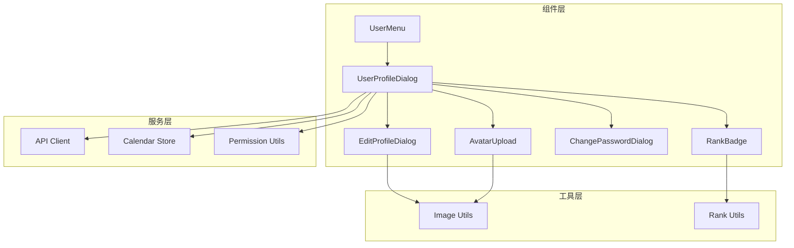
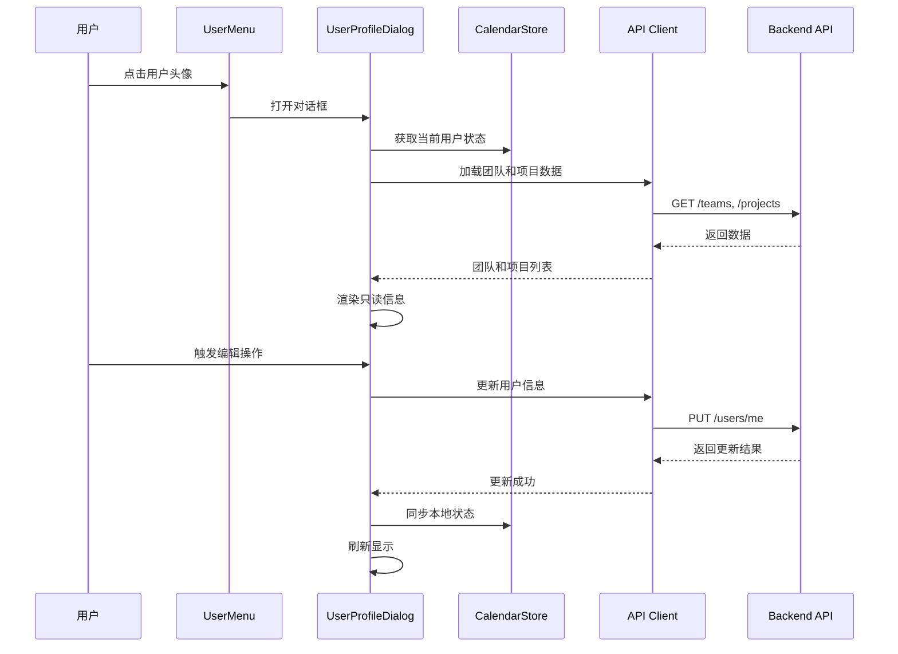
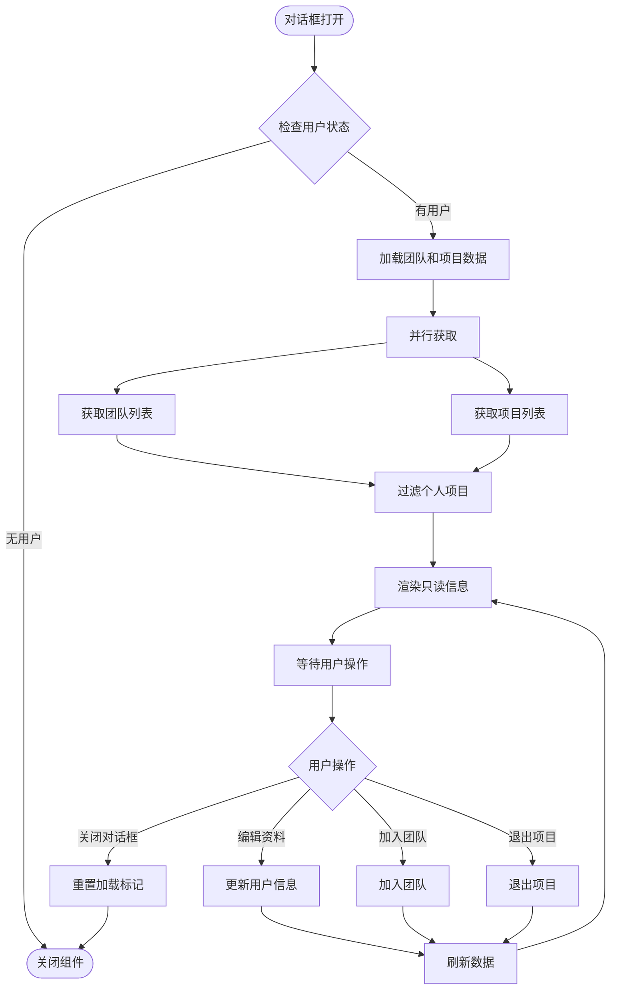
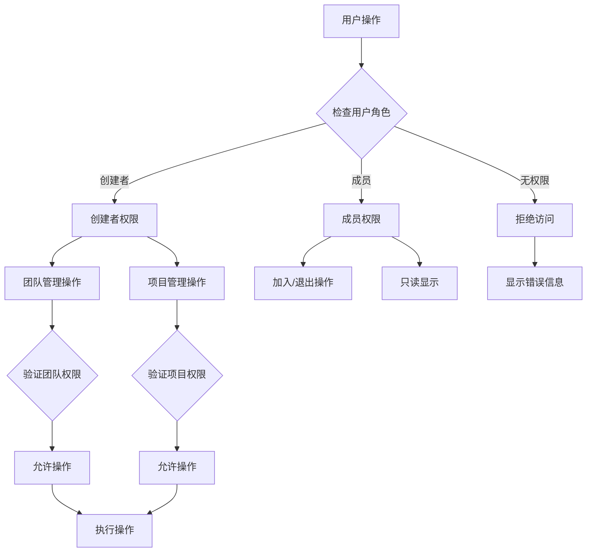
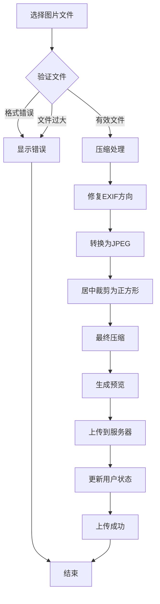
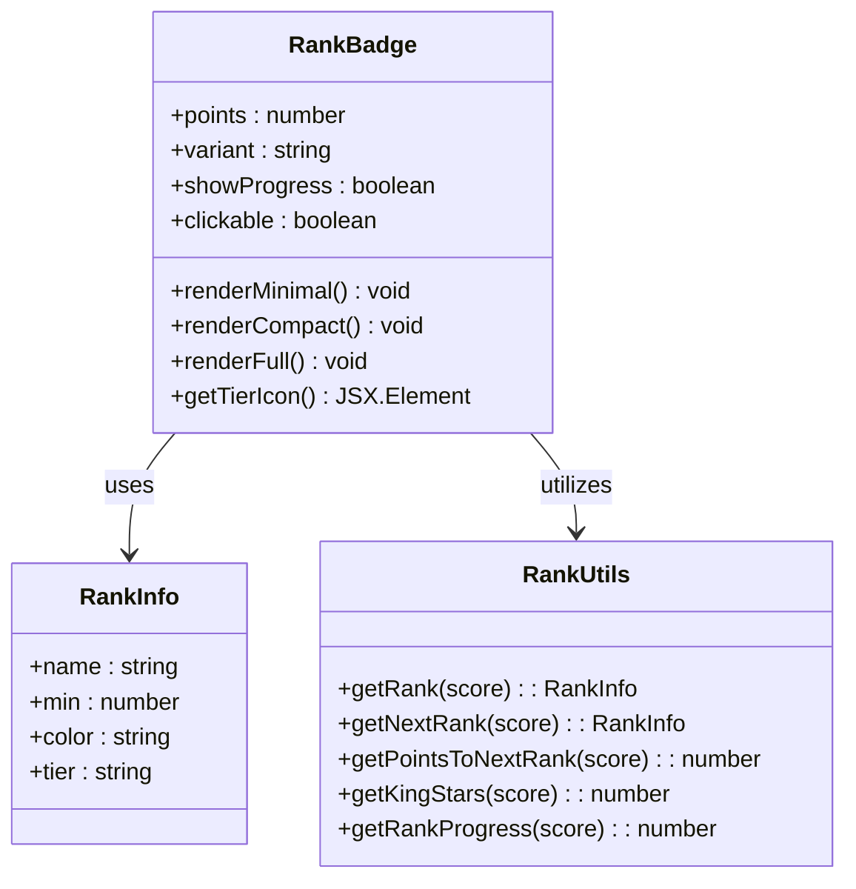
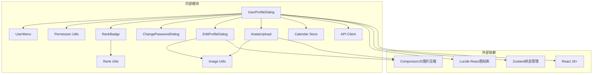

# 用户资料对话框

<cite>
**本文档引用的文件**
- [components/user-profile-dialog.tsx](file://components/user-profile-dialog.tsx)
- [components/user-menu.tsx](file://components/user-menu.tsx)
- [lib/api-client.ts](file://lib/api-client.ts)
- [lib/store/calendar-store.ts](file://lib/store/calendar-store.ts)
- [lib/types.ts](file://lib/types.ts)
- [lib/utils/permission-utils.ts](file://lib/utils/permission-utils.ts)
- [components/avatar-upload.tsx](file://components/avatar-upload.tsx)
- [components/edit-profile-dialog.tsx](file://components/edit-profile-dialog.tsx)
- [components/change-password-dialog.tsx](file://components/change-password-dialog.tsx)
- [components/rank-badge.tsx](file://components/rank-badge.tsx)
- [lib/utils/rank.ts](file://lib/utils/rank.ts)
- [lib/image-utils.ts](file://lib/image-utils.ts)
</cite>

## 目录
1. [简介](#简介)
2. [项目结构](#项目结构)
3. [核心组件](#核心组件)
4. [架构概览](#架构概览)
5. [详细组件分析](#详细组件分析)
6. [依赖关系分析](#依赖关系分析)
7. [性能考虑](#性能考虑)
8. [故障排除指南](#故障排除指南)
9. [结论](#结论)
10. [附录](#附录)

## 简介

用户资料对话框是一个综合性的个人信息管理组件，为用户提供只读信息展示、团队项目关联管理和权限控制功能。该组件基于 React 和 TypeScript 构建，采用现代前端架构模式，实现了完整的用户信息展示、编辑、权限验证和数据同步机制。

该组件支持多种显示模式，包括基本信息展示、团队列表、项目列表，并提供了丰富的交互功能，如头像上传、密码修改、团队项目管理等。组件设计遵循响应式原则，适配不同屏幕尺寸，并提供了完善的错误处理和用户体验优化。

## 项目结构

用户资料对话框组件位于 `components/user-profile-dialog.tsx`，与之协作的相关文件包括：

**图表来源**
- [components/user-profile-dialog.tsx](file://components/user-profile-dialog.tsx#L1-L816)
- [components/user-menu.tsx](file://components/user-menu.tsx#L1-L114)

**章节来源**
- [components/user-profile-dialog.tsx](file://components/user-profile-dialog.tsx#L1-L816)
- [components/user-menu.tsx](file://components/user-menu.tsx#L1-L114)

## 核心组件

### 用户资料对话框组件

UserProfileDialog 是整个用户资料系统的核心组件，负责：

- **只读信息展示**：显示用户的基本信息、角色权限、组织团队关联
- **权限控制**：根据用户身份显示不同的信息内容和操作选项
- **数据同步**：实时更新用户信息、团队项目数据
- **交互管理**：处理头像上传、个人信息编辑、密码修改等操作

组件采用受控组件模式，通过 useState 和 useEffect 管理状态和生命周期，确保数据的一致性和用户体验的流畅性。

**章节来源**
- [components/user-profile-dialog.tsx](file://components/user-profile-dialog.tsx#L62-L123)

### API 客户端集成

组件通过统一的 API 客户端进行数据交互：

- **用户信息管理**：获取当前用户信息、更新用户资料
- **团队项目管理**：获取团队列表、项目列表、加入/退出操作
- **权限验证**：基于用户角色和权限设置进行访问控制

API 客户端实现了完整的错误处理机制，包括认证错误、网络错误和业务逻辑错误的分类处理。

**章节来源**
- [lib/api-client.ts](file://lib/api-client.ts#L184-L281)
- [lib/api-client.ts](file://lib/api-client.ts#L357-L429)
- [lib/api-client.ts](file://lib/api-client.ts#L283-L355)

## 架构概览

用户资料对话框采用分层架构设计，各层职责明确：

**图表来源**
- [components/user-profile-dialog.tsx](file://components/user-profile-dialog.tsx#L82-L121)
- [lib/store/calendar-store.ts](file://lib/store/calendar-store.ts#L455-L546)

**章节来源**
- [components/user-profile-dialog.tsx](file://components/user-profile-dialog.tsx#L298-L816)
- [lib/store/calendar-store.ts](file://lib/store/calendar-store.ts#L200-L287)

## 详细组件分析

### 数据获取和同步策略

组件实现了多层次的数据获取和同步机制：

#### 首次加载策略
- **条件加载**：仅在对话框打开且存在当前用户时加载数据
- **防重复加载**：使用 useRef 跟踪加载状态，避免重复请求
- **并行加载**：团队和项目数据采用 Promise.all 并行获取

#### 实时同步机制
- **本地状态管理**：使用 Zustand 管理全局状态，确保组件间数据一致性
- **手动刷新**：关键操作后主动调用刷新函数更新数据
- **缓存策略**：结合 localStorage 实现数据持久化

**图表来源**
- [components/user-profile-dialog.tsx](file://components/user-profile-dialog.tsx#L82-L121)
- [components/user-profile-dialog.tsx](file://components/user-profile-dialog.tsx#L125-L129)

**章节来源**
- [components/user-profile-dialog.tsx](file://components/user-profile-dialog.tsx#L82-L121)
- [lib/store/calendar-store.ts](file://lib/store/calendar-store.ts#L455-L546)

### 权限控制机制

组件实现了多层级的权限控制：

#### 用户身份识别
- **创建者权限**：团队/项目的创建者拥有额外的操作权限
- **成员权限**：普通成员只能进行基本的加入/退出操作
- **默认团队设置**：用户可以设置默认团队，便于快速切换

#### 权限验证流程

**图表来源**
- [lib/utils/permission-utils.ts](file://lib/utils/permission-utils.ts#L11-L30)
- [lib/utils/permission-utils.ts](file://lib/utils/permission-utils.ts#L40-L59)

**章节来源**
- [lib/utils/permission-utils.ts](file://lib/utils/permission-utils.ts#L1-L72)
- [components/user-profile-dialog.tsx](file://components/user-profile-dialog.tsx#L407-L547)

### 头像上传和处理

组件提供了完整的头像上传解决方案：

#### 图片处理流程
- **格式转换**：自动将图片转换为 JPEG 格式
- **尺寸调整**：统一裁剪为 256x256 像素的正方形
- **质量压缩**：使用 Canvas 技术进行有损压缩
- **预览功能**：支持实时预览和魔法棒生成

**图表来源**
- [lib/image-utils.ts](file://lib/image-utils.ts#L8-L91)
- [components/avatar-upload.tsx](file://components/avatar-upload.tsx#L26-L54)

**章节来源**
- [lib/image-utils.ts](file://lib/image-utils.ts#L1-L92)
- [components/avatar-upload.tsx](file://components/avatar-upload.tsx#L1-L102)

### 积分和等级系统

组件集成了完整的积分和等级展示功能：

#### 等级计算逻辑
- **段位划分**：27个不同的段位等级
- **积分要求**：每个段位有明确的积分门槛
- **星级系统**：王者段位特有的星级计算
- **进度显示**：实时显示段位升级进度

#### 等级徽章组件

**图表来源**
- [components/rank-badge.tsx](file://components/rank-badge.tsx#L20-L206)
- [lib/utils/rank.ts](file://lib/utils/rank.ts#L6-L156)

**章节来源**
- [components/rank-badge.tsx](file://components/rank-badge.tsx#L1-L207)
- [lib/utils/rank.ts](file://lib/utils/rank.ts#L1-L156)

## 依赖关系分析

用户资料对话框组件的依赖关系如下：

**图表来源**
- [components/user-profile-dialog.tsx](file://components/user-profile-dialog.tsx#L1-L55)
- [components/edit-profile-dialog.tsx](file://components/edit-profile-dialog.tsx#L1-L20)

**章节来源**
- [components/user-profile-dialog.tsx](file://components/user-profile-dialog.tsx#L1-L55)
- [components/edit-profile-dialog.tsx](file://components/edit-profile-dialog.tsx#L1-L20)

## 性能考虑

### 数据加载优化
- **懒加载策略**：仅在需要时加载团队和项目数据
- **并行请求**：使用 Promise.all 同时获取多个数据源
- **缓存机制**：结合 localStorage 实现数据持久化

### 渲染性能
- **虚拟滚动**：对于大量数据采用虚拟滚动技术
- **组件拆分**：将复杂界面拆分为多个独立组件
- **状态分离**：避免不必要的组件重渲染

### 网络优化
- **请求合并**：将多个相关请求合并为一次调用
- **错误重试**：实现智能的错误重试机制
- **超时控制**：设置合理的请求超时时间

## 故障排除指南

### 常见问题及解决方案

#### 登录状态异常
**问题描述**：用户信息无法正确显示
**解决方案**：
1. 检查本地存储中的认证令牌
2. 验证 API 响应状态
3. 确认用户会话有效性

#### 数据同步失败
**问题描述**：更新后的数据未正确显示
**解决方案**：
1. 检查状态更新回调函数
2. 验证 API 响应数据格式
3. 确认本地状态同步机制

#### 图片上传失败
**问题描述**：头像上传过程中出现错误
**解决方案**：
1. 验证文件格式和大小限制
2. 检查图片压缩处理流程
3. 确认服务器端上传接口

**章节来源**
- [lib/api-client.ts](file://lib/api-client.ts#L72-L100)
- [components/avatar-upload.tsx](file://components/avatar-upload.tsx#L30-L40)

## 结论

用户资料对话框组件是一个功能完整、架构清晰的个人信息管理解决方案。组件设计充分考虑了用户体验、性能优化和安全性，在以下方面表现突出：

- **完整的功能覆盖**：从只读信息展示到交互式编辑管理
- **严格的权限控制**：基于用户角色的精细化权限管理
- **高效的数据处理**：优化的加载策略和缓存机制
- **良好的扩展性**：模块化的组件设计便于功能扩展

该组件为整个应用提供了坚实的用户基础，为后续的功能扩展和维护奠定了良好的基础。

## 附录

### 组件集成指南

#### 基础集成步骤
1. 在应用入口处引入用户菜单组件
2. 确保认证状态正确传递给组件
3. 配置必要的权限检查逻辑

#### 样式定制建议
- 使用 Tailwind CSS 的原子类进行样式定制
- 通过 CSS 变量控制主题色彩
- 实现响应式布局适配不同设备

#### 响应式设计最佳实践
- 使用移动端优先的设计理念
- 实现触摸友好的交互元素
- 优化小屏幕下的信息密度

### 隐私保护和安全措施

#### 数据脱敏策略
- 敏感信息在传输过程中进行加密
- 本地存储采用安全的存储机制
- 实现最小权限原则的数据访问

#### 访问控制实现
- 基于角色的权限验证
- 细粒度的操作权限控制
- 完善的审计日志记录