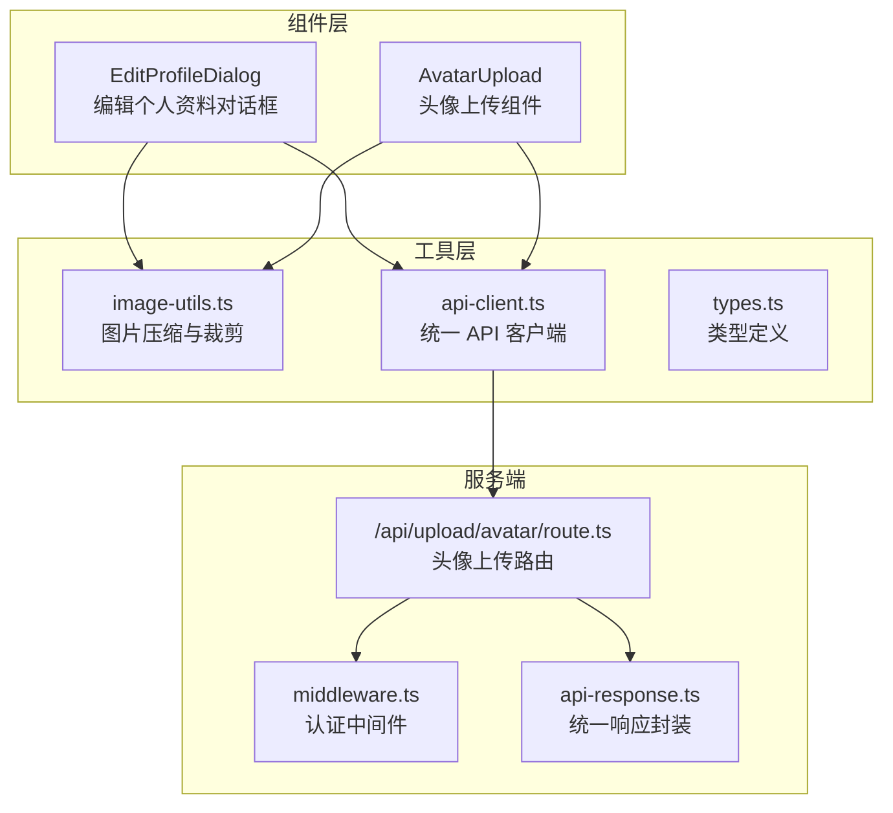
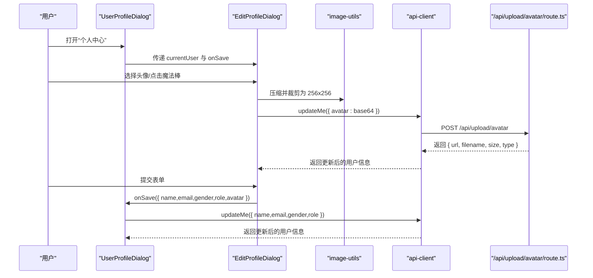
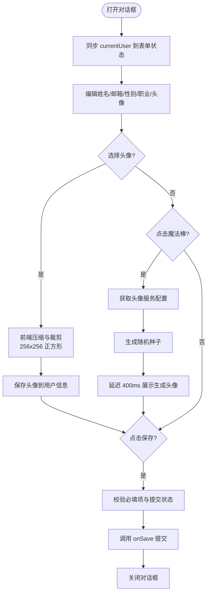
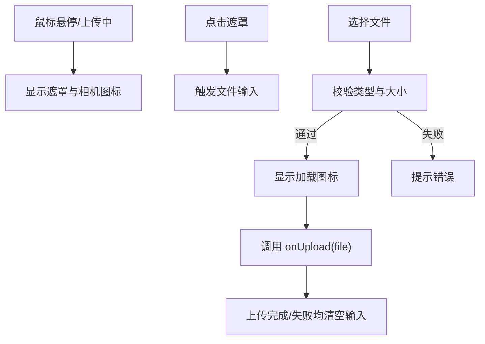
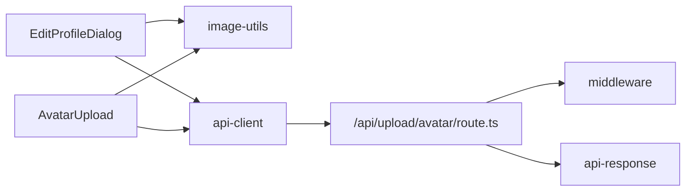

# 编辑个人资料对话框

<cite>
**本文引用的文件**
- [edit-profile-dialog.tsx](file://components/edit-profile-dialog.tsx)
- [avatar-upload.tsx](file://components/avatar-upload.tsx)
- [image-utils.ts](file://lib/image-utils.ts)
- [route.ts](file://app/api/upload/avatar/route.ts)
- [types.ts](file://lib/types.ts)
- [api-client.ts](file://lib/api-client.ts)
- [middleware.ts](file://lib/middleware.ts)
- [api-response.ts](file://lib/api-response.ts)
- [user-profile-dialog.tsx](file://components/user-profile-dialog.tsx)
</cite>

## 目录
1. [简介](#简介)
2. [项目结构](#项目结构)
3. [核心组件](#核心组件)
4. [架构总览](#架构总览)
5. [详细组件分析](#详细组件分析)
6. [依赖关系分析](#依赖关系分析)
7. [性能考量](#性能考量)
8. [故障排查指南](#故障排查指南)
9. [结论](#结论)

## 简介
本技术文档围绕“编辑个人资料对话框”组件进行深入解析，涵盖状态管理、表单验证与数据绑定、头像上传流程（含图片压缩、魔法棒生成）、表单字段的动态行为（职业选择器的预设选项与自定义输入切换）、组件属性接口、事件处理与生命周期管理，并提供用户体验优化、性能考虑与安全最佳实践的具体实现示例路径。

## 项目结构
该组件位于组件层，配合工具层的图片处理与 API 客户端，以及后端路由完成头像上传与用户资料更新。整体采用“组件-工具-服务端”的分层架构。

图表来源
- [edit-profile-dialog.tsx](file://components/edit-profile-dialog.tsx#L1-L299)
- [avatar-upload.tsx](file://components/avatar-upload.tsx#L1-L102)
- [image-utils.ts](file://lib/image-utils.ts#L1-L92)
- [route.ts](file://app/api/upload/avatar/route.ts#L1-L74)
- [api-client.ts](file://lib/api-client.ts#L1-L525)
- [middleware.ts](file://lib/middleware.ts#L1-L47)
- [api-response.ts](file://lib/api-response.ts#L1-L101)

章节来源
- [edit-profile-dialog.tsx](file://components/edit-profile-dialog.tsx#L1-L299)
- [avatar-upload.tsx](file://components/avatar-upload.tsx#L1-L102)
- [image-utils.ts](file://lib/image-utils.ts#L1-L92)
- [route.ts](file://app/api/upload/avatar/route.ts#L1-L74)
- [api-client.ts](file://lib/api-client.ts#L1-L525)
- [middleware.ts](file://lib/middleware.ts#L1-L47)
- [api-response.ts](file://lib/api-response.ts#L1-L101)

## 核心组件
- EditProfileDialog：负责展示与编辑用户资料，包含头像上传、魔法棒生成、表单提交等逻辑。
- AvatarUpload：独立的头像上传组件，提供拖拽/点击触发、悬停遮罩、上传状态反馈。
- image-utils：提供前端图片压缩与正方形裁剪能力，保障头像体积与一致性。
- 后端上传路由：接收前端压缩后的头像，校验类型与大小，写入磁盘并返回可访问 URL。
- API 客户端：封装统一的请求与响应格式，自动携带认证头，处理 401 清理 token。
- 类型定义：User 接口定义了头像、邮箱、性别、职业等字段。

章节来源
- [edit-profile-dialog.tsx](file://components/edit-profile-dialog.tsx#L31-L36)
- [avatar-upload.tsx](file://components/avatar-upload.tsx#L10-L15)
- [image-utils.ts](file://lib/image-utils.ts#L8-L92)
- [route.ts](file://app/api/upload/avatar/route.ts#L15-L74)
- [api-client.ts](file://lib/api-client.ts#L184-L281)
- [types.ts](file://lib/types.ts#L108-L120)

## 架构总览
编辑个人资料对话框的调用链路如下：
- 用户在用户中心对话框中打开“编辑资料”，传入当前用户信息与保存回调。
- EditProfileDialog 内部维护表单状态，支持头像上传与魔法棒生成。
- 头像上传时，前端先压缩并裁剪为 256x256 正方形，再通过 API 客户端更新用户头像。
- 表单提交时，调用外部 onSave 回调，将姓名、邮箱、性别、职业、头像等数据提交至后端持久化。

图表来源
- [user-profile-dialog.tsx](file://components/user-profile-dialog.tsx#L62-L170)
- [edit-profile-dialog.tsx](file://components/edit-profile-dialog.tsx#L64-L82)
- [image-utils.ts](file://lib/image-utils.ts#L8-L92)
- [route.ts](file://app/api/upload/avatar/route.ts#L15-L74)
- [api-client.ts](file://lib/api-client.ts#L204-L241)

## 详细组件分析

### EditProfileDialog 组件
- 状态管理
  - 使用 useState 维护 name、email、gender、role、avatar、isSubmitting、isAvatarLoading。
  - 使用 useEffect 在对话框打开时同步最新 currentUser 数据，保证表单初始值与全局状态一致。
- 表单验证与数据绑定
  - 表单项双向绑定，提交前对 name/email 做 trim 处理；提交按钮根据必填项与提交状态禁用。
  - 职业选择器支持预设选项与自定义输入切换：当选择“自定义…”时清空 role 并允许输入；否则回显预设值。
- 头像上传与魔法棒
  - 文件上传：读取 File，调用 image-utils.compressImage 压缩并裁剪为 256x256，失败时回退到 FileReader 读取。
  - 魔法棒：向 /api/config 获取头像服务地址（默认 DiceBear），生成随机种子拼接 URL，模拟“施法”动画效果。
- 生命周期与事件
  - onOpenChange 控制对话框开关；handleSubmit 阻止默认提交，调用 onSave 并在完成后关闭对话框。
  - 头像加载状态 isAvatarLoading 控制模糊与旋转动画，提升交互反馈。

图表来源
- [edit-profile-dialog.tsx](file://components/edit-profile-dialog.tsx#L38-L132)

章节来源
- [edit-profile-dialog.tsx](file://components/edit-profile-dialog.tsx#L38-L132)

### AvatarUpload 组件
- 功能要点
  - 文件类型与大小校验（仅图片、≤5MB）。
  - 悬停遮罩显示相机图标，点击触发隐藏文件输入。
  - 上传中显示旋转加载图标，上传完成后清空输入以便重复上传同一文件。
  - 调用 onUpload 回调，由父组件决定如何处理（例如直接更新用户头像）。

图表来源
- [avatar-upload.tsx](file://components/avatar-upload.tsx#L17-L54)

章节来源
- [avatar-upload.tsx](file://components/avatar-upload.tsx#L17-L54)

### 图片压缩与裁剪（image-utils）
- 压缩策略
  - 第一步：使用 Compressor.js 修复 EXIF 方向并转换为 JPEG，保留较高质量中间步骤。
  - 第二步：Canvas 居中裁剪为 256x256 正方形，适配宽图/长图/正方形场景。
  - 第三步：导出为 JPEG，质量 0.6，得到紧凑的 Base64 字符串。
- 性能与兼容性
  - 使用 Promise 包裹异步流程，错误时 reject 并上抛。
  - 严格检查 Canvas 上下文与图片加载，失败时清理临时 URL。

章节来源
- [image-utils.ts](file://lib/image-utils.ts#L8-L92)

### 后端头像上传路由（App Router）
- 认证与校验
  - 使用 middleware.authenticate 校验 Authorization 头中的 JWT。
  - 校验文件类型（JPG/PNG/GIF/WebP）与大小（≤5MB）。
- 存储与返回
  - 生成唯一文件名，确保目录存在后写入 public/uploads/avatars。
  - 返回统一响应格式，包含 url、filename、size、type。

章节来源
- [route.ts](file://app/api/upload/avatar/route.ts#L15-L74)
- [middleware.ts](file://lib/middleware.ts#L10-L39)
- [api-response.ts](file://lib/api-response.ts#L19-L32)

### API 客户端与类型定义
- API 客户端
  - 自动注入 Authorization 头，处理 401 清理 token。
  - 统一响应格式兼容新旧两种风格，自动提取 data。
- 类型定义
  - User 接口包含 avatar、email、gender、role 等字段，满足编辑对话框的数据模型。

章节来源
- [api-client.ts](file://lib/api-client.ts#L44-L100)
- [types.ts](file://lib/types.ts#L108-L120)

## 依赖关系分析
- 组件依赖
  - EditProfileDialog 依赖 UI 组件库（Dialog、Button、Input、Select、Avatar）与工具类 image-utils。
  - UserProfileDialog 作为容器，将 EditProfileDialog 与 AvatarUpload 组合使用。
- 工具与服务端
  - image-utils 依赖第三方库 compressorjs 与浏览器 Canvas API。
  - 上传路由依赖 fs/promises、path、认证中间件与统一响应封装。

图表来源
- [edit-profile-dialog.tsx](file://components/edit-profile-dialog.tsx#L1-L20)
- [avatar-upload.tsx](file://components/avatar-upload.tsx#L1-L9)
- [image-utils.ts](file://lib/image-utils.ts#L1)
- [route.ts](file://app/api/upload/avatar/route.ts#L1-L13)
- [api-client.ts](file://lib/api-client.ts#L1-L10)
- [middleware.ts](file://lib/middleware.ts#L1-L3)
- [api-response.ts](file://lib/api-response.ts#L1-L5)

章节来源
- [edit-profile-dialog.tsx](file://components/edit-profile-dialog.tsx#L1-L20)
- [avatar-upload.tsx](file://components/avatar-upload.tsx#L1-L9)
- [image-utils.ts](file://lib/image-utils.ts#L1)
- [route.ts](file://app/api/upload/avatar/route.ts#L1-L13)
- [api-client.ts](file://lib/api-client.ts#L1-L10)
- [middleware.ts](file://lib/middleware.ts#L1-L3)
- [api-response.ts](file://lib/api-response.ts#L1-L5)

## 性能考量
- 前端压缩
  - 使用 Canvas 居中裁剪减少带宽与存储占用，建议在移动端也启用压缩以降低网络压力。
- 上传优化
  - 上传路由设置最大执行时间与动态渲染，避免长时间阻塞。
- 交互反馈
  - 头像加载时的模糊与旋转动画提升感知性能，避免用户误以为卡顿。
- 状态同步
  - 对话框打开时同步 currentUser，避免脏数据导致的二次提交。

章节来源
- [image-utils.ts](file://lib/image-utils.ts#L34-L76)
- [route.ts](file://app/api/upload/avatar/route.ts#L12-L13)
- [edit-profile-dialog.tsx](file://components/edit-profile-dialog.tsx#L48-L58)

## 故障排查指南
- 头像上传失败
  - 检查文件类型与大小限制（仅支持 JPG/PNG/GIF/WebP，≤5MB）。
  - 确认认证头是否正确传递，401 会触发 token 清理。
  - 查看后端日志与统一响应错误信息。
- 压缩失败回退
  - 若前端压缩异常，组件会回退到 FileReader 读取，仍可继续流程。
- 表单提交无效
  - 确认 name/email 已填写且非空；提交按钮受 isSubmitting 与必填项控制。
- 魔法棒生成异常
  - 若 /api/config 获取失败，组件会降级使用默认 DiceBear 地址生成头像。

章节来源
- [route.ts](file://app/api/upload/avatar/route.ts#L29-L39)
- [api-client.ts](file://lib/api-client.ts#L72-L82)
- [edit-profile-dialog.tsx](file://components/edit-profile-dialog.tsx#L84-L104)
- [edit-profile-dialog.tsx](file://components/edit-profile-dialog.tsx#L106-L132)

## 结论
编辑个人资料对话框通过清晰的状态管理、严格的前后端校验与良好的用户体验设计，实现了稳定可靠的个人资料编辑能力。头像上传结合前端压缩与后端校验，既保证了性能又兼顾了安全性。职业选择器的动态行为提升了灵活性，而统一的 API 客户端与响应封装则简化了集成与维护成本。