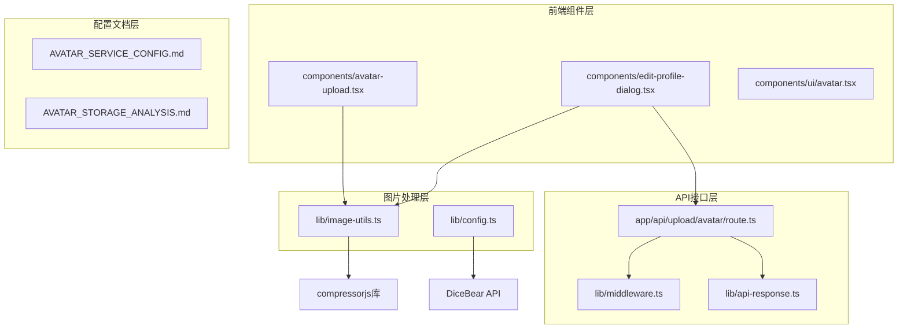
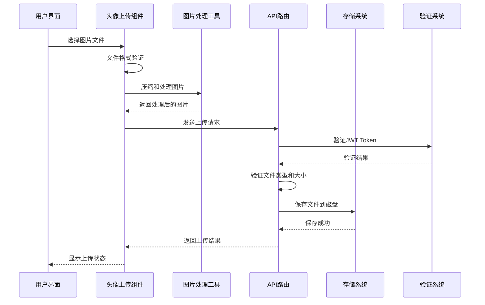
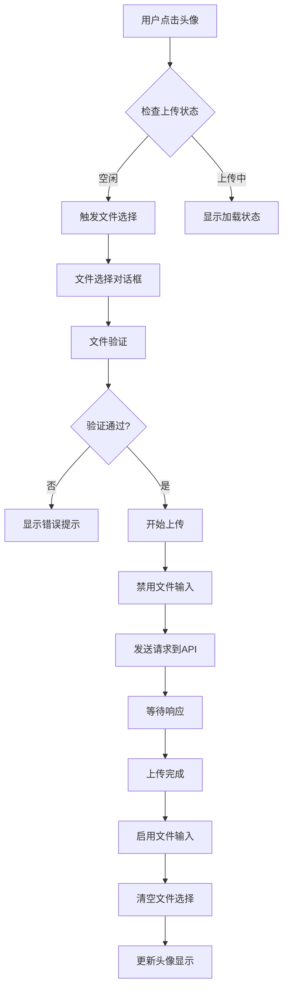
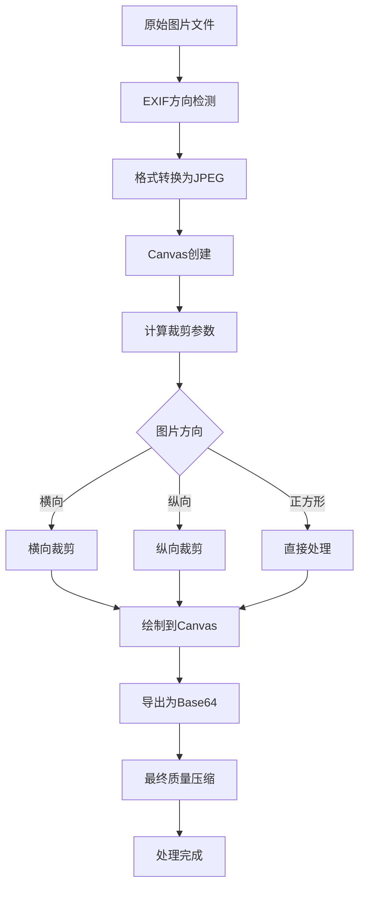
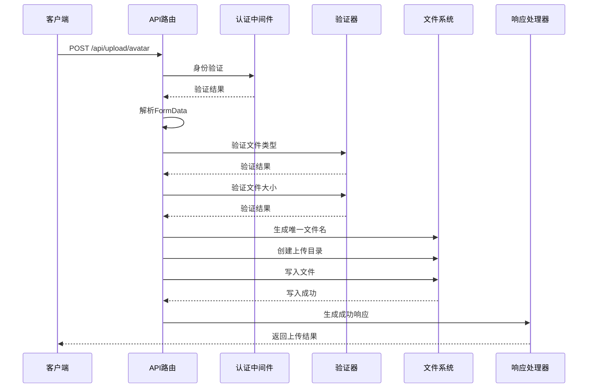
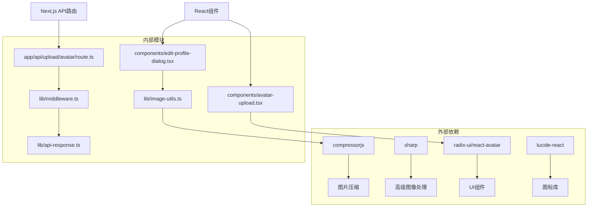

# 头像上传系统

<cite>
**本文档引用的文件**
- [app/api/upload/avatar/route.ts](file://app/api/upload/avatar/route.ts)
- [components/avatar-upload.tsx](file://components/avatar-upload.tsx)
- [lib/image-utils.ts](file://lib/image-utils.ts)
- [AVATAR_SERVICE_CONFIG.md](file://AVATAR_SERVICE_CONFIG.md)
- [AVATAR_STORAGE_ANALYSIS.md](file://AVATAR_STORAGE_ANALYSIS.md)
- [lib/config.ts](file://lib/config.ts)
- [lib/middleware.ts](file://lib/middleware.ts)
- [lib/api-response.ts](file://lib/api-response.ts)
- [components/edit-profile-dialog.tsx](file://components/edit-profile-dialog.tsx)
- [components/ui/avatar.tsx](file://components/ui/avatar.tsx)
- [package.json](file://package.json)
</cite>

## 目录
1. [简介](#简介)
2. [项目结构](#项目结构)
3. [核心组件](#核心组件)
4. [架构概览](#架构概览)
5. [详细组件分析](#详细组件分析)
6. [依赖关系分析](#依赖关系分析)
7. [性能考虑](#性能考虑)
8. [故障排除指南](#故障排除指南)
9. [结论](#结论)

## 简介

头像上传系统是一个完整的用户头像管理解决方案，支持多种头像生成和存储方式。系统提供了两种主要的头像处理模式：文件上传存储和在线头像服务生成。该系统具有高度的可配置性，支持公网、内网和混合部署环境。

系统的核心特性包括：
- 多种头像生成方式：本地上传、在线生成、魔法棒生成
- 智能图片压缩和格式转换
- 安全的文件上传和验证机制
- 灵活的存储策略和缓存机制
- 完善的错误处理和性能优化

## 项目结构

头像上传系统采用模块化架构，主要分布在以下几个关键目录中：



**图表来源**
- [components/avatar-upload.tsx](file://components/avatar-upload.tsx#L1-L102)
- [lib/image-utils.ts](file://lib/image-utils.ts#L1-L92)
- [app/api/upload/avatar/route.ts](file://app/api/upload/avatar/route.ts#L1-L74)

**章节来源**
- [components/avatar-upload.tsx](file://components/avatar-upload.tsx#L1-L102)
- [lib/image-utils.ts](file://lib/image-utils.ts#L1-L92)
- [app/api/upload/avatar/route.ts](file://app/api/upload/avatar/route.ts#L1-L74)

## 核心组件

### 头像上传组件 (AvatarUpload)

头像上传组件是用户界面的核心部分，提供了直观的头像上传体验。该组件支持文件选择、预览和上传功能。

**主要功能特性：**
- 文件选择器集成
- 实时文件验证（格式和大小）
- 上传状态管理
- 加载指示器显示
- 错误处理和用户反馈

**技术实现要点：**
- 使用 React Hooks 管理组件状态
- 支持拖拽和点击两种文件选择方式
- 实时文件类型和大小验证
- 上传完成后的文件输入重置

### 图片处理工具 (ImageUtils)

图片处理工具提供了强大的图片压缩和格式转换能力，支持多种图片格式和尺寸要求。

**核心处理流程：**
1. **EXIF方向修复**：自动检测和修正图片方向
2. **格式转换**：统一转换为 JPEG 格式
3. **尺寸压缩**：智能压缩到目标尺寸
4. **质量优化**：平衡质量和文件大小

**压缩算法特点：**
- 支持多种图片格式（JPEG、PNG、GIF、WebP）
- 智能中心裁剪算法
- 可配置的质量参数
- 错误处理和降级机制

### API路由处理器

API路由处理器负责处理头像上传请求，实现了完整的文件上传、验证和存储流程。

**处理流程：**
1. **身份验证**：JWT Token 验证
2. **文件接收**：FormData 解析
3. **格式验证**：类型和大小检查
4. **文件命名**：唯一文件名生成
5. **存储处理**：文件系统写入
6. **响应返回**：标准化API响应

**章节来源**
- [components/avatar-upload.tsx](file://components/avatar-upload.tsx#L17-L101)
- [lib/image-utils.ts](file://lib/image-utils.ts#L8-L91)
- [app/api/upload/avatar/route.ts](file://app/api/upload/avatar/route.ts#L16-L73)

## 架构概览

头像上传系统采用分层架构设计，确保了良好的可维护性和扩展性：



**图表来源**
- [components/avatar-upload.tsx](file://components/avatar-upload.tsx#L26-L54)
- [lib/image-utils.ts](file://lib/image-utils.ts#L8-L91)
- [app/api/upload/avatar/route.ts](file://app/api/upload/avatar/route.ts#L16-L73)

系统架构的关键特点：
- **分离关注点**：前端组件、图片处理、API接口职责明确
- **可扩展性**：支持多种存储后端和头像生成服务
- **安全性**：完整的身份验证和文件验证机制
- **性能优化**：智能缓存和CDN集成支持

## 详细组件分析

### 头像上传组件详细分析

头像上传组件是整个系统的核心交互界面，提供了完整的用户操作流程：



**图表来源**
- [components/avatar-upload.tsx](file://components/avatar-upload.tsx#L26-L54)

**组件特性：**
- **状态管理**：使用useState管理悬停、上传状态等
- **事件处理**：完整的文件选择和上传事件链
- **用户体验**：加载指示器和错误反馈
- **可访问性**：键盘导航和屏幕阅读器支持

### 图片处理算法分析

图片处理工具实现了复杂的图片压缩和格式转换算法：



**图表来源**
- [lib/image-utils.ts](file://lib/image-utils.ts#L8-L91)

**算法特点：**
- **智能裁剪**：根据图片比例自动计算裁剪区域
- **质量控制**：多阶段质量压缩策略
- **错误处理**：完整的异常捕获和降级机制
- **性能优化**：异步处理和内存管理

### API路由处理流程

API路由处理器实现了完整的文件上传处理流程：



**图表来源**
- [app/api/upload/avatar/route.ts](file://app/api/upload/avatar/route.ts#L16-L73)
- [lib/middleware.ts](file://lib/middleware.ts#L10-L39)
- [lib/api-response.ts](file://lib/api-response.ts#L19-L32)

**安全特性：**
- **JWT认证**：完整的令牌验证机制
- **文件验证**：严格的类型和大小检查
- **路径安全**：防止路径遍历攻击
- **错误处理**：详细的错误日志和用户反馈

### 存储策略分析

系统采用了灵活的存储策略，支持多种存储方式：

```mermaid
graph LR
subgraph "存储策略"
A[本地文件存储] --> B[public/uploads/avatars/]
C[在线头像服务] --> D[DiceBear API]
E[混合存储] --> F[本地+CDN]
end
subgraph "配置管理"
G[环境变量] --> H[AVATAR_API_URL]
I[运行时配置] --> J[/api/config]
K[默认配置] --> L[公网DiceBear]
end
H --> C
J --> C
L --> C
```

**图表来源**
- [AVATAR_STORAGE_ANALYSIS.md](file://AVATAR_STORAGE_ANALYSIS.md#L1-L76)
- [lib/config.ts](file://lib/config.ts#L13-L28)

**存储策略优势：**
- **灵活性**：支持不同部署环境的需求
- **可扩展性**：易于添加新的存储后端
- **性能优化**：CDN集成提升加载速度
- **成本控制**：按需选择存储方案

**章节来源**
- [components/avatar-upload.tsx](file://components/avatar-upload.tsx#L17-L101)
- [lib/image-utils.ts](file://lib/image-utils.ts#L8-L91)
- [app/api/upload/avatar/route.ts](file://app/api/upload/avatar/route.ts#L16-L73)
- [AVATAR_STORAGE_ANALYSIS.md](file://AVATAR_STORAGE_ANALYSIS.md#L1-L76)

## 依赖关系分析

头像上传系统的依赖关系清晰明确，各组件之间的耦合度适中：



**图表来源**
- [package.json](file://package.json#L45-L50)
- [lib/image-utils.ts](file://lib/image-utils.ts#L1-L1)
- [components/avatar-upload.tsx](file://components/avatar-upload.tsx#L3-L8)

**依赖管理特点：**
- **最小依赖**：只引入必要的第三方库
- **版本锁定**：使用package.json管理依赖版本
- **类型安全**：完整的TypeScript类型定义
- **性能考虑**：按需加载和懒加载机制

**章节来源**
- [package.json](file://package.json#L11-L75)
- [lib/image-utils.ts](file://lib/image-utils.ts#L1-L1)
- [components/avatar-upload.tsx](file://components/avatar-upload.tsx#L3-L8)

## 性能考虑

头像上传系统在多个层面进行了性能优化：

### 图片处理优化

- **异步处理**：图片压缩采用异步方式，避免阻塞主线程
- **智能缓存**：处理后的图片可以缓存到浏览器本地
- **质量平衡**：在质量和文件大小之间找到最佳平衡点
- **内存管理**：及时释放Canvas和URL对象的内存

### API性能优化

- **超时控制**：设置合理的请求超时时间（30秒）
- **动态渲染**：强制动态渲染确保实时性
- **错误快速返回**：验证失败时立即返回错误响应
- **资源清理**：及时清理临时文件和缓存

### 存储性能优化

- **CDN集成**：支持CDN加速头像加载
- **缓存策略**：合理的HTTP缓存头设置
- **文件组织**：按用户ID组织文件结构
- **压缩传输**：支持Gzip压缩传输

### 用户体验优化

- **即时反馈**：上传过程中的实时状态反馈
- **进度指示**：清晰的加载状态显示
- **错误友好**：友好的错误提示和解决方案
- **响应式设计**：适配各种设备和屏幕尺寸

## 故障排除指南

### 常见问题及解决方案

**问题1：图片上传失败**
- **症状**：上传按钮无响应或显示错误
- **原因**：文件格式不支持或文件过大
- **解决方案**：检查文件格式（JPG、PNG、GIF、WebP）和大小（不超过5MB）

**问题2：图片显示异常**
- **症状**：头像显示为占位符或旋转角度错误
- **原因**：EXIF方向信息未正确处理
- **解决方案**：使用内置的EXIF修复功能重新上传

**问题3：API认证失败**
- **症状**：显示"未授权"或"Token无效"
- **原因**：JWT Token缺失或过期
- **解决方案**：重新登录获取新的Token

**问题4：存储权限问题**
- **症状**：文件无法保存到服务器
- **原因**：文件系统权限不足
- **解决方案**：检查public/uploads/avatars目录的写入权限

### 调试技巧

**前端调试：**
- 使用浏览器开发者工具查看网络请求
- 检查控制台是否有JavaScript错误
- 验证文件选择和上传事件是否正常触发

**后端调试：**
- 查看服务器日志中的错误信息
- 检查文件系统权限和磁盘空间
- 验证JWT Token的解码和验证过程

**性能监控：**
- 监控图片处理的时间消耗
- 检查API响应时间和错误率
- 分析存储系统的I/O性能

**章节来源**
- [app/api/upload/avatar/route.ts](file://app/api/upload/avatar/route.ts#L25-L39)
- [components/avatar-upload.tsx](file://components/avatar-upload.tsx#L30-L40)
- [lib/middleware.ts](file://lib/middleware.ts#L22-L34)

## 结论

头像上传系统是一个设计精良、功能完整的用户头像管理解决方案。系统的主要优势包括：

**技术优势：**
- **模块化设计**：清晰的组件分离和职责划分
- **安全性强**：完整的认证、验证和安全防护机制
- **可扩展性好**：支持多种存储方式和部署环境
- **性能优化**：多层面的性能优化和缓存策略

**用户体验：**
- **直观易用**：简洁明了的用户界面和操作流程
- **响应迅速**：高效的图片处理和API响应
- **错误友好**：完善的错误处理和用户反馈

**最佳实践建议：**
1. **统一存储策略**：建议采用文件存储方式，避免数据库膨胀
2. **引入CDN**：结合CDN提升头像加载速度
3. **定期清理**：建立定期清理和维护机制
4. **监控告警**：建立完善的监控和告警系统

该系统为用户提供了优质的头像管理体验，同时为企业级应用提供了可靠的技术基础。通过持续的优化和改进，可以进一步提升系统的性能和可靠性。