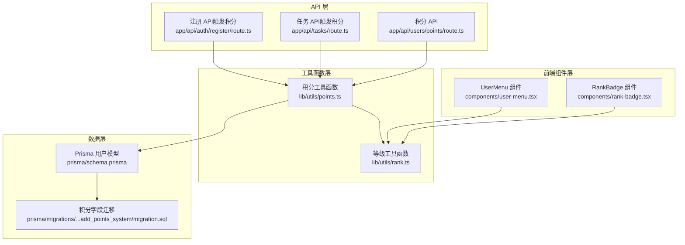
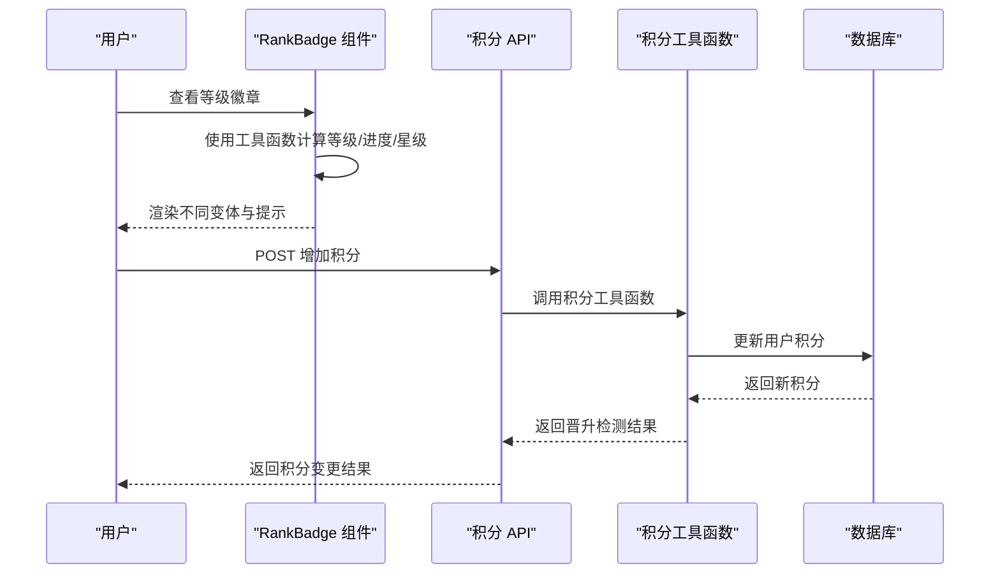
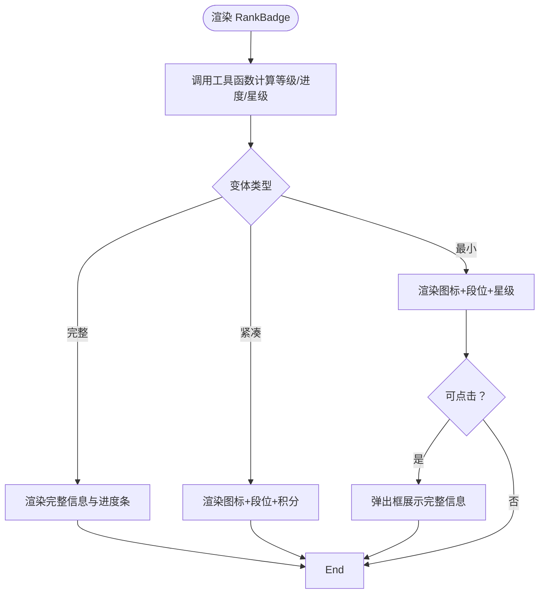
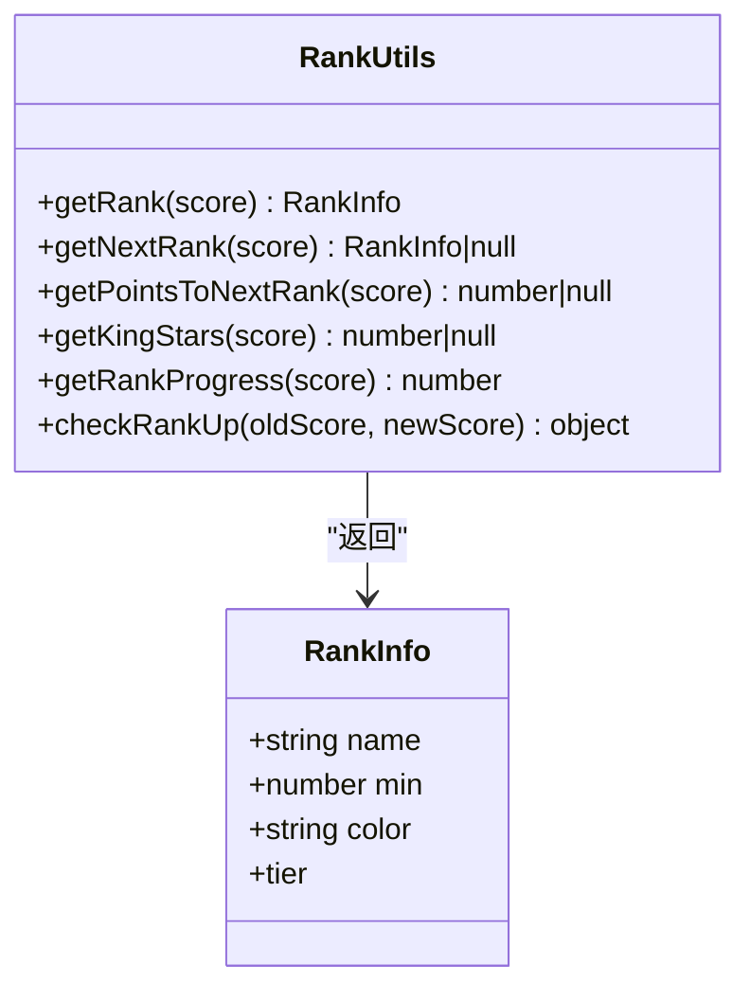
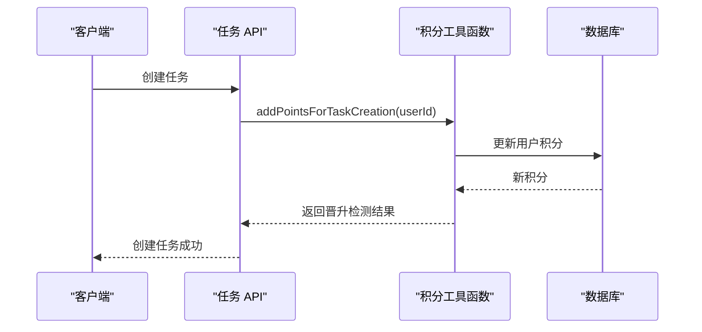
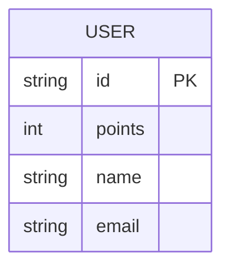
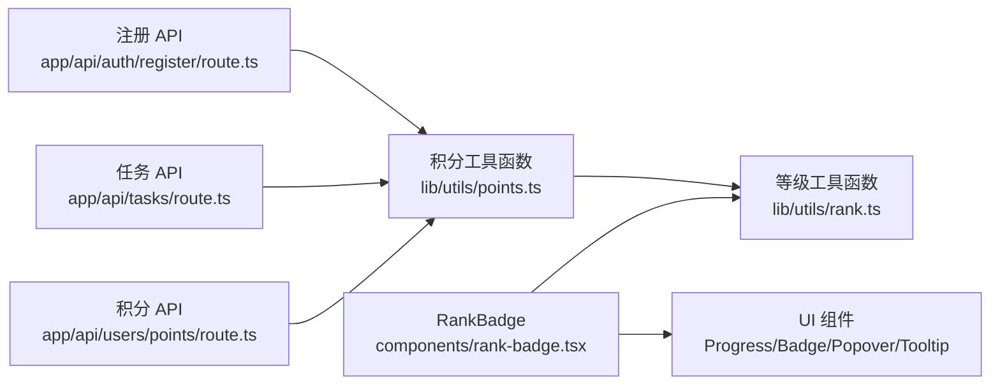

# 用户等级系统

<cite>
**本文档引用的文件**
- [components/rank-badge.tsx](file://components/rank-badge.tsx)
- [lib/utils/rank.ts](file://lib/utils/rank.ts)
- [lib/utils/points.ts](file://lib/utils/points.ts)
- [app/api/users/points/route.ts](file://app/api/users/points/route.ts)
- [app/api/tasks/route.ts](file://app/api/tasks/route.ts)
- [app/api/auth/register/route.ts](file://app/api/auth/register/route.ts)
- [prisma/schema.prisma](file://prisma/schema.prisma)
- [prisma/migrations/20251119142805_add_points_system/migration.sql](file://prisma/migrations/20251119142805_add_points_system/migration.sql)
- [components/user-menu.tsx](file://components/user-menu.tsx)
</cite>

## 目录
1. [简介](#简介)
2. [项目结构](#项目结构)
3. [核心组件](#核心组件)
4. [架构概览](#架构概览)
5. [详细组件分析](#详细组件分析)
6. [依赖分析](#依赖分析)
7. [性能考虑](#性能考虑)
8. [故障排除指南](#故障排除指南)
9. [结论](#结论)
10. [附录](#附录)

## 简介
本文件为日历任务管理系统的用户等级系统技术文档，围绕等级徽章组件、等级算法、积分系统与数据存储展开，涵盖以下关键主题：
- 等级徽章组件的实现原理：等级计算、样式动态切换、标题提示功能
- 等级算法设计：积分阈值设定、等级名称配置、视觉效果设计
- 积分系统实现：积分获取规则、累积计算、等级提升条件
- 等级数据的存储与同步机制：本地缓存、服务器同步、实时更新策略
- 等级配置管理、自定义主题、扩展开发指南
- 用户体验优化、激励机制设计、公平性保障最佳实践

## 项目结构
用户等级系统由前端组件、工具函数、API 接口与数据库模型共同构成，采用分层设计：
- 前端组件层：等级徽章组件负责展示与交互
- 工具函数层：提供等级计算、星级计算、积分动作配置等纯函数
- API 层：提供积分查询与变更的后端接口
- 数据层：Prisma 模型与迁移脚本定义用户积分字段

**图表来源**
- [components/rank-badge.tsx](file://components/rank-badge.tsx#L1-L207)
- [lib/utils/rank.ts](file://lib/utils/rank.ts#L1-L156)
- [lib/utils/points.ts](file://lib/utils/points.ts#L1-L99)
- [app/api/users/points/route.ts](file://app/api/users/points/route.ts#L1-L102)
- [app/api/tasks/route.ts](file://app/api/tasks/route.ts#L1-L480)
- [app/api/auth/register/route.ts](file://app/api/auth/register/route.ts#L1-L348)
- [prisma/schema.prisma](file://prisma/schema.prisma#L64-L96)
- [prisma/migrations/20251119142805_add_points_system/migration.sql](file://prisma/migrations/20251119142805_add_points_system/migration.sql#L1-L2)

**章节来源**
- [components/rank-badge.tsx](file://components/rank-badge.tsx#L1-L207)
- [lib/utils/rank.ts](file://lib/utils/rank.ts#L1-L156)
- [lib/utils/points.ts](file://lib/utils/points.ts#L1-L99)
- [app/api/users/points/route.ts](file://app/api/users/points/route.ts#L1-L102)
- [app/api/tasks/route.ts](file://app/api/tasks/route.ts#L1-L480)
- [app/api/auth/register/route.ts](file://app/api/auth/register/route.ts#L1-L348)
- [prisma/schema.prisma](file://prisma/schema.prisma#L64-L96)
- [prisma/migrations/20251119142805_add_points_system/migration.sql](file://prisma/migrations/20251119142805_add_points_system/migration.sql#L1-L2)

## 核心组件
- 等级徽章组件（RankBadge）：根据传入积分渲染不同变体（完整/紧凑/最小），支持进度条、星级、段位图标与标题提示
- 等级工具函数（rank.ts）：提供段位配置、等级计算、下一级判断、进度百分比、星级计算等
- 积分工具函数（points.ts）：封装积分增减、行为积分配置、晋升检测
- 积分 API（users/points）：提供积分查询与增加的后端接口
- 任务 API（tasks）：在创建任务后异步增加积分
- 注册 API（auth/register）：在邀请用户成功注册后异步增加邀请人积分
- 用户模型（schema.prisma）：包含 points 字段，用于持久化用户积分

**章节来源**
- [components/rank-badge.tsx](file://components/rank-badge.tsx#L20-L25)
- [lib/utils/rank.ts](file://lib/utils/rank.ts#L6-L46)
- [lib/utils/points.ts](file://lib/utils/points.ts#L11-L70)
- [app/api/users/points/route.ts](file://app/api/users/points/route.ts#L11-L66)
- [app/api/tasks/route.ts](file://app/api/tasks/route.ts#L457-L461)
- [app/api/auth/register/route.ts](file://app/api/auth/register/route.ts#L317-L322)
- [prisma/schema.prisma](file://prisma/schema.prisma#L78-L78)

## 架构概览
等级系统采用“前端展示 + 工具函数 + 后端 API + 数据库”的分层架构。前端组件通过工具函数进行等级与进度计算，后端 API 提供幂等的积分操作，数据库持久化用户积分。

**图表来源**
- [components/rank-badge.tsx](file://components/rank-badge.tsx#L27-L33)
- [lib/utils/rank.ts](file://lib/utils/rank.ts#L48-L81)
- [lib/utils/points.ts](file://lib/utils/points.ts#L11-L70)
- [app/api/users/points/route.ts](file://app/api/users/points/route.ts#L11-L66)

## 详细组件分析

### 等级徽章组件（RankBadge）
- 功能特性
  - 多变体展示：完整（Full）、紧凑（Compact）、最小（Minimal）
  - 进度条：显示当前段位内进度百分比与升级所需积分
  - 星级显示：针对“王者”段位显示累计星数
  - 标题提示：帮助图标展示积分获取规则
  - 可点击最小模式：通过弹出框展示完整信息
- 关键实现点
  - 使用工具函数进行等级、进度、下一级与星级计算
  - 根据段位档次动态选择图标与颜色
  - 在最小模式下支持 Popover 弹窗展示完整信息
  - 通过 Tooltip 展示积分规则说明

**图表来源**
- [components/rank-badge.tsx](file://components/rank-badge.tsx#L27-L206)
- [lib/utils/rank.ts](file://lib/utils/rank.ts#L48-L127)

**章节来源**
- [components/rank-badge.tsx](file://components/rank-badge.tsx#L20-L206)
- [lib/utils/rank.ts](file://lib/utils/rank.ts#L48-L127)

### 等级算法与配置
- 段位配置（RANKS）
  - 包含名称、最低积分阈值、颜色与段位档次（如 bronze、silver、gold、platinum、diamond、star、king）
  - 通过降序遍历找到满足“当前积分≥某段位阈值”的最高等级
- 下一级判断（getNextRank）
  - 基于当前等级索引定位下一级段位
- 进度百分比（getRankProgress）
  - 计算当前段位内的进度：((当前积分-当前阈值)/(下一级阈值-当前阈值))*100
- 星级计算（getKingStars）
  - “王者”段位起始阈值为 950，按每 7.5 积分计 10 星，累计计算总星数
- 行为积分配置（POINT_ACTIONS）
  - 创建任务：+2 积分
  - 创建团队：+5 积分
  - 创建项目：+5 积分
  - 邀请用户：+10 积分

**图表来源**
- [lib/utils/rank.ts](file://lib/utils/rank.ts#L6-L156)

**章节来源**
- [lib/utils/rank.ts](file://lib/utils/rank.ts#L14-L156)

### 积分系统实现
- 积分增减流程
  - 前端或后端调用积分工具函数，读取当前积分并累加
  - 写入数据库，同时检测是否晋升段位
  - 返回操作结果（成功/失败、旧积分、新积分、是否晋升、旧/新段位）
- 行为触发点
  - 创建任务：在任务 API 的创建流程中异步增加积分
  - 邀请用户：在注册 API 中，若存在邀请人则异步增加邀请人积分
- API 接口
  - POST /api/users/points：增加用户积分，返回是否晋升及新积分
  - GET /api/users/points：获取当前用户积分

**图表来源**
- [app/api/tasks/route.ts](file://app/api/tasks/route.ts#L457-L461)
- [lib/utils/points.ts](file://lib/utils/points.ts#L75-L77)

**章节来源**
- [lib/utils/points.ts](file://lib/utils/points.ts#L11-L98)
- [app/api/users/points/route.ts](file://app/api/users/points/route.ts#L11-L66)
- [app/api/tasks/route.ts](file://app/api/tasks/route.ts#L457-L461)
- [app/api/auth/register/route.ts](file://app/api/auth/register/route.ts#L317-L322)

### 数据存储与同步机制
- 数据模型
  - 用户模型包含 points 字段，默认为 0
- 迁移脚本
  - 为 User 表添加 points 字段
- 同步策略
  - 前端组件直接基于传入的积分渲染，无需本地缓存
  - 后端 API 提供幂等的积分查询与增加接口，保证并发安全
  - 异步积分增加（如创建任务、邀请用户）不影响主流程响应

**图表来源**
- [prisma/schema.prisma](file://prisma/schema.prisma#L78-L78)
- [prisma/migrations/20251119142805_add_points_system/migration.sql](file://prisma/migrations/20251119142805_add_points_system/migration.sql#L1-L2)

**章节来源**
- [prisma/schema.prisma](file://prisma/schema.prisma#L64-L96)
- [prisma/migrations/20251119142805_add_points_system/migration.sql](file://prisma/migrations/20251119142805_add_points_system/migration.sql#L1-L2)

### 用户界面集成
- 用户菜单（UserMenu）
  - 展示当前用户的等级信息（通过工具函数计算段位）
  - 以标题形式显示当前积分，便于快速了解等级状态

**章节来源**
- [components/user-menu.tsx](file://components/user-menu.tsx#L68-L75)

## 依赖分析
- 组件依赖
  - RankBadge 依赖等级工具函数与 UI 组件（Progress、Badge、Popover、Tooltip）
- 工具函数依赖
  - 等级工具函数提供纯计算能力，不依赖外部状态
  - 积分工具函数依赖数据库（Prisma），并调用等级工具函数进行晋升检测
- API 依赖
  - 积分 API 依赖认证中间件与等级工具函数
  - 任务与注册 API 依赖积分工具函数进行行为积分发放

**图表来源**
- [components/rank-badge.tsx](file://components/rank-badge.tsx#L3-L18)
- [lib/utils/rank.ts](file://lib/utils/rank.ts#L1-L156)
- [lib/utils/points.ts](file://lib/utils/points.ts#L1-L99)
- [app/api/users/points/route.ts](file://app/api/users/points/route.ts#L1-L102)
- [app/api/tasks/route.ts](file://app/api/tasks/route.ts#L1-L480)
- [app/api/auth/register/route.ts](file://app/api/auth/register/route.ts#L1-L348)

**章节来源**
- [components/rank-badge.tsx](file://components/rank-badge.tsx#L3-L18)
- [lib/utils/rank.ts](file://lib/utils/rank.ts#L1-L156)
- [lib/utils/points.ts](file://lib/utils/points.ts#L1-L99)
- [app/api/users/points/route.ts](file://app/api/users/points/route.ts#L1-L102)
- [app/api/tasks/route.ts](file://app/api/tasks/route.ts#L1-L480)
- [app/api/auth/register/route.ts](file://app/api/auth/register/route.ts#L1-L348)

## 性能考虑
- 前端渲染
  - 等级计算为 O(n)（n 为段位数量），RANKS 数量较小，开销可忽略
  - 进度计算为常数时间复杂度，渲染成本低
- 后端写入
  - 积分更新为单条记录写入，使用幂等接口避免重复加分
  - 异步积分发放（如创建任务、邀请用户）不阻塞主流程响应
- 并发控制
  - 建议在数据库层面使用原子更新或乐观锁，防止竞态导致的积分异常

## 故障排除指南
- 积分增加失败
  - 检查用户是否存在与认证状态
  - 确认积分数值为正数
  - 查看后端日志中的错误信息
- 晋升检测异常
  - 确认段位阈值配置正确，避免相邻段位阈值冲突
  - 检查积分工具函数的晋升检测逻辑
- 前端显示异常
  - 确认传入的积分值有效
  - 检查最小模式下的 Popover 触发器是否正确绑定

**章节来源**
- [app/api/users/points/route.ts](file://app/api/users/points/route.ts#L21-L33)
- [lib/utils/points.ts](file://lib/utils/points.ts#L30-L37)
- [lib/utils/rank.ts](file://lib/utils/rank.ts#L51-L58)

## 结论
用户等级系统通过清晰的分层设计实现了稳定的等级计算、丰富的展示形态与可靠的积分发放机制。前端组件与工具函数解耦良好，后端 API 提供幂等操作，数据库模型简洁可靠。建议在后续迭代中进一步增强配置化能力与可视化管理界面，持续优化用户体验与激励效果。

## 附录

### 等级徽章组件 API
- 属性
  - points: number（必需）——当前积分
  - variant: 'full' | 'compact' | 'minimal'（可选，默认 full）
  - showProgress: boolean（可选，默认 true）
  - clickable: boolean（可选，默认 true，仅在 minimal 模式生效）

**章节来源**
- [components/rank-badge.tsx](file://components/rank-badge.tsx#L20-L25)

### 积分获取规则
- 创建任务：+2 积分
- 创建团队：+5 积分
- 创建项目：+5 积分
- 邀请用户：+10 积分

**章节来源**
- [lib/utils/rank.ts](file://lib/utils/rank.ts#L129-L137)

### 数据模型与迁移
- 用户模型包含 points 字段，默认 0
- 迁移脚本为 User 表添加 points 字段

**章节来源**
- [prisma/schema.prisma](file://prisma/schema.prisma#L78-L78)
- [prisma/migrations/20251119142805_add_points_system/migration.sql](file://prisma/migrations/20251119142805_add_points_system/migration.sql#L1-L2)