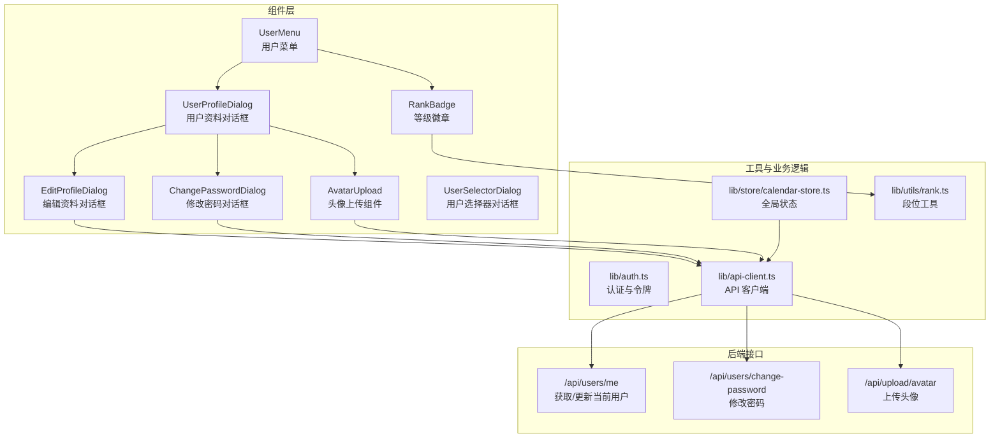
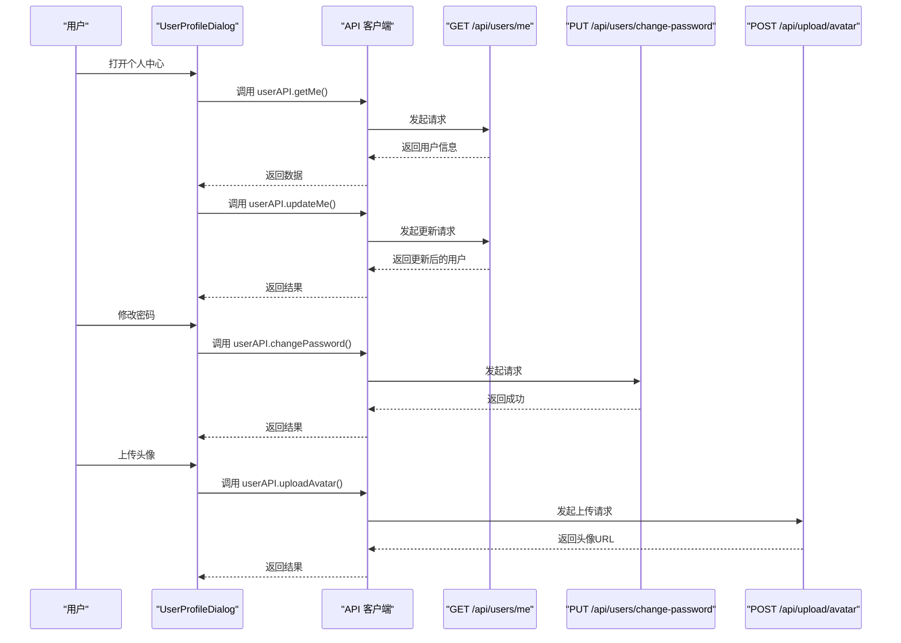
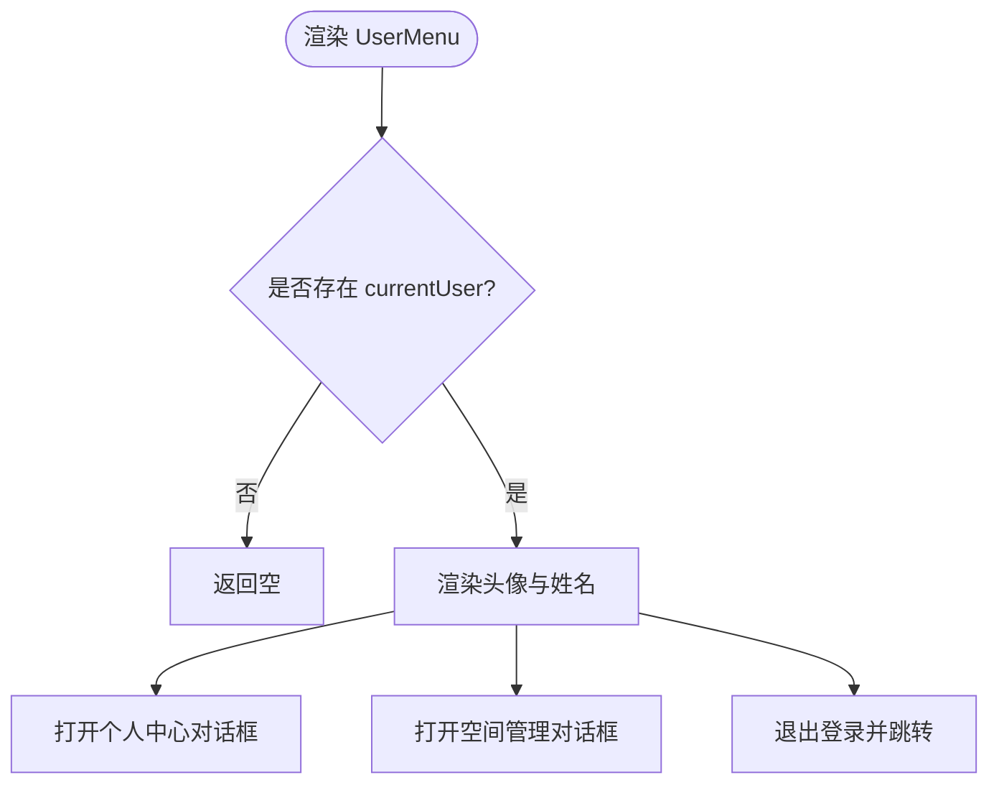
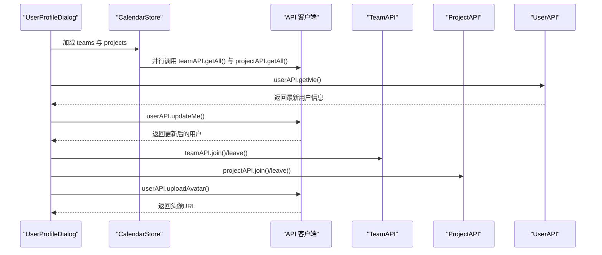
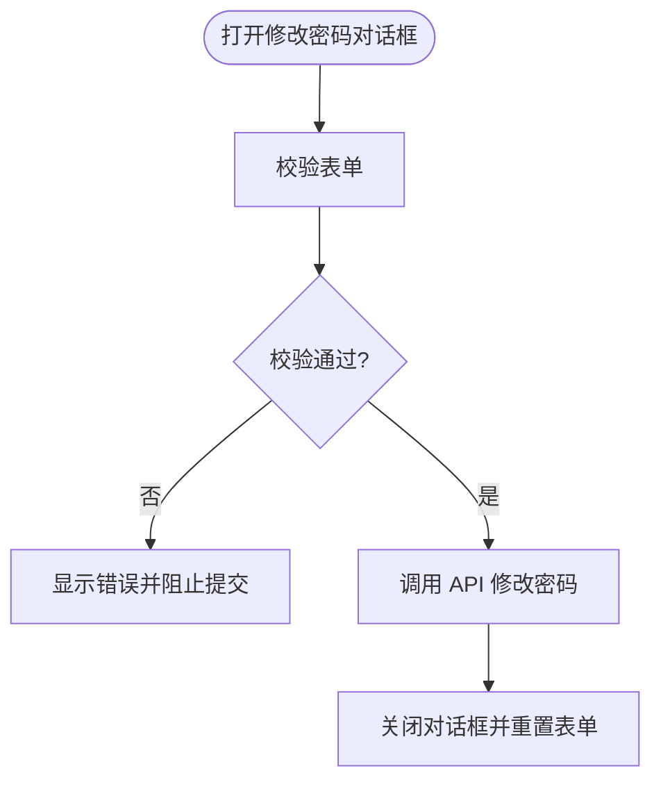
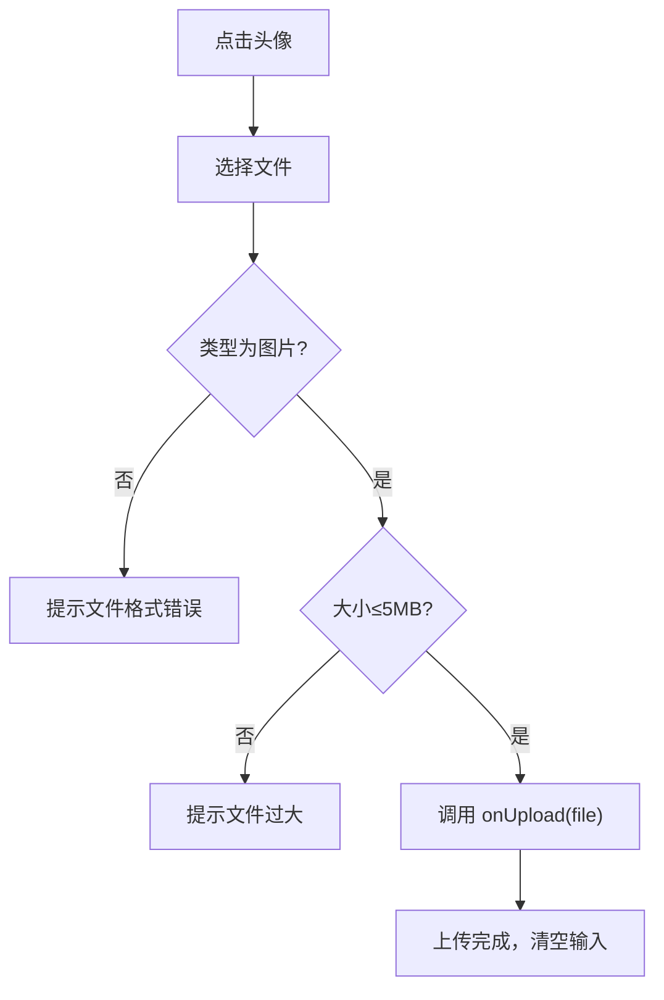
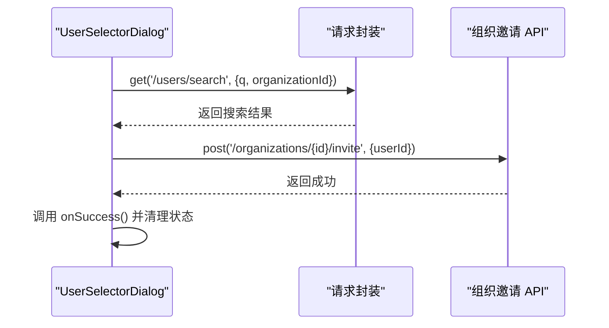
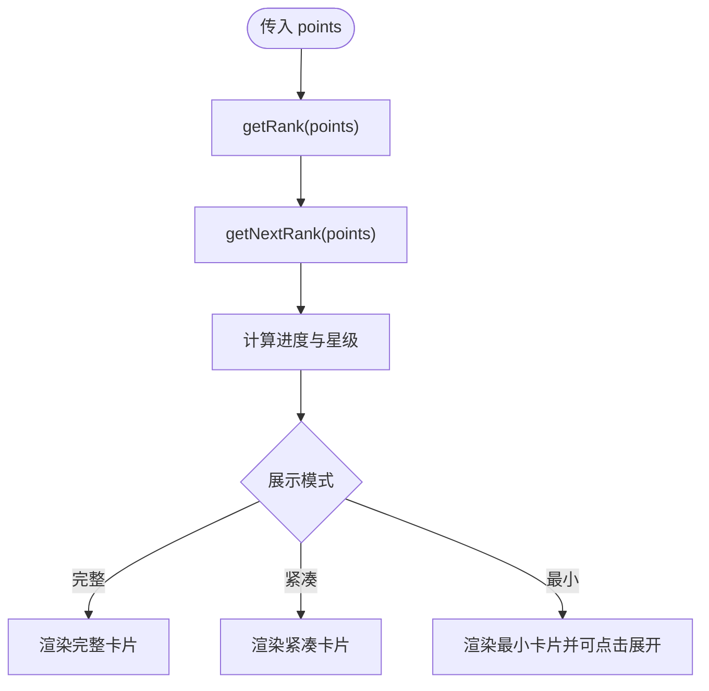
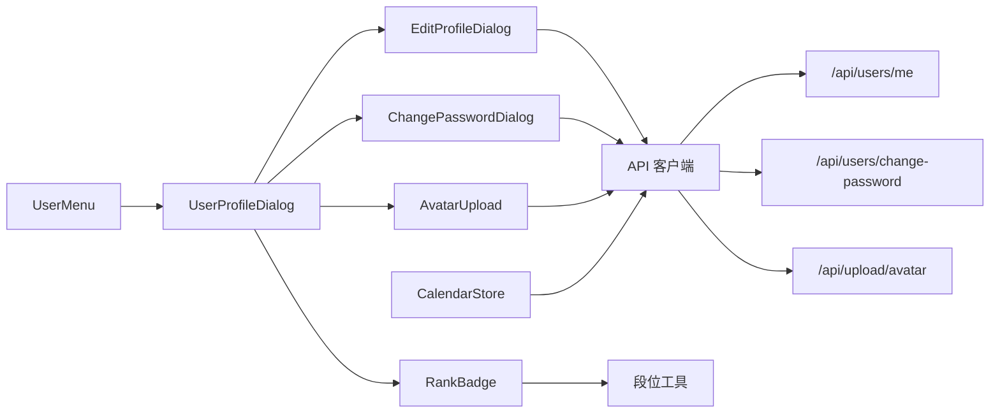

# 用户管理系统

<cite>
**本文引用的文件**
- [components/user-menu.tsx](file://components/user-menu.tsx)
- [components/edit-profile-dialog.tsx](file://components/edit-profile-dialog.tsx)
- [components/change-password-dialog.tsx](file://components/change-password-dialog.tsx)
- [components/avatar-upload.tsx](file://components/avatar-upload.tsx)
- [components/user-profile-dialog.tsx](file://components/user-profile-dialog.tsx)
- [components/user-selector-dialog.tsx](file://components/user-selector-dialog.tsx)
- [components/rank-badge.tsx](file://components/rank-badge.tsx)
- [lib/utils/rank.ts](file://lib/utils/rank.ts)
- [lib/auth.ts](file://lib/auth.ts)
- [lib/api-client.ts](file://lib/api-client.ts)
- [lib/store/calendar-store.ts](file://lib/store/calendar-store.ts)
- [app/api/users/me/route.ts](file://app/api/users/me/route.ts)
- [app/api/users/change-password/route.ts](file://app/api/users/change-password/route.ts)
- [app/api/upload/avatar/route.ts](file://app/api/upload/avatar/route.ts)
- [components/theme-provider.tsx](file://components/theme-provider.tsx)
</cite>

## 目录
1. [简介](#简介)
2. [项目结构](#项目结构)
3. [核心组件](#核心组件)
4. [架构总览](#架构总览)
5. [详细组件分析](#详细组件分析)
6. [依赖关系分析](#依赖关系分析)
7. [性能考量](#性能考量)
8. [故障排查指南](#故障排查指南)
9. [结论](#结论)
10. [附录](#附录)

## 简介
本技术文档围绕用户管理系统进行深入解析，覆盖用户菜单、个人资料编辑对话框、密码修改对话框、头像上传组件、用户资料对话框、用户选择器对话框、用户权限验证、会话管理、数据同步机制、用户等级徽章、个人设置与偏好配置、界面定制与主题切换、无障碍支持以及安全与扩展开发建议。文档以循序渐进的方式呈现，既适合开发者深入理解实现细节，也便于非技术读者把握整体功能。

## 项目结构
用户管理相关的核心文件分布于以下位置：
- 组件层：用户菜单、个人资料对话框、密码修改对话框、头像上传、用户资料对话框、用户选择器对话框、等级徽章等位于 components 目录。
- 工具与业务逻辑：积分段位计算、认证与令牌管理、API 客户端封装、全局状态管理位于 lib 目录。
- 后端接口：用户信息、密码修改、头像上传等 API 实现位于 app/api 下。

图表来源
- [components/user-menu.tsx](file://components/user-menu.tsx#L20-L114)
- [components/user-profile-dialog.tsx](file://components/user-profile-dialog.tsx#L62-L124)
- [components/edit-profile-dialog.tsx](file://components/edit-profile-dialog.tsx#L38-L82)
- [components/change-password-dialog.tsx](file://components/change-password-dialog.tsx#L23-L96)
- [components/avatar-upload.tsx](file://components/avatar-upload.tsx#L17-L54)
- [lib/api-client.ts](file://lib/api-client.ts#L184-L281)
- [lib/store/calendar-store.ts](file://lib/store/calendar-store.ts#L270-L287)
- [lib/utils/rank.ts](file://lib/utils/rank.ts#L51-L127)
- [app/api/users/me/route.ts](file://app/api/users/me/route.ts#L16-L50)
- [app/api/users/change-password/route.ts](file://app/api/users/change-password/route.ts#L15-L73)
- [app/api/upload/avatar/route.ts](file://app/api/upload/avatar/route.ts#L15-L73)

章节来源
- [components/user-menu.tsx](file://components/user-menu.tsx#L20-L114)
- [components/user-profile-dialog.tsx](file://components/user-profile-dialog.tsx#L62-L124)
- [lib/api-client.ts](file://lib/api-client.ts#L184-L281)
- [lib/store/calendar-store.ts](file://lib/store/calendar-store.ts#L270-L287)
- [lib/utils/rank.ts](file://lib/utils/rank.ts#L51-L127)
- [app/api/users/me/route.ts](file://app/api/users/me/route.ts#L16-L50)
- [app/api/users/change-password/route.ts](file://app/api/users/change-password/route.ts#L15-L73)
- [app/api/upload/avatar/route.ts](file://app/api/upload/avatar/route.ts#L15-L73)

## 核心组件
- 用户菜单：提供头像、姓名、积分段位展示，并支持打开个人中心、空间管理与退出登录。
- 个人资料对话框：集中展示与管理用户信息、团队与项目列表、默认团队设置、头像上传、编辑资料与修改密码入口。
- 密码修改对话框：表单校验、密码可见性切换、提交流程与错误处理。
- 头像上传组件：文件类型与大小校验、上传状态反馈、悬停编辑按钮与加载动画。
- 用户选择器对话框：组织内用户搜索、邀请发送、结果选择与状态清理。
- 等级徽章：积分段位、星级、进度条、规则提示与最小/紧凑/完整三种展示模式。

章节来源
- [components/user-menu.tsx](file://components/user-menu.tsx#L20-L114)
- [components/user-profile-dialog.tsx](file://components/user-profile-dialog.tsx#L62-L124)
- [components/change-password-dialog.tsx](file://components/change-password-dialog.tsx#L23-L96)
- [components/avatar-upload.tsx](file://components/avatar-upload.tsx#L17-L54)
- [components/user-selector-dialog.tsx](file://components/user-selector-dialog.tsx#L35-L111)
- [components/rank-badge.tsx](file://components/rank-badge.tsx#L27-L206)

## 架构总览
系统采用前后端分离的架构，前端通过 API 客户端封装统一调用后端接口，使用 JWT 进行认证与授权，Zustand 全局状态管理负责用户与数据的缓存与同步，UI 组件基于组件库构建，支持主题切换与无障碍访问。

图表来源
- [components/user-profile-dialog.tsx](file://components/user-profile-dialog.tsx#L112-L182)
- [lib/api-client.ts](file://lib/api-client.ts#L204-L281)
- [app/api/users/me/route.ts](file://app/api/users/me/route.ts#L16-L50)
- [app/api/users/change-password/route.ts](file://app/api/users/change-password/route.ts#L15-L73)
- [app/api/upload/avatar/route.ts](file://app/api/upload/avatar/route.ts#L15-L73)

## 详细组件分析

### 用户菜单（UserMenu）
- 功能要点
  - 展示当前用户头像与姓名，头像后备使用姓名首字母。
  - 提供“个人中心”、“空间管理”、“退出登录”等操作入口。
  - 集成积分段位徽章，显示当前积分与段位等级。
- 关键实现
  - 使用全局状态读取 currentUser 与 teams。
  - 退出登录时清除本地存储的用户信息并跳转到登录页。
  - 通过对话框组件打开个人中心与空间管理。

图表来源
- [components/user-menu.tsx](file://components/user-menu.tsx#L20-L114)

章节来源
- [components/user-menu.tsx](file://components/user-menu.tsx#L20-L114)

### 个人资料对话框（UserProfileDialog）
- 功能要点
  - 展示头像上传、基本信息、默认团队、职业与积分段位。
  - 团队与项目列表展示，支持加入/退出、设为默认团队、编辑与删除（创建者）。
  - 内嵌编辑资料与修改密码对话框。
- 关键实现
  - 首次打开时加载所有团队与项目，并刷新当前用户信息。
  - 头像上传：前端压缩 Base64，调用 API 更新用户头像并同步本地状态。
  - 个人信息保存：调用 API 更新用户信息并更新本地 currentUser。
  - 密码修改：调用 API 修改密码并提示成功/失败。
  - 加入/退出团队与项目：调用相应 API 并重新加载数据。

图表来源
- [components/user-profile-dialog.tsx](file://components/user-profile-dialog.tsx#L82-L121)
- [lib/api-client.ts](file://lib/api-client.ts#L363-L428)
- [lib/api-client.ts](file://lib/api-client.ts#L184-L281)

章节来源
- [components/user-profile-dialog.tsx](file://components/user-profile-dialog.tsx#L62-L124)
- [lib/api-client.ts](file://lib/api-client.ts#L184-L281)

### 密码修改对话框（ChangePasswordDialog）
- 功能要点
  - 表单校验：原密码、新密码长度、确认密码一致性、新旧密码不同。
  - 密码可见性切换。
  - 提交流程与错误处理（通过父组件 toast 显示）。
- 关键实现
  - 校验通过后调用 userAPI.changePassword()。
  - 关闭时重置表单状态。

图表来源
- [components/change-password-dialog.tsx](file://components/change-password-dialog.tsx#L46-L96)

章节来源
- [components/change-password-dialog.tsx](file://components/change-password-dialog.tsx#L23-L96)

### 头像上传组件（AvatarUpload）
- 功能要点
  - 文件类型与大小校验（仅图片、≤5MB）。
  - 上传状态反馈（悬停按钮、加载动画）。
  - 点击头像触发文件选择，支持重复上传同一文件。
- 关键实现
  - handleFileChange 中进行类型与大小校验，调用 onUpload 回调。
  - 上传完成后清空文件输入值以便重复上传。

图表来源
- [components/avatar-upload.tsx](file://components/avatar-upload.tsx#L26-L54)

章节来源
- [components/avatar-upload.tsx](file://components/avatar-upload.tsx#L17-L54)

### 用户选择器对话框（UserSelectorDialog）
- 功能要点
  - 搜索组织内用户（防抖延迟）。
  - 选择用户并发送邀请。
  - 结果列表与选择状态管理。
- 关键实现
  - 搜索：防抖 300ms，携带组织 ID 查询。
  - 邀请：调用组织邀请 API，成功后回调 onSuccess 并清理状态。

图表来源
- [components/user-selector-dialog.tsx](file://components/user-selector-dialog.tsx#L49-L111)

章节来源
- [components/user-selector-dialog.tsx](file://components/user-selector-dialog.tsx#L35-L111)

### 等级徽章（RankBadge）
- 功能要点
  - 根据积分计算段位、星级、下一段位所需积分与进度百分比。
  - 支持完整、紧凑、最小三种展示模式；最小模式可点击展开详情。
  - 积分规则提示与图标颜色随段位变化。
- 关键实现
  - 依赖段位工具函数：getRank、getNextRank、getPointsToNextRank、getRankProgress、getKingStars。
  - 最小模式使用 Popover 展示完整详情。

图表来源
- [components/rank-badge.tsx](file://components/rank-badge.tsx#L27-L206)
- [lib/utils/rank.ts](file://lib/utils/rank.ts#L51-L127)

章节来源
- [components/rank-badge.tsx](file://components/rank-badge.tsx#L27-L206)
- [lib/utils/rank.ts](file://lib/utils/rank.ts#L51-L127)

## 依赖关系分析
- 组件依赖
  - UserMenu 依赖全局状态与对话框组件。
  - UserProfileDialog 依赖 AvatarUpload、EditProfileDialog、ChangePasswordDialog、RankBadge。
  - ChangePasswordDialog 依赖 API 客户端与 Toast。
  - AvatarUpload 依赖 Toast 与图像工具（在 UserProfileDialog 中使用）。
  - UserSelectorDialog 依赖请求封装与 Toast。
  - RankBadge 依赖段位工具与 UI 组件。
- API 依赖
  - API 客户端封装统一的请求方法、Token 管理与错误处理。
  - 后端接口分别处理用户信息、密码修改、头像上传。
- 状态依赖
  - 全局状态管理 currentUser、teams、projects 等，支持本地持久化与刷新。

图表来源
- [components/user-menu.tsx](file://components/user-menu.tsx#L20-L114)
- [components/user-profile-dialog.tsx](file://components/user-profile-dialog.tsx#L62-L124)
- [components/edit-profile-dialog.tsx](file://components/edit-profile-dialog.tsx#L38-L82)
- [components/change-password-dialog.tsx](file://components/change-password-dialog.tsx#L23-L96)
- [components/avatar-upload.tsx](file://components/avatar-upload.tsx#L17-L54)
- [components/rank-badge.tsx](file://components/rank-badge.tsx#L27-L206)
- [lib/api-client.ts](file://lib/api-client.ts#L184-L281)
- [lib/store/calendar-store.ts](file://lib/store/calendar-store.ts#L270-L287)
- [lib/utils/rank.ts](file://lib/utils/rank.ts#L51-L127)
- [app/api/users/me/route.ts](file://app/api/users/me/route.ts#L16-L50)
- [app/api/users/change-password/route.ts](file://app/api/users/change-password/route.ts#L15-L73)
- [app/api/upload/avatar/route.ts](file://app/api/upload/avatar/route.ts#L15-L73)

章节来源
- [lib/api-client.ts](file://lib/api-client.ts#L184-L281)
- [lib/store/calendar-store.ts](file://lib/store/calendar-store.ts#L270-L287)
- [lib/utils/rank.ts](file://lib/utils/rank.ts#L51-L127)

## 性能考量
- 前端性能
  - 图片上传前进行前端压缩，减少带宽与服务器压力。
  - 对话框与弹窗使用受控状态，避免不必要的重渲染。
  - 搜索采用防抖策略，降低频繁请求带来的网络压力。
- 后端性能
  - API 接口对文件类型与大小进行严格校验，防止异常请求。
  - 统一的响应格式与错误处理，便于前端快速定位问题。
- 状态管理
  - 全局状态使用持久化存储，减少重复加载与网络请求。
  - 并行加载团队与项目数据，缩短首次渲染时间。

## 故障排查指南
- 认证与会话
  - 若出现 401 错误，客户端会清除本地 Token 并抛出错误，需重新登录。
  - 检查请求头是否正确附加 Authorization Bearer Token。
- 头像上传
  - 确认文件类型与大小符合要求；若上传失败，检查后端日志与磁盘权限。
- 密码修改
  - 确认原密码正确且新密码长度≥6位；避免新旧密码相同。
- 数据同步
  - 更新用户信息或头像后，确保本地 currentUser 已同步更新。
  - 加入/退出团队与项目后，重新加载数据以保证视图一致性。

章节来源
- [lib/api-client.ts](file://lib/api-client.ts#L75-L82)
- [app/api/upload/avatar/route.ts](file://app/api/upload/avatar/route.ts#L29-L39)
- [app/api/users/change-password/route.ts](file://app/api/users/change-password/route.ts#L25-L38)
- [components/user-profile-dialog.tsx](file://components/user-profile-dialog.tsx#L112-L121)

## 结论
用户管理系统通过模块化的组件设计、完善的认证与状态管理、清晰的 API 接口与健壮的错误处理，实现了从用户菜单、个人资料管理、密码修改、头像上传到团队与项目管理的全链路功能。等级徽章与积分体系增强了用户体验与激励效果。未来可在权限细化、国际化、无障碍增强与主题扩展等方面持续优化。

## 附录
- 主题切换支持
  - 通过主题提供器启用深浅色主题切换，适配不同用户偏好。
- 无障碍支持
  - 使用语义化标签与键盘可达性；为按钮与对话框提供适当的 ARIA 属性与提示文本。
- 安全考虑
  - 密码使用哈希算法存储；JWT 令牌有效期与提取逻辑完善；后端对请求参数进行严格校验。
- 扩展开发指南
  - 新增用户设置项时，遵循现有 API 客户端与全局状态管理模式。
  - 新增权限控制时，结合权限工具函数与后端接口进行统一校验。

章节来源
- [components/theme-provider.tsx](file://components/theme-provider.tsx#L9-L11)
- [lib/auth.ts](file://lib/auth.ts#L13-L29)
- [lib/api-client.ts](file://lib/api-client.ts#L18-L40)