# 用户菜单组件

<cite>
**本文档引用的文件**
- [components/user-menu.tsx](file://components/user-menu.tsx)
- [components/user-profile-dialog.tsx](file://components/user-profile-dialog.tsx)
- [components/organization-management-dialog.tsx](file://components/organization-management-dialog.tsx)
- [components/ui/dropdown-menu.tsx](file://components/ui/dropdown-menu.tsx)
- [components/ui/avatar.tsx](file://components/ui/avatar.tsx)
- [components/rank-badge.tsx](file://components/rank-badge.tsx)
- [lib/store/calendar-store.ts](file://lib/store/calendar-store.ts)
- [lib/utils/rank.ts](file://lib/utils/rank.ts)
- [lib/utils/points.ts](file://lib/utils/points.ts)
- [lib/utils/permission-utils.ts](file://lib/utils/permission-utils.ts)
- [lib/api-client.ts](file://lib/api-client.ts)
- [lib/types.ts](file://lib/types.ts)
- [app/page.tsx](file://app/page.tsx)
</cite>

## 目录
1. [简介](#简介)
2. [项目结构](#项目结构)
3. [核心组件](#核心组件)
4. [架构概览](#架构概览)
5. [详细组件分析](#详细组件分析)
6. [依赖关系分析](#依赖关系分析)
7. [性能考虑](#性能考虑)
8. [故障排除指南](#故障排除指南)
9. [结论](#结论)
10. [附录](#附录)

## 简介
用户菜单组件是日历任务管理系统中的关键交互元素，负责提供用户身份识别、信息展示、权限管理和导航控制功能。该组件集成了头像显示、用户信息展示、权限检查、会话状态管理、导航路由处理、用户等级显示、积分系统集成和默认团队标识等多种功能。

## 项目结构
用户菜单组件位于 `components/user-menu.tsx`，采用模块化设计，与其他组件形成清晰的层次结构：

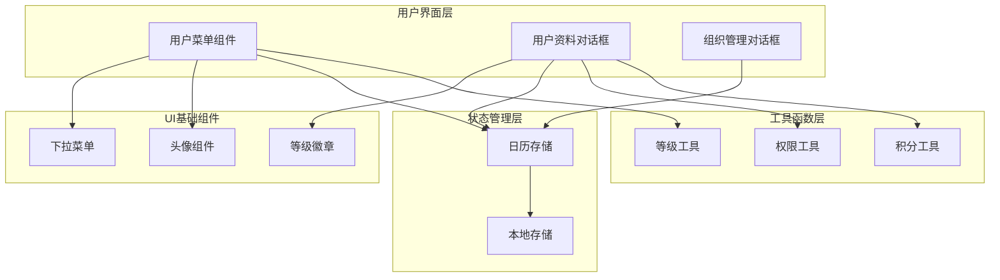

**图表来源**
- [components/user-menu.tsx](file://components/user-menu.tsx#L1-L114)
- [components/ui/dropdown-menu.tsx](file://components/ui/dropdown-menu.tsx#L1-L258)
- [components/ui/avatar.tsx](file://components/ui/avatar.tsx#L1-L54)

**章节来源**
- [components/user-menu.tsx](file://components/user-menu.tsx#L1-L114)
- [lib/store/calendar-store.ts](file://lib/store/calendar-store.ts#L1-L800)

## 核心组件
用户菜单组件由以下核心部分组成：

### 主要功能模块
1. **下拉菜单触发器** - 基于Radix UI的DropdownMenu组件
2. **用户信息展示** - 显示用户名、邮箱、头像等信息
3. **权限管理** - 基于角色的访问控制
4. **会话管理** - 登录状态维护和令牌管理
5. **导航控制** - 页面路由跳转和状态切换
6. **积分系统集成** - 用户等级显示和进度跟踪
7. **团队管理** - 默认团队标识和组织切换

### 关键特性
- **响应式设计** - 适配不同屏幕尺寸
- **状态持久化** - 使用localStorage存储用户信息
- **权限验证** - 实时检查用户权限
- **实时更新** - 自动同步用户状态变化

**章节来源**
- [components/user-menu.tsx](file://components/user-menu.tsx#L20-L114)
- [lib/types.ts](file://lib/types.ts#L108-L120)

## 架构概览
用户菜单组件采用分层架构设计，各层职责明确：

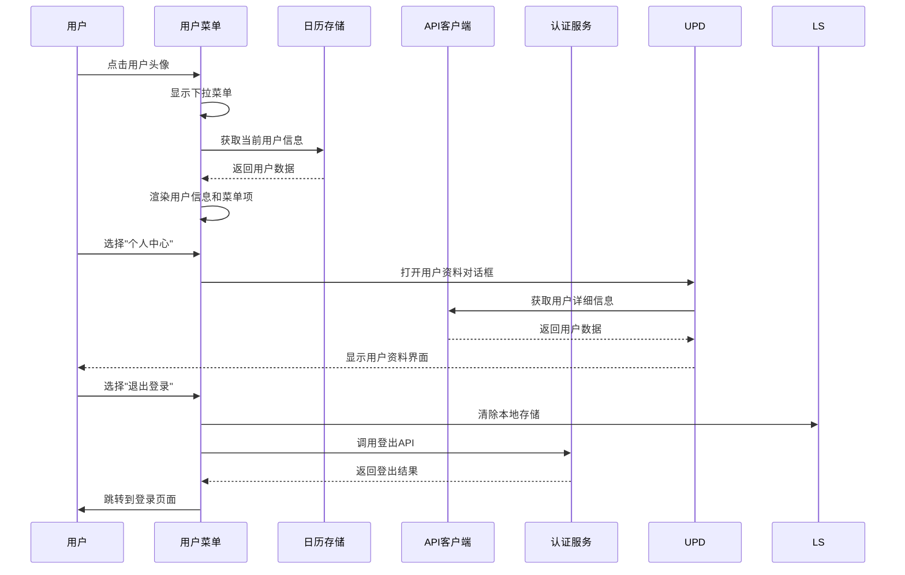

**图表来源**
- [components/user-menu.tsx](file://components/user-menu.tsx#L26-L31)
- [lib/store/calendar-store.ts](file://lib/store/calendar-store.ts#L271-L287)
- [lib/api-client.ts](file://lib/api-client.ts#L492-L495)

## 详细组件分析

### 用户菜单组件分析

#### 组件结构
用户菜单组件采用函数式组件设计，使用React Hooks管理状态：

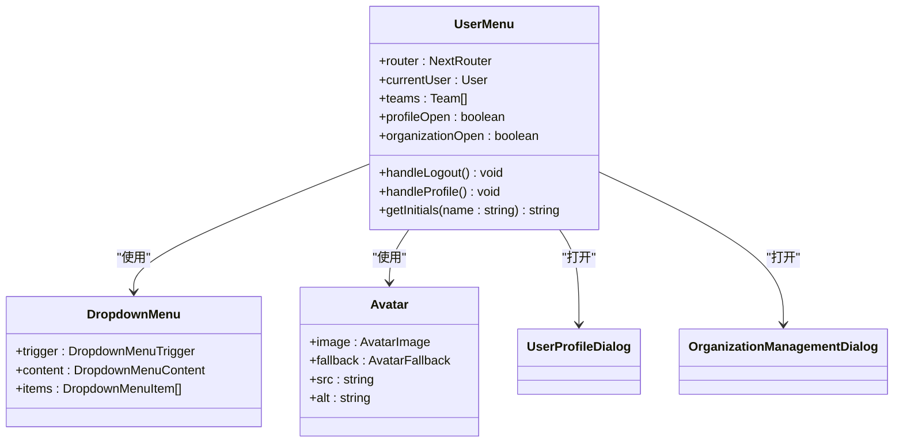

**图表来源**
- [components/user-menu.tsx](file://components/user-menu.tsx#L20-L114)
- [components/ui/dropdown-menu.tsx](file://components/ui/dropdown-menu.tsx#L9-L52)
- [components/ui/avatar.tsx](file://components/ui/avatar.tsx#L8-L22)

#### 下拉菜单触发器实现
下拉菜单基于Radix UI构建，提供丰富的交互体验：

| 功能特性 | 实现方式 | 样式类名 |
|---------|----------|----------|
| 触发器容器 | button元素 | `flex items-center gap-2 rounded-lg px-3 py-2` |
| 头像显示 | Avatar组件 | `h-8 w-8` |
| 用户名显示 | span元素 | `text-sm font-medium` |
| 下拉内容 | DropdownMenuContent | `w-56` |
| 分隔线 | DropdownMenuSeparator | `-mx-1 my-1 h-px` |

#### 用户信息展示逻辑
用户信息展示包含多个维度的信息：

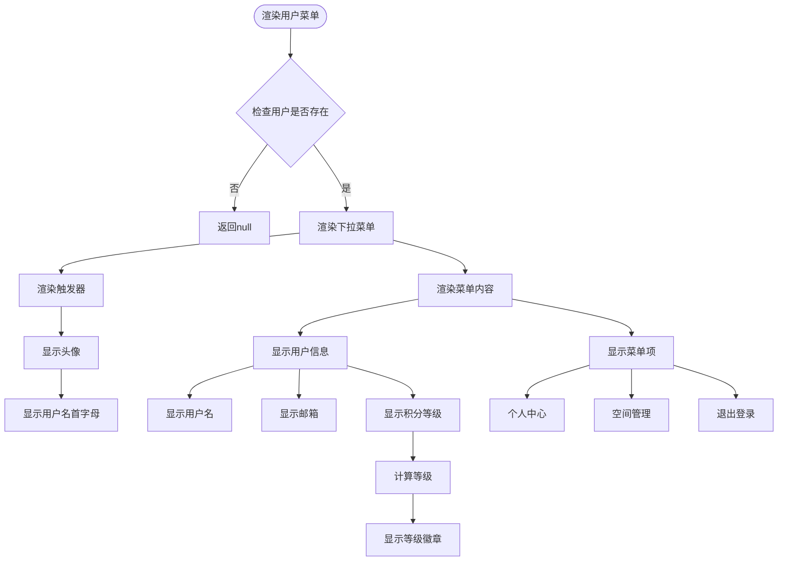

**图表来源**
- [components/user-menu.tsx](file://components/user-menu.tsx#L37-L45)
- [components/user-menu.tsx](file://components/user-menu.tsx#L62-L84)

#### 头像显示逻辑
头像显示采用渐进增强策略：

| 头像类型 | 实现方式 | 备注 |
|---------|----------|------|
| 在线头像 | AvatarImage | 显示用户上传的真实头像 |
| 备用头像 | AvatarFallback | 显示用户名首字母 |
| 占位符 | AvatarFallback | 默认背景色和文字颜色 |
| 动态颜色 | Tailwind类 | 基于主题的动态颜色 |

#### 权限检查机制
组件集成了多层次的权限检查：

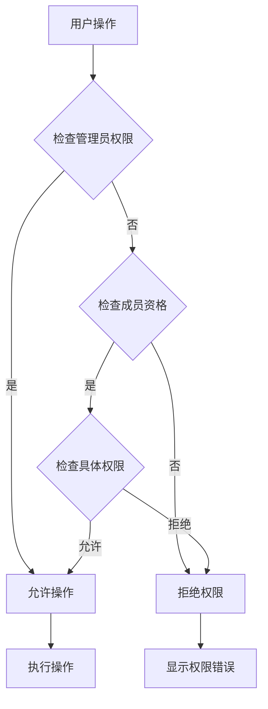

**图表来源**
- [lib/utils/permission-utils.ts](file://lib/utils/permission-utils.ts#L11-L30)
- [lib/utils/permission-utils.ts](file://lib/utils/permission-utils.ts#L40-L59)

#### 会话状态管理
会话状态管理采用本地存储和API双重验证：

| 状态类型 | 存储位置 | 验证方式 | 生命周期 |
|---------|----------|----------|----------|
| 用户信息 | localStorage | JSON字符串 | 浏览器会话 |
| 访问令牌 | localStorage | Bearer Token | 90天 |
| 当前组织 | localStorage | 组织ID | 浏览器会话 |
| 临时状态 | 组件状态 | 内存存储 | 组件卸载 |

#### 导航路由处理
路由处理机制支持多种导航模式：

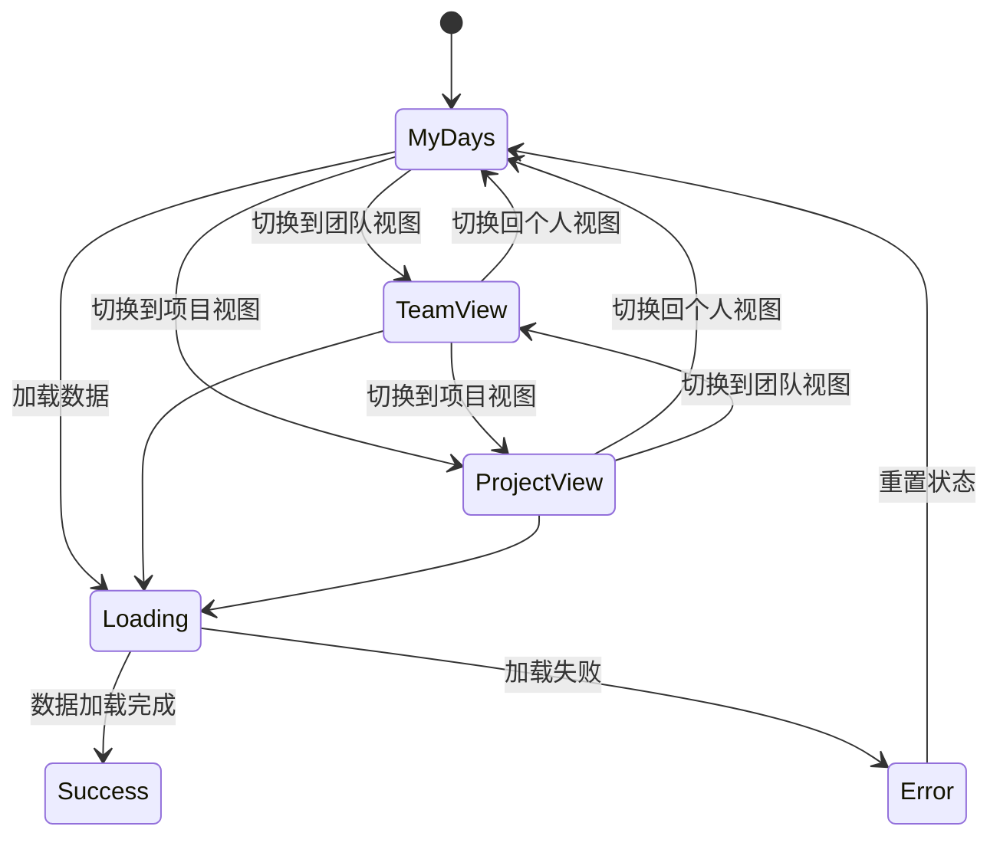

#### 用户等级显示系统
等级系统基于积分计算，提供丰富的视觉反馈：

| 等级类别 | 积分范围 | 段位名称 | 颜色标识 |
|---------|----------|----------|----------|
| 青铜段位 | 0-40 | 倔强青铜I-III | #CD7F32 |
| 白银段位 | 60-100 | 秩序白银I-III | #9d9890 |
| 黄金段位 | 120-210 | 荣耀黄金I-IV | #FFD700 |
| 铂金段位 | 240-360 | 尊贵铂金I-IV | #917f59 |
| 钻石段位 | 400-600 | 永恒钻石I-V | #B9F2FF |
| 星耀段位 | 650-890 | 至尊星耀I-V | #FF6B9D |
| 王者段位 | 950+ | 最强/至圣/无双等 | #FF0080 |

#### 积分系统集成
积分系统提供完整的奖励机制：

| 积分行为 | 奖励积分 | 说明 |
|---------|----------|------|
| 创建任务 | +2 | 鼓励用户积极创建任务 |
| 创建团队 | +5 | 促进团队建设 |
| 创建项目 | +5 | 推动项目管理 |
| 邀请用户 | +10 | 鼓励用户推荐 |

#### 默认团队标识实现
默认团队标识通过用户配置实现：

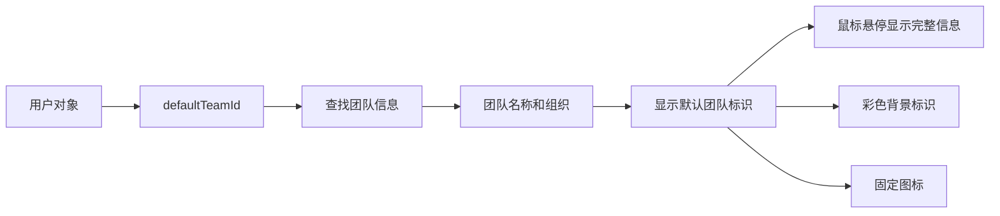

**图表来源**
- [components/user-menu.tsx](file://components/user-menu.tsx#L76-L81)
- [components/user-profile-dialog.tsx](file://components/user-profile-dialog.tsx#L361-L374)

**章节来源**
- [components/user-menu.tsx](file://components/user-menu.tsx#L1-L114)
- [lib/utils/rank.ts](file://lib/utils/rank.ts#L1-L156)
- [lib/utils/points.ts](file://lib/utils/points.ts#L1-L99)

### 用户资料对话框分析

#### 对话框功能架构
用户资料对话框提供完整的用户信息管理功能：

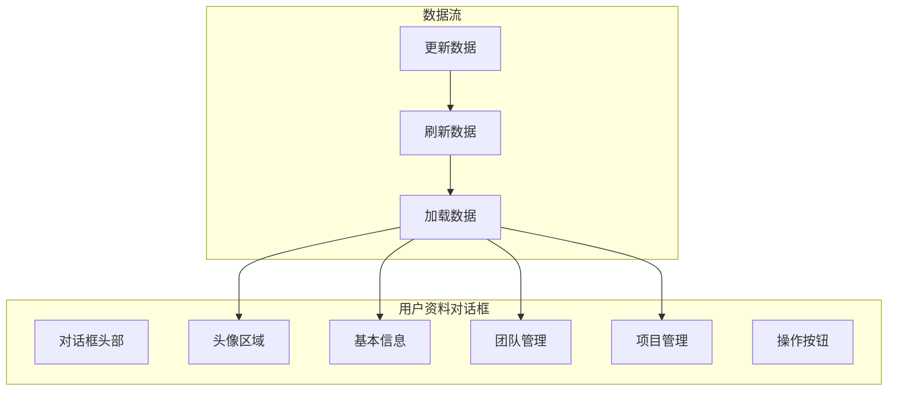

**图表来源**
- [components/user-profile-dialog.tsx](file://components/user-profile-dialog.tsx#L62-L123)
- [components/user-profile-dialog.tsx](file://components/user-profile-dialog.tsx#L96-L121)

#### 头像上传流程
头像上传采用多步骤处理机制：

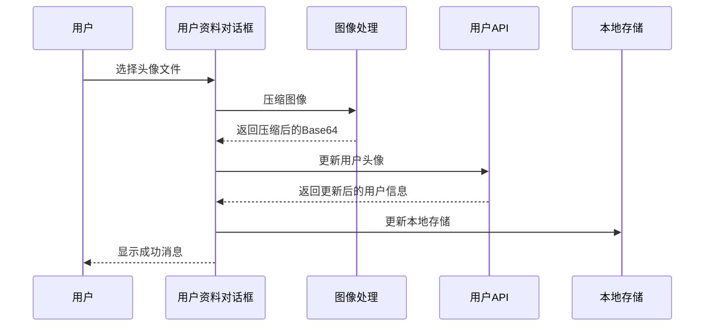

**图表来源**
- [components/user-profile-dialog.tsx](file://components/user-profile-dialog.tsx#L132-L152)

#### 团队和项目管理
对话框提供团队和项目的完整管理功能：

| 功能类型 | 操作类型 | 权限要求 | 状态管理 |
|---------|----------|----------|----------|
| 团队管理 | 查看 | 任意用户 | 显示成员数量 |
| 团队管理 | 加入 | 非成员 | 显示加入按钮 |
| 团队管理 | 退出 | 团队成员 | 显示退出确认 |
| 团队管理 | 编辑 | 团队创建者 | 显示编辑按钮 |
| 项目管理 | 查看 | 任意用户 | 显示成员数量 |
| 项目管理 | 加入 | 非成员 | 显示加入按钮 |
| 项目管理 | 退出 | 项目成员 | 显示退出确认 |
| 项目管理 | 编辑 | 项目创建者 | 显示编辑按钮 |

**章节来源**
- [components/user-profile-dialog.tsx](file://components/user-profile-dialog.tsx#L1-L816)

### 组织管理对话框分析

#### 组织管理功能
组织管理对话框提供空间/组织的完整生命周期管理：

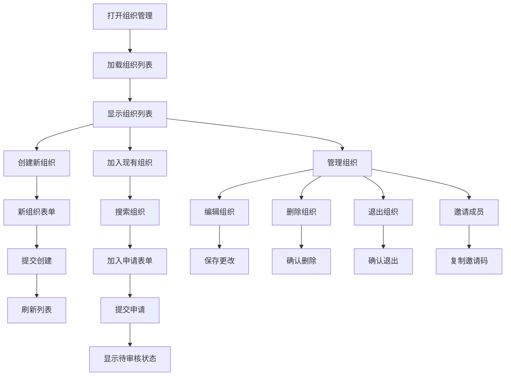

**图表来源**
- [components/organization-management-dialog.tsx](file://components/organization-management-dialog.tsx#L53-L95)
- [components/organization-management-dialog.tsx](file://components/organization-management-dialog.tsx#L121-L245)

#### 邀请码系统
邀请码系统提供安全的组织加入机制：

| 邀请码功能 | 实现方式 | 安全措施 |
|-----------|----------|----------|
| 生成邀请码 | API调用 | 服务器端生成 |
| 复制邀请码 | 剪贴板API | 自动复制文本 |
| 验证邀请码 | API校验 | 服务器端验证 |
| 使用邀请码 | 加入申请 | 需要管理员审批 |

**章节来源**
- [components/organization-management-dialog.tsx](file://components/organization-management-dialog.tsx#L1-L846)

## 依赖关系分析

### 组件依赖图
用户菜单组件的依赖关系呈现清晰的层次结构：

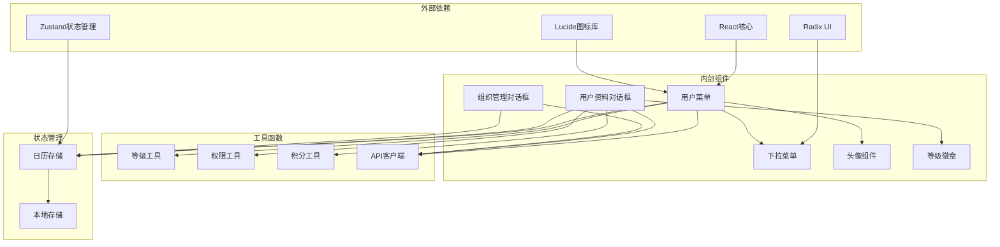

**图表来源**
- [components/user-menu.tsx](file://components/user-menu.tsx#L3-L18)
- [lib/store/calendar-store.ts](file://lib/store/calendar-store.ts#L3-L31)

### 数据流依赖
组件间的数据流遵循单向数据流原则：

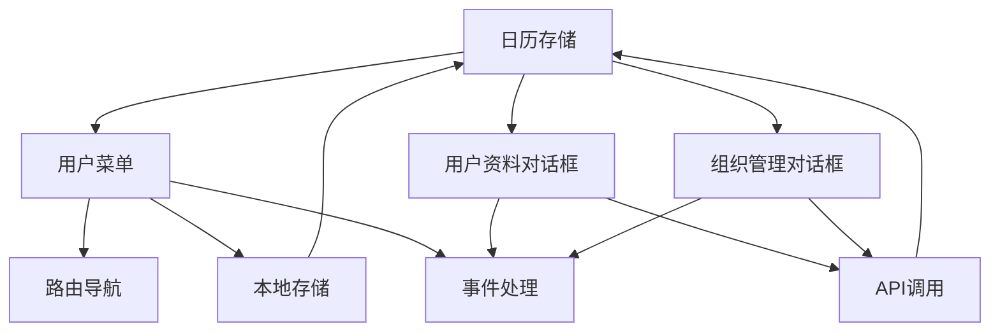

**图表来源**
- [lib/store/calendar-store.ts](file://lib/store/calendar-store.ts#L271-L287)
- [lib/api-client.ts](file://lib/api-client.ts#L44-L100)

**章节来源**
- [components/user-menu.tsx](file://components/user-menu.tsx#L1-L114)
- [lib/store/calendar-store.ts](file://lib/store/calendar-store.ts#L1-L800)

## 性能考虑

### 性能优化策略
用户菜单组件采用了多项性能优化措施：

#### 渲染优化
- **条件渲染**：当用户不存在时直接返回null，避免不必要的DOM节点创建
- **状态分离**：将对话框状态与菜单状态分离，减少不必要的重渲染
- **懒加载**：对话框组件采用延迟加载，只有在用户交互时才加载

#### 内存管理
- **引用清理**：使用useRef跟踪对话框加载状态，避免重复加载
- **事件解绑**：组件卸载时自动清理定时器和事件监听器
- **缓存策略**：对API响应进行缓存，减少重复请求

#### 网络优化
- **批量请求**：使用Promise.all并行加载多个数据源
- **错误处理**：完善的错误处理机制，避免应用崩溃
- **超时控制**：为长时间请求设置超时机制

### 性能监控指标
建议监控以下关键性能指标：

| 指标类型 | 目标值 | 监控方法 |
|---------|--------|----------|
| 组件渲染时间 | <100ms | React DevTools Profiler |
| 首次交互延迟 | <200ms | Lighthouse Performance |
| 内存使用 | <50MB | Chrome DevTools Memory |
| API响应时间 | <1s | Network面板分析 |

## 故障排除指南

### 常见问题及解决方案

#### 用户信息显示异常
**问题症状**：用户头像显示为占位符，用户名显示为"Guest"

**可能原因**：
1. 本地存储中的用户信息损坏
2. API响应格式不正确
3. 网络请求失败

**解决步骤**：
1. 检查localStorage中的currentUser数据
2. 验证API响应格式
3. 查看网络请求状态

#### 下拉菜单不显示
**问题症状**：点击用户头像无反应

**可能原因**：
1. DropdownMenu组件未正确导入
2. Radix UI上下文未正确配置
3. 样式冲突

**解决步骤**：
1. 确认DropdownMenu组件导入正确
2. 检查Radix UI Provider配置
3. 检查CSS冲突

#### 权限检查失败
**问题症状**：用户权限验证总是失败

**可能原因**：
1. 用户权限数据不正确
2. 权限检查逻辑错误
3. API返回的权限信息格式不正确

**解决步骤**：
1. 检查用户权限数据结构
2. 验证权限检查函数逻辑
3. 查看API响应格式

#### 积分显示异常
**问题症状**：用户等级显示不正确

**可能原因**：
1. 积分计算逻辑错误
2. 等级配置数据不正确
3. 数据同步问题

**解决步骤**：
1. 验证积分计算逻辑
2. 检查等级配置表
3. 确认数据同步机制

### 调试工具和技巧

#### 开发者工具使用
- **React DevTools**：检查组件树和状态变化
- **Chrome DevTools**：监控网络请求和内存使用
- **Redux DevTools**：调试状态管理问题

#### 日志记录
建议在关键位置添加日志记录：

```typescript
// 用户状态变化日志
console.log('用户状态变化:', { currentUser, action });

// API调用日志
console.log('API调用:', { endpoint, method, status });

// 错误处理日志
console.error('组件错误:', { component, error, stack });
```

**章节来源**
- [components/user-menu.tsx](file://components/user-menu.tsx#L26-L31)
- [lib/store/calendar-store.ts](file://lib/store/calendar-store.ts#L271-L287)

## 结论
用户菜单组件是一个功能完整、架构清晰的React组件，成功集成了用户身份管理、权限控制、状态管理、数据同步等多个复杂功能。组件设计遵循了现代前端开发的最佳实践，具有良好的可维护性和扩展性。

组件的主要优势包括：
- **模块化设计**：功能清晰分离，便于维护和测试
- **状态管理**：采用Zustand实现高效的状态管理
- **权限控制**：多层次的权限检查机制
- **用户体验**：流畅的交互和响应式设计
- **性能优化**：多项性能优化措施确保良好性能

未来可以考虑的功能扩展包括：
- 更丰富的用户个性化设置
- 实时通知集成
- 更灵活的权限配置
- 增强的搜索和筛选功能

## 附录

### 组件属性配置指南

#### 用户菜单组件属性
| 属性名 | 类型 | 默认值 | 描述 |
|-------|------|--------|------|
| currentUser | User \| null | null | 当前登录用户信息 |
| teams | Team[] | [] | 用户所属团队列表 |
| profileOpen | boolean | false | 用户资料对话框开关 |
| organizationOpen | boolean | false | 组织管理对话框开关 |

#### 对话框组件属性
| 属性名 | 类型 | 默认值 | 描述 |
|-------|------|--------|------|
| open | boolean | false | 对话框显示状态 |
| onOpenChange | (open: boolean) => void | - | 对话框状态变化回调 |
| currentUser | User \| null | null | 当前用户信息 |

### 事件处理机制

#### 用户交互事件
| 事件类型 | 触发条件 | 处理函数 | 参数 |
|---------|----------|----------|------|
| 用户头像点击 | 点击用户头像 | handleProfile | - |
| 个人中心点击 | 选择个人中心菜单项 | handleProfile | - |
| 空间管理点击 | 选择空间管理菜单项 | setOrganizationOpen(true) | - |
| 退出登录点击 | 选择退出登录菜单项 | handleLogout | - |
| 头像上传 | 选择新头像文件 | handleAvatarUpload | File |
| 个人信息保存 | 点击保存按钮 | handleSaveProfile | Partial<User> |
| 修改密码 | 点击修改密码 | handleChangePassword | { oldPassword, newPassword } |

### 样式定制指南

#### 主题定制
组件支持通过Tailwind CSS类名进行样式定制：

```css
/* 用户菜单容器 */
.user-menu-container {
  @apply flex items-center gap-2 rounded-lg px-3 py-2 transition-colors hover:bg-accent;
}

/* 头像容器 */
.user-avatar {
  @apply h-8 w-8 rounded-full overflow-hidden;
}

/* 用户名文本 */
.user-name {
  @apply text-sm font-medium;
}

/* 下拉菜单内容 */
.dropdown-content {
  @apply w-56 origin-[--radix-dropdown-menu-content-transform-origin];
}
```

#### 响应式设计
组件支持移动端和桌面端的不同布局：

| 断点 | 屏幕宽度 | 布局特点 |
|------|----------|----------|
| 移动端 | <768px | 垂直布局，紧凑间距 |
| 平板端 | 768px-1024px | 水平布局，适中间距 |
| 桌面端 | >1024px | 宽屏布局，宽松间距 |

### 扩展开发方案

#### 功能扩展
1. **通知集成**：添加用户通知中心
2. **快捷操作**：添加常用操作的快捷入口
3. **主题切换**：支持深色/浅色主题切换
4. **多语言支持**：国际化文本支持

#### 性能优化
1. **代码分割**：对大型对话框组件进行代码分割
2. **缓存策略**：实现更智能的数据缓存机制
3. **懒加载**：对非关键资源进行懒加载
4. **虚拟化**：对长列表进行虚拟化处理

#### 安全增强
1. **CSRF保护**：添加CSRF令牌验证
2. **XSS防护**：对用户输入进行严格验证
3. **权限审计**：记录重要的权限操作
4. **会话安全**：实现更安全的会话管理

**章节来源**
- [components/user-menu.tsx](file://components/user-menu.tsx#L1-L114)
- [components/user-profile-dialog.tsx](file://components/user-profile-dialog.tsx#L1-L816)
- [components/organization-management-dialog.tsx](file://components/organization-management-dialog.tsx#L1-L846)