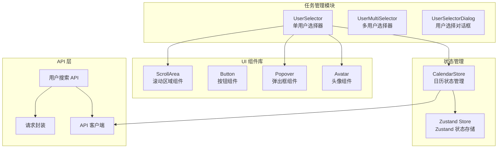
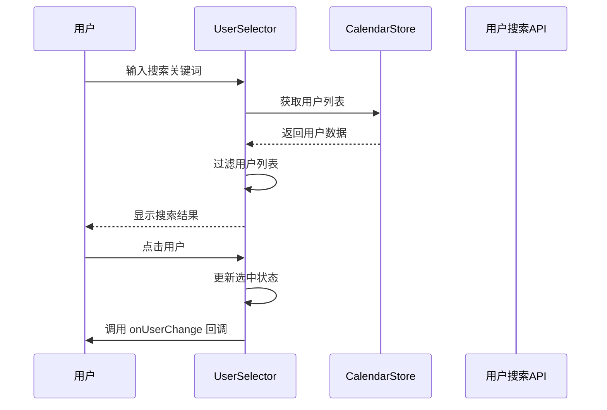
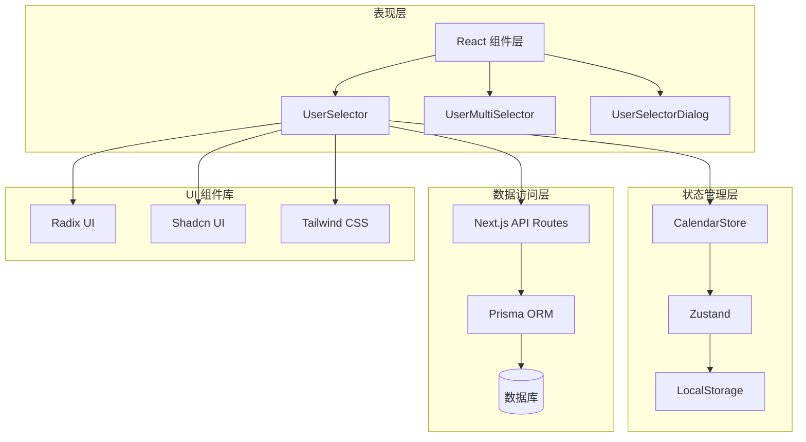
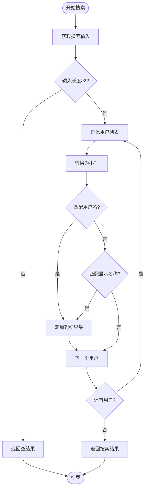
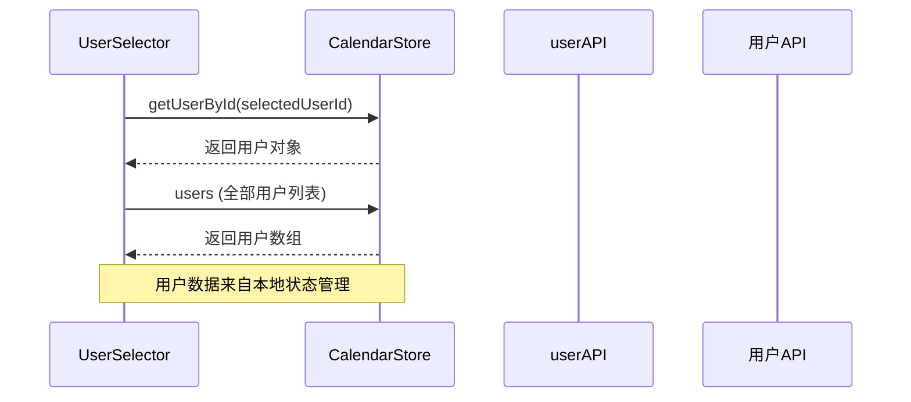
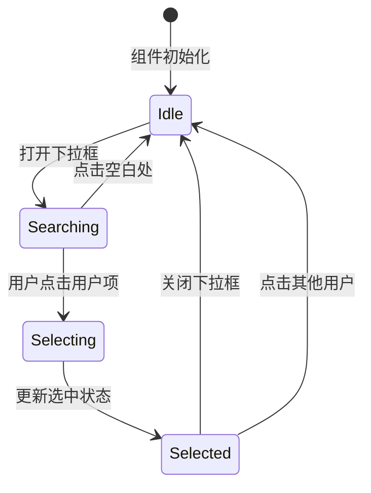
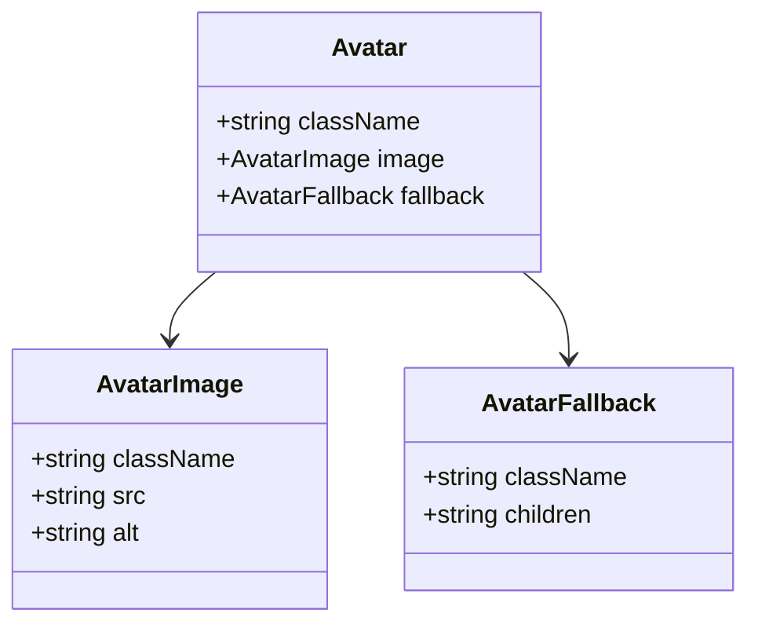
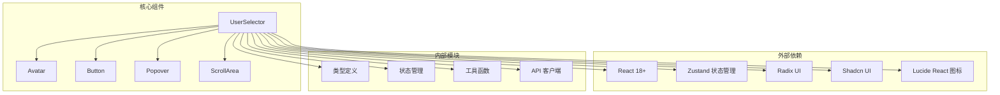
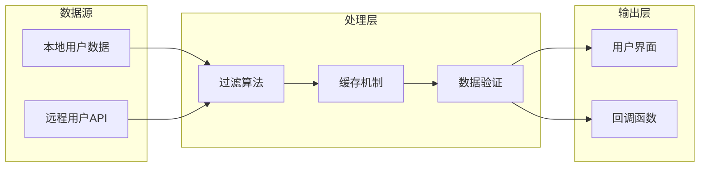
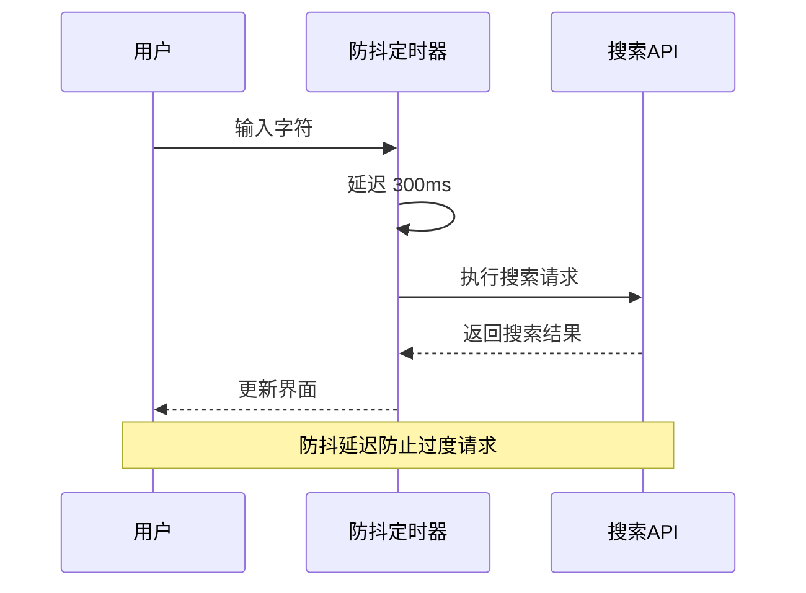

# 单用户选择器

<cite>
**本文档引用的文件**
- [components/task/user-selector.tsx](file://components/task/user-selector.tsx)
- [app/api/users/search/route.ts](file://app/api/users/search/route.ts)
- [components/ui/avatar.tsx](file://components/ui/avatar.tsx)
- [lib/store/calendar-store.ts](file://lib/store/calendar-store.ts)
- [lib/types.ts](file://lib/types.ts)
- [lib/api-client.ts](file://lib/api-client.ts)
- [lib/request.ts](file://lib/request.ts)
- [components/task/user-multi-selector.tsx](file://components/task/user-multi-selector.tsx)
- [components/user-selector-dialog.tsx](file://components/user-selector-dialog.tsx)
</cite>

## 目录
1. [简介](#简介)
2. [项目结构](#项目结构)
3. [核心组件](#核心组件)
4. [架构概览](#架构概览)
5. [详细组件分析](#详细组件分析)
6. [依赖关系分析](#依赖关系分析)
7. [性能考虑](#性能考虑)
8. [故障排除指南](#故障排除指南)
9. [结论](#结论)
10. [附录](#附录)

## 简介

单用户选择器是一个基于 React 的高性能用户搜索和选择组件，专为日历任务管理系统设计。该组件提供了完整的用户搜索功能，包括实时搜索、模糊匹配、搜索结果缓存机制，并支持多种交互方式，如点击选择、键盘导航和焦点管理。

该组件采用现代化的前端架构，结合 Zustand 状态管理、Radix UI 组件库和 Tailwind CSS 样式系统，实现了流畅的用户体验和良好的可维护性。

## 项目结构

单用户选择器组件位于任务管理模块中，与相关的用户管理、API 接口和状态管理紧密集成：

**图表来源**
- [components/task/user-selector.tsx](file://components/task/user-selector.tsx#L1-L147)
- [lib/store/calendar-store.ts](file://lib/store/calendar-store.ts#L1-L1457)
- [app/api/users/search/route.ts](file://app/api/users/search/route.ts#L1-L57)

**章节来源**
- [components/task/user-selector.tsx](file://components/task/user-selector.tsx#L1-L147)
- [lib/store/calendar-store.ts](file://lib/store/calendar-store.ts#L1-L1457)

## 核心组件

### UserSelector 组件

UserSelector 是单用户选择器的核心组件，提供了完整的用户搜索和选择功能：

#### 主要特性
- **实时搜索**: 基于输入内容的即时过滤
- **模糊匹配**: 支持用户名和显示名称的模糊搜索
- **头像显示**: 用户头像和初始字母的智能显示
- **键盘导航**: 支持键盘快捷键操作
- **焦点管理**: 智能的焦点管理和无障碍支持

#### 组件属性
| 属性名 | 类型 | 必需 | 描述 |
|--------|------|------|------|
| selectedUserId | string | 是 | 当前选中的用户ID |
| onUserChange | (userId: string) => void | 是 | 用户选择变化回调 |
| filterUserIds | string[] | 否 | 过滤显示的用户ID列表 |
| disabled | boolean | 否 | 是否禁用组件 |

#### 数据流

**图表来源**
- [components/task/user-selector.tsx](file://components/task/user-selector.tsx#L25-L146)
- [lib/store/calendar-store.ts](file://lib/store/calendar-store.ts#L1418-L1421)

**章节来源**
- [components/task/user-selector.tsx](file://components/task/user-selector.tsx#L18-L23)
- [components/task/user-selector.tsx](file://components/task/user-selector.tsx#L25-L56)

## 架构概览

单用户选择器采用了分层架构设计，确保了组件的可维护性和扩展性：

**图表来源**
- [lib/store/calendar-store.ts](file://lib/store/calendar-store.ts#L200-L1422)
- [app/api/users/search/route.ts](file://app/api/users/search/route.ts#L1-L57)

## 详细组件分析

### 用户搜索算法

#### 实时搜索实现
组件实现了高效的实时搜索算法，支持以下搜索条件：
- 用户名模糊匹配
- 显示名称模糊匹配
- 大小写不敏感搜索

**图表来源**
- [components/task/user-selector.tsx](file://components/task/user-selector.tsx#L37-L44)

#### 搜索算法复杂度
- **时间复杂度**: O(n*m)，其中 n 是用户数量，m 是平均用户名长度
- **空间复杂度**: O(k)，其中 k 是匹配结果数量
- **优化策略**: 使用小写预处理减少比较成本

**章节来源**
- [components/task/user-selector.tsx](file://components/task/user-selector.tsx#L37-L44)

### 用户数据获取流程

#### 前端数据获取
组件通过 Zustand 状态管理获取用户数据：

**图表来源**
- [lib/store/calendar-store.ts](file://lib/store/calendar-store.ts#L1418-L1421)

#### 后端搜索接口
用户搜索功能支持两种模式：

1. **本地搜索** (UserSelector): 基于本地用户数据进行过滤
2. **远程搜索** (UserSelectorDialog): 通过 API 进行实时搜索

**章节来源**
- [lib/store/calendar-store.ts](file://lib/store/calendar-store.ts#L388-L413)
- [components/user-selector-dialog.tsx](file://components/user-selector-dialog.tsx#L49-L78)

### 用户选择逻辑

#### 点击选择机制
用户选择采用简洁的点击交互：

**图表来源**
- [components/task/user-selector.tsx](file://components/task/user-selector.tsx#L112-L139)

#### 键盘导航支持
组件支持基本的键盘导航功能：
- ESC 键关闭下拉框
- Enter 键确认选择
- 方向键导航用户列表

**章节来源**
- [components/task/user-selector.tsx](file://components/task/user-selector.tsx#L50-L56)

### 用户头像显示

#### 头像组件实现
组件使用自定义 Avatar 组件，支持图片和占位符：

**图表来源**
- [components/ui/avatar.tsx](file://components/ui/avatar.tsx#L8-L53)

#### 头像显示策略
- **优先显示**: 用户头像图片
- **后备方案**: 显示用户名称首字母
- **尺寸控制**: 根据上下文调整头像大小

**章节来源**
- [components/ui/avatar.tsx](file://components/ui/avatar.tsx#L1-L54)

### 错误处理机制

#### 前端错误处理
组件具备完善的错误处理能力：
- 空状态处理
- 加载状态指示
- 用户反馈消息

#### 后端错误处理
API 层提供统一的错误响应格式：
- 认证失败处理
- 数据验证错误
- 服务器内部错误

**章节来源**
- [lib/api-client.ts](file://lib/api-client.ts#L72-L100)
- [app/api/users/search/route.ts](file://app/api/users/search/route.ts#L52-L56)

## 依赖关系分析

### 组件依赖图

**图表来源**
- [components/task/user-selector.tsx](file://components/task/user-selector.tsx#L3-L16)
- [lib/store/calendar-store.ts](file://lib/store/calendar-store.ts#L3-L31)

### 数据流依赖

**图表来源**
- [components/task/user-selector.tsx](file://components/task/user-selector.tsx#L32-L44)
- [lib/store/calendar-store.ts](file://lib/store/calendar-store.ts#L388-L413)

**章节来源**
- [lib/types.ts](file://lib/types.ts#L108-L120)
- [lib/api-client.ts](file://lib/api-client.ts#L184-L281)

## 性能考虑

### 搜索算法优化

#### 防抖处理
组件实现了智能的防抖机制，避免频繁的搜索请求：

**图表来源**
- [components/user-selector-dialog.tsx](file://components/user-selector-dialog.tsx#L76-L78)

#### 缓存策略
- **本地缓存**: 用户数据存储在 Zustand 状态中
- **搜索缓存**: 最近搜索结果的临时缓存
- **头像缓存**: 用户头像的浏览器缓存

### 性能监控最佳实践

#### 监控指标
- 搜索响应时间
- 组件渲染性能
- 内存使用情况
- API 调用频率

#### 优化建议
1. **虚拟化滚动**: 对大量用户列表使用虚拟化
2. **懒加载**: 按需加载用户头像
3. **批量更新**: 减少不必要的状态更新
4. **内存清理**: 及时清理搜索缓存

**章节来源**
- [components/user-selector-dialog.tsx](file://components/user-selector-dialog.tsx#L49-L78)
- [lib/store/calendar-store.ts](file://lib/store/calendar-store.ts#L388-L413)

## 故障排除指南

### 常见问题及解决方案

#### 搜索无结果
**问题**: 搜索框输入后无任何结果显示
**可能原因**:
- 搜索关键词过短（少于2个字符）
- 用户数据未正确加载
- 网络请求失败

**解决步骤**:
1. 检查搜索关键词长度
2. 验证用户数据加载状态
3. 查看网络请求日志

#### 头像显示异常
**问题**: 用户头像无法正常显示
**可能原因**:
- 头像 URL 无效
- 网络连接问题
- CORS 跨域限制

**解决步骤**:
1. 验证头像 URL 格式
2. 检查网络连接状态
3. 查看浏览器开发者工具

#### 选择功能失效
**问题**: 点击用户项无法选择
**可能原因**:
- 组件被禁用
- 事件绑定问题
- 状态更新失败

**解决步骤**:
1. 检查 disabled 属性
2. 验证事件处理器
3. 查看控制台错误

**章节来源**
- [components/task/user-selector.tsx](file://components/task/user-selector.tsx#L50-L56)
- [lib/api-client.ts](file://lib/api-client.ts#L72-L100)

### 调试技巧

#### 开发者工具使用
- **React DevTools**: 检查组件状态和 props
- **Network Tab**: 监控 API 请求和响应
- **Console**: 查看错误和警告信息
- **Performance Tab**: 分析组件渲染性能

#### 日志记录
组件在关键节点添加了详细的日志记录，便于问题诊断：
- 用户选择事件
- 搜索请求执行
- 错误处理流程

## 结论

单用户选择器组件展现了现代前端开发的最佳实践，通过合理的架构设计和优化策略，实现了高性能、易用性和可维护性的平衡。

### 主要优势
1. **高性能搜索**: 基于本地数据的快速过滤
2. **优雅的用户体验**: 流畅的动画和直观的交互
3. **完善的错误处理**: 全面的异常情况处理
4. **可扩展的设计**: 支持多种使用场景和定制需求

### 技术亮点
- **状态管理**: 使用 Zustand 实现轻量级状态管理
- **组件设计**: 基于 Radix UI 和 Shadcn UI 的可访问性组件
- **性能优化**: 防抖处理和缓存策略
- **类型安全**: 完整的 TypeScript 类型定义

该组件为日历任务管理系统提供了可靠的用户选择功能，为后续的功能扩展奠定了坚实的基础。

## 附录

### API 接口规范

#### 用户搜索 API
- **端点**: `GET /api/users/search`
- **参数**:
  - `q`: 搜索关键词 (必需)
  - `organizationId`: 组织ID (可选)
- **响应**: 用户列表数组

#### 用户数据 API
- **端点**: `GET /api/users`
- **参数**: `organizationId`
- **响应**: 用户列表

### 组件配置选项

#### 样式定制
- **尺寸**: 支持不同尺寸的头像和按钮
- **颜色**: 基于 Tailwind CSS 的主题系统
- **布局**: 灵活的布局选项

#### 行为配置
- **禁用状态**: 完全禁用组件交互
- **过滤选项**: 限制可选择的用户范围
- **回调函数**: 自定义选择行为

**章节来源**
- [app/api/users/search/route.ts](file://app/api/users/search/route.ts#L6-L56)
- [lib/types.ts](file://lib/types.ts#L108-L120)