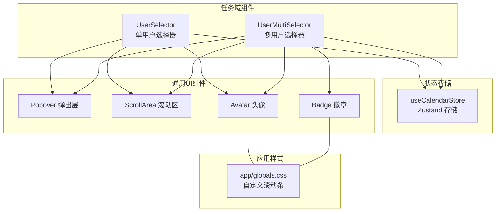
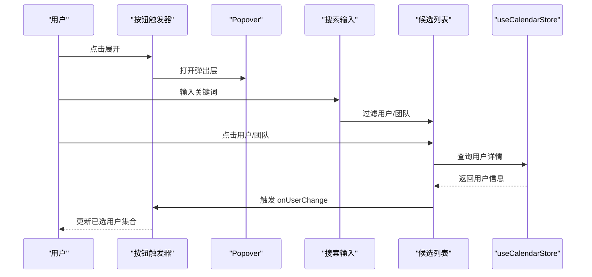
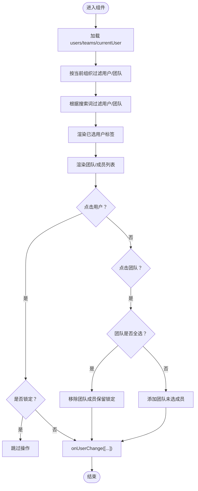
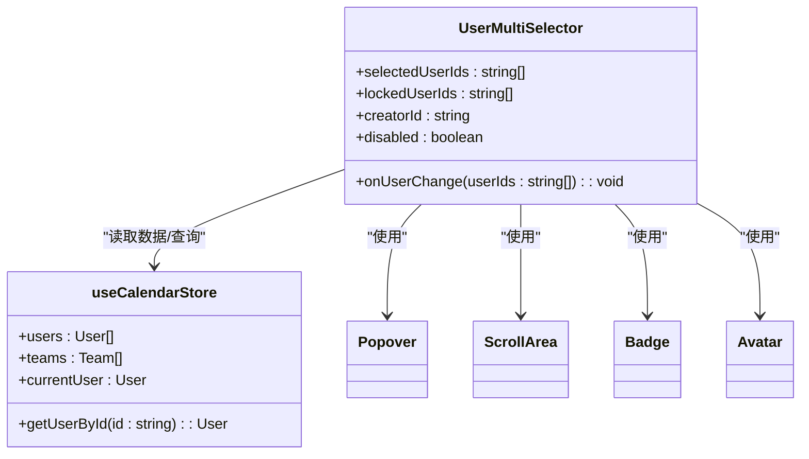

# 多用户选择器

<cite>
**本文档引用的文件**
- [components/task/user-multi-selector.tsx](file://components/task/user-multi-selector.tsx)
- [components/task/user-selector.tsx](file://components/task/user-selector.tsx)
- [lib/store/calendar-store.ts](file://lib/store/calendar-store.ts)
- [components/ui/badge.tsx](file://components/ui/badge.tsx)
- [components/ui/popover.tsx](file://components/ui/popover.tsx)
- [components/ui/scroll-area.tsx](file://components/ui/scroll-area.tsx)
- [components/ui/avatar.tsx](file://components/ui/avatar.tsx)
- [app/globals.css](file://app/globals.css)
- [components/tabs.tsx](file://components/tabs.tsx)
- [components/ui/select.tsx](file://components/ui/select.tsx)
- [components/ui/form.tsx](file://components/ui/form.tsx)
- [components/ui/label.tsx](file://components/ui/label.tsx)
- [components/ui/input.tsx](file://components/ui/input.tsx)
- [components/ui/button.tsx](file://components/ui/button.tsx)
- [components/ui/dialog.tsx](file://components/ui/dialog.tsx)
- [components/ui/separator.tsx](file://components/ui/separator.tsx)
- [components/ui/kbd.tsx](file://components/ui/kbd.tsx)
- [components/ui/tooltip.tsx](file://components/ui/tooltip.tsx)
- [components/ui/toaster.tsx](file://components/ui/toaster.tsx)
- [components/ui/toast.tsx](file://components/ui/toast.tsx)
- [components/ui/alert-dialog.tsx](file://components/ui/alert-dialog.tsx)
- [components/ui/accordion.tsx](file://components/ui/accordion.tsx)
- [components/ui/calendar.tsx](file://components/ui/calendar.tsx)
- [components/ui/table.tsx](file://components/ui/table.tsx)
- [components/ui/pagination.tsx](file://components/ui/pagination.tsx)
- [components/ui/slider.tsx](file://components/ui/slider.tsx)
- [components/ui/switch.tsx](file://components/ui/switch.tsx)
- [components/ui/radio-group.tsx](file://components/ui/radio-group.tsx)
- [components/ui/checkbox.tsx](file://components/ui/checkbox.tsx)
- [components/ui/dropdown-menu.tsx](file://components/ui/dropdown-menu.tsx)
- [components/ui/context-menu.tsx](file://components/ui/context-menu.tsx)
- [components/ui/hover-card.tsx](file://components/ui/hover-card.tsx)
- [components/ui/resizable.tsx](file://components/ui/resizable.tsx)
- [components/ui/empty.tsx](file://components/ui/empty.tsx)
- [components/ui/field.tsx](file://components/ui/field.tsx)
- [components/ui/item.tsx](file://components/ui/item.tsx)
- [components/ui/skeleton.tsx](file://components/ui/skeleton.tsx)
- [components/ui/spinner.tsx](file://components/ui/spinner.tsx)
- [components/ui/sonner.tsx](file://components/ui/sonner.tsx)
- [components/ui/time-picker.tsx](file://components/ui/time-picker.tsx)
- [components/ui/date-range-picker.tsx](file://components/ui/date-range-picker.tsx)
- [components/ui/progress.tsx](file://components/ui/progress.tsx)
- [components/ui/aspect-ratio.tsx](file://components/ui/aspect-ratio.tsx)
- [components/ui/chart.tsx](file://components/ui/chart.tsx)
- [components/ui/carousel.tsx](file://components/ui/carousel.tsx)
- [components/ui/breadcrumb.tsx](file://components/ui/breadcrumb.tsx)
- [components/ui/navigation-menu.tsx](file://components/ui/navigation-menu.tsx)
- [components/ui/menubar.tsx](file://components/ui/menubar.tsx)
- [components/ui/pagination.tsx](file://components/ui/pagination.tsx)
- [components/ui/tabs.tsx](file://components/ui/tabs.tsx)
- [components/ui/textarea.tsx](file://components/ui/textarea.tsx)
- [components/ui/empty.tsx](file://components/ui/empty.tsx)
- [components/ui/field.tsx](file://components/ui/field.tsx)
- [components/ui/item.tsx](file://components/ui/item.tsx)
- [components/ui/skeleton.tsx](file://components/ui/skeleton.tsx)
- [components/ui/spinner.tsx](file://components/ui/spinner.tsx)
- [components/ui/sonner.tsx](file://components/ui/sonner.tsx)
- [components/ui/time-picker.tsx](file://components/ui/time-picker.tsx)
- [components/ui/date-range-picker.tsx](file://components/ui/date-range-picker.tsx)
- [components/ui/progress.tsx](file://components/ui/progress.tsx)
- [components/ui/aspect-ratio.tsx](file://components/ui/aspect-ratio.tsx)
- [components/ui/chart.tsx](file://components/ui/chart.tsx)
- [components/ui/carousel.tsx](file://components/ui/carousel.tsx)
- [components/ui/breadcrumb.tsx](file://components/ui/breadcrumb.tsx)
- [components/ui/navigation-menu.tsx](file://components/ui/navigation-menu.tsx)
- [components/ui/menubar.tsx](file://components/ui/menubar.tsx)
- [components/ui/pagination.tsx](file://components/ui/pagination.tsx)
- [components/ui/tabs.tsx](file://components/ui/tabs.tsx)
- [components/ui/textarea.tsx](file://components/ui/textarea.tsx)
- [components/ui/empty.tsx](file://components/ui/empty.tsx)
- [components/ui/field.tsx](file://components/ui/field.tsx)
- [components/ui/item.tsx](file://components/ui/item.tsx)
- [components/ui/skeleton.tsx](file://components/ui/skeleton.tsx)
- [components/ui/spinner.tsx](file://components/ui/spinner.tsx)
- [components/ui/sonner.tsx](file://components/ui/sonner.tsx)
- [components/ui/time-picker.tsx](file://components/ui/time-picker.tsx)
- [components/ui/date-range-picker.tsx](file://components/ui/date-range-picker.tsx)
- [components/ui/progress.tsx](file://components/ui/progress.tsx)
- [components/ui/aspect-ratio.tsx](file://components/ui/aspect-ratio.tsx)
- [components/ui/chart.tsx](file://components/ui/chart.tsx)
- [components/ui/carousel.tsx](file://components/ui/carousel.tsx)
- [components/ui/breadcrumb.tsx](file://components/ui/breadcrumb.tsx)
- [components/ui/navigation-menu.tsx](file://components/ui/navigation-menu.tsx)
- [components/ui/menubar.tsx](file://components/ui/menubar.tsx)
- [components/ui/pagination.tsx](file://components/ui/pagination.tsx)
- [components/ui/tabs.tsx](file://components/ui/tabs.tsx)
- [components/ui/textarea.tsx](file://components/ui/textarea.tsx)
- [components/ui/empty.tsx](file://components/ui/empty.tsx)
- [components/ui/field.tsx](file://components/ui/field.tsx)
- [components/ui/item.tsx](file://components/ui/item.tsx)
- [components/ui/skeleton.tsx](file://components/ui/skeleton.tsx)
- [components/ui/spinner.tsx](file://components/ui/spinner.tsx)
- [components/ui/sonner.tsx](file://components/ui/sonner.tsx)
- [components/ui/time-picker.tsx](file://components/ui/time-picker.tsx)
- [components/ui/date-range-picker.tsx](file://components/ui/date-range-picker.tsx)
- [components/ui/progress.tsx](file://components/ui/progress.tsx)
- [components/ui/aspect-ratio.tsx](file://components/ui/aspect-ratio.tsx)
- [components/ui/chart.tsx](file://components/ui/chart.tsx)
- [components/ui/carousel.tsx](file://components/ui/carousel.tsx)
- [components/ui/breadcrumb.tsx](file://components/ui/breadcrumb.tsx)
- [components/ui/navigation-menu.tsx](file://components/ui/navigation-menu.tsx)
- [components/ui/menubar.tsx](file://components/ui/menubar.tsx)
- [components/ui/pagination.tsx](file://components/ui/pagination.tsx)
- [components/ui/tabs.tsx](file://components/ui/tabs.tsx)
- [components/ui/textarea.tsx](file://components/ui/textarea.tsx)
- [components/ui/empty.tsx](file://components/ui/empty.tsx)
- [components/ui/field.tsx](file://components/ui/field.tsx)
- [components/ui/item.tsx](file://components/ui/item.tsx)
- [components/ui/skeleton.tsx](file://components/ui/skeleton.tsx)
- [components/ui/spinner.tsx](file://components/ui/spinner.tsx)
- [components/ui/sonner.tsx](file://components/ui/sonner.tsx)
- [components/ui/time-picker.tsx](file://components/ui/time-picker.tsx)
- [components/ui/date-range-picker.tsx](file://components/ui/date-range-picker.tsx)
- [components/ui/progress.tsx](file://components/ui/progress.tsx)
- [components/ui/aspect-ratio.tsx](file://components/ui/aspect-ratio.tsx)
- [components/ui/chart.tsx](file://components/ui/chart.tsx)
- [components/ui/carousel.tsx](file://components/ui/carousel.tsx)
- [components/ui/breadcrumb.tsx](file://components/ui/breadcrumb.tsx)
- [components/ui/navigation-menu.tsx](file://components/ui/navigation-menu.tsx)
- [components/ui/menubar.tsx](file://components/ui/menubar.tsx)
- [components/ui/pagination.tsx](file://components/ui/pagination.tsx)
- [components/ui/tabs.tsx](file://components/ui/tabs.tsx)
- [components/ui/textarea.tsx](file://components/ui/textarea.tsx)
- [components/ui/empty.tsx](file://components/ui/empty.tsx)
- [components/ui/field.tsx](file://components/ui/field.tsx)
- [components/ui/item.tsx](file://components/ui/item.tsx)
- [components/ui/skeleton.tsx](file://components/ui/skeleton.tsx)
- [components/ui/spinner.tsx](file://components/ui/spinner.tsx)
- [components/ui/sonner.tsx](file://components/ui/sonner.tsx)
- [components/ui/time-picker.tsx](file://components/ui/time-picker.tsx)
- [components/ui/date-range-picker.tsx](file://components/ui/date-range-picker.tsx)
- [components/ui/progress.tsx](file://components/ui/progress.tsx)
- [components/ui/aspect-ratio.tsx](file://components/ui/aspect-ratio.tsx)
- [components/ui/chart.tsx](file://components/ui/chart.tsx)
- [components/ui/carousel.tsx](file://components/ui/carousel.tsx)
- [components/ui/breadcrumb.tsx](file://components/ui/breadcrumb.tsx)
- [components/ui/navigation-menu.tsx](file://components/ui/navigation-menu.tsx)
- [components/ui/menubar.tsx](file://components/ui/menubar.tsx)
- [components/ui/pagination.tsx](file://components/ui/pagination.tsx)
- [components/ui/tabs.tsx](file://components/ui/tabs.tsx)
- [components/ui/textarea.tsx](file://components/ui/textarea.tsx)
- [components/ui/empty.tsx](file://components/ui/empty.tsx)
- [components/ui/field.tsx](file://components/ui/field.tsx)
- [components/ui/item.tsx](file://components/ui/item.tsx)
- [components/ui/skeleton.tsx](file://components/ui/skeleton.tsx)
......
</cite>

## 目录
1. [简介](#简介)
2. [项目结构](#项目结构)
3. [核心组件](#核心组件)
4. [架构总览](#架构总览)
5. [详细组件分析](#详细组件分析)
6. [依赖关系分析](#依赖关系分析)
7. [性能考虑](#性能考虑)
8. [故障排查指南](#故障排查指南)
9. [结论](#结论)
10. [附录](#附录)

## 简介
本文件为“多用户选择器”组件的全面技术文档，覆盖批量用户选择的实现机制、多选逻辑与状态管理、去重策略、已选用户的标签化展示与移除、搜索与候选列表、用户添加流程、列表渲染优化（虚拟滚动与懒加载）、数据绑定与状态同步、表单验证、组件交互与无障碍支持等。目标是帮助开发者快速理解并正确集成与扩展该组件。

## 项目结构
多用户选择器位于任务域组件目录中，依赖全局状态存储与通用UI组件库，采用组合式弹出面板（Popover）承载搜索与候选列表，并通过标签化徽章展示已选用户。

**图表来源**
- [components/task/user-multi-selector.tsx](file://components/task/user-multi-selector.tsx#L1-L290)
- [components/task/user-selector.tsx](file://components/task/user-selector.tsx#L1-L147)
- [lib/store/calendar-store.ts](file://lib/store/calendar-store.ts#L1-L200)
- [components/ui/popover.tsx](file://components/ui/popover.tsx#L1-L49)
- [components/ui/scroll-area.tsx](file://components/ui/scroll-area.tsx#L1-L59)
- [components/ui/badge.tsx](file://components/ui/badge.tsx#L1-L47)
- [components/ui/avatar.tsx](file://components/ui/avatar.tsx#L1-L53)
- [app/globals.css](file://app/globals.css#L190-L212)

**章节来源**
- [components/task/user-multi-selector.tsx](file://components/task/user-multi-selector.tsx#L1-L290)
- [components/task/user-selector.tsx](file://components/task/user-selector.tsx#L1-L147)
- [lib/store/calendar-store.ts](file://lib/store/calendar-store.ts#L1-L200)
- [components/ui/popover.tsx](file://components/ui/popover.tsx#L1-L49)
- [components/ui/scroll-area.tsx](file://components/ui/scroll-area.tsx#L1-L59)
- [components/ui/badge.tsx](file://components/ui/badge.tsx#L1-L47)
- [components/ui/avatar.tsx](file://components/ui/avatar.tsx#L1-L53)
- [app/globals.css](file://app/globals.css#L190-L212)

## 核心组件
- 多用户选择器（UserMultiSelector）
  - 支持批量选择用户与团队，展示已选用户为标签，支持移除与锁定不可移除用户。
  - 提供搜索过滤、团队/成员双列展示、全选/反选团队成员。
  - 通过回调 onUserChange 实现数据绑定与状态同步。
- 单用户选择器（UserSelector）
  - 用于单一用户选择，提供搜索与候选列表，适合表单字段场景。
- 状态存储（useCalendarStore）
  - 统一管理 users、teams、currentUser 等数据，提供 getUserById 等查询方法。
- UI 基础组件
  - Popover、ScrollArea、Badge、Avatar 等，支撑交互与视觉呈现。

**章节来源**
- [components/task/user-multi-selector.tsx](file://components/task/user-multi-selector.tsx#L18-L24)
- [components/task/user-selector.tsx](file://components/task/user-selector.tsx#L18-L23)
- [lib/store/calendar-store.ts](file://lib/store/calendar-store.ts#L33-L198)
- [components/ui/popover.tsx](file://components/ui/popover.tsx#L1-L49)
- [components/ui/scroll-area.tsx](file://components/ui/scroll-area.tsx#L1-L59)
- [components/ui/badge.tsx](file://components/ui/badge.tsx#L1-L47)
- [components/ui/avatar.tsx](file://components/ui/avatar.tsx#L1-L53)

## 架构总览
多用户选择器采用“组件内状态 + 全局状态”的混合架构：
- 组件内部维护 open、searchQuery 等本地状态，控制弹出层与搜索输入。
- 使用 useCalendarStore 获取 users、teams、currentUser 并进行过滤与查询。
- 通过 props.onUserChange 将变更通知父组件，实现双向数据绑定。
- UI 层由 Popover 承载内容，ScrollArea 提供滚动体验，Badge/Avatar 负责展示。

**图表来源**
- [components/task/user-multi-selector.tsx](file://components/task/user-multi-selector.tsx#L26-L108)
- [components/task/user-selector.tsx](file://components/task/user-selector.tsx#L25-L56)
- [lib/store/calendar-store.ts](file://lib/store/calendar-store.ts#L197-L197)

## 详细组件分析

### 多用户选择器（UserMultiSelector）
- 多选逻辑与去重
  - 通过 toggleUser/toggleTeam 切换选中状态；当用户已在已选集合中时，若非锁定则移除；否则追加到集合。
  - 团队全选/反选：若团队成员全部被选中则全部移除（保留锁定项），否则将未选成员加入集合。
  - 由于使用数组去重策略，实际去重由调用方确保唯一性；组件内部不重复校验，避免重复渲染与状态抖动。
- 选择状态管理
  - selectedUserIds 作为受控属性，onUserChange 回调负责同步父组件状态。
  - lockedUserIds 用于标记不可移除的用户，移除按钮在锁定状态下隐藏。
  - creatorId 用于在标签中标识创建者。
- 已选用户展示
  - 使用 Badge + Avatar 展示每个已选用户，支持点击移除（非锁定且非禁用）。
  - 标签容器支持自动换行与滚动，避免溢出。
- 搜索与候选列表
  - 搜索词同时匹配用户姓名与用户名；团队按名称匹配。
  - 双列布局：左侧团队列表，右侧成员列表；团队项显示成员数量与选中状态指示。
- 数据绑定与状态同步
  - 组件不直接写入全局状态，仅通过 onUserChange 通知父组件；父组件负责持久化与联动。
- 表单验证与禁用
  - disabled 控制整体交互；可结合业务规则在父组件进行必填/数量限制等校验。
- 无障碍与键盘支持
  - 移除按钮支持 Enter/Space 键触发移除，提升键盘可达性。
  - Popover 触发器具备 role="combobox" 与 aria-expanded 状态，便于屏幕阅读器识别。

**图表来源**
- [components/task/user-multi-selector.tsx](file://components/task/user-multi-selector.tsx#L26-L108)

**章节来源**
- [components/task/user-multi-selector.tsx](file://components/task/user-multi-selector.tsx#L18-L290)
- [lib/store/calendar-store.ts](file://lib/store/calendar-store.ts#L33-L198)

### 单用户选择器（UserSelector）
- 功能定位
  - 适用于单一用户选择的场景，如负责人、执行人等。
- 搜索与过滤
  - 搜索词匹配姓名与用户名；支持 filterUserIds 限定候选集。
- 交互与回显
  - 选中用户以头像+名称展示；关闭弹出层时重置搜索词。
- 禁用与只读
  - disabled 控制交互；可配合父组件进行只读场景。

**章节来源**
- [components/task/user-selector.tsx](file://components/task/user-selector.tsx#L18-L147)
- [lib/store/calendar-store.ts](file://lib/store/calendar-store.ts#L197-L197)

### UI 组件与样式支持
- Popover
  - 提供弹出层容器与触发器，支持 onOpenChange 与 modal=false 的非模态交互。
- ScrollArea
  - 提供垂直滚动区域，内置滚动条与角落，适配长列表。
- Badge
  - 标签化展示已选用户，支持变体与尺寸。
- Avatar
  - 头像占位与 fallback 文字，支持图片加载与降级。
- 自定义滚动条
  - 在全局样式中定义自定义滚动条外观，提升视觉一致性。

**章节来源**
- [components/ui/popover.tsx](file://components/ui/popover.tsx#L1-L49)
- [components/ui/scroll-area.tsx](file://components/ui/scroll-area.tsx#L1-L59)
- [components/ui/badge.tsx](file://components/ui/badge.tsx#L1-L47)
- [components/ui/avatar.tsx](file://components/ui/avatar.tsx#L1-L53)
- [app/globals.css](file://app/globals.css#L194-L211)

## 依赖关系分析
- 组件依赖
  - UserMultiSelector 依赖 useCalendarStore 的 users、teams、currentUser、getUserById。
  - 依赖 UI 组件 Popover、ScrollArea、Badge、Avatar。
- 状态耦合
  - 组件与全局状态解耦：组件仅读取数据并回调更新，避免直接修改全局状态。
- 外部依赖
  - Zustand 用于状态管理；Radix UI 用于无障碍弹出层；Lucide React 图标库。

**图表来源**
- [components/task/user-multi-selector.tsx](file://components/task/user-multi-selector.tsx#L26-L290)
- [lib/store/calendar-store.ts](file://lib/store/calendar-store.ts#L33-L198)
- [components/ui/popover.tsx](file://components/ui/popover.tsx#L1-L49)
- [components/ui/scroll-area.tsx](file://components/ui/scroll-area.tsx#L1-L59)
- [components/ui/badge.tsx](file://components/ui/badge.tsx#L1-L47)
- [components/ui/avatar.tsx](file://components/ui/avatar.tsx#L1-L53)

**章节来源**
- [components/task/user-multi-selector.tsx](file://components/task/user-multi-selector.tsx#L26-L290)
- [lib/store/calendar-store.ts](file://lib/store/calendar-store.ts#L33-L198)

## 性能考虑
- 列表渲染优化
  - 使用 ScrollArea 提供虚拟滚动体验，避免超大列表导致的重排与卡顿。
  - 对于极大数据集，建议引入虚拟列表方案（例如 react-window 或类似库）以进一步降低 DOM 节点数量。
- 搜索与过滤
  - 组件内对 users/teams 进行内存过滤，复杂度为 O(n)；建议在父组件或服务端侧做分页与索引优化。
- 去重与状态更新
  - 组件内部不强制去重，避免重复计算；建议调用方保证 selectedUserIds 的唯一性，减少不必要的渲染。
- 渲染节流
  - 搜索输入可增加防抖策略（在父组件层实现），降低频繁过滤带来的性能压力。
- 内存管理
  - 关闭弹出层时重置搜索词，避免残留状态影响后续渲染。
- 惰性加载
  - 用户与团队数据建议通过 useCalendarStore 的异步加载接口按需拉取，避免一次性加载全部数据。

[本节为通用性能建议，不直接分析具体文件]

## 故障排查指南
- 已选用户无法移除
  - 检查 lockedUserIds 是否包含该用户；锁定用户不会显示移除按钮。
- 搜索无结果
  - 确认搜索词是否为空；确认 users/teams 数据是否已加载。
- 团队全选/反选异常
  - 确认 teams 中的 memberIds 是否正确；检查 lockedUserIds 是否影响了最终集合。
- 禁用状态无效
  - 确认 disabled 属性传递路径；Popover 的 onOpenChange 会在禁用时直接返回。
- 无障碍问题
  - 移除按钮需支持键盘触发（Enter/Space）；确保 Popover 触发器具备 role 与 aria-expanded。

**章节来源**
- [components/task/user-multi-selector.tsx](file://components/task/user-multi-selector.tsx#L93-L108)
- [components/task/user-selector.tsx](file://components/task/user-selector.tsx#L50-L56)

## 结论
多用户选择器通过清晰的职责分离与通用 UI 组件，实现了高效、可扩展的批量用户选择能力。其核心优势在于：
- 明确的数据绑定与状态同步机制；
- 灵活的搜索与过滤策略；
- 友好的标签化展示与无障碍支持；
- 与全局状态解耦，便于在不同业务场景复用。

建议在生产环境中结合虚拟滚动、防抖与惰性加载等优化手段，进一步提升大规模数据下的交互性能与稳定性。

[本节为总结性内容，不直接分析具体文件]

## 附录

### 组件属性与事件
- UserMultiSelector
  - selectedUserIds: string[]（已选用户ID列表）
  - onUserChange(userIds: string[]): void（选择变化回调）
  - lockedUserIds?: string[]（不可移除用户ID列表）
  - creatorId?: string（创建者ID，用于标签标识）
  - disabled?: boolean（禁用状态）

- UserSelector
  - selectedUserId: string（已选用户ID）
  - onUserChange(userId: string): void（选择变化回调）
  - filterUserIds?: string[]（候选用户ID过滤）
  - disabled?: boolean（禁用状态）

**章节来源**
- [components/task/user-multi-selector.tsx](file://components/task/user-multi-selector.tsx#L18-L24)
- [components/task/user-selector.tsx](file://components/task/user-selector.tsx#L18-L23)

### 交互行为与用户体验
- 搜索输入
  - 支持清空按钮；关闭弹出层时自动清空搜索词。
- 候选列表
  - 用户与团队分别展示；团队项显示成员数量与选中状态（全选/部分选中）。
- 标签化展示
  - 已选用户以徽章形式展示，带头像与移除按钮；锁定用户不显示移除按钮。
- 键盘可达性
  - 支持键盘触发移除；弹出层具备 aria-expanded 状态。

**章节来源**
- [components/task/user-multi-selector.tsx](file://components/task/user-multi-selector.tsx#L102-L108)
- [components/task/user-selector.tsx](file://components/task/user-selector.tsx#L50-L56)

### 无障碍访问支持
- 角色与状态
  - Popover 触发器具备 role="combobox" 与 aria-expanded。
- 键盘操作
  - 移除按钮支持 Enter/Space 键触发。
- 屏幕阅读器友好
  - 标签与按钮具备语义化文本与状态提示。

**章节来源**
- [components/task/user-multi-selector.tsx](file://components/task/user-multi-selector.tsx#L115-L117)
- [components/task/user-multi-selector.tsx](file://components/task/user-multi-selector.tsx#L143-L147)