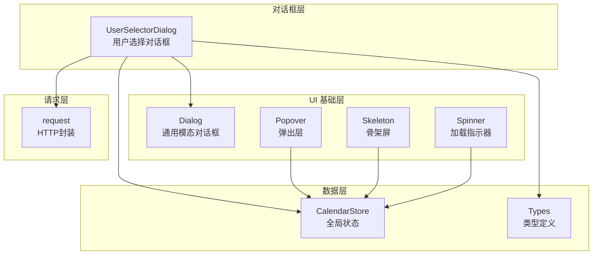
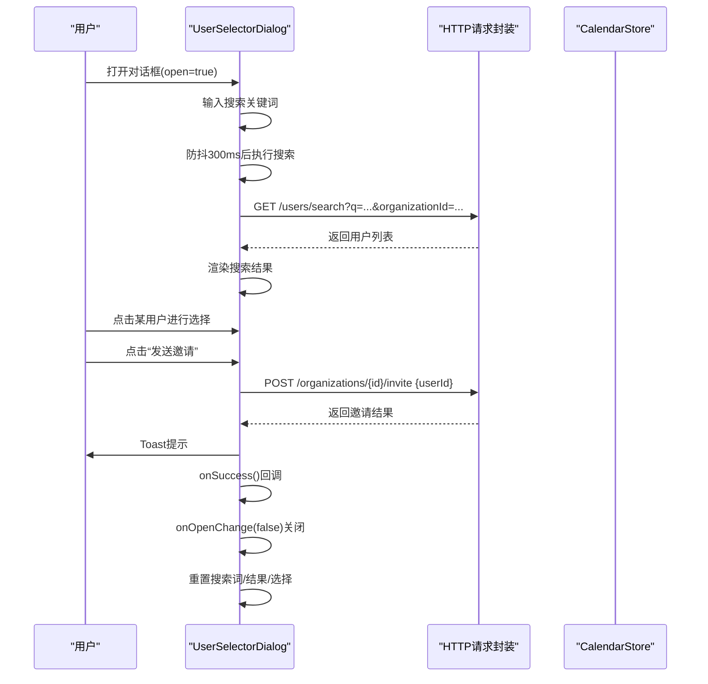
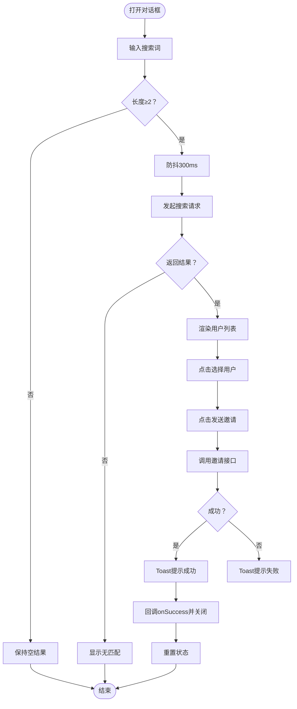
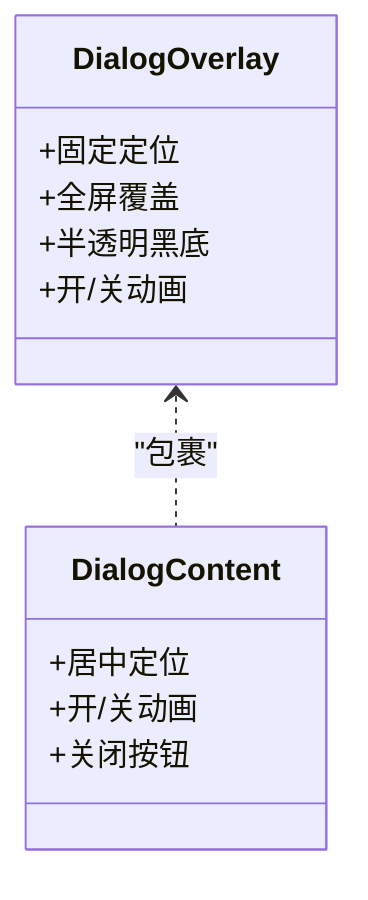
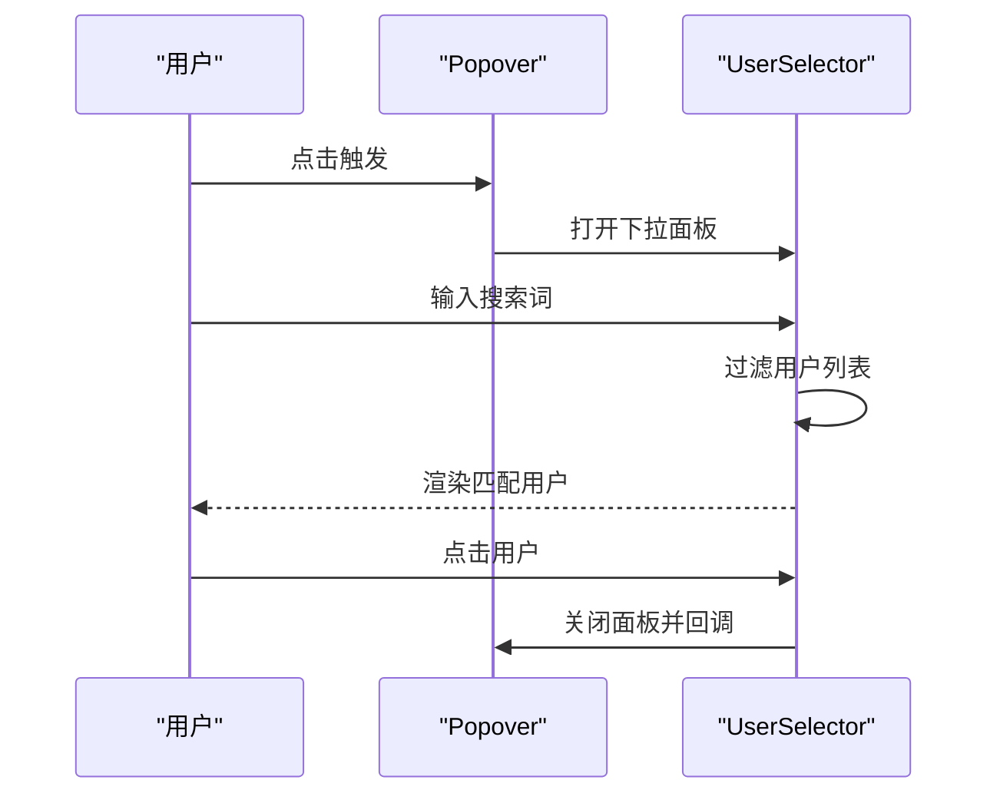
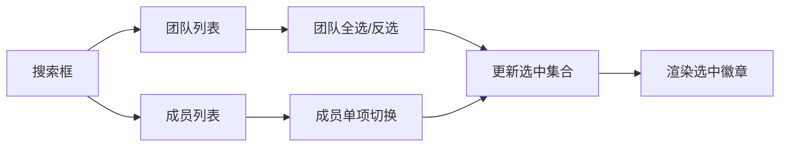
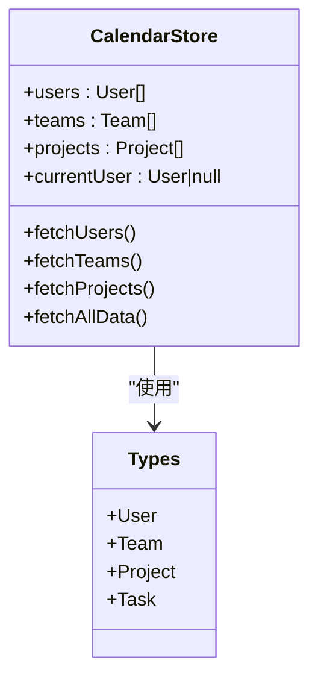
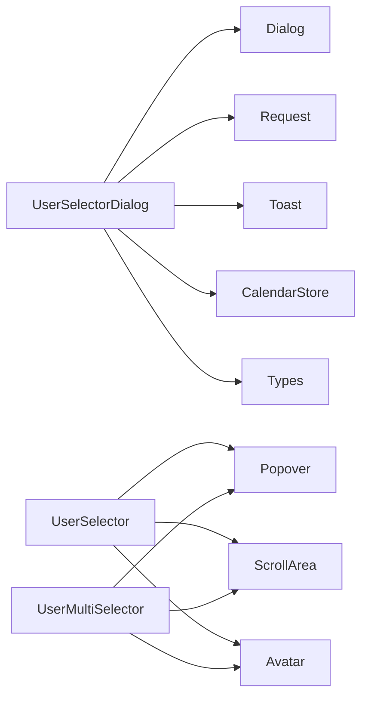

# 用户选择对话框

<cite>
**本文引用的文件**
- [components/user-selector-dialog.tsx](file://components/user-selector-dialog.tsx)
- [components/ui/dialog.tsx](file://components/ui/dialog.tsx)
- [components/task/user-selector.tsx](file://components/task/user-selector.tsx)
- [components/task/user-multi-selector.tsx](file://components/task/user-multi-selector.tsx)
- [lib/store/calendar-store.ts](file://lib/store/calendar-store.ts)
- [lib/types.ts](file://lib/types.ts)
- [lib/request.ts](file://lib/request.ts)
- [components/ui/popover.tsx](file://components/ui/popover.tsx)
- [components/ui/skeleton.tsx](file://components/ui/skeleton.tsx)
- [components/ui/spinner.tsx](file://components/ui/spinner.tsx)
- [hooks/use-loading-delay.ts](file://hooks/use-loading-delay.ts)
- [styles/globals.css](file://styles/globals.css)
- [app/layout.tsx](file://app/layout.tsx)
</cite>

## 目录
1. [简介](#简介)
2. [项目结构](#项目结构)
3. [核心组件](#核心组件)
4. [架构总览](#架构总览)
5. [详细组件分析](#详细组件分析)
6. [依赖关系分析](#依赖关系分析)
7. [性能考量](#性能考量)
8. [故障排查指南](#故障排查指南)
9. [结论](#结论)
10. [附录](#附录)

## 简介
本技术文档围绕“用户选择对话框”组件展开，重点覆盖以下方面：
- 模态对话框实现与交互：打开/关闭动画、背景遮罩、键盘交互
- 搜索与筛选：实时搜索、条件筛选、结果排序
- 分页与加载：无限滚动、懒加载、数据缓存策略
- 列表渲染优化：虚拟滚动、占位符、加载状态
- 对话框布局设计：响应式适配、尺寸控制、定位算法
- 用户选择确认/取消与回调处理
- 组件集成方式、样式定制、国际化支持

## 项目结构
本项目采用基于功能域的组件组织方式，用户选择相关能力分布在以下模块：
- 对话框层：用户选择对话框组件
- UI 基础层：通用对话框、弹出层、骨架屏、加载指示器
- 数据层：全局状态管理与类型定义
- 请求层：HTTP 请求封装

**图表来源**
- [components/user-selector-dialog.tsx](file://components/user-selector-dialog.tsx#L1-L222)
- [components/ui/dialog.tsx](file://components/ui/dialog.tsx#L1-L144)
- [components/ui/popover.tsx](file://components/ui/popover.tsx#L1-L49)
- [components/ui/skeleton.tsx](file://components/ui/skeleton.tsx#L1-L13)
- [components/ui/spinner.tsx](file://components/ui/spinner.tsx#L1-L16)
- [lib/store/calendar-store.ts](file://lib/store/calendar-store.ts#L1-L800)
- [lib/types.ts](file://lib/types.ts#L1-L141)
- [lib/request.ts](file://lib/request.ts#L1-L200)

**章节来源**
- [components/user-selector-dialog.tsx](file://components/user-selector-dialog.tsx#L1-L222)
- [components/ui/dialog.tsx](file://components/ui/dialog.tsx#L1-L144)
- [components/ui/popover.tsx](file://components/ui/popover.tsx#L1-L49)
- [lib/store/calendar-store.ts](file://lib/store/calendar-store.ts#L1-L800)
- [lib/types.ts](file://lib/types.ts#L1-L141)

## 核心组件
- 用户选择对话框：提供组织内用户搜索、邀请发送、确认/取消流程
- 通用对话框：提供开启动画、遮罩、居中定位、关闭按钮
- 弹出层：用于用户选择器（单选/多选）的下拉面板
- 骨架屏与加载指示器：提升列表渲染体验与感知性能
- 全局状态：统一管理用户、团队、项目等数据与视图状态

**章节来源**
- [components/user-selector-dialog.tsx](file://components/user-selector-dialog.tsx#L1-L222)
- [components/ui/dialog.tsx](file://components/ui/dialog.tsx#L1-L144)
- [components/ui/popover.tsx](file://components/ui/popover.tsx#L1-L49)
- [components/ui/skeleton.tsx](file://components/ui/skeleton.tsx#L1-L13)
- [components/ui/spinner.tsx](file://components/ui/spinner.tsx#L1-L16)
- [lib/store/calendar-store.ts](file://lib/store/calendar-store.ts#L1-L800)

## 架构总览
用户选择对话框的调用链路如下：
- 触发：外部组件通过 open/onOpenChange 控制对话框显隐
- 搜索：输入触发防抖搜索，调用请求封装发起 API 查询
- 结果展示：列表渲染用户卡片，支持点击选择
- 邀请：确认后调用邀请接口，成功后回调 onSuccess 并重置状态
- 关闭：取消或成功后关闭对话框并清理本地状态

**图表来源**
- [components/user-selector-dialog.tsx](file://components/user-selector-dialog.tsx#L49-L111)
- [lib/request.ts](file://lib/request.ts#L1-L200)
- [lib/store/calendar-store.ts](file://lib/store/calendar-store.ts#L388-L412)

**章节来源**
- [components/user-selector-dialog.tsx](file://components/user-selector-dialog.tsx#L35-L111)
- [lib/request.ts](file://lib/request.ts#L1-L200)
- [lib/store/calendar-store.ts](file://lib/store/calendar-store.ts#L388-L412)

## 详细组件分析

### 用户选择对话框（模态）
- 功能要点
  - 搜索：输入≥2字符触发搜索；300ms 防抖；加载态显示旋转图标
  - 选择：点击用户卡片高亮；支持再次点击取消选择
  - 邀请：点击发送邀请，调用组织邀请接口；成功后回调 onSuccess 并关闭对话框
  - 关闭：取消按钮清空状态并关闭；支持键盘 ESC（由通用对话框提供）
- 动画与遮罩
  - 通用对话框提供开/关动画与背景遮罩，居中定位
- 错误处理
  - 搜索失败与邀请失败均通过 Toast 提示

**图表来源**
- [components/user-selector-dialog.tsx](file://components/user-selector-dialog.tsx#L49-L111)
- [components/ui/dialog.tsx](file://components/ui/dialog.tsx#L33-L81)

**章节来源**
- [components/user-selector-dialog.tsx](file://components/user-selector-dialog.tsx#L35-L222)
- [components/ui/dialog.tsx](file://components/ui/dialog.tsx#L1-L144)

### 通用对话框（动画与遮罩）
- 动画：开/关均有淡入/淡出与缩放过渡
- 遮罩：固定定位、全屏覆盖、半透明黑底
- 定位：绝对定位于视口中心，支持关闭按钮
- 键盘交互：由底层库提供，支持 ESC 关闭

**图表来源**
- [components/ui/dialog.tsx](file://components/ui/dialog.tsx#L33-L81)

**章节来源**
- [components/ui/dialog.tsx](file://components/ui/dialog.tsx#L1-L144)

### 单选用户选择器（弹出层）
- 功能要点
  - 搜索：输入关键字过滤用户（支持姓名/用户名）
  - 选择：点击用户项完成选择并关闭面板
  - 禁用：支持禁用状态
- 布局与交互
  - 弹出层宽度固定，垂直滚动区域
  - 搜索框支持清空

**图表来源**
- [components/task/user-selector.tsx](file://components/task/user-selector.tsx#L58-L146)
- [components/ui/popover.tsx](file://components/ui/popover.tsx#L1-L49)

**章节来源**
- [components/task/user-selector.tsx](file://components/task/user-selector.tsx#L1-L147)
- [components/ui/popover.tsx](file://components/ui/popover.tsx#L1-L49)

### 多选用户选择器（弹出层）
- 功能要点
  - 双栏布局：左侧团队、右侧成员
  - 搜索：同时对团队与成员进行过滤
  - 选择：支持单个用户切换、团队全选/反选；支持锁定不可移除用户
  - 锁定：部分用户不可移除，防止误删
- 布局与交互
  - 弹出层宽度较大，双栏等宽；垂直滚动区域

**图表来源**
- [components/task/user-multi-selector.tsx](file://components/task/user-multi-selector.tsx#L18-L290)
- [components/ui/popover.tsx](file://components/ui/popover.tsx#L1-L49)

**章节来源**
- [components/task/user-multi-selector.tsx](file://components/task/user-multi-selector.tsx#L1-L290)
- [components/ui/popover.tsx](file://components/ui/popover.tsx#L1-L49)

### 全局状态与类型
- 状态管理：用户、团队、项目、当前用户等数据集中管理
- 类型定义：User、Team、Project、Task 等核心类型
- 数据加载：统一的数据加载动作与最小加载时长保障

**图表来源**
- [lib/store/calendar-store.ts](file://lib/store/calendar-store.ts#L33-L198)
- [lib/types.ts](file://lib/types.ts#L108-L120)

**章节来源**
- [lib/store/calendar-store.ts](file://lib/store/calendar-store.ts#L1-L800)
- [lib/types.ts](file://lib/types.ts#L1-L141)

## 依赖关系分析
- 组件耦合
  - UserSelectorDialog 依赖通用对话框、请求封装、Toast
  - 用户选择器依赖弹出层、滚动区域、Avatar
- 外部依赖
  - Radix UI 提供对话框/弹出层基础能力
  - Tailwind CSS 提供样式与动画类
  - Next.js App Router 提供路由与静态资源

**图表来源**
- [components/user-selector-dialog.tsx](file://components/user-selector-dialog.tsx#L1-L222)
- [components/ui/dialog.tsx](file://components/ui/dialog.tsx#L1-L144)
- [components/ui/popover.tsx](file://components/ui/popover.tsx#L1-L49)
- [lib/request.ts](file://lib/request.ts#L1-L200)
- [lib/store/calendar-store.ts](file://lib/store/calendar-store.ts#L1-L800)
- [lib/types.ts](file://lib/types.ts#L1-L141)

**章节来源**
- [components/user-selector-dialog.tsx](file://components/user-selector-dialog.tsx#L1-L222)
- [components/ui/dialog.tsx](file://components/ui/dialog.tsx#L1-L144)
- [components/ui/popover.tsx](file://components/ui/popover.tsx#L1-L49)
- [lib/request.ts](file://lib/request.ts#L1-L200)
- [lib/store/calendar-store.ts](file://lib/store/calendar-store.ts#L1-L800)
- [lib/types.ts](file://lib/types.ts#L1-L141)

## 性能考量
- 搜索防抖
  - 对话框搜索使用 300ms 防抖，降低频繁请求
- 最小加载时长
  - 数据加载使用最小时长保障，避免闪烁
- 列表渲染
  - 使用滚动区域承载长列表，避免整页滚动
- 图标与动画
  - 使用矢量图标与 CSS 动画，保证流畅度

**章节来源**
- [components/user-selector-dialog.tsx](file://components/user-selector-dialog.tsx#L49-L78)
- [hooks/use-loading-delay.ts](file://hooks/use-loading-delay.ts#L1-L27)
- [components/ui/dialog.tsx](file://components/ui/dialog.tsx#L33-L81)

## 故障排查指南
- 搜索无结果
  - 确认关键词长度≥2；检查网络请求是否成功；查看 Toast 错误提示
- 邀请失败
  - 检查用户权限与组织状态；查看 Toast 错误提示
- 列表不更新
  - 确认全局状态是否刷新；必要时手动触发数据刷新
- 动画异常
  - 检查 Tailwind 动画类是否正确引入；确认根布局样式

**章节来源**
- [components/user-selector-dialog.tsx](file://components/user-selector-dialog.tsx#L64-L111)
- [app/layout.tsx](file://app/layout.tsx#L25-L44)
- [styles/globals.css](file://styles/globals.css#L1-L126)

## 结论
用户选择对话框组件以通用对话框为基础，结合搜索防抖、状态管理与请求封装，实现了完整的用户选择与邀请流程。组件在交互、动画、布局与错误处理方面具备良好一致性，适合在多场景中复用。后续可在大数据量场景下引入虚拟滚动与分页加载进一步优化性能。

## 附录

### 对话框布局设计
- 响应式适配
  - 使用相对宽度与最大宽度约束，保证在不同屏幕下的可读性
- 尺寸控制
  - 内容区最大宽度与高度限制，避免过大遮挡
- 定位算法
  - 绝对定位 + translate(-50%, -50%) 实现水平垂直居中

**章节来源**
- [components/ui/dialog.tsx](file://components/ui/dialog.tsx#L49-L81)

### 用户列表渲染优化
- 虚拟滚动
  - 在超大列表场景建议引入虚拟滚动库以减少 DOM 节点
- 占位符
  - 使用骨架屏组件提升加载感知
- 加载状态
  - 通过最小加载时长与旋转指示器改善用户体验

**章节来源**
- [components/ui/skeleton.tsx](file://components/ui/skeleton.tsx#L1-L13)
- [components/ui/spinner.tsx](file://components/ui/spinner.tsx#L1-L16)
- [hooks/use-loading-delay.ts](file://hooks/use-loading-delay.ts#L1-L27)

### 组件集成方式
- 对话框
  - 通过 open/onOpenChange 控制显隐；onSuccess 回调处理成功逻辑
- 选择器
  - 通过 onUserChange 或 onUserChange 接收选中结果；支持禁用与锁定用户

**章节来源**
- [components/user-selector-dialog.tsx](file://components/user-selector-dialog.tsx#L27-L41)
- [components/task/user-selector.tsx](file://components/task/user-selector.tsx#L18-L23)
- [components/task/user-multi-selector.tsx](file://components/task/user-multi-selector.tsx#L18-L24)

### 样式定制
- Tailwind 类
  - 通过类名组合实现尺寸、间距、颜色与动画的灵活定制
- 全局样式
  - 根变量与暗色主题支持，便于整体风格统一

**章节来源**
- [styles/globals.css](file://styles/globals.css#L1-L126)

### 国际化支持
- 文案
  - 组件内部文案为中文；如需国际化，建议将文案提取为 i18n 资源并在组件中引用
- 无障碍
  - 对话框与按钮提供语义化标签与键盘交互支持

**章节来源**
- [components/user-selector-dialog.tsx](file://components/user-selector-dialog.tsx#L116-L121)
- [components/ui/dialog.tsx](file://components/ui/dialog.tsx#L69-L77)