# 用户选择组件

<cite>
**本文档引用的文件**
- [components/task/user-selector.tsx](file://components/task/user-selector.tsx)
- [components/task/user-multi-selector.tsx](file://components/task/user-multi-selector.tsx)
- [components/user-selector-dialog.tsx](file://components/user-selector-dialog.tsx)
- [app/api/users/search/route.ts](file://app/api/users/search/route.ts)
- [app/api/users/route.ts](file://app/api/users/route.ts)
- [lib/store/calendar-store.ts](file://lib/store/calendar-store.ts)
- [lib/types.ts](file://lib/types.ts)
- [lib/utils.ts](file://lib/utils.ts)
- [lib/api-client.ts](file://lib/api-client.ts)
- [lib/utils/permission-utils.ts](file://lib/utils/permission-utils.ts)
- [components/tabs.tsx](file://components/ui/tabs.tsx)
- [components/ui/select.tsx](file://components/ui/select.tsx)
- [components/ui/dialog.tsx](file://components/ui/dialog.tsx)
- [components/ui/popover.tsx](file://components/ui/popover.tsx)
- [components/ui/scroll-area.tsx](file://components/ui/scroll-area.tsx)
- [components/ui/avatar.tsx](file://components/ui/avatar.tsx)
- [components/ui/badge.tsx](file://components/ui/badge.tsx)
- [components/ui/button.tsx](file://components/ui/button.tsx)
- [components/ui/input.tsx](file://components/ui/input.tsx)
</cite>

## 目录
1. [简介](#简介)
2. [项目结构](#项目结构)
3. [核心组件](#核心组件)
4. [架构概览](#架构概览)
5. [详细组件分析](#详细组件分析)
6. [依赖关系分析](#依赖关系分析)
7. [性能考虑](#性能考虑)
8. [故障排除指南](#故障排除指南)
9. [结论](#结论)

## 简介
本文档全面介绍了用户选择组件系列，包括单用户选择器、多用户选择器和用户选择器对话框。这些组件提供了完整的用户搜索、过滤、选择和管理功能，支持单选、多选、团队批量选择等场景，并集成了权限控制、数据绑定和状态管理机制。

## 项目结构
用户选择组件位于 `components/task/` 和 `components/` 目录下，采用模块化设计，每个组件都有明确的职责分工：

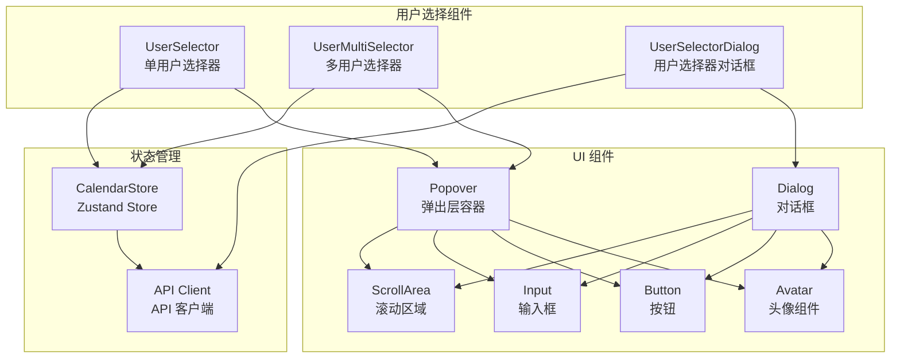

**图表来源**
- [components/task/user-selector.tsx](file://components/task/user-selector.tsx#L1-L147)
- [components/task/user-multi-selector.tsx](file://components/task/user-multi-selector.tsx#L1-L290)
- [components/user-selector-dialog.tsx](file://components/user-selector-dialog.tsx#L1-L222)

**章节来源**
- [components/task/user-selector.tsx](file://components/task/user-selector.tsx#L1-L147)
- [components/task/user-multi-selector.tsx](file://components/task/user-multi-selector.tsx#L1-L290)
- [components/user-selector-dialog.tsx](file://components/user-selector-dialog.tsx#L1-L222)

## 核心组件
用户选择组件系列包含三个主要组件，每个组件都有独特的功能特性和使用场景：

### 单用户选择器 (UserSelector)
单用户选择器提供简洁的用户选择界面，支持搜索过滤和快速选择功能。组件特点：
- 支持用户搜索（姓名、用户名）
- 实时过滤显示
- 头像显示和用户信息展示
- 禁用状态管理
- 与全局状态管理集成

### 多用户选择器 (UserMultiSelector)
多用户选择器支持批量用户选择，提供团队级别的批量操作能力：
- 团队和用户双重视图
- 批量选择和取消选择
- 锁定用户不可移除
- 创建者标识显示
- 丰富的交互状态反馈

### 用户选择器对话框 (UserSelectorDialog)
用户选择器对话框提供完整的用户搜索和邀请功能：
- 组织级别的用户搜索
- 邀请机制集成
- 模态窗口交互
- 实时搜索防抖
- 邀请流程管理

**章节来源**
- [components/task/user-selector.tsx](file://components/task/user-selector.tsx#L18-L23)
- [components/task/user-multi-selector.tsx](file://components/task/user-multi-selector.tsx#L18-L24)
- [components/user-selector-dialog.tsx](file://components/user-selector-dialog.tsx#L27-L33)

## 架构概览
用户选择组件采用分层架构设计，从底层的数据获取到上层的用户交互，形成了清晰的层次结构：

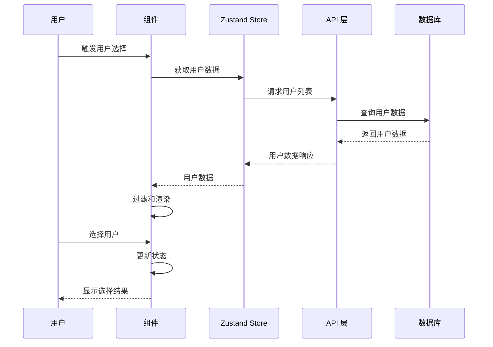

**图表来源**
- [lib/store/calendar-store.ts](file://lib/store/calendar-store.ts#L388-L413)
- [lib/api-client.ts](file://lib/api-client.ts#L186-L200)
- [app/api/users/route.ts](file://app/api/users/route.ts#L5-L88)

## 详细组件分析

### 单用户选择器 (UserSelector) 详细分析

#### 组件架构设计
单用户选择器采用受控组件模式，通过状态管理实现用户选择逻辑：

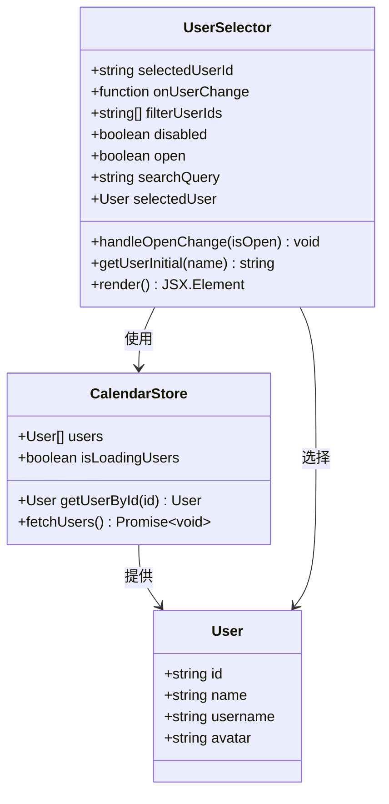

**图表来源**
- [components/task/user-selector.tsx](file://components/task/user-selector.tsx#L25-L56)
- [lib/store/calendar-store.ts](file://lib/store/calendar-store.ts#L197-L198)

#### 搜索和过滤算法
单用户选择器实现了高效的搜索过滤机制：

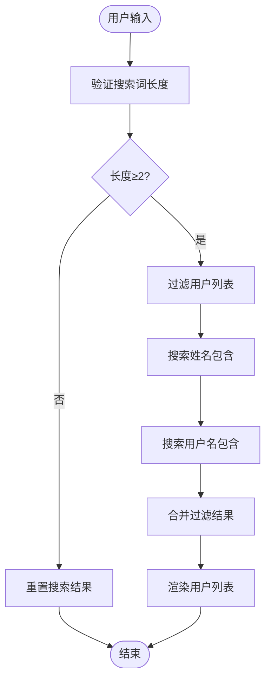

**图表来源**
- [components/task/user-selector.tsx](file://components/task/user-selector.tsx#L37-L44)

#### 用户选择逻辑
组件实现了完整的用户选择流程，包括选择、取消选择和状态更新：

**章节来源**
- [components/task/user-selector.tsx](file://components/task/user-selector.tsx#L1-L147)

### 多用户选择器 (UserMultiSelector) 详细分析

#### 批量选择机制
多用户选择器支持复杂的批量选择逻辑，包括团队级别的批量操作：

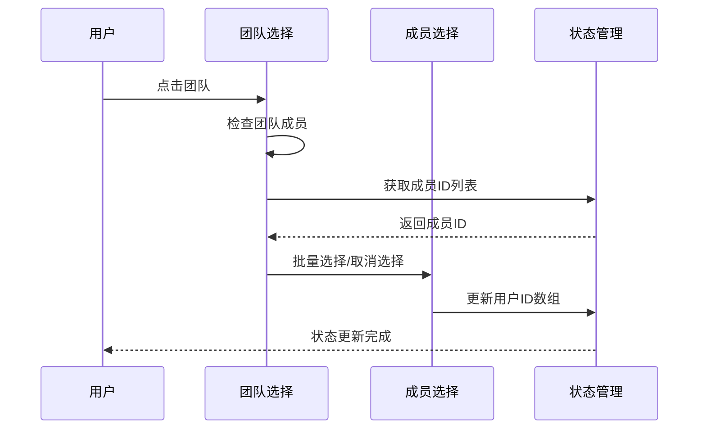

**图表来源**
- [components/task/user-multi-selector.tsx](file://components/task/user-multi-selector.tsx#L72-L91)

#### 去重处理机制
多用户选择器实现了智能的去重处理，确保用户列表的唯一性：

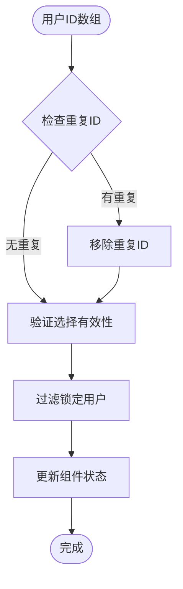

**图表来源**
- [components/task/user-multi-selector.tsx](file://components/task/user-multi-selector.tsx#L60-L70)

#### 数据绑定机制
多用户选择器通过 props 和回调函数实现双向数据绑定：

**章节来源**
- [components/task/user-multi-selector.tsx](file://components/task/user-multi-selector.tsx#L1-L290)

### 用户选择器对话框 (UserSelectorDialog) 详细分析

#### 模态窗口设计
用户选择器对话框提供了完整的模态窗口交互体验：

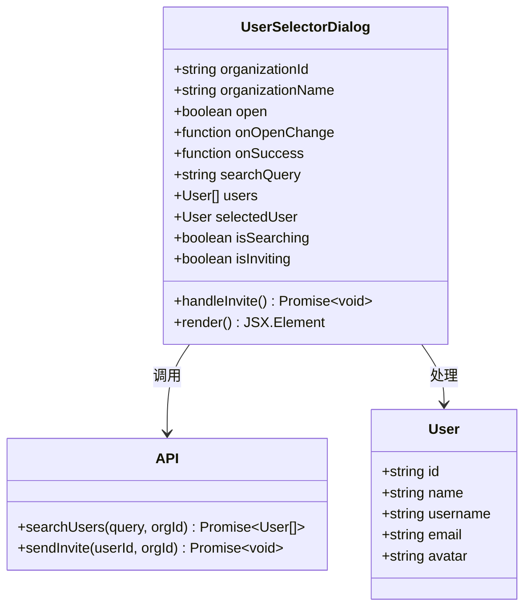

**图表来源**
- [components/user-selector-dialog.tsx](file://components/user-selector-dialog.tsx#L35-L47)
- [app/api/users/search/route.ts](file://app/api/users/search/route.ts#L6-L57)

#### 搜索过滤实现
对话框实现了智能的搜索过滤机制，支持防抖和实时更新：

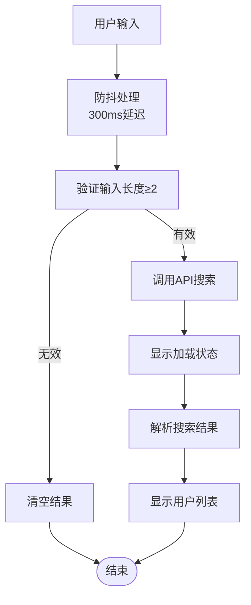

**图表来源**
- [components/user-selector-dialog.tsx](file://components/user-selector-dialog.tsx#L49-L78)

#### 邀请流程管理
对话框集成了完整的邀请流程，包括邀请发送和状态管理：

**章节来源**
- [components/user-selector-dialog.tsx](file://components/user-selector-dialog.tsx#L1-L222)

## 依赖关系分析

### 组件间依赖关系
用户选择组件之间存在清晰的依赖关系，形成完整的功能体系：

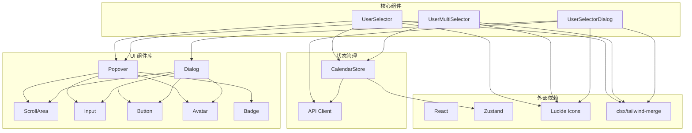

**图表来源**
- [lib/store/calendar-store.ts](file://lib/store/calendar-store.ts#L1-L32)
- [lib/api-client.ts](file://lib/api-client.ts#L1-L100)

### 数据流分析
用户选择组件的数据流遵循单向数据流原则，确保状态的一致性和可预测性：

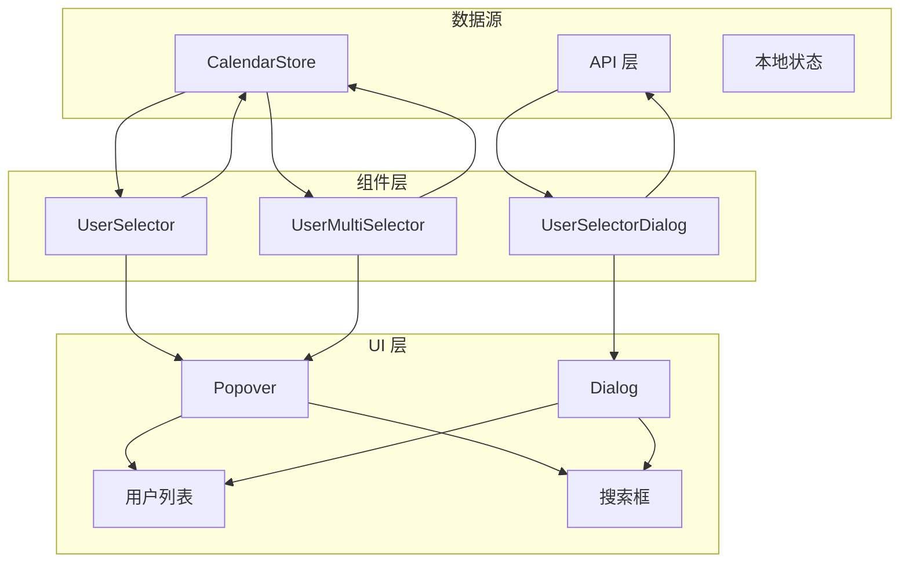

**图表来源**
- [lib/store/calendar-store.ts](file://lib/store/calendar-store.ts#L200-L287)
- [lib/api-client.ts](file://lib/api-client.ts#L186-L200)

**章节来源**
- [lib/store/calendar-store.ts](file://lib/store/calendar-store.ts#L1-L800)
- [lib/api-client.ts](file://lib/api-client.ts#L1-L200)

## 性能考虑

### 搜索算法优化
用户选择组件采用了多种性能优化策略：

1. **防抖机制**：搜索输入采用300ms防抖，减少不必要的API调用
2. **本地过滤**：用户列表在客户端进行过滤，减少服务器负载
3. **智能缓存**：利用Zustand状态管理实现数据缓存
4. **虚拟滚动**：对于大量用户数据，建议使用虚拟滚动技术

### 内存管理
组件实现了有效的内存管理策略：

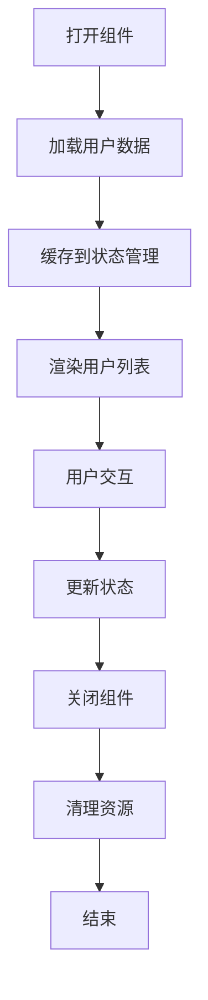

**图表来源**
- [components/task/user-selector.tsx](file://components/task/user-selector.tsx#L50-L56)

### 渲染优化
组件采用了多种渲染优化技术：

1. **条件渲染**：根据状态动态渲染不同的UI元素
2. **懒加载**：对话框组件按需加载
3. **状态分离**：将搜索状态和选择状态分离管理
4. **事件委托**：使用事件委托减少事件处理器数量

## 故障排除指南

### 常见问题及解决方案

#### 用户搜索无结果
**问题描述**：用户搜索时无法找到任何结果
**可能原因**：
1. 搜索关键词长度不足（小于2个字符）
2. 用户数据未正确加载
3. API连接异常

**解决方案**：
1. 确保搜索关键词至少2个字符
2. 检查网络连接和API状态
3. 刷新页面重新加载用户数据

#### 用户选择器不响应
**问题描述**：用户选择器点击无反应
**可能原因**：
1. 组件被禁用
2. 状态管理异常
3. 事件处理错误

**解决方案**：
1. 检查disabled属性
2. 验证状态管理器正常运行
3. 查看控制台错误信息

#### 邀请功能失败
**问题描述**：用户邀请功能无法正常工作
**可能原因**：
1. 权限不足
2. API调用失败
3. 网络连接问题

**解决方案**：
1. 验证用户权限
2. 检查API响应状态
3. 确认网络连接稳定

### 调试技巧
1. **使用浏览器开发者工具**：监控网络请求和状态变化
2. **启用开发模式**：获取更详细的错误信息
3. **检查控制台日志**：查看组件生命周期和状态更新
4. **验证API响应**：确认后端服务正常运行

**章节来源**
- [components/user-selector-dialog.tsx](file://components/user-selector-dialog.tsx#L64-L71)
- [app/api/users/search/route.ts](file://app/api/users/search/route.ts#L52-L55)

## 结论
用户选择组件系列提供了完整的用户管理解决方案，具有以下优势：

1. **模块化设计**：三个组件各司其职，功能明确
2. **性能优化**：采用多种优化策略确保流畅体验
3. **权限控制**：内置权限验证机制
4. **用户体验**：提供直观的交互界面和反馈
5. **可扩展性**：良好的架构设计便于功能扩展

这些组件为任务管理系统提供了强大的用户选择和管理能力，支持从简单的单用户选择到复杂的团队批量管理等各种使用场景。