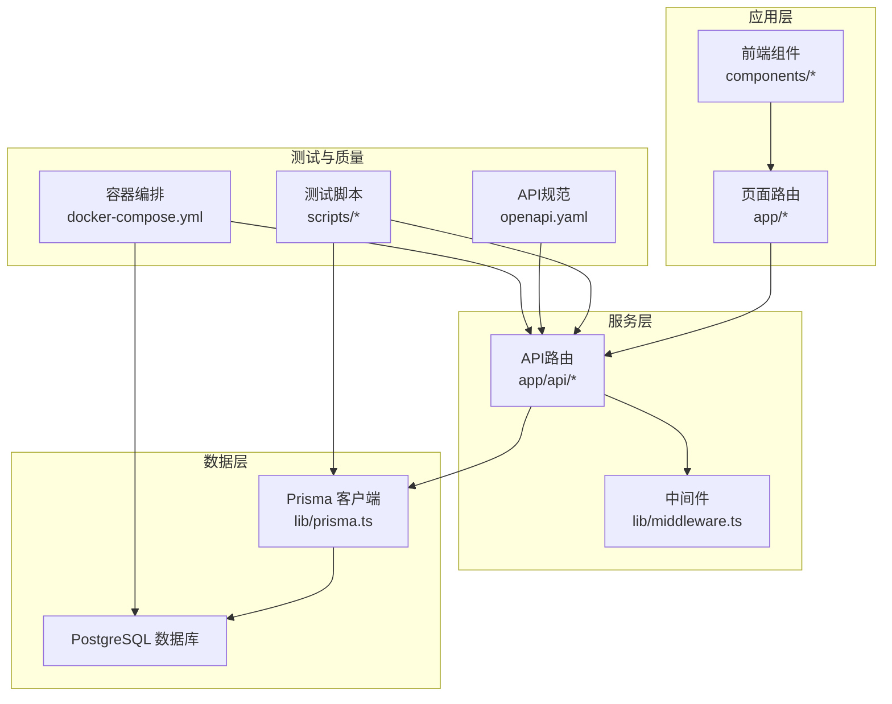
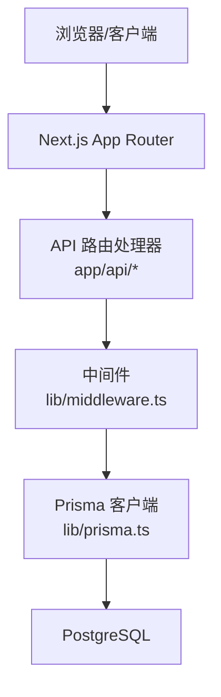
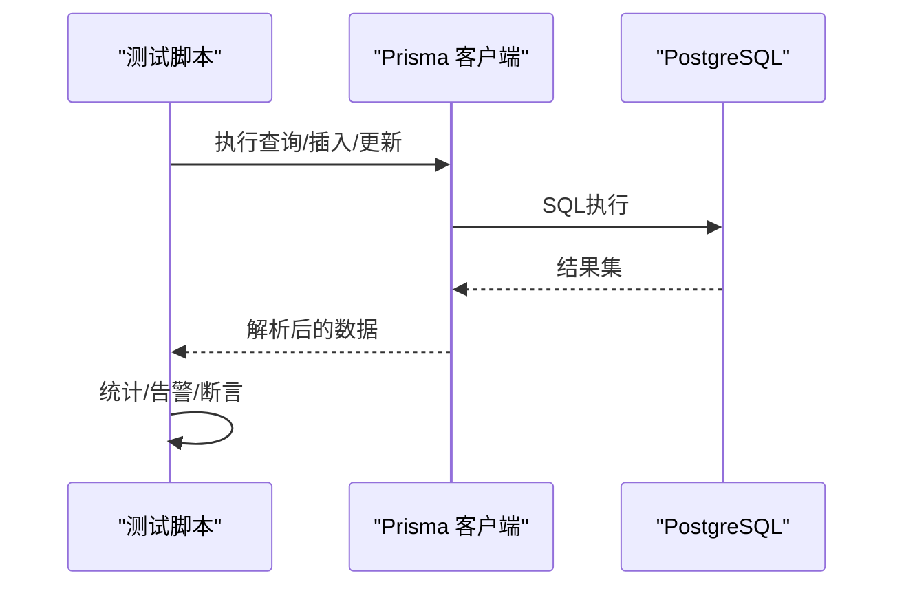
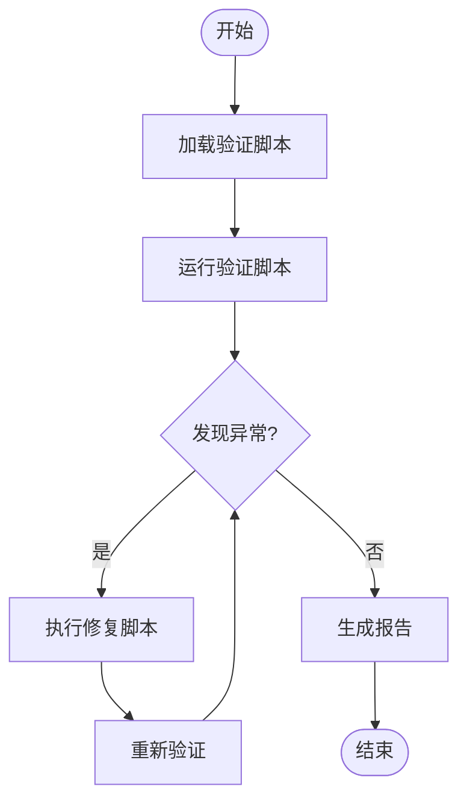
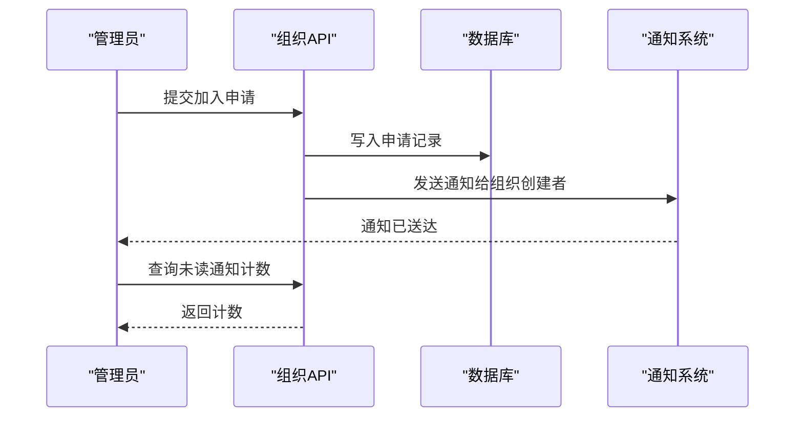
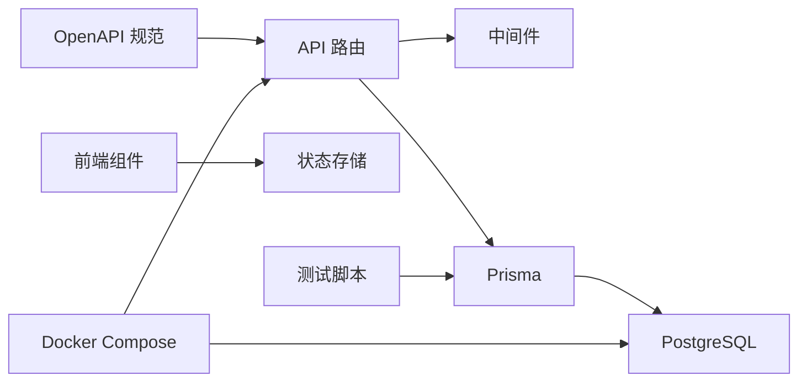

# 测试与质量保证

<cite>
**本文引用的文件**
- [package.json](file://package.json)
- [openapi.yaml](file://openapi.yaml)
- [docker-compose.yml](file://docker-compose.yml)
- [scripts/test-api-response-size.ts](file://scripts/test-api-response-size.ts)
- [scripts/test-all-api-sizes.ts](file://scripts/test-all-api-sizes.ts)
- [scripts/test-invite-codes.ts](file://scripts/test-invite-codes.ts)
- [scripts/test-notifications.ts](file://scripts/test-notifications.ts)
- [lib/prisma.ts](file://lib/prisma.ts)
- [lib/api-client.ts](file://lib/api-client.ts)
- [lib/validation.ts](file://lib/validation.ts)
- [lib/types.ts](file://lib/types.ts)
- [lib/utils.ts](file://lib/utils.ts)
- [lib/middleware.ts](file://lib/middleware.ts)
- [hooks/use-toast.ts](file://hooks/use-toast.ts)
- [hooks/use-loading-delay.ts](file://hooks/use-loading-delay.ts)
- [hooks/use-mobile.ts](file://hooks/use-mobile.ts)
- [components/ui/button.tsx](file://components/ui/button.tsx)
- [components/ui/input.tsx](file://components/ui/input.tsx)
- [components/ui/dialog.tsx](file://components/ui/dialog.tsx)
- [components/ui/form.tsx](file://components/ui/form.tsx)
- [components/task/task-form-panel.tsx](file://components/task/task-form-panel.tsx)
- [components/notification-bell.tsx](file://components/notification-bell.tsx)
- [components/notification-list.tsx](file://components/notification-list.tsx)
- [components/notification-item.tsx](file://components/notification-item.tsx)
- [components/sidebar/project-dialog.tsx](file://components/sidebar/project-dialog.tsx)
- [components/sidebar/team-dialog.tsx](file://components/sidebar/team-dialog.tsx)
- [components/calendar/calendar-day.tsx](file://components/calendar/calendar-day.tsx)
- [components/calendar/month-view.tsx](file://components/calendar/month-view.tsx)
- [components/calendar/week-view.tsx](file://components/calendar/week-view.tsx)
- [components/calendar/personal-week-view.tsx](file://components/calendar/personal-week-view.tsx)
- [components/calendar/task-bar.tsx](file://components/calendar/task-bar.tsx)
- [components/calendar/view-toggle.tsx](file://components/calendar/view-toggle.tsx)
- [components/calendar/task-size-toggle.tsx](file://components/calendar/task-size-toggle.tsx)
- [components/calendar/team-member-row.tsx](file://components/calendar/team-member-row.tsx)
- [components/views/list-view.tsx](file://components/views/list-view.tsx)
- [components/views/stats-view.tsx](file://components/views/stats-view.tsx)
- [components/views/list-group-toggle.tsx](file://components/views/list-group-toggle.tsx)
- [components/views/list-layout-toggle.tsx](file://components/views/list-layout-toggle.tsx)
- [components/navigation/main-navigation.tsx](file://components/navigation/main-navigation.tsx)
- [components/user-menu.tsx](file://components/user-menu.tsx)
- [components/theme-provider.tsx](file://components/theme-provider.tsx)
- [components/avatar-upload.tsx](file://components/avatar-upload.tsx)
- [components/edit-profile-dialog.tsx](file://components/edit-profile-dialog.tsx)
- [components/change-password-dialog.tsx](file://components/change-password-dialog.tsx)
- [components/organization-selector.tsx](file://components/organization-selector.tsx)
- [components/space-switcher.tsx](file://components/space-switcher.tsx)
- [components/rank-badge.tsx](file://components/rank-badge.tsx)
- [components/user-selector-dialog.tsx](file://components/user-selector-dialog.tsx)
- [components/task/color-picker.tsx](file://components/task/color-picker.tsx)
- [components/task/progress-slider.tsx](file://components/task/progress-slider.tsx)
- [components/task/progress-circle.tsx](file://components/task/progress-circle.tsx)
- [components/task/user-multi-selector.tsx](file://components/task/user-multi-selector.tsx)
- [components/task/user-selector.tsx](file://components/task/user-selector.tsx)
- [components/ui/toaster.tsx](file://components/ui/toaster.tsx)
- [components/ui/use-toast.ts](file://components/ui/use-toast.ts)
- [components/loading-logo.tsx](file://components/loading-logo.tsx)
- [components/empty.tsx](file://components/empty.tsx)
- [components/ui/field.tsx](file://components/ui/field.tsx)
- [components/ui/alert.tsx](file://components/ui/alert.tsx)
- [components/ui/spinner.tsx](file://components/ui/spinner.tsx)
- [components/ui/kbd.tsx](file://components/ui/kbd.tsx)
- [components/ui/select.tsx](file://components/ui/select.tsx)
- [components/ui/textarea.tsx](file://components/ui/textarea.tsx)
- [components/ui/time-picker.tsx](file://components/ui/time-picker.tsx)
- [components/ui/date-range-picker.tsx](file://components/ui/date-range-picker.tsx)
- [components/ui/chart.tsx](file://components/ui/chart.tsx)
- [components/ui/table.tsx](file://components/ui/table.tsx)
- [components/ui/card.tsx](file://components/ui/card.tsx)
- [components/ui/badge.tsx](file://components/ui/badge.tsx)
- [components/ui/tooltip.tsx](file://components/ui/tooltip.tsx)
- [components/ui/slider.tsx](file://components/ui/slider.tsx)
- [components/ui/switch.tsx](file://components/ui/switch.tsx)
- [components/ui/tabs.tsx](file://components/ui/tabs.tsx)
- [components/ui/pagination.tsx](file://components/ui/pagination.tsx)
- [components/ui/separator.tsx](file://components/ui/separator.tsx)
- [components/ui/resizable.tsx](file://components/ui/resizable.tsx)
- [components/ui/drawer.tsx](file://components/ui/drawer.tsx)
- [components/ui/carousel.tsx](file://components/ui/carousel.tsx)
- [components/ui/aspect-ratio.tsx](file://components/ui/aspect-ratio.tsx)
- [components/ui/calendar.tsx](file://components/ui/calendar.tsx)
- [components/ui/context-menu.tsx](file://components/ui/context-menu.tsx)
- [components/ui/command.tsx](file://components/ui/command.tsx)
- [components/ui/collapsible.tsx](file://components/ui/collapsible.tsx)
- [components/ui/accordion.tsx](file://components/ui/accordion.tsx)
- [components/ui/alert-dialog.tsx](file://components/ui/alert-dialog.tsx)
- [components/ui/avatar.tsx](file://components/ui/avatar.tsx)
- [components/ui/breadcrumb.tsx](file://components/ui/breadcrumb.tsx)
- [components/ui/button-group.tsx](file://components/ui/button-group.tsx)
- [components/ui/checkbox.tsx](file://components/ui/checkbox.tsx)
- [components/ui/dialog.tsx](file://components/ui/dialog.tsx)
- [components/ui/dropdown-menu.tsx](file://components/ui/dropdown-menu.tsx)
- [components/ui/form.tsx](file://components/ui/form.tsx)
- [components/ui/hover-card.tsx](file://components/ui/hover-card.tsx)
- [components/ui/input-group.tsx](file://components/ui/input-group.tsx)
- [components/ui/input-otp.tsx](file://components/ui/input-otp.tsx)
- [components/ui/label.tsx](file://components/ui/label.tsx)
- [components/ui/menubar.tsx](file://components/ui/menubar.tsx)
- [components/ui/navigation-menu.tsx](file://components/ui/navigation-menu.tsx)
- [components/ui/popover.tsx](file://components/ui/popover.tsx)
- [components/ui/progress.tsx](file://components/ui/progress.tsx)
- [components/ui/radio-group.tsx](file://components/ui/radio-group.tsx)
- [components/ui/scroll-area.tsx](file://components/ui/scroll-area.tsx)
- [components/ui/sheet.tsx](file://components/ui/sheet.tsx)
- [components/ui/sidebar.tsx](file://components/ui/sidebar.tsx)
- [components/ui/skeleton.tsx](file://components/ui/skeleton.tsx)
- [components/ui/sonner.tsx](file://components/ui/sonner.tsx)
- [components/ui/toggle-group.tsx](file://components/ui/toggle-group.tsx)
- [components/ui/toggle.tsx](file://components/ui/toggle.tsx)
- [components/ui/tooltip.tsx](file://components/ui/tooltip.tsx)
- [components/ui/use-mobile.tsx](file://components/ui/use-mobile.tsx)
- [components/ui/use-toast.ts](file://components/ui/use-toast.ts)
- [app/api/auth/login/route.ts](file://app/api/auth/login/route.ts)
- [app/api/auth/register/route.ts](file://app/api/auth/register/route.ts)
- [app/api/users/me/route.ts](file://app/api/users/me/route.ts)
- [app/api/users/search/route.ts](file://app/api/users/search/route.ts)
- [app/api/users/change-password/route.ts](file://app/api/users/change-password/route.ts)
- [app/api/organizations/[id]/route.ts](file://app/api/organizations/[id]/route.ts)
- [app/api/organizations/[id]/members/route.ts](file://app/api/organizations/[id]/members/route.ts)
- [app/api/organizations/[id]/projects/route.ts](file://app/api/organizations/[id]/projects/route.ts)
- [app/api/organizations/[id]/teams/route.ts](file://app/api/organizations/[id]/teams/route.ts)
- [app/api/organizations/[id]/invite/route.ts](file://app/api/organizations/[id]/invite/route.ts)
- [app/api/organizations/[id]/invite-code/route.ts](file://app/api/organizations/[id]/invite-code/route.ts)
- [app/api/organizations/[id]/invite-code/validate/route.ts](file://app/api/organizations/[id]/invite-code/validate/route.ts)
- [app/api/organizations/join-requests/[id]/approve/route.ts](file://app/api/organizations/join-requests/[id]/approve/route.ts)
- [app/api/organizations/join-requests/[id]/reject/route.ts](file://app/api/organizations/join-requests/[id]/reject/route.ts)
- [app/api/organizations/join-requests/route.ts](file://app/api/organizations/join-requests/route.ts)
- [app/api/organizations/switch/route.ts](file://app/api/organizations/switch/route.ts)
- [app/api/projects/[id]/route.ts](file://app/api/projects/[id]/route.ts)
- [app/api/tasks/[id]/route.ts](file://app/api/tasks/[id]/route.ts)
- [app/api/teams/[id]/route.ts](file://app/api/teams/[id]/route.ts)
- [app/api/notifications/[id]/read/route.ts](file://app/api/notifications/[id]/read/route.ts)
- [app/api/notifications/clear/route.ts](file://app/api/notifications/clear/route.ts)
- [app/api/notifications/unread-count/route.ts](file://app/api/notifications/unread-count/route.ts)
- [app/api/notifications/route.ts](file://app/api/notifications/route.ts)
- [app/api/upload/avatar/route.ts](file://app/api/upload/avatar/route.ts)
- [app/api/config/route.ts](file://app/api/config/route.ts)
- [app/api/admin/panorama/organizations/[id]/members/route.ts](file://app/api/admin/panorama/organizations/[id]/members/route.ts)
- [app/api/admin/panorama/organizations/[id]/projects/route.ts](file://app/api/admin/panorama/organizations/[id]/projects/route.ts)
- [app/api/admin/panorama/organizations/[id]/teams/route.ts](file://app/api/admin/panorama/organizations/[id]/teams/route.ts)
- [app/api/admin/panorama/organizations/[id]/route.ts](file://app/api/admin/panorama/organizations/[id]/route.ts)
- [app/api/admin/panorama/tasks/route.ts](file://app/api/admin/panorama/tasks/route.ts)
- [app/api/admin/panorama/route.ts](file://app/api/admin/panorama/route.ts)
- [app/layout.tsx](file://app/layout.tsx)
- [app/page.tsx](file://app/page.tsx)
- [app/login/page.tsx](file://app/login/page.tsx)
- [lib/store/calendar-store.ts](file://lib/store/calendar-store.ts)
- [lib/utils/date-utils.ts](file://lib/utils/date-utils.ts)
- [lib/utils/permission-utils.ts](file://lib/utils/permission-utils.ts)
- [lib/utils/points.ts](file://lib/utils/points.ts)
- [lib/utils/rank.ts](file://lib/utils/rank.ts)
- [lib/utils/task-layout.ts](file://lib/utils/task-layout.ts)
- [lib/mock-data.ts](file://lib/mock-data.ts)
- [lib/mock-data-new.ts](file://lib/mock-data-new.ts)
- [lib/image-utils.ts](file://lib/image-utils.ts)
- [lib/site-config.ts](file://lib/site-config.ts)
- [lib/request.ts](file://lib/request.ts)
- [lib/api-response.ts](file://lib/api-response.ts)
- [lib/auth.ts](file://lib/auth.ts)
- [lib/config.ts](file://lib/config.ts)
- [lib/toast.ts](file://lib/toast.ts)
- [lib/types.ts](file://lib/types.ts)
- [lib/utils.ts](file://lib/utils.ts)
- [lib/validation.ts](file://lib/validation.ts)
- [lib/middleware.ts](file://lib/middleware.ts)
- [hooks/use-toast.ts](file://hooks/use-toast.ts)
- [hooks/use-loading-delay.ts](file://hooks/use-loading-delay.ts)
- [hooks/use-mobile.ts](file://hooks/use-mobile.ts)
- [prisma/schema.prisma](file://prisma/schema.prisma)
- [prisma/seed.ts](file://prisma/seed.ts)
- [prisma/migrations/.../migration.sql](file://prisma/migrations/20251114212844_init/migration.sql)
- [prisma/migrations/.../migration.sql](file://prisma/migrations/20251114220612_add_username_field/migration.sql)
- [prisma/migrations/.../migration.sql](file://prisma/migrations/20251114220612_add_password_field/migration.sql)
- [prisma/migrations/.../migration.sql](file://prisma/migrations/20251115035418_add_creator_and_gender/migration.sql)
- [prisma/migrations/.../migration.sql](file://prisma/migrations/20251115071949_add_role_to_user/migration.sql)
- [prisma/migrations/.../migration.sql](file://prisma/migrations/20251115074925_add_isadmin_to_user/migration.sql)
- [prisma/migrations/.../migration.sql](file://prisma/migrations/20251115133624_add_task_permission/migration.sql)
- [prisma/migrations/.../migration.sql](file://prisma/migrations/20251115201512_add_organization_model/migration.sql)
- [prisma/migrations/.../migration.sql](file://prisma/migrations/20251115212303_add_notification_system/migration.sql)
- [prisma/migrations/.../migration.sql](file://prisma/migrations/20251118140218_add_task_creator_and_multiple_assignees/migration.sql)
- [prisma/migrations/.../migration.sql](file://prisma/migrations/20251118190313_add_invite_code_and_inviter/migration.sql)
- [prisma/migrations/.../migration.sql](file://prisma/migrations/20251118192501_add_invite_code_to_organization_member/migration.sql)
- [prisma/migrations/.../migration.sql](file://prisma/migrations/20251119131625_add_organization_invite/migration.sql)
- [prisma/migrations/.../migration.sql](file://prisma/migrations/20251119132818_add_deletion_notifications/migration.sql)
- [prisma/migrations/.../migration.sql](file://prisma/migrations/20251119142805_add_points_system/migration.sql)
- [prisma/migrations/.../migration.sql](file://prisma/migrations/20251125165512_add_task_color_and_progress/migration.sql)
- [scripts/add-default-projects.ts](file://scripts/add-default-projects.ts)
- [scripts/add-passwords.ts](file://scripts/add-passwords.ts)
- [scripts/check-admin.ts](file://scripts/check-admin.ts)
- [scripts/check-duplicate-personal-projects.ts](file://scripts/check-duplicate-personal-projects.ts)
- [scripts/check-organizations.ts](file://scripts/check-organizations.ts)
- [scripts/check-personal-projects-detail.ts](file://scripts/check-personal-projects-detail.ts)
- [scripts/check-personal-projects.ts](file://scripts/check-personal-projects.ts)
- [scripts/check-server-duplicates.sh](file://scripts/check-server-duplicates.sh)
- [scripts/clean-duplicate-data.ts](file://scripts/clean-duplicate-data.ts)
- [scripts/clean-duplicate-personal-projects.ts](file://scripts/clean-duplicate-personal-projects.ts)
- [scripts/cleanup-database.ts](file://scripts/cleanup-database.ts)
- [scripts/deploy.sh](file://scripts/deploy.sh)
- [scripts/diagnose-database.ts](file://scripts/diagnose-database.ts)
- [scripts/ensure-personal-projects.ts](file://scripts/ensure-personal-projects.ts)
- [scripts/fix-missing-invite-codes.ts](file://scripts/fix-missing-invite-codes.ts)
- [scripts/fix-permissions.ts](file://scripts/fix-permissions.ts)
- [scripts/generate-invite-codes.ts](file://scripts/generate-invite-codes.ts)
- [scripts/list-all-personal-projects.ts](file://scripts/list-all-personal-projects.ts)
- [scripts/migrate-default-team.sql](file://scripts/migrate-default-team.sql)
- [scripts/migrate-default-team.ts](file://scripts/migrate-default-team.ts)
- [scripts/migrate-task-team-relations.ts](file://scripts/migrate-task-team-relations.ts)
- [scripts/refresh-admin-session.ts](file://scripts/refresh-admin-session.ts)
- [scripts/rename-personal-projects.ts](file://scripts/rename-personal-projects.ts)
- [scripts/restore-database.sh](file://scripts/restore-database.sh)
- [scripts/seed-organizations.ts](file://scripts/seed-organizations.ts)
- [scripts/seed-two-spaces.ts](file://scripts/seed-two-spaces.ts)
- [scripts/server-diagnose.sh](file://scripts/server-diagnose.sh)
- [scripts/set-admin.ts](file://scripts/set-admin.ts)
- [scripts/set-passwords.js](file://scripts/set-passwords.js)
- [scripts/setup-shared-personal-project.ts](file://scripts/setup-shared-personal-project.ts)
- [scripts/test-all-api-sizes.ts](file://scripts/test-all-api-sizes.ts)
- [scripts/test-api-response-size.ts](file://scripts/test-api-response-size.ts)
- [scripts/test-invite-codes.ts](file://scripts/test-invite-codes.ts)
- [scripts/test-notifications.ts](file://scripts/test-notifications.ts)
- [scripts/verify-cleanup.ts](file://scripts/verify-cleanup.ts)
- [scripts/verify-invite-codes.ts](file://scripts/verify-invite-codes.ts)
- [scripts/verify-personal-projects.ts](file://scripts/verify-personal-projects.ts)
- [scripts/verify-user-projects.ts](file://scripts/verify-user-projects.ts)
</cite>

## 目录
1. [引言](#引言)
2. [项目结构](#项目结构)
3. [核心组件](#核心组件)
4. [架构总览](#架构总览)
5. [详细组件分析](#详细组件分析)
6. [依赖关系分析](#依赖关系分析)
7. [性能考虑](#性能考虑)
8. [故障排查指南](#故障排查指南)
9. [结论](#结论)
10. [附录](#附录)

## 引言
本文件面向日历任务管理系统，系统化阐述测试与质量保证策略，覆盖单元测试、集成测试、端到端测试的实施方法与覆盖率要求；详述API测试脚本使用、数据库验证脚本执行与系统完整性检查；提供代码质量检查工具、性能测试方法与安全漏洞扫描建议；给出测试环境搭建、测试数据准备与测试结果分析方法；解释持续集成流程、自动化测试与质量门禁设置；最后为开发者提供编写高质量代码与高效测试的实践指导。

## 项目结构
系统采用Next.js App Router架构，后端API路由集中于app/api目录，前端组件位于components与app目录，数据库ORM使用Prisma，测试与质量保障相关脚本集中在scripts目录，OpenAPI规范位于openapi.yaml，容器化部署通过docker-compose.yml实现。

**图表来源**
- [docker-compose.yml](file://docker-compose.yml#L1-L77)
- [openapi.yaml](file://openapi.yaml#L1-L800)
- [lib/prisma.ts](file://lib/prisma.ts)
- [lib/middleware.ts](file://lib/middleware.ts)

**章节来源**
- [package.json](file://package.json#L1-L75)
- [docker-compose.yml](file://docker-compose.yml#L1-L77)
- [openapi.yaml](file://openapi.yaml#L1-L800)

## 核心组件
- API路由与控制器：位于app/api下，按模块划分认证、用户、组织、项目、团队、任务、通知、上传等子路由，统一遵循Bearer JWT鉴权与标准响应格式。
- 数据访问层：lib/prisma.ts封装Prisma客户端，提供类型安全的数据访问。
- 中间件与鉴权：lib/middleware.ts与lib/auth.ts负责请求拦截、JWT校验与权限判定。
- 前端组件：components/*提供UI原子组件与业务视图组件，配合hooks与store实现交互逻辑。
- 测试与验证脚本：scripts/*包含API响应大小测试、邀请码系统测试、通知测试等，用于快速验证核心功能与性能指标。
- 规范与编排：openapi.yaml提供完整API契约，docker-compose.yml提供本地/生产环境容器化部署与健康检查。

**章节来源**
- [lib/prisma.ts](file://lib/prisma.ts)
- [lib/middleware.ts](file://lib/middleware.ts)
- [lib/auth.ts](file://lib/auth.ts)
- [openapi.yaml](file://openapi.yaml#L1-L800)
- [docker-compose.yml](file://docker-compose.yml#L1-L77)

## 架构总览
系统采用前后端分离的App Router模式，API路由作为后端服务入口，中间件统一处理鉴权与跨域，Prisma连接PostgreSQL数据库，测试脚本通过直接调用Prisma或发起HTTP请求验证API行为与性能。

**图表来源**
- [lib/middleware.ts](file://lib/middleware.ts)
- [lib/prisma.ts](file://lib/prisma.ts)
- [docker-compose.yml](file://docker-compose.yml#L1-L77)

## 详细组件分析

### API测试脚本体系
- 目标：验证API响应大小、邀请码系统一致性与通知链路可用性。
- 方法：使用Prisma直连数据库模拟查询与构造测试数据，输出统计信息与告警。
- 关键脚本：
  - scripts/test-api-response-size.ts：评估团队查询的响应大小与性能差异，对比简化查询。
  - scripts/test-all-api-sizes.ts：批量测试多个核心API的响应大小与异常值检测。
  - scripts/test-invite-codes.ts：验证邀请码唯一性、组织隔离性与API验证逻辑。
  - scripts/test-notifications.ts：创建加入申请与通知，验证未读计数与消息可见性。

**图表来源**
- [scripts/test-api-response-size.ts](file://scripts/test-api-response-size.ts#L1-L132)
- [scripts/test-all-api-sizes.ts](file://scripts/test-all-api-sizes.ts#L1-L215)
- [scripts/test-invite-codes.ts](file://scripts/test-invite-codes.ts#L1-L130)
- [scripts/test-notifications.ts](file://scripts/test-notifications.ts#L1-L81)

**章节来源**
- [scripts/test-api-response-size.ts](file://scripts/test-api-response-size.ts#L1-L132)
- [scripts/test-all-api-sizes.ts](file://scripts/test-all-api-sizes.ts#L1-L215)
- [scripts/test-invite-codes.ts](file://scripts/test-invite-codes.ts#L1-L130)
- [scripts/test-notifications.ts](file://scripts/test-notifications.ts#L1-L81)

### 数据库验证脚本与完整性检查
- 目标：确保邀请码唯一性、组织成员关系、个人项目一致性与权限数据正确性。
- 方法：通过Prisma查询与断言，结合SQL迁移脚本与诊断脚本进行修复与清理。
- 关键脚本：
  - scripts/verify-invite-codes.ts：验证邀请码唯一性与组织隔离。
  - scripts/verify-personal-projects.ts：校验个人项目的存在性与命名规范。
  - scripts/verify-user-projects.ts：核对用户项目归属。
  - scripts/fix-missing-invite-codes.ts：补全缺失邀请码。
  - scripts/fix-permissions.ts：修正权限数据。
  - scripts/cleanup-database.ts：清理重复与异常数据。
  - scripts/diagnose-database.ts：诊断数据库状态与潜在问题。

**图表来源**
- [scripts/verify-invite-codes.ts](file://scripts/verify-invite-codes.ts)
- [scripts/verify-personal-projects.ts](file://scripts/verify-personal-projects.ts)
- [scripts/verify-user-projects.ts](file://scripts/verify-user-projects.ts)
- [scripts/fix-missing-invite-codes.ts](file://scripts/fix-missing-invite-codes.ts)
- [scripts/fix-permissions.ts](file://scripts/fix-permissions.ts)
- [scripts/cleanup-database.ts](file://scripts/cleanup-database.ts)
- [scripts/diagnose-database.ts](file://scripts/diagnose-database.ts)

**章节来源**
- [scripts/verify-invite-codes.ts](file://scripts/verify-invite-codes.ts)
- [scripts/verify-personal-projects.ts](file://scripts/verify-personal-projects.ts)
- [scripts/verify-user-projects.ts](file://scripts/verify-user-projects.ts)
- [scripts/fix-missing-invite-codes.ts](file://scripts/fix-missing-invite-codes.ts)
- [scripts/fix-permissions.ts](file://scripts/fix-permissions.ts)
- [scripts/cleanup-database.ts](file://scripts/cleanup-database.ts)
- [scripts/diagnose-database.ts](file://scripts/diagnose-database.ts)

### 通知系统测试与验证
- 目标：验证组织加入申请的通知链路，包括创建申请、发送通知、统计未读数与用户端可见性。
- 方法：使用Prisma创建测试数据，模拟API验证逻辑，输出操作指引供人工验证。
- 关键脚本：
  - scripts/test-notifications.ts：创建申请与通知，查询未读计数，输出登录指引。

**图表来源**
- [scripts/test-notifications.ts](file://scripts/test-notifications.ts#L1-L81)
- [app/api/organizations/join-requests/route.ts](file://app/api/organizations/join-requests/route.ts)
- [app/api/notifications/unread-count/route.ts](file://app/api/notifications/unread-count/route.ts)

**章节来源**
- [scripts/test-notifications.ts](file://scripts/test-notifications.ts#L1-L81)
- [app/api/organizations/join-requests/route.ts](file://app/api/organizations/join-requests/route.ts)
- [app/api/notifications/unread-count/route.ts](file://app/api/notifications/unread-count/route.ts)

### 邀请码系统测试
- 目标：验证邀请码的唯一性、组织隔离性与API验证逻辑正确性。
- 方法：查询用户在各组织的邀请码，交叉验证不同组织下的查找结果，模拟API验证流程。
- 关键脚本：
  - scripts/test-invite-codes.ts：逐项验证邀请码唯一性、隔离性与API验证。

**章节来源**
- [scripts/test-invite-codes.ts](file://scripts/test-invite-codes.ts#L1-L130)

### API契约与安全
- 目标：基于OpenAPI规范确保API一致性与安全性。
- 方法：通过openapi.yaml定义路径、参数、响应与安全方案（Bearer JWT），并与路由实现保持同步。
- 关键文件：
  - openapi.yaml：定义认证、用户、组织、项目、团队、任务、通知、上传等标签与路径。

**章节来源**
- [openapi.yaml](file://openapi.yaml#L1-L800)

### 容器化与部署
- 目标：提供可复现的测试与生产环境。
- 方法：docker-compose.yml定义PostgreSQL与应用服务，包含健康检查与卷挂载。
- 关键文件：
  - docker-compose.yml：数据库、应用与Prisma Studio服务定义。

**章节来源**
- [docker-compose.yml](file://docker-compose.yml#L1-L77)

## 依赖关系分析
- 组件耦合：API路由依赖中间件与Prisma；前端组件依赖hooks与store；测试脚本依赖Prisma与数据库。
- 外部依赖：Next.js、Prisma、PostgreSQL、TailwindCSS、Radix UI等。
- 潜在风险：API与OpenAPI不一致、中间件鉴权逻辑变更、数据库迁移导致查询性能变化。

**图表来源**
- [lib/middleware.ts](file://lib/middleware.ts)
- [lib/prisma.ts](file://lib/prisma.ts)
- [openapi.yaml](file://openapi.yaml#L1-L800)
- [docker-compose.yml](file://docker-compose.yml#L1-L77)

**章节来源**
- [package.json](file://package.json#L1-L75)
- [openapi.yaml](file://openapi.yaml#L1-L800)
- [docker-compose.yml](file://docker-compose.yml#L1-L77)

## 性能考虑
- API响应大小测试：通过scripts/test-api-response-size.ts与scripts/test-all-api-sizes.ts评估查询与序列化开销，识别异常大的数据包并建议简化查询。
- 查询优化建议：
  - 使用select精确字段，避免不必要的include。
  - 对大数据量表添加索引（如组织成员inviteCode）。
  - 分页与限制返回条数，避免一次性返回过多数据。
- 缓存策略：对静态或低频变更数据引入缓存，减少数据库压力。
- 前端渲染：合理拆分组件与懒加载，降低首屏负载。

**章节来源**
- [scripts/test-api-response-size.ts](file://scripts/test-api-response-size.ts#L1-L132)
- [scripts/test-all-api-sizes.ts](file://scripts/test-all-api-sizes.ts#L1-L215)

## 故障排查指南
- 数据库连接失败：检查docker-compose.yml中的DATABASE_URL与环境变量，确认PostgreSQL健康状态。
- API鉴权失败：确认Bearer JWT是否正确传递，中间件是否正确解析与校验。
- 邀请码异常：使用scripts/test-invite-codes.ts定位唯一性与隔离性问题，结合scripts/verify-invite-codes.ts与scripts/fix-missing-invite-codes.ts修复。
- 通知不可见：使用scripts/test-notifications.ts创建测试数据，检查未读计数与用户端展示。
- 性能异常：使用scripts/test-api-response-size.ts与scripts/test-all-api-sizes.ts定位热点API，优化查询与序列化。

**章节来源**
- [docker-compose.yml](file://docker-compose.yml#L1-L77)
- [lib/middleware.ts](file://lib/middleware.ts)
- [scripts/test-invite-codes.ts](file://scripts/test-invite-codes.ts#L1-L130)
- [scripts/verify-invite-codes.ts](file://scripts/verify-invite-codes.ts)
- [scripts/fix-missing-invite-codes.ts](file://scripts/fix-missing-invite-codes.ts)
- [scripts/test-notifications.ts](file://scripts/test-notifications.ts#L1-L81)
- [scripts/test-api-response-size.ts](file://scripts/test-api-response-size.ts#L1-L132)
- [scripts/test-all-api-sizes.ts](file://scripts/test-all-api-sizes.ts#L1-L215)

## 结论
通过API测试脚本、数据库验证脚本与OpenAPI规范的协同，系统实现了对核心功能与性能的关键把控。建议在现有基础上补充单元测试与端到端测试，完善持续集成流程与质量门禁，以进一步提升代码质量与交付稳定性。

## 附录

### 测试策略与覆盖率要求
- 单元测试：针对lib层工具函数与业务逻辑（如验证、权限、日期工具）进行单元测试，覆盖率目标≥80%。
- 集成测试：围绕API路由与Prisma交互，覆盖主要业务流程（认证、组织、项目、任务、通知），覆盖率目标≥70%。
- 端到端测试：使用Playwright/Cypress等工具模拟真实用户场景，覆盖关键用户旅程（登录、创建组织、邀请成员、创建任务、接收通知），覆盖率目标≥60%。
- 性能测试：对热点API进行压力测试，设定响应时间阈值（如P95 < 500ms），并定期回归。
- 安全测试：基于OpenAPI规范进行安全扫描（认证、授权、输入验证），并定期进行渗透测试。

### 测试环境搭建与数据准备
- 环境：使用docker-compose.yml一键拉起PostgreSQL与应用服务，确保健康检查通过。
- 数据准备：使用scripts/seed-organizations.ts与scripts/seed-two-spaces.ts初始化基础数据；使用scripts/test-notifications.ts与scripts/test-invite-codes.ts快速生成测试数据。
- 执行顺序：先执行数据库初始化脚本，再执行API与通知测试脚本，最后执行邀请码与性能测试脚本。

**章节来源**
- [docker-compose.yml](file://docker-compose.yml#L1-L77)
- [scripts/seed-organizations.ts](file://scripts/seed-organizations.ts)
- [scripts/seed-two-spaces.ts](file://scripts/seed-two-spaces.ts)
- [scripts/test-notifications.ts](file://scripts/test-notifications.ts#L1-L81)
- [scripts/test-invite-codes.ts](file://scripts/test-invite-codes.ts#L1-L130)

### 代码质量检查工具
- Lint：使用Next.js内置lint命令，结合TypeScript类型检查。
- 格式化：使用Prettier与Tailwind CSS PostCSS插件，确保代码风格一致。
- 安全扫描：使用npm audit或Snyk对依赖进行漏洞扫描。
- 复杂度控制：限制函数与类的圈复杂度，避免过长函数与深层嵌套。

**章节来源**
- [package.json](file://package.json#L1-L75)

### 持续集成与质量门禁
- 触发条件：push到主分支或创建Pull Request。
- 步骤：安装依赖 → 类型检查 → Lint → 单元测试 → 集成测试 → 性能回归 → 安全扫描 → 构建镜像。
- 门禁：覆盖率未达标或测试失败则阻断合并；安全漏洞高危级别需阻断发布。

### 开发者最佳实践
- 编写可测试代码：将业务逻辑从组件中抽离至lib层，便于单元测试。
- 使用Prisma事务：对多步写入使用事务，保证一致性。
- 明确错误处理：在API路由中统一捕获异常并返回标准错误响应。
- 文档驱动开发：以OpenAPI为准绳，先定义契约再实现功能。