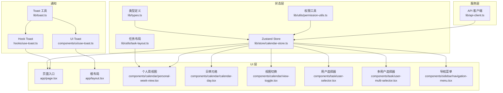
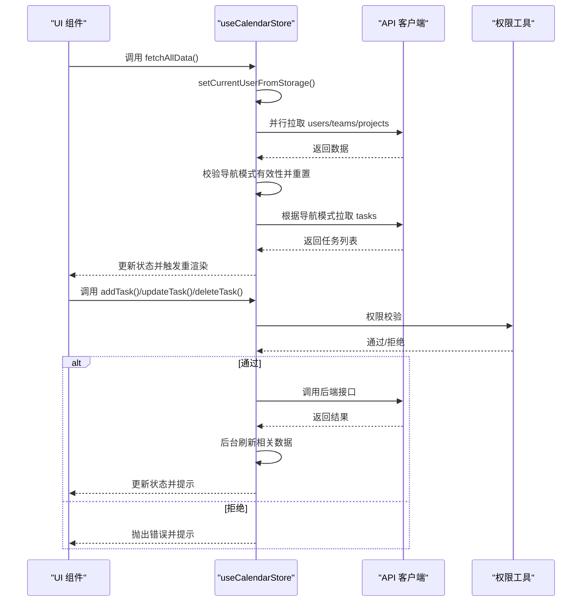
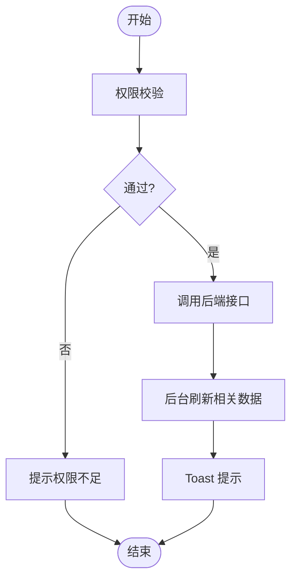
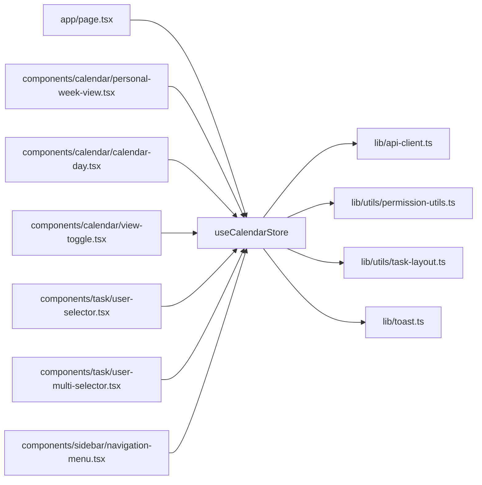

# 状态管理

<cite>
**本文引用的文件**
- [lib/store/calendar-store.ts](file://lib/store/calendar-store.ts)
- [lib/types.ts](file://lib/types.ts)
- [lib/api-client.ts](file://lib/api-client.ts)
- [lib/utils/permission-utils.ts](file://lib/utils/permission-utils.ts)
- [lib/utils/task-layout.ts](file://lib/utils/task-layout.ts)
- [components/calendar/personal-week-view.tsx](file://components/calendar/personal-week-view.tsx)
- [components/calendar/calendar-day.tsx](file://components/calendar/calendar-day.tsx)
- [components/calendar/view-toggle.tsx](file://components/calendar/view-toggle.tsx)
- [components/task/user-selector.tsx](file://components/task/user-selector.tsx)
- [components/task/user-multi-selector.tsx](file://components/task/user-multi-selector.tsx)
- [components/sidebar/navigation-menu.tsx](file://components/sidebar/navigation-menu.tsx)
- [app/page.tsx](file://app/page.tsx)
- [app/layout.tsx](file://app/layout.tsx)
- [lib/toast.ts](file://lib/toast.ts)
- [hooks/use-toast.ts](file://hooks/use-toast.ts)
- [components/ui/use-toast.ts](file://components/ui/use-toast.ts)
</cite>

## 目录
1. [简介](#简介)
2. [项目结构](#项目结构)
3. [核心组件](#核心组件)
4. [架构总览](#架构总览)
5. [详细组件分析](#详细组件分析)
6. [依赖关系分析](#依赖关系分析)
7. [性能考量](#性能考量)
8. [故障排查指南](#故障排查指南)
9. [结论](#结论)
10. [附录](#附录)

## 简介
本文件系统性阐述本项目的全局状态管理方案，采用 Zustand 构建的“日历任务管理”状态仓库，覆盖任务、用户、团队、项目等核心状态域，以及视图状态、拖拽交互、权限校验、数据持久化与中间件策略、自定义 Hook 订阅模式、状态迁移与版本兼容、调试与最佳实践等内容。目标是帮助开发者快速理解并扩展状态管理能力。

## 项目结构
围绕状态管理的关键目录与文件如下：
- 状态仓库：lib/store/calendar-store.ts（Zustand Store + persist 中间件）
- 类型定义：lib/types.ts（Task、Project、User、Team、CalendarSettings 等）
- API 客户端：lib/api-client.ts（统一的 fetch 封装、鉴权、错误处理）
- 权限工具：lib/utils/permission-utils.ts（任务权限校验）
- 任务布局：lib/utils/task-layout.ts（任务轨道分配与可视化）
- 视图与组件：components/calendar/*、components/task/*、components/sidebar/*
- 页面入口：app/page.tsx、app/layout.tsx
- 通知系统：lib/toast.ts、hooks/use-toast.ts、components/ui/use-toast.ts

图表来源
- [lib/store/calendar-store.ts](file://lib/store/calendar-store.ts#L1-L1456)
- [lib/types.ts](file://lib/types.ts#L1-L141)
- [lib/api-client.ts](file://lib/api-client.ts#L1-L525)
- [lib/utils/permission-utils.ts](file://lib/utils/permission-utils.ts#L1-L72)
- [lib/utils/task-layout.ts](file://lib/utils/task-layout.ts#L1-L77)
- [app/page.tsx](file://app/page.tsx#L25-L55)
- [app/layout.tsx](file://app/layout.tsx#L1-L45)
- [components/calendar/personal-week-view.tsx](file://components/calendar/personal-week-view.tsx#L1-L200)
- [components/calendar/calendar-day.tsx](file://components/calendar/calendar-day.tsx#L1-L164)
- [components/calendar/view-toggle.tsx](file://components/calendar/view-toggle.tsx#L1-L37)
- [components/task/user-selector.tsx](file://components/task/user-selector.tsx#L1-L40)
- [components/task/user-multi-selector.tsx](file://components/task/user-multi-selector.tsx#L1-L33)
- [components/sidebar/navigation-menu.tsx](file://components/sidebar/navigation-menu.tsx#L43-L166)
- [lib/toast.ts](file://lib/toast.ts#L1-L34)
- [hooks/use-toast.ts](file://hooks/use-toast.ts#L109-L191)
- [components/ui/use-toast.ts](file://components/ui/use-toast.ts#L71-L191)

章节来源
- [lib/store/calendar-store.ts](file://lib/store/calendar-store.ts#L1-L1456)
- [lib/types.ts](file://lib/types.ts#L1-L141)
- [lib/api-client.ts](file://lib/api-client.ts#L1-L525)

## 核心组件
- Zustand Store（useCalendarStore）
  - 状态域：任务、项目、用户、团队、当前用户、加载/错误状态、视图状态、拖拽状态、任务创建/编辑状态、设置等
  - 行为：数据加载（fetchAllData、fetchTasks、fetchProjects、fetchUsers、fetchTeams）、CRUD（add/update/delete）、视图切换、项目过滤、拖拽创建/移动、权限校验、设置更新、辅助查询（按日期/按ID）
- 类型系统
  - Task、Project、Team、User、CalendarSettings、枚举类型（ViewMode、NavigationMode、MainViewMode、ListGroupMode、ListLayoutColumns、TaskType、TaskPermission、OrgMemberRole、NotificationType、JoinRequestStatus）
- API 客户端
  - 统一封装 fetch、鉴权（Authorization Bearer）、错误处理、日期序列化/解析、各资源 CRUD
- 权限工具
  - canManageTaskInProject、canManageTaskInTeam、getPermissionDeniedMessage
- 任务布局
  - assignTaskTracks、doTasksOverlap、getMaxTrackForDate
- UI 组件与 Hook 订阅
  - 通过 useCalendarStore 订阅状态，驱动视图渲染与交互

章节来源
- [lib/store/calendar-store.ts](file://lib/store/calendar-store.ts#L33-L198)
- [lib/types.ts](file://lib/types.ts#L61-L141)
- [lib/api-client.ts](file://lib/api-client.ts#L104-L182)
- [lib/utils/permission-utils.ts](file://lib/utils/permission-utils.ts#L11-L71)
- [lib/utils/task-layout.ts](file://lib/utils/task-layout.ts#L28-L77)

## 架构总览
Zustand Store 作为单一事实来源，通过 persist 中间件将“视图配置、导航状态、筛选条件、设置”等轻量状态持久化至 localStorage；数据实体（tasks、projects、users、teams）由 API 拉取并缓存于内存，避免重复请求与跨组件共享。

图表来源
- [lib/store/calendar-store.ts](file://lib/store/calendar-store.ts#L455-L546)
- [lib/api-client.ts](file://lib/api-client.ts#L112-L182)
- [lib/utils/permission-utils.ts](file://lib/utils/permission-utils.ts#L11-L30)

## 详细组件分析

### 状态结构与持久化策略
- 状态域划分
  - 数据域：tasks、projects、users、teams、currentUser
  - 加载/错误：isLoadingTasks/Projects/Users/Teams、error
  - 视图状态：mainViewMode、listGroupMode、listLayoutColumns、viewMode、navigationMode、selectedTeamId、selectedProjectId、currentDate、selectedDate、selectedProjectIds、hideWeekends、taskBarSize
  - 拖拽：dragState、dragMoveState
  - 任务面板：taskCreation、taskEdit
  - 设置：settings（rememberLastProject、lastSelectedProjectId）
  - 辅助查询：getTasksForDate、getTasksForDateRange、getProjectById、getTeamById、getUserById
- 持久化策略（persist 中间件）
  - 仅持久化“视图配置、导航状态、筛选条件、设置”等轻量状态，避免将大量数据写入 localStorage
  - 自定义序列化/反序列化：onRehydrateStorage 将字符串日期还原为 Date 对象
  - 版本命名：storage name 为 "calendar-storage-v2"，便于后续迁移与重置
- 数据加载流程
  - fetchAllData：先从 localStorage 恢复 currentUser，再并行拉取 users/teams/projects，校验导航状态有效性，最后按导航模式拉取 tasks
  - fetchTasks/fetchProjects/fetchUsers/fetchTeams：统一 loadingDelay 控制最小加载时长，错误统一处理并通过 toast 提示

章节来源
- [lib/store/calendar-store.ts](file://lib/store/calendar-store.ts#L200-L270)
- [lib/store/calendar-store.ts](file://lib/store/calendar-store.ts#L289-L342)
- [lib/store/calendar-store.ts](file://lib/store/calendar-store.ts#L344-L453)
- [lib/store/calendar-store.ts](file://lib/store/calendar-store.ts#L455-L546)
- [lib/store/calendar-store.ts](file://lib/store/calendar-store.ts#L1423-L1455)

### 状态更新机制与权限控制
- 任务 CRUD
  - addTask：权限校验（canManageTaskInProject），调用 taskAPI.create，后台 Promise.all 刷新项目/团队/任务列表，避免阻塞
  - updateTask：权限校验，记录原任务信息，调用 taskAPI.update，根据字段变更决定是否刷新项目/团队/任务列表，并在必要时提示任务移出视图
  - deleteTask：权限校验，调用 DELETE 接口，后台刷新任务列表
- 团队/项目 CRUD
  - addTeam/updateTeam/deleteTeam/leaveTeam、addProject/updateProject/deleteProject/leaveProject：均进行权限校验与后台刷新
- 视图与筛选
  - setMainViewMode/setListGroupMode/setListLayoutColumns/setViewMode/setNavigationMode/setSelectedTeamId/setSelectedProjectId/setCurrentDate/setSelectedDate/toggleWeekends/setTaskBarSize/setError
  - toggleProjectFilter/selectAllProjects/clearProjectFilter：项目筛选逻辑
- 拖拽交互
  - startDragCreate/updateDragCreate/endDragCreate/cancelDragCreate：拖拽创建任务
  - startDragMove/updateDragMove/endDragMove/cancelDragMove：拖拽移动任务，支持 offsetDays 计算与 API 同步
  - openTaskCreation/closeTaskCreation/openTaskEdit/closeTaskEdit：任务面板状态管理
- 辅助查询
  - getTasksForDate/getTasksForDateRange/getProjectById/getTeamById/getUserById：基于当前内存状态的查询

图表来源
- [lib/store/calendar-store.ts](file://lib/store/calendar-store.ts#L551-L613)
- [lib/store/calendar-store.ts](file://lib/store/calendar-store.ts#L615-L748)
- [lib/store/calendar-store.ts](file://lib/store/calendar-store.ts#L750-L806)
- [lib/utils/permission-utils.ts](file://lib/utils/permission-utils.ts#L11-L30)

章节来源
- [lib/store/calendar-store.ts](file://lib/store/calendar-store.ts#L551-L806)
- [lib/utils/permission-utils.ts](file://lib/utils/permission-utils.ts#L11-L71)

### 自定义 Hook 设计模式与状态订阅
- 订阅模式
  - 组件通过 useCalendarStore(state => state.xxx) 订阅所需状态片段，减少不必要的重渲染
  - 示例：app/page.tsx 订阅 fetchAllData、loading/error、视图状态、任务面板状态
  - 示例：components/calendar/personal-week-view.tsx 订阅 currentDate、tasks、selectedProjectIds、hideWeekends、dragState/dragMoveState、taskBarSize 等
- Hook 设计
  - hooks/use-toast.ts 与 components/ui/use-toast.ts 提供独立的 toast 状态机与订阅机制，与业务 Store 解耦
  - lib/toast.ts 作为统一的 toast 工具，封装 success/error/warning/info

章节来源
- [app/page.tsx](file://app/page.tsx#L31-L43)
- [components/calendar/personal-week-view.tsx](file://components/calendar/personal-week-view.tsx#L10-L11)
- [hooks/use-toast.ts](file://hooks/use-toast.ts#L171-L189)
- [components/ui/use-toast.ts](file://components/ui/use-toast.ts#L171-L189)
- [lib/toast.ts](file://lib/toast.ts#L1-L34)

### 状态迁移、版本兼容与数据恢复
- 版本命名：storage name 为 "calendar-storage-v2"，便于未来迁移
- 部分化持久化：仅持久化视图配置、导航状态、筛选条件、设置，避免历史数据污染
- 日期序列化：onRehydrateStorage 将字符串日期还原为 Date 对象，保证 UI 正确渲染
- 数据恢复：fetchAllData 会从 localStorage 恢复 currentUser，并校验导航状态有效性，必要时重置为 My Days

章节来源
- [lib/store/calendar-store.ts](file://lib/store/calendar-store.ts#L1423-L1455)
- [lib/store/calendar-store.ts](file://lib/store/calendar-store.ts#L455-L527)

### 任务布局与可视化
- assignTaskTracks：为重叠任务分配轨道，确保同一时间段内的任务在同一轨道内不重叠
- doTasksOverlap：判断任务日期范围是否重叠
- getMaxTrackForDate：计算某一天的最大轨道数，用于确定容器高度
- 与 UI 的结合：personal-week-view.tsx 与 calendar-day.tsx 使用 assignTaskTracks 与 getMaxTrackForDate 计算轨道并渲染任务条

章节来源
- [lib/utils/task-layout.ts](file://lib/utils/task-layout.ts#L28-L77)
- [components/calendar/personal-week-view.tsx](file://components/calendar/personal-week-view.tsx#L46-L94)
- [components/calendar/calendar-day.tsx](file://components/calendar/calendar-day.tsx#L38-L86)

### 权限模型与权限检查
- 任务权限类型：ALL_MEMBERS（所有成员）、CREATOR_ONLY（仅创建人）
- 权限检查：
  - canManageTaskInProject：项目成员 + 项目权限设置
  - canManageTaskInTeam：团队成员 + 团队权限设置
  - getPermissionDeniedMessage：生成权限不足提示
- 在任务 CRUD 中贯穿使用，确保操作安全

章节来源
- [lib/types.ts](file://lib/types.ts#L3-L4)
- [lib/utils/permission-utils.ts](file://lib/utils/permission-utils.ts#L11-L71)
- [lib/store/calendar-store.ts](file://lib/store/calendar-store.ts#L551-L613)

### 通知系统与错误处理
- lib/toast.ts：统一的 toast 工具，封装 success/error/warning/info
- hooks/use-toast.ts 与 components/ui/use-toast.ts：提供独立的状态机与订阅机制，支持 add/update/dismiss/remove
- 在 API 错误与权限错误时，通过 showToast.error 提示用户

章节来源
- [lib/toast.ts](file://lib/toast.ts#L1-L34)
- [hooks/use-toast.ts](file://hooks/use-toast.ts#L109-L191)
- [components/ui/use-toast.ts](file://components/ui/use-toast.ts#L71-L191)
- [lib/store/calendar-store.ts](file://lib/store/calendar-store.ts#L321-L341)

## 依赖关系分析
- 组件对 Store 的依赖
  - app/page.tsx：订阅 fetchAllData、loading/error、视图状态、任务面板状态
  - components/calendar/*：订阅日期、任务、拖拽状态、视图配置
  - components/task/*：订阅用户列表、用户查询
  - components/sidebar/navigation-menu.tsx：订阅团队/项目 CRUD、导航模式切换
- Store 对外部模块的依赖
  - API 客户端：taskAPI/projectAPI/userAPI/teamAPI
  - 权限工具：canManageTaskInProject/canManageTaskInTeam/getPermissionDeniedMessage
  - 任务布局：assignTaskTracks/getMaxTrackForDate
  - 通知：showToast

图表来源
- [app/page.tsx](file://app/page.tsx#L31-L43)
- [components/calendar/personal-week-view.tsx](file://components/calendar/personal-week-view.tsx#L10-L11)
- [components/calendar/calendar-day.tsx](file://components/calendar/calendar-day.tsx#L34-L35)
- [components/calendar/view-toggle.tsx](file://components/calendar/view-toggle.tsx#L7-L8)
- [components/task/user-selector.tsx](file://components/task/user-selector.tsx#L25-L26)
- [components/task/user-multi-selector.tsx](file://components/task/user-multi-selector.tsx#L26-L27)
- [components/sidebar/navigation-menu.tsx](file://components/sidebar/navigation-menu.tsx#L43-L48)
- [lib/store/calendar-store.ts](file://lib/store/calendar-store.ts#L17-L23)
- [lib/api-client.ts](file://lib/api-client.ts#L1-L525)
- [lib/utils/permission-utils.ts](file://lib/utils/permission-utils.ts#L1-L72)
- [lib/utils/task-layout.ts](file://lib/utils/task-layout.ts#L1-L77)
- [lib/toast.ts](file://lib/toast.ts#L1-L34)

章节来源
- [app/page.tsx](file://app/page.tsx#L31-L43)
- [components/calendar/personal-week-view.tsx](file://components/calendar/personal-week-view.tsx#L10-L11)
- [components/calendar/calendar-day.tsx](file://components/calendar/calendar-day.tsx#L34-L35)
- [components/calendar/view-toggle.tsx](file://components/calendar/view-toggle.tsx#L7-L8)
- [components/task/user-selector.tsx](file://components/task/user-selector.tsx#L25-L26)
- [components/task/user-multi-selector.tsx](file://components/task/user-multi-selector.tsx#L26-L27)
- [components/sidebar/navigation-menu.tsx](file://components/sidebar/navigation-menu.tsx#L43-L48)
- [lib/store/calendar-store.ts](file://lib/store/calendar-store.ts#L17-L23)

## 性能考量
- 最小化订阅粒度：组件仅订阅所需状态，降低重渲染频率
- 并行加载：fetchAllData 内部 Promise.all 并行拉取用户/团队/项目，缩短首屏加载时间
- 后台刷新：任务 CRUD 成功后，使用 Promise.all 在后台刷新相关数据，避免阻塞用户操作
- loadingDelay：统一控制最小加载时长，改善用户体验
- 任务轨道计算：assignTaskTracks 与 getMaxTrackForDate 仅在任务集合变化时重新计算，避免频繁重排

章节来源
- [lib/store/calendar-store.ts](file://lib/store/calendar-store.ts#L473-L477)
- [lib/store/calendar-store.ts](file://lib/store/calendar-store.ts#L580-L605)
- [lib/store/calendar-store.ts](file://lib/store/calendar-store.ts#L659-L662)
- [lib/utils/task-layout.ts](file://lib/utils/task-layout.ts#L28-L77)

## 故障排查指南
- 认证失效
  - API 客户端在 401 时清除 token 并抛出错误；Store 在 fetchTasks 中识别认证类错误并设置全局 error
  - 建议：引导用户重新登录，或在页面中检测 currentUser 与 token 缺失时跳转登录页
- 权限不足
  - Store 在任务 CRUD 前调用权限工具进行校验，失败时通过 showToast.error 提示
  - 建议：在 UI 中根据 error 状态显示友好提示，并提供权限说明
- 数据不一致
  - 拖拽移动任务失败时，Store 会在 catch 分支重新拉取任务列表，保证本地状态与后端一致
  - 建议：在 UI 中提供“撤销/重试”操作提示
- 本地持久化异常
  - 若 localStorage 中的日期字符串无法解析，onRehydrateStorage 会尝试转换；若仍失败，建议清理 storage 或迁移版本

章节来源
- [lib/api-client.ts](file://lib/api-client.ts#L72-L82)
- [lib/store/calendar-store.ts](file://lib/store/calendar-store.ts#L321-L341)
- [lib/store/calendar-store.ts](file://lib/store/calendar-store.ts#L1254-L1258)
- [lib/store/calendar-store.ts](file://lib/store/calendar-store.ts#L1443-L1452)
- [app/page.tsx](file://app/page.tsx#L46-L54)

## 结论
本项目采用 Zustand 构建的全局状态管理方案，通过清晰的状态域划分、严格的权限控制、完善的持久化策略与 UI 订阅模式，实现了日历任务管理的高效与稳定。配合任务轨道算法与并行加载策略，兼顾了性能与用户体验。建议在后续迭代中持续关注状态订阅粒度、错误边界与版本迁移策略，以进一步提升可维护性与扩展性。

## 附录
- 扩展建议
  - 引入 selector 优化：对复杂查询（如 getTasksForDateRange）使用 selector 函数，避免每次重渲染
  - 状态快照与回放：在开发环境增加状态导出/导入，便于问题复现
  - 中间件增强：考虑引入 devtools 中间件（开发环境）与 undo/redo 中间件（高风险操作）
  - 数据一致性：在关键路径增加乐观更新与回滚策略，提升交互流畅度