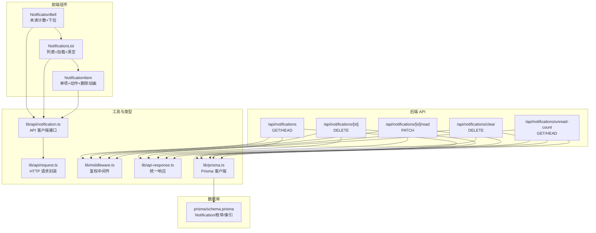
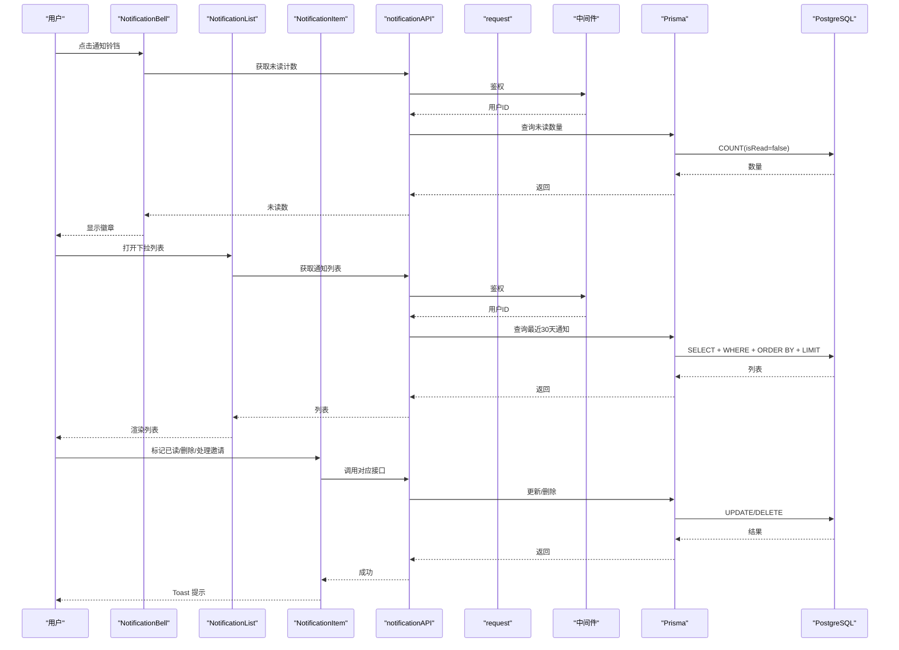
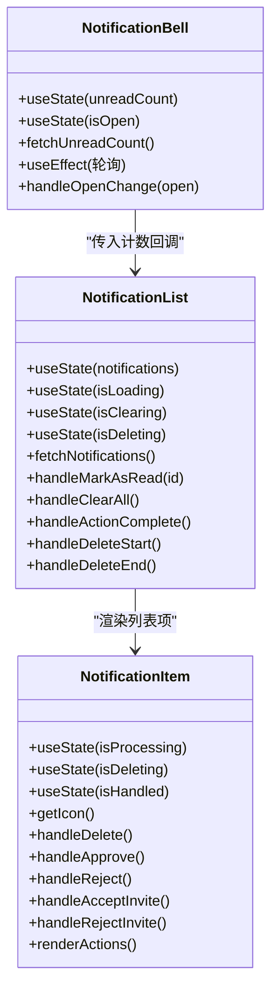
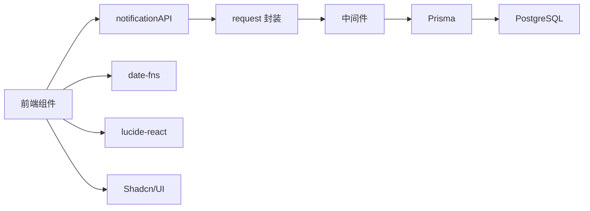

# 通知系统

<cite>
**本文引用的文件**
- [app/api/notifications/route.ts](file://app/api/notifications/route.ts)
- [app/api/notifications/[id]/route.ts](file://app/api/notifications/[id]/route.ts)
- [app/api/notifications/[id]/read/route.ts](file://app/api/notifications/[id]/read/route.ts)
- [app/api/notifications/clear/route.ts](file://app/api/notifications/clear/route.ts)
- [app/api/notifications/unread-count/route.ts](file://app/api/notifications/unread-count/route.ts)
- [components/notification-bell.tsx](file://components/notification-bell.tsx)
- [components/notification-list.tsx](file://components/notification-list.tsx)
- [components/notification-item.tsx](file://components/notification-item.tsx)
- [lib/api/notification.ts](file://lib/api/notification.ts)
- [lib/api/request.ts](file://lib/api/request.ts)
- [lib/api/organization.ts](file://lib/api/organization.ts)
- [lib/api-client.ts](file://lib/api-client.ts)
- [lib/middleware.ts](file://lib/middleware.ts)
- [lib/api-response.ts](file://lib/api-response.ts)
- [lib/prisma.ts](file://lib/prisma.ts)
- [hooks/use-toast.ts](file://hooks/use-toast.ts)
- [lib/toast.ts](file://lib/toast.ts)
- [prisma/schema.prisma](file://prisma/schema.prisma)
- [NOTIFICATION_SYSTEM.md](file://NOTIFICATION_SYSTEM.md)
- [scripts/test-notifications.ts](file://scripts/test-notifications.ts)
</cite>

## 目录
1. [简介](#简介)
2. [项目结构](#项目结构)
3. [核心组件](#核心组件)
4. [架构总览](#架构总览)
5. [详细组件分析](#详细组件分析)
6. [依赖分析](#依赖分析)
7. [性能考虑](#性能考虑)
8. [故障排查指南](#故障排查指南)
9. [结论](#结论)
10. [附录](#附录)

## 简介
本通知系统是日历任务管理系统中的站内消息通知子系统，采用“关系型数据库 + JSON 元数据”的混合存储方案，支持组织与任务相关的多种通知类型，并提供完整的前后端交互流程。系统具备：
- 通知类型：组织加入申请、邀请、成员变更、任务创建/更新/删除/分配等
- 通知触发：后端业务逻辑在关键事件发生时创建通知
- 通知展示：前端下拉式通知栏，支持未读计数、标记已读、批量清空、逐条删除
- 实时推送：提供 WebSocket 扩展方案（可选）
- 持久化策略：PostgreSQL + 索引优化 + 历史清理脚本

## 项目结构
通知系统涉及的后端 API、前端组件、数据库模型与工具函数分布如下：



图表来源
- [app/api/notifications/route.ts](file://app/api/notifications/route.ts#L6-L82)
- [app/api/notifications/[id]/route.ts](file://app/api/notifications/[id]/route.ts#L6-L43)
- [app/api/notifications/[id]/read/route.ts](file://app/api/notifications/[id]/read/route.ts#L6-L45)
- [app/api/notifications/clear/route.ts](file://app/api/notifications/clear/route.ts#L6-L25)
- [app/api/notifications/unread-count/route.ts](file://app/api/notifications/unread-count/route.ts#L6-L33)
- [components/notification-bell.tsx](file://components/notification-bell.tsx#L16-L76)
- [components/notification-list.tsx](file://components/notification-list.tsx#L17-L177)
- [components/notification-item.tsx](file://components/notification-item.tsx#L30-L364)
- [lib/api/notification.ts](file://lib/api/notification.ts#L20-L70)
- [lib/api/request.ts](file://lib/api/request.ts)
- [lib/middleware.ts](file://lib/middleware.ts)
- [lib/api-response.ts](file://lib/api-response.ts)
- [lib/prisma.ts](file://lib/prisma.ts)
- [prisma/schema.prisma](file://prisma/schema.prisma#L221-L254)

章节来源
- [app/api/notifications/route.ts](file://app/api/notifications/route.ts#L6-L82)
- [components/notification-bell.tsx](file://components/notification-bell.tsx#L16-L76)
- [lib/api/notification.ts](file://lib/api/notification.ts#L20-L70)
- [prisma/schema.prisma](file://prisma/schema.prisma#L221-L254)

## 核心组件
- 后端 API
  - 获取通知列表：支持筛选未读、限制时间窗口与数量
  - 获取未读计数：快速统计
  - 标记已读：按通知 ID 更新状态
  - 删除单条通知：鉴权校验后删除
  - 清空所有通知：批量删除当前用户的通知
- 前端组件
  - NotificationBell：显示未读徽章，定时轮询更新
  - NotificationList：加载列表、标记已读、清空、删除动画
  - NotificationItem：按类型渲染图标、相对时间、动作按钮、删除交互
- 工具与类型
  - notificationAPI：统一的前端 API 客户端
  - request：HTTP 请求封装
  - 中间件与响应：鉴权、统一响应体
  - Prisma：数据库访问

章节来源
- [app/api/notifications/route.ts](file://app/api/notifications/route.ts#L6-L82)
- [app/api/notifications/unread-count/route.ts](file://app/api/notifications/unread-count/route.ts#L6-L33)
- [app/api/notifications/[id]/read/route.ts](file://app/api/notifications/[id]/read/route.ts#L6-L45)
- [app/api/notifications/[id]/route.ts](file://app/api/notifications/[id]/route.ts#L6-L43)
- [app/api/notifications/clear/route.ts](file://app/api/notifications/clear/route.ts#L6-L25)
- [components/notification-bell.tsx](file://components/notification-bell.tsx#L16-L76)
- [components/notification-list.tsx](file://components/notification-list.tsx#L17-L177)
- [components/notification-item.tsx](file://components/notification-item.tsx#L30-L364)
- [lib/api/notification.ts](file://lib/api/notification.ts#L20-L70)
- [lib/api/request.ts](file://lib/api/request.ts)
- [lib/middleware.ts](file://lib/middleware.ts)
- [lib/api-response.ts](file://lib/api-response.ts)
- [lib/prisma.ts](file://lib/prisma.ts)

## 架构总览
通知系统采用“后端 API + 前端组件 + 数据库存储”的分层架构。后端通过 Next.js API Routes 提供 REST 接口；前端通过 notificationAPI 调用接口，使用 use-toast 提供的 Toast 组件进行轻提示；数据库采用 PostgreSQL + Prisma，使用复合索引优化查询。



图表来源
- [components/notification-bell.tsx](file://components/notification-bell.tsx#L20-L44)
- [components/notification-list.tsx](file://components/notification-list.tsx#L24-L100)
- [components/notification-item.tsx](file://components/notification-item.tsx#L70-L171)
- [lib/api/notification.ts](file://lib/api/notification.ts#L24-L68)
- [lib/api/request.ts](file://lib/api/request.ts)
- [lib/middleware.ts](file://lib/middleware.ts)
- [lib/prisma.ts](file://lib/prisma.ts)
- [prisma/schema.prisma](file://prisma/schema.prisma#L221-L254)

## 详细组件分析

### 后端 API 设计
- 获取通知列表
  - 支持查询参数 unreadOnly，按创建时间倒序，限制最近30天最多100条
  - 对特定类型通知（如组织加入申请）动态附加请求状态字段
- 获取未读计数
  - 快速统计当前用户未读通知数量
- 标记已读
  - 校验通知归属，更新 isRead 与 readAt
- 删除单条通知
  - 校验归属后删除
- 清空所有通知
  - 删除当前用户的所有通知

```mermaid
flowchart TD
Start(["请求进入"]) --> Auth["鉴权中间件"]
Auth --> |失败| Err403["返回错误"]
Auth --> |成功| Route{"路由匹配"}
Route --> |GET /api/notifications| List["查询最近30天通知<br/>最多100条<br/>可筛选未读"]
Route --> |GET /api/notifications/unread-count| Count["COUNT(isRead=false)"]
Route --> |PATCH /api/notifications/[id]/read| Mark["校验归属并更新已读"]
Route --> |DELETE /api/notifications/[id]| DelOne["校验归属并删除"]
Route --> |DELETE /api/notifications/clear| DelAll["删除当前用户所有通知"]
List --> Resp["统一响应"]
Count --> Resp
Mark --> Resp
DelOne --> Resp
DelAll --> Resp
Err403 --> End(["结束"])
Resp --> End
```

图表来源
- [app/api/notifications/route.ts](file://app/api/notifications/route.ts#L6-L82)
- [app/api/notifications/unread-count/route.ts](file://app/api/notifications/unread-count/route.ts#L6-L33)
- [app/api/notifications/[id]/read/route.ts](file://app/api/notifications/[id]/read/route.ts#L6-L45)
- [app/api/notifications/[id]/route.ts](file://app/api/notifications/[id]/route.ts#L6-L43)
- [app/api/notifications/clear/route.ts](file://app/api/notifications/clear/route.ts#L6-L25)
- [lib/middleware.ts](file://lib/middleware.ts)
- [lib/api-response.ts](file://lib/api-response.ts)

章节来源
- [app/api/notifications/route.ts](file://app/api/notifications/route.ts#L6-L82)
- [app/api/notifications/unread-count/route.ts](file://app/api/notifications/unread-count/route.ts#L6-L33)
- [app/api/notifications/[id]/read/route.ts](file://app/api/notifications/[id]/read/route.ts#L6-L45)
- [app/api/notifications/[id]/route.ts](file://app/api/notifications/[id]/route.ts#L6-L43)
- [app/api/notifications/clear/route.ts](file://app/api/notifications/clear/route.ts#L6-L25)

### 前端组件设计
- NotificationBell
  - 定时轮询（每30秒）获取未读计数，打开下拉时刷新
  - 未读数大于0时显示徽章，超过99显示“99+”
- NotificationList
  - 首次加载时获取通知列表，计算未读数量并回调更新
  - 支持清空全部通知，带确认与加载覆盖层
  - 支持逐条标记已读，本地即时更新
- NotificationItem
  - 按通知类型渲染图标与动作按钮（同意/拒绝、接受/拒绝邀请）
  - 支持删除动画与删除过程的状态控制
  - 相对时间显示，未读项高亮



图表来源
- [components/notification-bell.tsx](file://components/notification-bell.tsx#L16-L76)
- [components/notification-list.tsx](file://components/notification-list.tsx#L17-L177)
- [components/notification-item.tsx](file://components/notification-item.tsx#L30-L364)

章节来源
- [components/notification-bell.tsx](file://components/notification-bell.tsx#L16-L76)
- [components/notification-list.tsx](file://components/notification-list.tsx#L17-L177)
- [components/notification-item.tsx](file://components/notification-item.tsx#L30-L364)

### 通知类型与触发条件
系统支持的通知类型与典型触发场景如下（部分类型来自数据库枚举扩展）：
- ORG_JOIN_REQUEST：用户申请加入组织（无邀请码），通知组织创建人
- ORG_JOIN_APPROVED：管理员批准申请，通知申请人
- ORG_JOIN_REJECTED：管理员拒绝申请，通知申请人
- ORG_INVITE_RECEIVED：收到组织邀请，通知受邀用户
- ORG_INVITE_ACCEPTED：用户接受邀请，通知邀请人
- ORG_INVITE_REJECTED：用户拒绝邀请，通知邀请人
- ORG_MEMBER_REMOVED：被从组织移除
- TEAM_DELETED：团队被删除
- PROJECT_DELETED：项目被删除
- USER_INVITED_JOINED：你邀请的用户已加入组织
- TASK_CREATED：在所属项目/团队中创建任务，通知其他成员
- TASK_UPDATED：任务被修改，通知负责人
- TASK_DELETED：任务被删除，通知负责人
- TASK_ASSIGNED：任务被分配给你

章节来源
- [prisma/schema.prisma](file://prisma/schema.prisma#L238-L254)
- [NOTIFICATION_SYSTEM.md](file://NOTIFICATION_SYSTEM.md#L89-L274)
- [scripts/test-notifications.ts](file://scripts/test-notifications.ts#L24-L54)

### 通知内容格式与展示方式
- 内容格式
  - title：简短标题
  - content：详细内容
  - metadata：JSON 结构，承载动态参数（如任务ID、申请人ID、邀请ID等）
  - isRead：布尔值，默认 false
  - createdAt/readAt：时间戳
- 展示方式
  - 未读项高亮背景
  - 相对时间显示（如“5分钟前”）
  - 按类型渲染图标
  - 支持“标记已读”、“删除”、“处理邀请/申请”等交互

章节来源
- [components/notification-item.tsx](file://components/notification-item.tsx#L291-L361)
- [prisma/schema.prisma](file://prisma/schema.prisma#L221-L236)

### 通知存储结构与状态管理
- 数据库模型
  - Notification 表：包含 userId、type、title、content、metadata、isRead、createdAt、readAt
  - 索引：(userId, isRead)、createdAt
- 状态管理
  - 前端本地维护未读计数与列表状态
  - 后端按用户维度管理通知状态，支持标记已读与批量清空

章节来源
- [prisma/schema.prisma](file://prisma/schema.prisma#L221-L236)
- [components/notification-list.tsx](file://components/notification-list.tsx#L30-L58)

### 通知 API 设计
- GET /api/notifications
  - 查询参数：unreadOnly（可选）
  - 返回：最近30天最多100条通知，按创建时间倒序
- GET /api/notifications/unread-count
  - 返回：当前用户未读通知数量
- PATCH /api/notifications/[id]/read
  - 更新指定通知为已读并记录 readAt
- DELETE /api/notifications/[id]
  - 删除指定通知（需归属校验）
- DELETE /api/notifications/clear
  - 清空当前用户所有通知

章节来源
- [app/api/notifications/route.ts](file://app/api/notifications/route.ts#L6-L82)
- [app/api/notifications/unread-count/route.ts](file://app/api/notifications/unread-count/route.ts#L6-L33)
- [app/api/notifications/[id]/read/route.ts](file://app/api/notifications/[id]/read/route.ts#L6-L45)
- [app/api/notifications/[id]/route.ts](file://app/api/notifications/[id]/route.ts#L6-L43)
- [app/api/notifications/clear/route.ts](file://app/api/notifications/clear/route.ts#L6-L25)

### 实时推送机制与扩展
- WebSocket 扩展
  - 服务端：初始化 Socket.IO，按用户房间广播通知
  - 客户端：连接后监听 notification 事件，显示 Toast 并刷新未读计数
- 注意：当前仓库未包含 WebSocket 服务端与客户端集成代码，上述为可选扩展方案

章节来源
- [NOTIFICATION_SYSTEM.md](file://NOTIFICATION_SYSTEM.md#L793-L853)

### 通知持久化策略
- 历史清理
  - 定时任务删除旧的已读通知（如6个月前）
  - 或归档到历史表（可选）
- 索引优化
  - 复合索引 (userId, isRead) 与 createdAt 索引提升查询性能

章节来源
- [NOTIFICATION_SYSTEM.md](file://NOTIFICATION_SYSTEM.md#L746-L791)
- [prisma/schema.prisma](file://prisma/schema.prisma#L234-L235)

### 通知配置、偏好与屏蔽
- 当前实现
  - 未发现专门的“用户偏好设置”或“通知屏蔽”功能
  - 通知类型来源于数据库枚举，可在后端创建时按需选择
- 扩展建议
  - 引入用户偏好表，记录各类型通知的启用/禁用状态
  - 在创建通知时根据用户偏好过滤

章节来源
- [prisma/schema.prisma](file://prisma/schema.prisma#L238-L254)

### 通知组件实现、用户交互与视觉反馈
- 用户交互
  - 点击铃铛：打开下拉，首次打开刷新未读计数
  - 列表：滚动查看，支持清空与逐条删除
  - 单项：未读项可一键标记已读；支持处理邀请/申请的动作按钮
- 视觉反馈
  - 未读项高亮背景
  - 相对时间显示
  - 删除动画与加载覆盖层
  - Toast 轻提示（成功/失败）

章节来源
- [components/notification-bell.tsx](file://components/notification-bell.tsx#L30-L44)
- [components/notification-list.tsx](file://components/notification-list.tsx#L69-L100)
- [components/notification-item.tsx](file://components/notification-item.tsx#L70-L104)
- [hooks/use-toast.ts](file://hooks/use-toast.ts#L142-L169)

## 依赖分析
- 组件耦合
  - 前端组件通过 notificationAPI 调用后端接口，解耦良好
  - notificationAPI 依赖 request 封装与中间件鉴权
- 数据依赖
  - 后端 API 依赖 Prisma 访问 PostgreSQL
  - 数据模型与索引直接影响查询性能
- 外部依赖
  - date-fns 用于相对时间格式化
  - lucide-react 图标库
  - Shadcn/UI 组件库（Button、Badge、DropdownMenu、Toast 等）



图表来源
- [lib/api/notification.ts](file://lib/api/notification.ts#L20-L70)
- [lib/api/request.ts](file://lib/api/request.ts)
- [lib/middleware.ts](file://lib/middleware.ts)
- [lib/prisma.ts](file://lib/prisma.ts)
- [hooks/use-toast.ts](file://hooks/use-toast.ts#L1-L192)

章节来源
- [lib/api/notification.ts](file://lib/api/notification.ts#L20-L70)
- [lib/api/request.ts](file://lib/api/request.ts)
- [lib/middleware.ts](file://lib/middleware.ts)
- [lib/prisma.ts](file://lib/prisma.ts)
- [hooks/use-toast.ts](file://hooks/use-toast.ts#L1-L192)

## 性能考虑
- 数据库层面
  - 复合索引 (userId, isRead) 与 createdAt 索引
  - 查询限制：最近30天、最多100条
- API 层面
  - 未读计数使用 COUNT 查询
  - 批量创建通知减少往返（后端业务逻辑中已有 createMany 示例）
- 前端层面
  - 30秒轮询未读计数
  - 删除与清空操作使用加载覆盖层提升体验
- 可选优化
  - Redis 缓存未读计数
  - 虚拟滚动渲染大量通知
  - 分页查询（可选扩展）

章节来源
- [NOTIFICATION_SYSTEM.md](file://NOTIFICATION_SYSTEM.md#L641-L743)
- [app/api/notifications/route.ts](file://app/api/notifications/route.ts#L17-L38)
- [components/notification-bell.tsx](file://components/notification-bell.tsx#L33-L37)

## 故障排查指南
- 常见问题
  - 无权限操作通知：检查鉴权中间件与归属校验
  - 未读计数不更新：确认轮询逻辑与错误处理
  - 删除/清空失败：查看前端 Toast 提示与后端错误响应
- 日志与监控
  - 后端打印关键操作日志（创建通知、标记已读、删除等）
  - 监控指标：未读数量、消息创建速率、已读率、查询性能

章节来源
- [app/api/notifications/[id]/route.ts](file://app/api/notifications/[id]/route.ts#L17-L28)
- [app/api/notifications/[id]/read/route.ts](file://app/api/notifications/[id]/read/route.ts#L22-L28)
- [NOTIFICATION_SYSTEM.md](file://NOTIFICATION_SYSTEM.md#L960-L977)

## 结论
通知系统以简洁可靠的架构实现了站内消息的创建、存储、展示与交互。通过合理的数据库索引与查询限制，保证了性能与可维护性；前端组件提供了良好的用户体验与反馈。未来可扩展的方向包括：实时推送（WebSocket）、用户偏好与屏蔽、国际化模板、以及更丰富的通知类型与聚合策略。

## 附录
- 测试脚本
  - 提供测试数据创建脚本，便于验证通知流程（申请、通知、查看）
- 文档参考
  - 系统设计文档：涵盖数据库设计、消息类型、API 接口、前端组件、性能优化与扩展方案

章节来源
- [scripts/test-notifications.ts](file://scripts/test-notifications.ts#L1-L80)
- [NOTIFICATION_SYSTEM.md](file://NOTIFICATION_SYSTEM.md#L1-L1066)