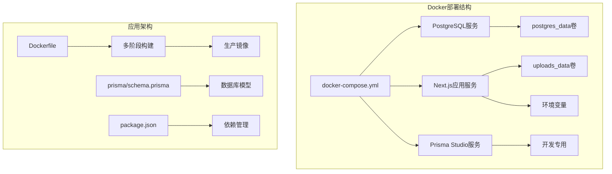
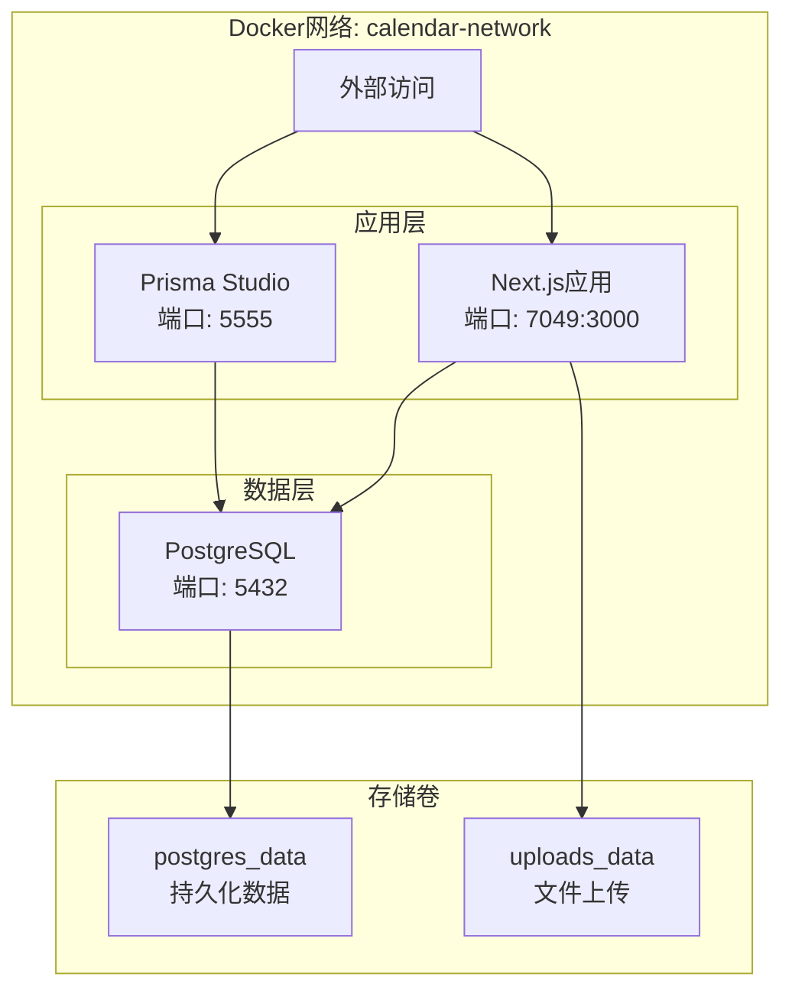
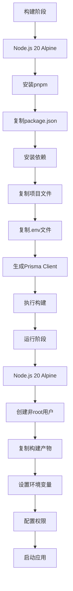
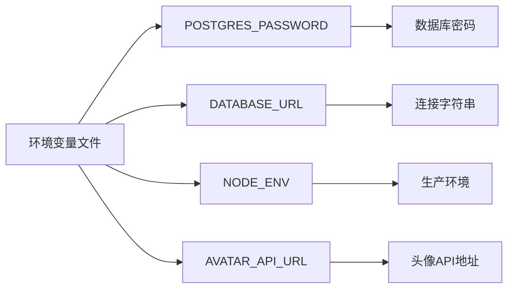
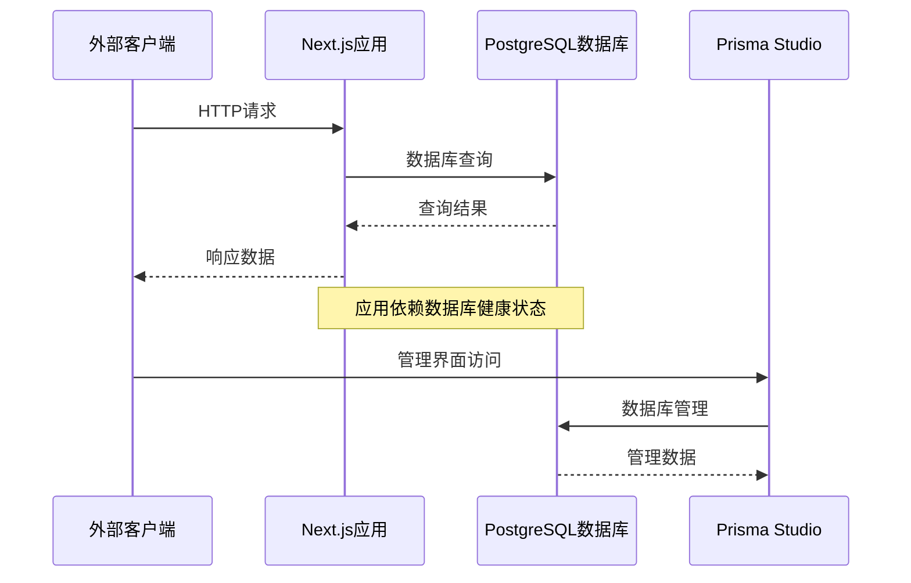
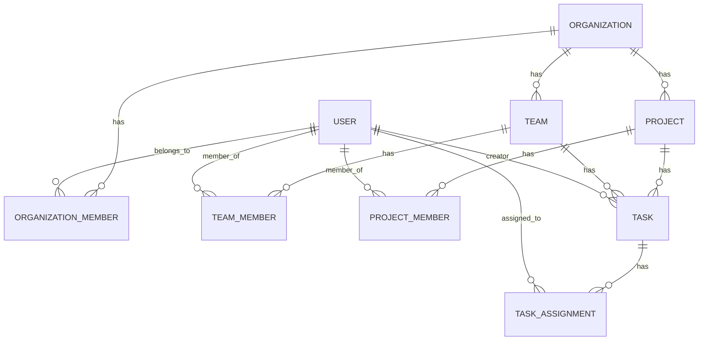
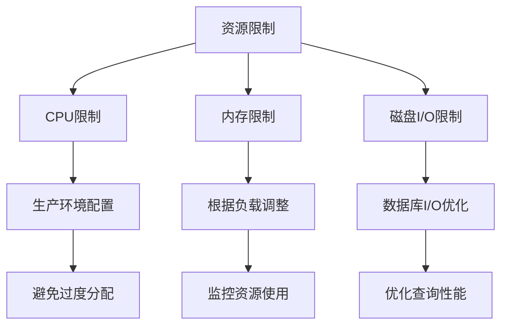
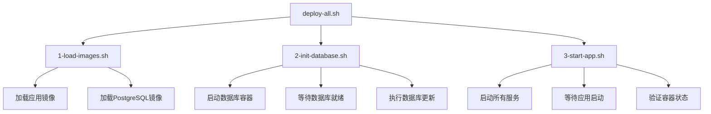

# Docker容器化部署

<cite>
**本文档引用的文件**
- [docker-compose.yml](file://docker-compose.yml)
- [Dockerfile](file://Dockerfile)
- [.dockerignore](file://.dockerignore)
- [.env.docker](file://.env.docker)
- [package.json](file://package.json)
- [prisma/schema.prisma](file://prisma/schema.prisma)
- [DOCKER_DEPLOYMENT.md](file://DOCKER_DEPLOYMENT.md)
- [DEPLOY_2025.11.19.md](file://DEPLOY_2025.11.19.md)
- [deploy/DEPLOYMENT.md](file://deploy/DEPLOYMENT.md)
- [OFFLINE_DEPLOYMENT.md](file://OFFLINE_DEPLOYMENT.md)
- [deploy/scripts/deploy-all.sh](file://deploy/scripts/deploy-all.sh)
- [deploy/scripts/1-load-images.sh](file://deploy/scripts/1-load-images.sh)
- [deploy/scripts/2-init-database.sh](file://deploy/scripts/2-init-database.sh)
- [deploy/scripts/3-start-app.sh](file://deploy/scripts/3-start-app.sh)
</cite>

## 更新摘要
**所做更改**
- 更新了Docker镜像标签从`calendar-task-manager:company-2026-1-1`到`calendar-task-manager:personal-2026-1-1`
- 更新了部署目标从企业级向个人开发者和小团队的战略转移
- 更新了Prisma Studio镜像标签从`calendar-task-manager:2025-11-29`到`calendar-task-manager:2025-11-29`
- 更新了相关的部署流程和环境配置说明
- 强调了个人版部署的简化配置和优化

## 目录
1. [简介](#简介)
2. [项目结构](#项目结构)
3. [核心组件](#核心组件)
4. [架构概览](#架构概览)
5. [详细组件分析](#详细组件分析)
6. [依赖关系分析](#依赖关系分析)
7. [性能考虑](#性能考虑)
8. [故障排除指南](#故障排除指南)
9. [结论](#结论)
10. [附录](#附录)

## 简介

本指南详细介绍如何使用Docker Compose对日历任务管理系统进行容器化部署。该系统采用现代化的微服务架构，包含PostgreSQL数据库、Next.js前端应用和Prisma Studio管理界面三个核心服务。文档涵盖了完整的部署流程、配置参数说明、环境变量设置、端口映射、卷挂载以及健康检查配置。

**更新** 部署目标已从企业级向个人开发者和小团队转移，镜像标签从`:company-2026-1-1`更新为`:personal-2026-1-1`，反映了更简洁的部署策略和更低的资源消耗需求。

## 项目结构

该项目采用标准的Next.js项目结构，结合Docker容器化部署需求进行了专门优化：



**图表来源**
- [docker-compose.yml](file://docker-compose.yml#L1-L77)
- [Dockerfile](file://Dockerfile#L1-L72)

**章节来源**
- [docker-compose.yml](file://docker-compose.yml#L1-L77)
- [Dockerfile](file://Dockerfile#L1-L72)

## 核心组件

### PostgreSQL数据库服务

PostgreSQL服务是系统的核心数据存储，采用官方Alpine Linux镜像以确保最小化体积和安全性。

**关键配置特性：**
- **镜像版本**: postgres:16-alpine
- **容器命名**: calendar-postgres
- **重启策略**: unless-stopped（除非手动停止）
- **数据持久化**: 使用postgres_data卷
- **健康检查**: 每10秒检查一次数据库连接

### Next.js应用服务

应用服务基于Node.js 20 Alpine镜像，实现了完整的多阶段构建优化。

**核心特性：**
- **镜像**: calendar-task-manager:personal-2026-1-1 **（个人版标签）**
- **端口映射**: 7049:3000（宿主:容器）
- **环境变量**: 包含数据库连接、节点环境、头像API配置
- **数据卷**: 挂载上传文件目录
- **依赖关系**: 严格依赖PostgreSQL服务健康状态

### Prisma Studio服务

开发专用的数据库管理界面，仅在开发配置文件中启用。

**配置特点：**
- **端口**: 5555（Prisma Studio默认端口）
- **环境变量**: 与应用共享相同的数据库连接
- **启动条件**: 仅在profiles: dev条件下启动
- **命令**: npx prisma studio --port 5555 --hostname 0.0.0.0

**章节来源**
- [docker-compose.yml](file://docker-compose.yml#L5-L66)

## 架构概览

系统采用三容器架构，通过Docker网络实现服务间通信：



**图表来源**
- [docker-compose.yml](file://docker-compose.yml#L74-L77)
- [docker-compose.yml](file://docker-compose.yml#L68-L72)

## 详细组件分析

### Dockerfile多阶段构建分析

应用采用两阶段构建策略，最大化优化镜像大小和安全性：



**图表来源**
- [Dockerfile](file://Dockerfile#L1-L72)

**构建阶段特性：**
- **构建参数**: ENV_TYPE=personal（支持个人版配置）
- **依赖安装**: 使用pnpm替代npm，提升安装速度
- **Prisma集成**: 在构建阶段生成客户端代码
- **多阶段优化**: 最终镜像仅包含运行时必需文件

**运行阶段优化：**
- **安全用户**: 使用non-root用户运行应用
- **环境变量**: 设置NODE_ENV=production和NEXT_TELEMETRY_DISABLED=1
- **文件权限**: 正确设置文件所有权
- **端口配置**: 暴露3000端口，设置HOSTNAME=0.0.0.0

**章节来源**
- [Dockerfile](file://Dockerfile#L1-L72)

### docker-compose.yml配置详解

#### PostgreSQL服务配置

| 参数 | 值 | 说明 |
|------|-----|------|
| image | postgres:16-alpine | 数据库镜像版本 |
| container_name | calendar-postgres | 容器名称 |
| restart | unless-stopped | 重启策略 |
| POSTGRES_USER | postgres | 默认用户 |
| POSTGRES_PASSWORD | ${POSTGRES_PASSWORD:-postgres} | 环境变量密码 |
| POSTGRES_DB | calendar_tasks | 数据库名称 |
| ports | 5432:5432 | 端口映射 |
| volumes | postgres_data:/var/lib/postgresql/data | 数据卷 |

#### Next.js应用服务配置

| 参数 | 值 | 说明 |
|------|-----|------|
| image | calendar-task-manager:personal-2026-1-1 **（个人版标签）** | 应用镜像 |
| container_name | calendar-app | 容器名称 |
| restart | unless-stopped | 重启策略 |
| ports | 7049:3000 | 端口映射 |
| volumes | ./uploads_data:/app/public/uploads | 文件挂载 |
| depends_on | postgres: condition: service_healthy | 依赖关系 |

#### Prisma Studio服务配置

| 参数 | 值 | 说明 |
|------|-----|------|
| image | calendar-task-manager:2025-11-29 **（保持不变）** | 开发镜像 |
| container_name | calendar-prisma-studio | 容器名称 |
| profiles | dev | 仅开发环境启用 |
| ports | 5555:5555 | 端口映射 |
| command | npx prisma studio --port 5555 --hostname 0.0.0.0 | 启动命令 |

**章节来源**
- [docker-compose.yml](file://docker-compose.yml#L1-L77)

### 环境变量配置

系统使用.env.docker文件管理环境变量：



**图表来源**
- [.env.docker](file://.env.docker#L1-L7)

**环境变量说明：**

| 变量名 | 默认值 | 用途 |
|--------|--------|------|
| POSTGRES_PASSWORD | @huangkun123 | PostgreSQL数据库密码 |
| DATABASE_URL | postgresql://... | 数据库连接字符串 |
| NODE_ENV | production | Node.js运行环境 |
| AVATAR_API_URL | https://api.dicebear.com | 头像API服务地址 |

**章节来源**
- [.env.docker](file://.env.docker#L1-L7)

## 依赖关系分析

### 服务间依赖关系



**图表来源**
- [docker-compose.yml](file://docker-compose.yml#L42-L44)
- [docker-compose.yml](file://docker-compose.yml#L61-L63)

### 数据库模型依赖

系统使用Prisma ORM管理数据库模型，主要实体包括：



**图表来源**
- [prisma/schema.prisma](file://prisma/schema.prisma#L16-L314)

**章节来源**
- [prisma/schema.prisma](file://prisma/schema.prisma#L1-L314)

## 性能考虑

### 镜像优化策略

1. **多阶段构建**: 减少最终镜像大小，仅包含运行时必需文件
2. **Alpine Linux**: 使用轻量级基础镜像，减少攻击面
3. **非root用户**: 提升容器安全性
4. **构建缓存**: 利用Docker层缓存机制加速构建

### 资源管理



**章节来源**
- [DOCKER_DEPLOYMENT.md](file://DOCKER_DEPLOYMENT.md#L218-L233)

## 故障排除指南

### 常见部署问题及解决方案

#### 问题1: 容器无法启动

**诊断步骤：**
1. 检查容器日志
2. 验证依赖服务状态
3. 检查端口占用情况

**解决方法：**
```bash
# 查看详细日志
docker-compose logs

# 检查容器状态
docker ps -a

# 重新构建并启动
docker-compose down
docker-compose up -d --build
```

#### 问题2: 数据库连接失败

**诊断步骤：**
1. 验证数据库密码
2. 检查网络连接
3. 确认数据库服务状态

**解决方法：**
```bash
# 进入数据库容器
docker exec -it calendar-postgres psql -U postgres

# 测试数据库连接
\l
\c calendar_tasks
\dt
```

#### 问题3: 端口冲突

**解决方法：**
修改docker-compose.yml中的端口映射：
```yaml
ports:
  - "8080:3000"  # 将3000端口映射到8080
```

#### 问题4: 内存不足

**解决方法：**
在docker-compose.yml中配置资源限制：
```yaml
services:
  app:
    deploy:
      resources:
        limits:
          memory: 2G
        reservations:
          memory: 512M
```

**章节来源**
- [DOCKER_DEPLOYMENT.md](file://DOCKER_DEPLOYMENT.md#L159-L204)

### 离线部署脚本使用

系统提供了完整的离线部署脚本套件：



**图表来源**
- [deploy/scripts/deploy-all.sh](file://deploy/scripts/deploy-all.sh#L1-L59)

**脚本功能说明：**

| 脚本名称 | 功能描述 | 主要作用 |
|----------|----------|----------|
| deploy-all.sh | 一键部署 | 协调整个部署流程 |
| 1-load-images.sh | 镜像加载 | 加载预构建的Docker镜像 |
| 2-init-database.sh | 数据库初始化 | 启动数据库并执行更新 |
| 3-start-app.sh | 应用启动 | 启动所有服务并验证状态 |

**章节来源**
- [deploy/scripts/deploy-all.sh](file://deploy/scripts/deploy-all.sh#L1-L59)
- [deploy/scripts/1-load-images.sh](file://deploy/scripts/1-load-images.sh#L1-L56)
- [deploy/scripts/2-init-database.sh](file://deploy/scripts/2-init-database.sh#L1-L83)
- [deploy/scripts/3-start-app.sh](file://deploy/scripts/3-start-app.sh#L1-L56)

## 结论

本Docker容器化部署方案提供了完整的日历任务管理系统部署解决方案。通过多阶段构建优化、严格的环境变量管理、完善的健康检查机制和灵活的部署脚本，确保了系统的稳定性、可维护性和可扩展性。

**更新** 部署目标已从企业级向个人开发者和小团队转移，镜像标签从`:company-2026-1-1`更新为`:personal-2026-1-1`，反映了更简洁的部署策略和更低的资源消耗需求。

关键优势包括：
- **安全性**: 非root用户运行、最小权限原则
- **可维护性**: 清晰的环境变量分离、标准化的部署流程
- **可扩展性**: 模块化的服务架构、灵活的资源配置
- **可靠性**: 健康检查、自动重启、数据持久化
- **成本效益**: 个人版镜像优化，降低部署成本

建议在生产环境中进一步完善：
1. 配置SSL证书和HTTPS
2. 设置防火墙规则
3. 配置日志轮转和监控
4. 建立完整的备份策略

## 附录

### 部署命令参考

**基本部署命令：**
```bash
# 复制环境变量模板
cp .env.docker .env

# 修改数据库密码
nano .env

# 构建并启动服务
docker-compose up -d

# 查看日志
docker-compose logs -f

# 停止服务
docker-compose down
```

**个人版部署配置：**
```yaml
# 使用个人版镜像标签
services:
  app:
    image: calendar-task-manager:personal-2026-1-1
    # 其他配置保持不变
```

**生产环境配置：**
```yaml
# 添加Nginx反向代理
services:
  nginx:
    image: nginx:alpine
    ports:
      - "80:80"
      - "443:443"
    volumes:
      - ./nginx.conf:/etc/nginx/nginx.conf
    depends_on:
      - app
```

**备份和恢复：**
```bash
# 备份数据库
docker exec calendar-postgres pg_dump -U postgres calendar_tasks > backup_$(date +%Y%m%d).sql

# 恢复数据库
docker exec -i calendar-postgres psql -U postgres calendar_tasks < backup_20250116.sql
```

**章节来源**
- [DOCKER_DEPLOYMENT.md](file://DOCKER_DEPLOYMENT.md#L100-L157)
- [DEPLOY_2025.11.19.md](file://DEPLOY_2025.11.19.md#L94-L107)