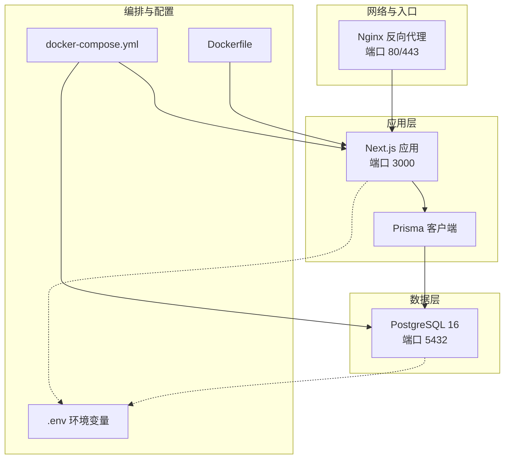
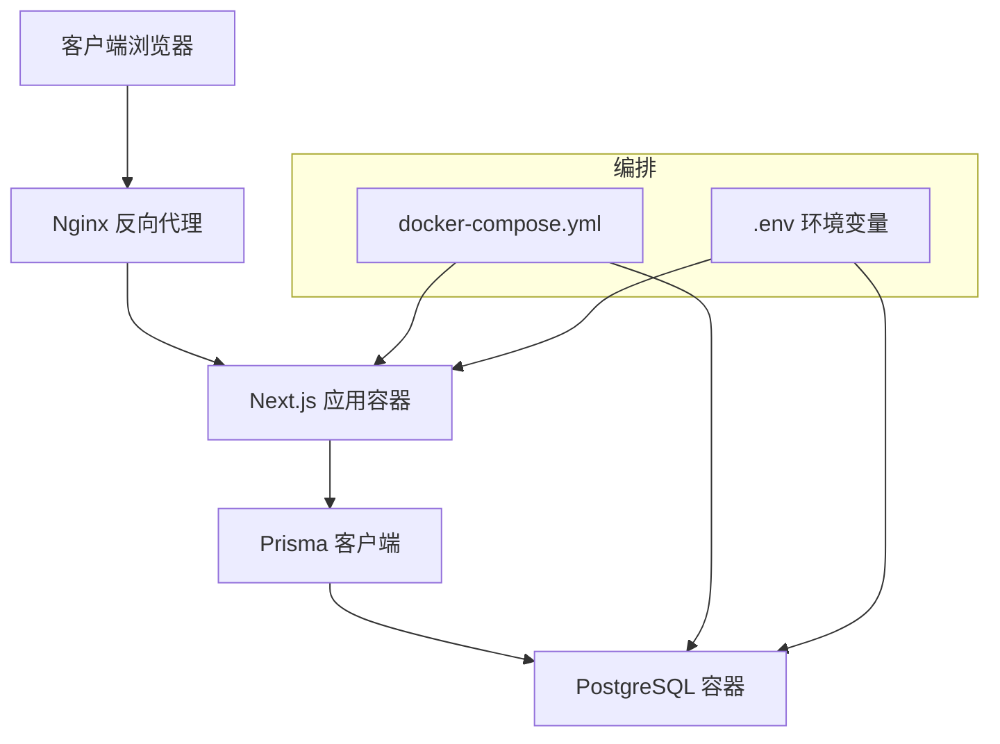
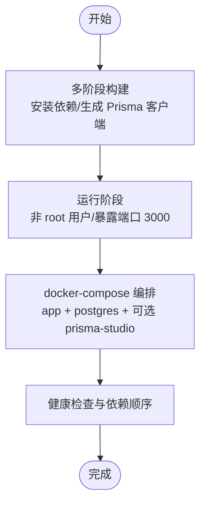
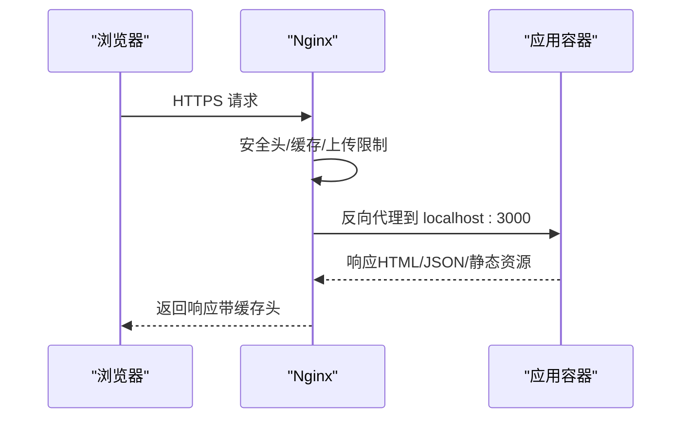
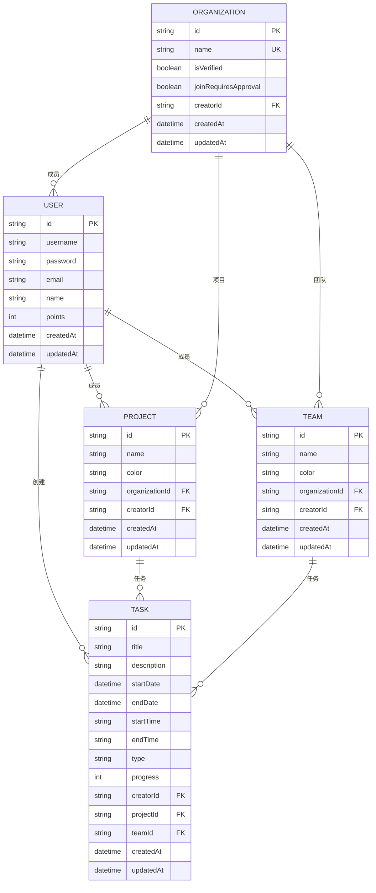
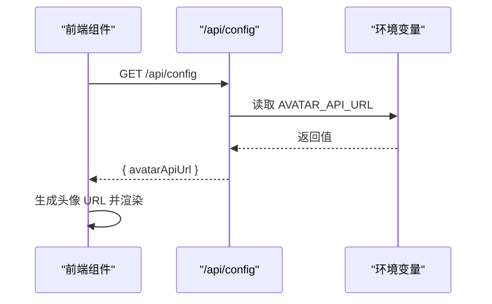
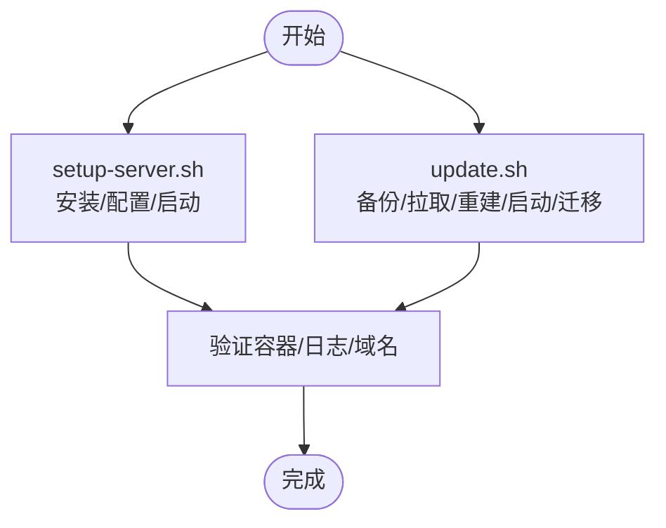
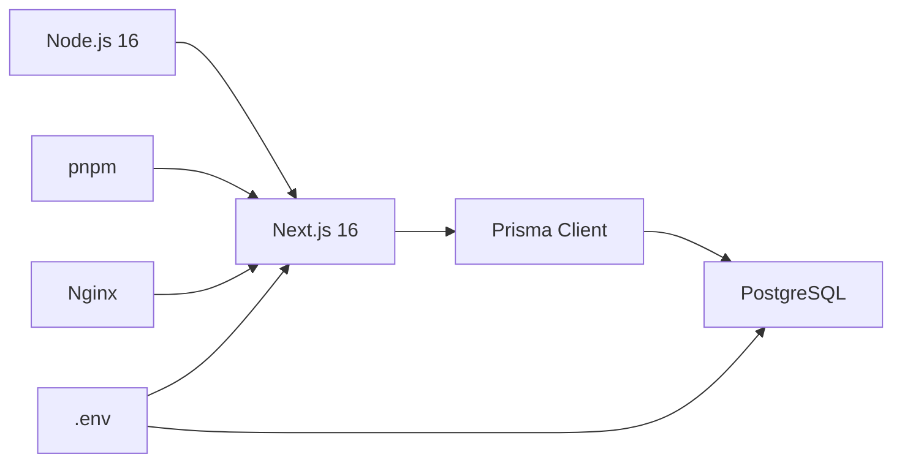

# 云平台部署

<cite>
**本文引用的文件**
- [Dockerfile](file://Dockerfile)
- [docker-compose.yml](file://docker-compose.yml)
- [next.config.mjs](file://next.config.mjs)
- [prisma/schema.prisma](file://prisma/schema.prisma)
- [deploy/DEPLOYMENT.md](file://deploy/DEPLOYMENT.md)
- [deploy/setup-server.sh](file://deploy/setup-server.sh)
- [deploy/update.sh](file://deploy/update.sh)
- [deploy/nginx/nginx.conf](file://deploy/nginx/nginx.conf)
- [MULTI_ENV_DEPLOYMENT.md](file://MULTI_ENV_DEPLOYMENT.md)
- [DOCKER_DEPLOYMENT.md](file://DOCKER_DEPLOYMENT.md)
- [FRESH_SERVER_DEPLOYMENT.md](file://FRESH_SERVER_DEPLOYMENT.md)
- [app/api/config/route.ts](file://app/api/config/route.ts)
- [lib/config.ts](file://lib/config.ts)
- [package.json](file://package.json)
</cite>

## 目录
1. [简介](#简介)
2. [项目结构](#项目结构)
3. [核心组件](#核心组件)
4. [架构总览](#架构总览)
5. [详细组件分析](#详细组件分析)
6. [依赖分析](#依赖分析)
7. [性能考虑](#性能考虑)
8. [故障排查指南](#故障排查指南)
9. [结论](#结论)
10. [附录](#附录)

## 简介
本文件面向在各类云平台（AWS、Azure、Google Cloud）部署“日历任务管理系统”的工程与运维人员，提供从单机容器到云原生编排的完整部署实践指南。内容涵盖：
- 容器化部署（Docker/Docker Compose）与反向代理（Nginx）
- 多环境（开发/测试/生产）与多域名部署
- 环境变量与密钥管理、安全组与防火墙配置
- 负载均衡、自动扩缩容与高可用建议
- 成本优化、监控告警与日志聚合
- CDN、静态资源与缓存策略
- 灾难恢复与数据备份的云原生方案
- 多平台部署对比与落地建议

## 项目结构
系统采用前后端一体化的 Next.js 应用，配合 PostgreSQL 数据库存储，使用 Prisma 管理数据库模式与迁移。部署以 Docker 多阶段构建为基础，通过 docker-compose 编排应用与数据库。

图表来源
- [docker-compose.yml](file://docker-compose.yml#L1-L77)
- [Dockerfile](file://Dockerfile#L1-L72)
- [next.config.mjs](file://next.config.mjs#L1-L20)
- [prisma/schema.prisma](file://prisma/schema.prisma#L1-L314)

章节来源
- [docker-compose.yml](file://docker-compose.yml#L1-L77)
- [Dockerfile](file://Dockerfile#L1-L72)
- [next.config.mjs](file://next.config.mjs#L1-L20)
- [prisma/schema.prisma](file://prisma/schema.prisma#L1-L314)

## 核心组件
- 应用容器（Next.js）
  - 多阶段构建，生产镜像最小化，非 root 用户运行，暴露端口 3000
  - 使用 standalone 输出，便于独立运行
- 数据库容器（PostgreSQL）
  - 健康检查，持久化卷，端口 5432
- 反向代理（Nginx）
  - HTTPS 强化、安全头、静态资源缓存、上传大小限制
- 编排与配置
  - docker-compose 统一编排；Dockerfile 参数化构建；.env 环境变量注入
- 多环境配置
  - 通过环境变量切换头像 API 地址，实现内网/公网差异化部署

章节来源
- [Dockerfile](file://Dockerfile#L1-L72)
- [docker-compose.yml](file://docker-compose.yml#L1-L77)
- [deploy/nginx/nginx.conf](file://deploy/nginx/nginx.conf#L1-L114)
- [MULTI_ENV_DEPLOYMENT.md](file://MULTI_ENV_DEPLOYMENT.md#L1-L153)

## 架构总览
系统采用“反向代理 + 应用 + 数据库”的三层架构。Nginx 作为统一入口，负责 TLS 终止、安全头与静态资源缓存；应用容器提供 API 与页面服务；数据库容器提供数据持久化。

图表来源
- [deploy/nginx/nginx.conf](file://deploy/nginx/nginx.conf#L1-L114)
- [docker-compose.yml](file://docker-compose.yml#L1-L77)
- [Dockerfile](file://Dockerfile#L1-L72)

## 详细组件分析

### 组件一：容器与编排（Docker/Docker Compose）
- 多阶段构建
  - 构建阶段安装 pnpm，复制 .env.* 以生成 Prisma 客户端
  - 运行阶段最小化镜像，非 root 用户运行，暴露端口 3000
- docker-compose 编排
  - app 服务：端口映射、环境变量注入、依赖健康检查
  - postgres 服务：健康检查、持久化卷、端口映射
  - 可选 prisma-studio（开发环境）

图表来源
- [Dockerfile](file://Dockerfile#L1-L72)
- [docker-compose.yml](file://docker-compose.yml#L1-L77)

章节来源
- [Dockerfile](file://Dockerfile#L1-L72)
- [docker-compose.yml](file://docker-compose.yml#L1-L77)

### 组件二：反向代理（Nginx）
- 功能要点
  - HTTP -> HTTPS 重定向、TLS 1.2/1.3、安全头、会话缓存
  - 静态资源缓存（immutable）、图片资源缓存（30 天）
  - 上传大小限制、代理头透传、超时设置
- 部署位置
  - 与应用容器同机部署，监听 80/443 并代理至 localhost:3000

图表来源
- [deploy/nginx/nginx.conf](file://deploy/nginx/nginx.conf#L1-L114)

章节来源
- [deploy/nginx/nginx.conf](file://deploy/nginx/nginx.conf#L1-L114)

### 组件三：数据库（PostgreSQL）
- 特性
  - 健康检查、持久化卷、端口 5432
  - 通过 DATABASE_URL 连接，支持迁移与管理工具
- 模式与迁移
  - Prisma schema 定义模型与索引，迁移由应用侧管理

图表来源
- [prisma/schema.prisma](file://prisma/schema.prisma#L1-L314)

章节来源
- [prisma/schema.prisma](file://prisma/schema.prisma#L1-L314)
- [docker-compose.yml](file://docker-compose.yml#L1-L77)

### 组件四：多环境与配置（环境变量与 API 配置）
- 运行时配置 API
  - /api/config 返回 AVATAR_API_URL，供前端动态获取
- 客户端配置
  - lib/config.ts 读取环境变量，生成头像 URL
- 多环境部署
  - 通过 .env 切换 AVATAR_API_URL，实现内网/公网差异
  - 无需重建镜像，仅需重启容器

图表来源
- [app/api/config/route.ts](file://app/api/config/route.ts#L1-L12)
- [lib/config.ts](file://lib/config.ts#L1-L30)
- [MULTI_ENV_DEPLOYMENT.md](file://MULTI_ENV_DEPLOYMENT.md#L1-L153)

章节来源
- [app/api/config/route.ts](file://app/api/config/route.ts#L1-L12)
- [lib/config.ts](file://lib/config.ts#L1-L30)
- [MULTI_ENV_DEPLOYMENT.md](file://MULTI_ENV_DEPLOYMENT.md#L1-L153)

### 组件五：部署脚本与自动化
- 初始化脚本（setup-server.sh）
  - 安装 Docker/Docker Compose/Nginx，创建项目目录，生成 .env，配置 Nginx，启动服务
- 更新脚本（update.sh）
  - 备份数据库、拉取代码、重建镜像、启动服务、运行迁移、清理镜像

图表来源
- [deploy/setup-server.sh](file://deploy/setup-server.sh#L1-L148)
- [deploy/update.sh](file://deploy/update.sh#L1-L61)

章节来源
- [deploy/setup-server.sh](file://deploy/setup-server.sh#L1-L148)
- [deploy/update.sh](file://deploy/update.sh#L1-L61)

## 依赖分析
- 运行时依赖
  - Node.js 16、pnpm、Next.js 16、Prisma Client
- 构建时依赖
  - Prisma CLI 用于生成客户端
- 外部服务
  - PostgreSQL（数据库）
  - Nginx（反向代理）
  - 头像服务（DiceBear 或内网服务）

图表来源
- [package.json](file://package.json#L1-L75)
- [Dockerfile](file://Dockerfile#L1-L72)
- [docker-compose.yml](file://docker-compose.yml#L1-L77)

章节来源
- [package.json](file://package.json#L1-L75)
- [Dockerfile](file://Dockerfile#L1-L72)
- [docker-compose.yml](file://docker-compose.yml#L1-L77)

## 性能考虑
- 构建与镜像
  - 多阶段构建减少镜像体积；启用构建缓存提升重复构建速度
- 资源限制
  - docker-compose 中可配置 CPU/内存限制与保留
- 静态资源与缓存
  - Nginx 对静态资源与图片设置长缓存；应用侧使用 Next.js standalone 输出
- 数据库性能
  - 合理索引（Prisma schema 已定义），避免全表扫描

章节来源
- [DOCKER_DEPLOYMENT.md](file://DOCKER_DEPLOYMENT.md#L205-L234)
- [deploy/nginx/nginx.conf](file://deploy/nginx/nginx.conf#L59-L71)
- [next.config.mjs](file://next.config.mjs#L1-L20)
- [prisma/schema.prisma](file://prisma/schema.prisma#L1-L314)

## 故障排查指南
- 容器无法启动
  - 查看日志、检查端口占用、重新构建
- 数据库连接失败
  - 进入数据库容器检查连接、确认 DATABASE_URL
- Nginx 配置错误
  - 配置语法检查、错误日志定位、重载配置
- 端口冲突
  - 修改 docker-compose 端口映射
- SSL 证书问题
  - 检查证书文件与有效期、重新加载 Nginx

章节来源
- [deploy/DEPLOYMENT.md](file://deploy/DEPLOYMENT.md#L221-L284)

## 结论
本项目以 Docker 多阶段构建与 docker-compose 编排为核心，结合 Nginx 反向代理与 Prisma 数据库管理，形成一套可移植、可扩展的部署方案。通过环境变量实现多环境差异化配置，配合自动化脚本与健康检查，满足从单机到云原生的多种部署形态。建议在生产环境中进一步引入负载均衡、自动扩缩容与监控告警体系，以提升可用性与可观测性。

## 附录

### 多平台部署建议（AWS/Azure/Google Cloud）
- 容器服务部署（ECS/AKS/GKE）
  - 优势：弹性伸缩、服务网格、托管数据库与对象存储
  - 适用场景：高并发、多区域、多租户
  - 注意事项：网络策略、安全组、密钥管理、镜像仓库
- 虚拟机部署
  - 优势：灵活定制、传统应用兼容
  - 适用场景：遗留系统、合规要求严格
  - 注意事项：安全基线、补丁管理、备份策略
- 无服务器部署（Lambda/Cloud Run）
  - 优势：按需计费、零运维
  - 适用场景：事件驱动、低延迟接口
  - 注意事项：冷启动、数据库连接池、静态资源托管
- 负载均衡与高可用
  - 应用层：Nginx/Ingress 控制器 + 健康检查
  - 数据层：主从/集群 + 备份与灾备
- 自动扩缩容
  - 基于 CPU/内存/请求速率的 HPA
  - 数据库连接数与事务锁监控
- 成本优化
  - 镜像瘦身、资源配额、预留实例、存储分层
- 监控告警与日志
  - 应用：指标（CPU/内存/请求时延/错误率）、日志聚合（集中化）
  - 数据库：慢查询、连接数、磁盘使用率
- CDN、静态资源与缓存
  - CDN 加速静态资源；Nginx 缓存策略；浏览器缓存控制
- 灾难恢复与备份
  - 定时备份、异地复制、快照策略、演练与回滚预案

### 环境变量与密钥管理
- 关键变量
  - DATABASE_URL、POSTGRES_PASSWORD、JWT_SECRET、AVATAR_API_URL
- 管理建议
  - 使用云厂商密钥管理服务（AWS Secrets Manager/Azure Key Vault/GCP Secret Manager）
  - 环境变量注入（CI/CD 或编排平台）
  - 最小权限原则与轮换策略

### 多环境部署（开发/测试/生产）
- 环境隔离
  - 不同命名空间/账户/密钥
- 配置差异化
  - 通过 .env 与环境变量区分头像 API 地址
- 自动化
  - CI/CD 触发部署，变更评审与灰度发布

### 安全加固
- 网络
  - 仅开放必要端口，使用安全组/防火墙
- 应用
  - 非 root 运行、最小权限、只读文件系统
- 传输
  - 强 TLS、HSTS、安全头
- 数据
  - 加密存储、备份加密、审计日志