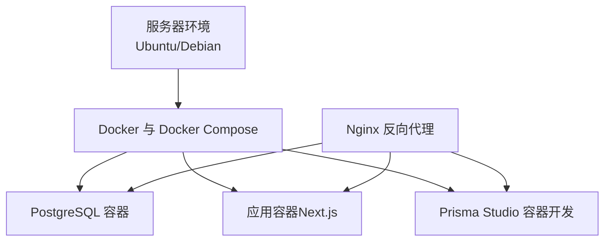
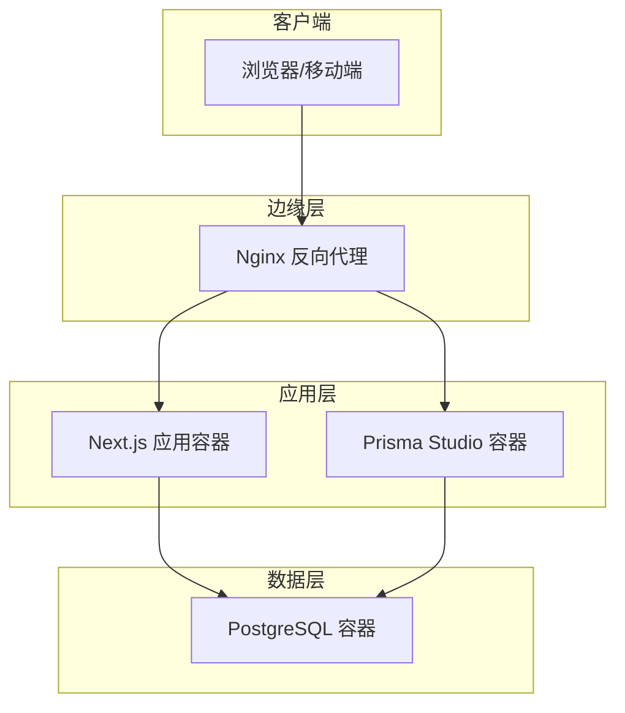
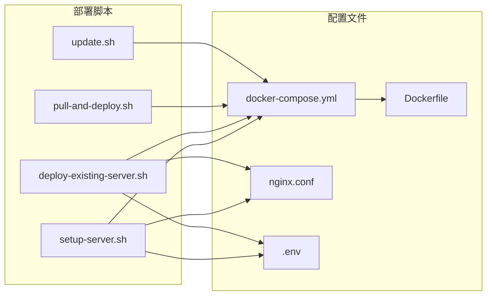

# 传统服务器部署

<cite>
**本文引用的文件**
- [deploy/setup-server.sh](file://deploy/setup-server.sh)
- [deploy/deploy-existing-server.sh](file://deploy/deploy-existing-server.sh)
- [deploy/pull-and-deploy.sh](file://deploy/pull-and-deploy.sh)
- [deploy/update.sh](file://deploy/update.sh)
- [deploy/MANUAL_DEPLOY.md](file://deploy/MANUAL_DEPLOY.md)
- [deploy/DEPLOYMENT.md](file://deploy/DEPLOYMENT.md)
- [deploy/nginx/nginx.conf](file://deploy/nginx/nginx.conf)
- [souxy.com.conf](file://souxy.com.conf)
- [docker-compose.yml](file://docker-compose.yml)
- [Dockerfile](file://Dockerfile)
- [deamon.json](file://deamon.json)
- [scripts/server-diagnose.sh](file://scripts/server-diagnose.sh)
- [package.json](file://package.json)
- [next.config.mjs](file://next.config.mjs)
- [lib/config.ts](file://lib/config.ts)
</cite>

## 目录
1. [简介](#简介)
2. [项目结构](#项目结构)
3. [核心组件](#核心组件)
4. [架构总览](#架构总览)
5. [详细组件分析](#详细组件分析)
6. [依赖关系分析](#依赖关系分析)
7. [性能考虑](#性能考虑)
8. [故障排查指南](#故障排查指南)
9. [结论](#结论)
10. [附录](#附录)

## 简介
本文件面向在物理服务器或虚拟主机上部署“日历任务管理系统”的运维与开发人员，提供从服务器环境准备、Docker 与 Nginx 安装、数据库与应用配置、部署脚本使用，到手动部署流程、Nginx 反向代理与 SSL 证书配置、PM2 进程管理替代方案、自动重启与日志监控、性能优化、安全加固与备份策略的全流程说明。文档同时给出常见问题与运维挑战的解决方案，并提供可视化图示帮助理解。

## 项目结构
该系统采用 Docker 化部署，核心由三类文件支撑：
- 部署脚本：一键初始化服务器、部署现有服务器、拉取镜像部署、更新应用等
- 反向代理配置：Nginx 配置文件，支持多域名与静态资源缓存
- 容器编排与镜像：docker-compose.yml 定义服务与端口映射；Dockerfile 定义构建与运行时

图表来源
- [docker-compose.yml](file://docker-compose.yml#L1-L77)
- [Dockerfile](file://Dockerfile#L1-L72)
- [deploy/nginx/nginx.conf](file://deploy/nginx/nginx.conf#L1-L114)

章节来源
- [docker-compose.yml](file://docker-compose.yml#L1-L77)
- [Dockerfile](file://Dockerfile#L1-L72)
- [deploy/nginx/nginx.conf](file://deploy/nginx/nginx.conf#L1-L114)

## 核心组件
- PostgreSQL 数据库：持久化存储，健康检查与卷挂载
- Next.js 应用容器：生产模式运行，端口映射至宿主机
- Prisma Studio 容器：开发环境专用，提供数据库可视化
- Nginx：反向代理与 SSL 终止，域名与静态资源缓存
- 部署脚本：自动化初始化、部署、更新与镜像拉取部署

章节来源
- [docker-compose.yml](file://docker-compose.yml#L1-L77)
- [Dockerfile](file://Dockerfile#L1-L72)
- [deploy/nginx/nginx.conf](file://deploy/nginx/nginx.conf#L1-L114)

## 架构总览
系统采用“Nginx → 应用容器 → 数据库容器”的三层架构。Nginx 负责 HTTPS 终止、静态资源缓存与请求转发；应用容器负责业务逻辑与 API；数据库容器提供数据持久化。

图表来源
- [docker-compose.yml](file://docker-compose.yml#L1-L77)
- [deploy/nginx/nginx.conf](file://deploy/nginx/nginx.conf#L1-L114)

## 详细组件分析

### 1) 服务器环境准备与初始化
- 更新系统、安装必要工具（git/curl/wget/vim/ufw）
- 安装 Docker 与 Docker Compose
- 配置防火墙开放 22/80/443 端口
- 创建项目目录 /opt/calendar-task-manager 并克隆仓库
- 生成 .env（含数据库 URL、POSTGRES_PASSWORD、JWT_SECRET、NODE_ENV）
- 准备 SSL 证书目录 /etc/nginx/ssl/{domain}
- 复制 Nginx 配置并启用站点
- 启动应用并检查服务状态

章节来源
- [deploy/setup-server.sh](file://deploy/setup-server.sh#L1-L148)

### 2) 部署脚本详解

#### 2.1 初始化部署脚本（setup-server.sh）
- 功能：首次部署，自动安装依赖、生成 .env、复制 Nginx 配置、启动容器
- 关键步骤：系统更新、Docker/Docker Compose 安装、防火墙配置、克隆仓库、.env 生成、SSL 证书目录、Nginx 配置、docker-compose up -d、检查状态

章节来源
- [deploy/setup-server.sh](file://deploy/setup-server.sh#L1-L148)

#### 2.2 部署现有服务器脚本（deploy-existing-server.sh）
- 功能：在已有 Docker/Nginx 环境下，重新配置 .env、备份并替换 Nginx 配置、构建并启动容器、重载 Nginx
- 关键步骤：检查 Docker 与 Compose、进入项目目录、生成 .env（可覆盖）、备份旧 Nginx 配置、复制新配置、测试配置、停止旧容器、启动新容器、重载 Nginx、检查状态

章节来源
- [deploy/deploy-existing-server.sh](file://deploy/deploy-existing-server.sh#L1-L142)

#### 2.3 拉取镜像并部署（pull-and-deploy.sh）
- 功能：拉取远程镜像、备份数据库、停止旧容器、启动新容器、清理未使用镜像
- 关键步骤：设置镜像版本、拉取镜像、备份数据库、停止旧容器、启动新容器、等待启动、检查状态、清理镜像

章节来源
- [deploy/pull-and-deploy.sh](file://deploy/pull-and-deploy.sh#L1-L69)

#### 2.4 应用更新脚本（update.sh）
- 功能：备份数据库、拉取最新代码、停止服务、重建镜像、启动服务、运行数据库迁移、检查状态、清理镜像
- 关键步骤：备份数据库、git 拉取、停止服务、重建镜像、启动服务、迁移数据库、检查状态、清理镜像

章节来源
- [deploy/update.sh](file://deploy/update.sh#L1-L61)

### 3) 手动部署流程（离线/受限环境）
- 本地构建镜像并保存为 tar 文件
- 通过 FTP/rsync 上传至服务器 /opt/calendar-task-manager/
- 服务器加载镜像、停止旧容器、启动新容器、查看状态与日志
- 可选：清理 tar 文件与旧镜像

章节来源
- [deploy/MANUAL_DEPLOY.md](file://deploy/MANUAL_DEPLOY.md#L1-L439)

### 4) Nginx 反向代理与 SSL 配置
- 支持两个域名：souxy.com 与 joox.cc
- HTTP → HTTPS 重定向
- SSL 证书路径与协议优化
- 安全头设置（HSTS、X-Frame-Options、X-Content-Type-Options、X-XSS-Protection）
- 静态资源缓存（/_next/static/ 与图片资源）
- 代理到应用容器（默认 7049:3000）

章节来源
- [deploy/nginx/nginx.conf](file://deploy/nginx/nginx.conf#L1-L114)
- [souxy.com.conf](file://souxy.com.conf#L1-L91)

### 5) 数据库与应用容器配置
- PostgreSQL
  - 环境变量：POSTGRES_USER/PASSWORD/DB
  - 端口映射：5432:5432
  - 健康检查：pg_isready
  - 卷：postgres_data
- 应用容器
  - 端口映射：7049:3000
  - 环境变量：DATABASE_URL、NODE_ENV、AVATAR_API_URL
  - 依赖：PostgreSQL 健康后再启动
  - 命令：node server.js
- Prisma Studio（开发）
  - 端口：5555:5555
  - 仅在 dev profile 启动

章节来源
- [docker-compose.yml](file://docker-compose.yml#L1-L77)

### 6) Dockerfile 构建与运行时
- 多阶段构建：builder 与 runner
- 使用 pnpm 安装依赖，生成 Prisma Client，构建 Next.js
- 运行时：非 root 用户，暴露 3000，CMD node server.js
- 支持构建参数 ENV_TYPE 选择 .env.* 文件

章节来源
- [Dockerfile](file://Dockerfile#L1-L72)

### 7) PM2 进程管理替代方案
- 本项目采用 Docker 管理应用生命周期（restart/unless-stopped），无需 PM2
- 如需使用 PM2，可在宿主机安装并管理 Node 进程，但需注意与 docker-compose 的端口与卷冲突

章节来源
- [docker-compose.yml](file://docker-compose.yml#L1-L77)

### 8) 自动重启与日志监控
- docker-compose restart/ps/logs
- Nginx 日志：/var/log/nginx/*.log
- 容器资源监控：docker stats/top
- 诊断脚本：server-diagnose.sh（容器状态、资源、日志、数据库连接与表统计）

章节来源
- [scripts/server-diagnose.sh](file://scripts/server-diagnose.sh#L1-L63)
- [deploy/DEPLOYMENT.md](file://deploy/DEPLOYMENT.md#L327-L358)

## 依赖关系分析

图表来源
- [deploy/setup-server.sh](file://deploy/setup-server.sh#L1-L148)
- [deploy/deploy-existing-server.sh](file://deploy/deploy-existing-server.sh#L1-L142)
- [deploy/pull-and-deploy.sh](file://deploy/pull-and-deploy.sh#L1-L69)
- [deploy/update.sh](file://deploy/update.sh#L1-L61)
- [docker-compose.yml](file://docker-compose.yml#L1-L77)
- [Dockerfile](file://Dockerfile#L1-L72)
- [deploy/nginx/nginx.conf](file://deploy/nginx/nginx.conf#L1-L114)

章节来源
- [deploy/setup-server.sh](file://deploy/setup-server.sh#L1-L148)
- [deploy/deploy-existing-server.sh](file://deploy/deploy-existing-server.sh#L1-L142)
- [deploy/pull-and-deploy.sh](file://deploy/pull-and-deploy.sh#L1-L69)
- [deploy/update.sh](file://deploy/update.sh#L1-L61)
- [docker-compose.yml](file://docker-compose.yml#L1-L77)
- [Dockerfile](file://Dockerfile#L1-L72)
- [deploy/nginx/nginx.conf](file://deploy/nginx/nginx.conf#L1-L114)

## 性能考虑
- Nginx 静态资源缓存与 HTTP/2
- 应用容器端口映射与负载均衡（多实例需额外编排）
- 数据库卷与备份策略
- Docker 镜像构建缓存与清理
- 容器资源限制与健康检查

章节来源
- [deploy/nginx/nginx.conf](file://deploy/nginx/nginx.conf#L1-L114)
- [docker-compose.yml](file://docker-compose.yml#L1-L77)
- [deamon.json](file://deamon.json#L1-L123)

## 故障排查指南
- 容器无法启动：查看 docker-compose logs，检查依赖服务健康状态，必要时 --build 重建
- 数据库连接失败：进入数据库容器检查数据库与表，确认 .env 中密码一致
- Nginx 配置错误：nginx -t 测试，查看 /var/log/nginx/error.log，重载配置
- 端口被占用：检查 lsof -i 端口，调整 docker-compose.yml 端口映射
- SSL 证书问题：检查证书文件存在与有效期，重新加载 Nginx
- 诊断脚本：server-diagnose.sh 检查容器状态、资源、日志与表统计

章节来源
- [deploy/DEPLOYMENT.md](file://deploy/DEPLOYMENT.md#L221-L284)
- [scripts/server-diagnose.sh](file://scripts/server-diagnose.sh#L1-L63)

## 结论
本部署文档提供了从服务器初始化到应用上线的完整流程，涵盖自动化脚本与手动部署两种方式，并配套 Nginx 反向代理、SSL 证书、日志监控与性能优化建议。通过 docker-compose 的健康检查与重启策略，系统具备良好的自愈能力；结合定期备份与安全加固，可满足生产环境的稳定性与安全性要求。

## 附录

### A. 环境变量与配置要点
- 数据库连接：DATABASE_URL 与 POSTGRES_PASSWORD 必须一致
- JWT 密钥：JWT_SECRET 自动生成或自定义
- 头像服务：AVATAR_API_URL 控制头像 API 地址
- Next.js 输出模式：生产环境使用 standalone

章节来源
- [docker-compose.yml](file://docker-compose.yml#L1-L77)
- [lib/config.ts](file://lib/config.ts#L1-L30)
- [next.config.mjs](file://next.config.mjs#L1-L20)

### B. 常用命令速查
- 查看容器状态：docker-compose ps
- 查看日志：docker-compose logs -f
- 重启应用：docker-compose restart app
- 停止服务：docker-compose down
- 重建镜像：docker-compose build --no-cache
- 清理镜像：docker image prune -f
- Nginx 重载：sudo systemctl reload nginx

章节来源
- [deploy/DEPLOYMENT.md](file://deploy/DEPLOYMENT.md#L155-L217)