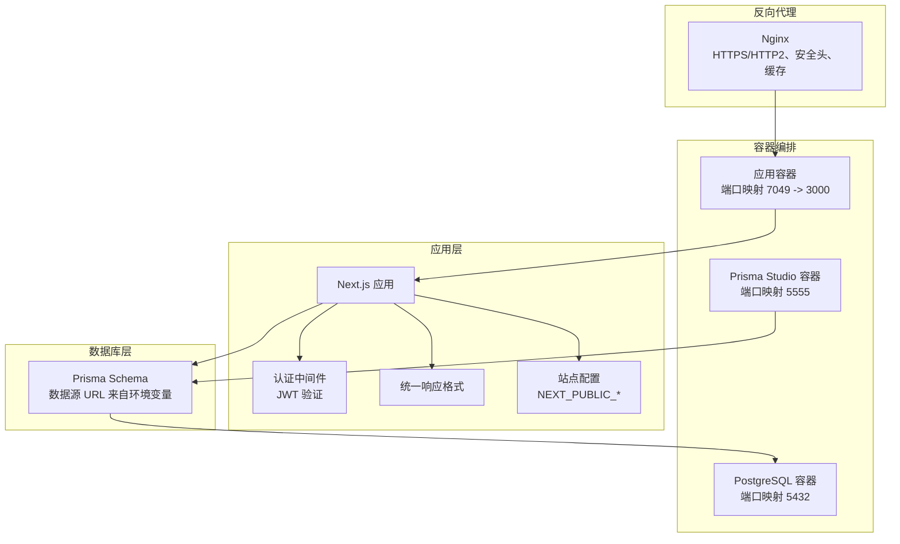
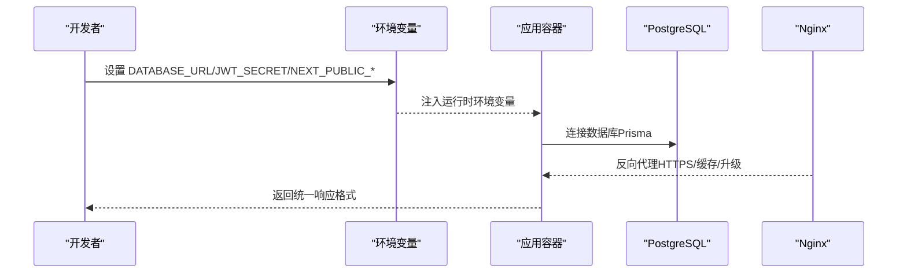
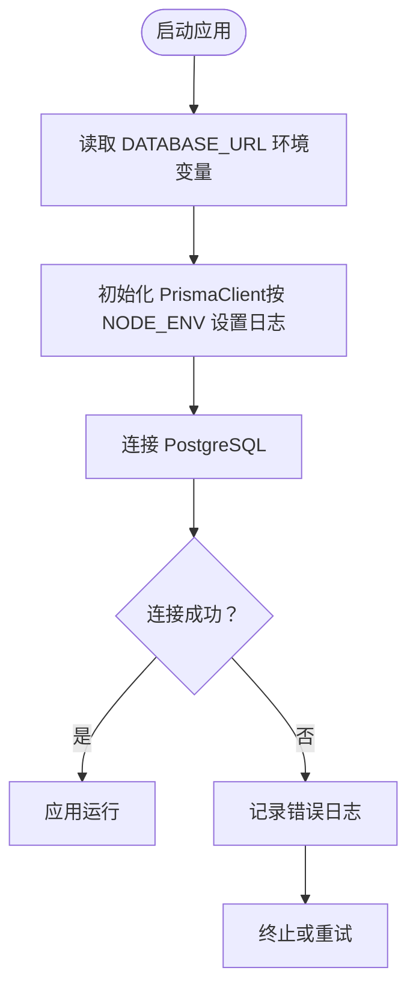
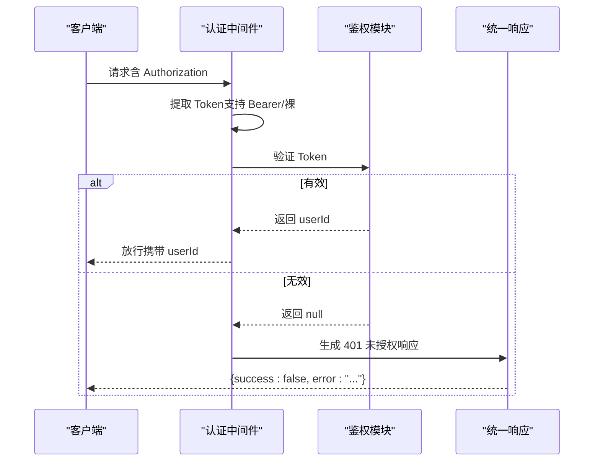
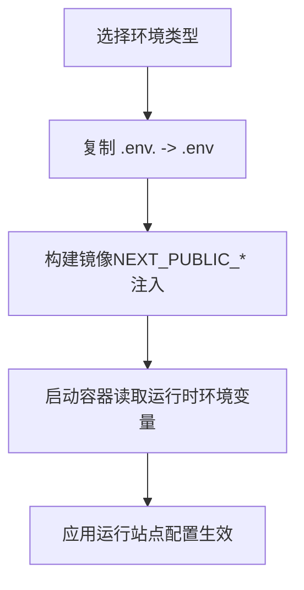
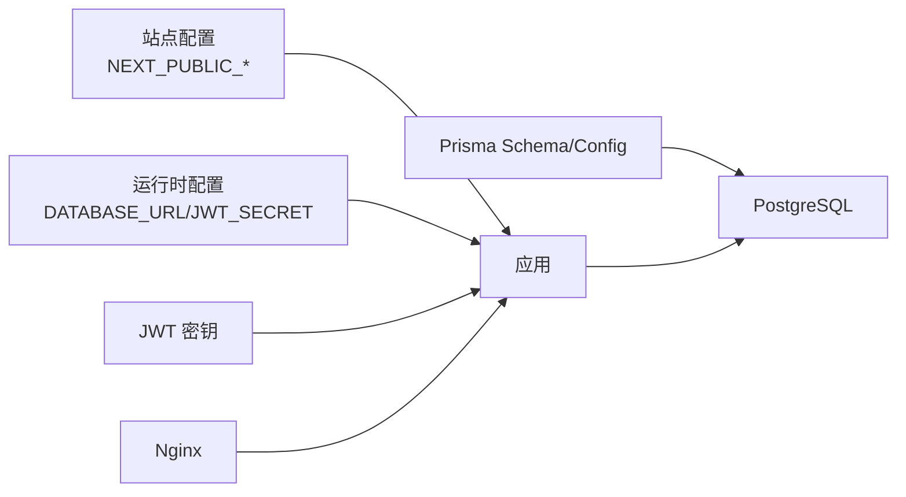

# 环境配置

<cite>
**本文引用的文件**
- [prisma/schema.prisma](file://prisma/schema.prisma)
- [prisma.config.ts](file://prisma.config.ts)
- [lib/prisma.ts](file://lib/prisma.ts)
- [lib/middleware.ts](file://lib/middleware.ts)
- [lib/auth.ts](file://lib/auth.ts)
- [lib/config.ts](file://lib/config.ts)
- [lib/site-config.ts](file://lib/site-config.ts)
- [lib/api-response.ts](file://lib/api-response.ts)
- [next.config.mjs](file://next.config.mjs)
- [docker-compose.yml](file://docker-compose.yml)
- [deploy/nginx/nginx.conf](file://deploy/nginx/nginx.conf)
- [MULTI_ENV_DEPLOYMENT_GUIDE.md](file://MULTI_ENV_DEPLOYMENT_GUIDE.md)
- [MULTI_ENV_DEPLOYMENT.md](file://MULTI_ENV_DEPLOYMENT.md)
- [scripts/deploy.sh](file://scripts/deploy.sh)
- [QUICK_DEPLOY.md](file://QUICK_DEPLOY.md)
</cite>

## 目录
1. [简介](#简介)
2. [项目结构与环境相关配置总览](#项目结构与环境相关配置总览)
3. [核心配置组件](#核心配置组件)
4. [架构总览与环境适配](#架构总览与环境适配)
5. [详细组件与环境配置](#详细组件与环境配置)
6. [依赖关系与耦合分析](#依赖关系与耦合分析)
7. [性能与稳定性考虑](#性能与稳定性考虑)
8. [故障排查与验证清单](#故障排查与验证清单)
9. [结论](#结论)
10. [附录：环境变量与配置清单](#附录环境变量与配置清单)

## 简介
本文件面向运维与开发工程师，系统化梳理日历任务管理系统在不同环境（开发、测试、生产）中的配置要点与最佳实践，涵盖数据库连接、认证与会话、API 响应格式、中间件、Nginx 反向代理、Docker Compose 编排、Prisma 迁移与种子数据、以及环境切换与一致性校验方法。文档同时提供可视化图示与操作指引，帮助快速落地与稳定运行。

## 项目结构与环境相关配置总览
系统采用 Next.js 16 应用，配合 PostgreSQL 数据库、Nginx 反向代理与 Docker Compose 编排；通过环境变量实现“构建期注入”（NEXT_PUBLIC_*）与“运行期注入”（容器环境变量），并以 Prisma 管理数据库模式与迁移。

图表来源
- [docker-compose.yml](file://docker-compose.yml#L1-L77)
- [lib/middleware.ts](file://lib/middleware.ts#L1-L47)
- [lib/api-response.ts](file://lib/api-response.ts#L1-L101)
- [lib/site-config.ts](file://lib/site-config.ts#L1-L34)
- [prisma/schema.prisma](file://prisma/schema.prisma#L11-L14)
- [deploy/nginx/nginx.conf](file://deploy/nginx/nginx.conf#L1-L114)

章节来源
- [docker-compose.yml](file://docker-compose.yml#L1-L77)
- [prisma/schema.prisma](file://prisma/schema.prisma#L11-L14)
- [lib/site-config.ts](file://lib/site-config.ts#L1-L34)
- [deploy/nginx/nginx.conf](file://deploy/nginx/nginx.conf#L1-L114)

## 核心配置组件
- 数据库连接：通过 Prisma 数据源 URL 读取环境变量 DATABASE_URL，支持开发、测试、生产三类环境的连接串差异化。
- 认证与会话：JWT 密钥来自环境变量 JWT_SECRET，支持 Bearer Token 与裸 Token 两种提取策略，统一 401 未授权响应。
- API 响应格式：统一 success/error/message/data 结构，便于前端与自动化测试一致处理。
- 站点配置：NEXT_PUBLIC_* 变量在构建期注入，支持企业版/个人版/团队版等多版本切换。
- 反向代理：Nginx 提供 HTTPS、安全头、静态资源缓存与 WebSocket 升级支持。
- Docker 编排：PostgreSQL、应用、Prisma Studio 三服务联动，健康检查与端口映射清晰。

章节来源
- [lib/prisma.ts](file://lib/prisma.ts#L1-L12)
- [prisma.config.ts](file://prisma.config.ts#L1-L14)
- [prisma/schema.prisma](file://prisma/schema.prisma#L11-L14)
- [lib/auth.ts](file://lib/auth.ts#L1-L78)
- [lib/middleware.ts](file://lib/middleware.ts#L1-L47)
- [lib/api-response.ts](file://lib/api-response.ts#L1-L101)
- [lib/site-config.ts](file://lib/site-config.ts#L1-L34)
- [deploy/nginx/nginx.conf](file://deploy/nginx/nginx.conf#L1-L114)
- [docker-compose.yml](file://docker-compose.yml#L1-L77)

## 架构总览与环境适配
- 开发环境：NODE_ENV 非 production，Prisma 日志包含 warn/error；Next.js 使用 standalone 输出（生产）或默认输出；Docker Compose 仅启动数据库与应用；Nginx 可选。
- 测试环境：与生产相似，但数据库连接串指向测试实例；JWT_SECRET 可独立配置；站点配置可按需切换。
- 生产环境：启用 standalone 构建、严格安全头、静态资源缓存与 HTTPS；数据库连接串与 JWT_SECRET 严格保密；Nginx 提供反向代理与缓存。

图表来源
- [lib/prisma.ts](file://lib/prisma.ts#L7-L11)
- [prisma.config.ts](file://prisma.config.ts#L10-L13)
- [docker-compose.yml](file://docker-compose.yml#L36-L48)
- [deploy/nginx/nginx.conf](file://deploy/nginx/nginx.conf#L42-L57)

章节来源
- [next.config.mjs](file://next.config.mjs#L1-L20)
- [docker-compose.yml](file://docker-compose.yml#L36-L48)
- [deploy/nginx/nginx.conf](file://deploy/nginx/nginx.conf#L1-L114)

## 详细组件与环境配置

### 数据库连接与 Prisma 管理
- 数据源 URL：来自环境变量 DATABASE_URL，Prisma Schema 与 Prisma Config 均从 env 读取，确保迁移与客户端行为一致。
- 日志级别：开发环境开启 warn 日志，生产环境仅 error，便于定位问题且避免噪声。
- 迁移与种子：迁移目录位于 prisma/migrations，种子脚本位于 prisma/seed.ts；可通过 Prisma CLI 或容器命令执行。

图表来源
- [lib/prisma.ts](file://lib/prisma.ts#L7-L11)
- [prisma/schema.prisma](file://prisma/schema.prisma#L11-L14)
- [prisma.config.ts](file://prisma.config.ts#L10-L13)

章节来源
- [lib/prisma.ts](file://lib/prisma.ts#L1-L12)
- [prisma/schema.prisma](file://prisma/schema.prisma#L11-L14)
- [prisma.config.ts](file://prisma.config.ts#L1-L14)

### 认证与会话（JWT）
- 密钥来源：JWT_SECRET 环境变量，开发默认值仅为示例，生产务必替换。
- Token 提取：支持 Bearer <token> 与 <token> 两种格式；验证失败记录详细日志。
- 中间件流程：从 Authorization 头提取 Token，解码后返回 userId，否则返回 401。

图表来源
- [lib/middleware.ts](file://lib/middleware.ts#L10-L39)
- [lib/auth.ts](file://lib/auth.ts#L36-L58)
- [lib/api-response.ts](file://lib/api-response.ts#L56-L60)

章节来源
- [lib/auth.ts](file://lib/auth.ts#L1-L78)
- [lib/middleware.ts](file://lib/middleware.ts#L1-L47)
- [lib/api-response.ts](file://lib/api-response.ts#L1-L101)

### API 响应格式与中间件适配
- 统一结构：success、data、error、message；状态码由各工厂函数固定映射。
- 未授权/禁止/未找到/服务器错误均有专用工厂，便于前端与自动化测试一致处理。
- 中间件与路由：路由层在认证失败时返回统一 401 响应，避免泄露细节。

章节来源
- [lib/api-response.ts](file://lib/api-response.ts#L1-L101)
- [lib/middleware.ts](file://lib/middleware.ts#L22-L38)

### 站点配置与多版本环境切换
- 构建期注入：NEXT_PUBLIC_* 在构建时注入，修改后需重建镜像。
- 运行期注入：容器启动时读取环境变量（如 AVATAR_API_URL），无需重建。
- 多版本：通过 .env.company/.env.personal/.env.team 切换企业版/个人版/团队版；部署脚本自动复制并构建。

图表来源
- [MULTI_ENV_DEPLOYMENT_GUIDE.md](file://MULTI_ENV_DEPLOYMENT_GUIDE.md#L21-L30)
- [scripts/deploy.sh](file://scripts/deploy.sh#L19-L35)
- [docker-compose.yml](file://docker-compose.yml#L36-L48)

章节来源
- [lib/site-config.ts](file://lib/site-config.ts#L1-L34)
- [lib/config.ts](file://lib/config.ts#L1-L30)
- [MULTI_ENV_DEPLOYMENT_GUIDE.md](file://MULTI_ENV_DEPLOYMENT_GUIDE.md#L1-L152)
- [scripts/deploy.sh](file://scripts/deploy.sh#L1-L55)

### 反向代理与静态资源缓存（Nginx）
- 安全头：Strict-Transport-Security、X-Frame-Options、X-Content-Type-Options、X-XSS-Protection。
- HTTPS 与 HTTP/2：TLS v1.2/v1.3、会话缓存与超时。
- 反向代理：WebSocket 升级、真实 IP、协议透传。
- 缓存策略：/_next/static/ 与图片资源缓存，提升性能与降低带宽。

章节来源
- [deploy/nginx/nginx.conf](file://deploy/nginx/nginx.conf#L1-L114)

### Docker Compose 编排与健康检查
- 服务：postgres、app、prisma-studio（仅 dev）。
- 健康检查：PostgreSQL 使用 pg_isready。
- 端口映射：数据库 5432、应用 7049:3000、Studio 5555。
- 环境变量：DATABASE_URL、NODE_ENV、AVATAR_API_URL。

章节来源
- [docker-compose.yml](file://docker-compose.yml#L1-L77)

### 部署脚本与一键构建
- 支持 company/personal/team 三种环境；自动检查 .env 文件、显示配置、构建镜像、启动容器并验证。
- 快速部署：docker-compose build --build-arg ENV_TYPE=xxx 与一键启动。

章节来源
- [scripts/deploy.sh](file://scripts/deploy.sh#L1-L55)
- [QUICK_DEPLOY.md](file://QUICK_DEPLOY.md#L1-L80)

## 依赖关系与耦合分析
- 配置耦合点
  - 数据库：Prisma Schema 与 Prisma Config 共同决定数据源 URL 与迁移路径。
  - 认证：JWT_SECRET 与中间件/鉴权模块强耦合，密钥泄露将导致全局风险。
  - 站点配置：NEXT_PUBLIC_* 与构建流程耦合，运行时配置与容器环境变量耦合。
  - 反向代理：Nginx 与应用容器端口映射、缓存策略耦合。
- 外部依赖
  - PostgreSQL：容器化部署，健康检查保障可用性。
  - 头像服务：AVATAR_API_URL 支持公网/内网/自建，影响用户体验与合规性。

图表来源
- [lib/site-config.ts](file://lib/site-config.ts#L1-L34)
- [lib/config.ts](file://lib/config.ts#L1-L30)
- [prisma/schema.prisma](file://prisma/schema.prisma#L11-L14)
- [prisma.config.ts](file://prisma.config.ts#L10-L13)
- [lib/auth.ts](file://lib/auth.ts#L5-L6)
- [deploy/nginx/nginx.conf](file://deploy/nginx/nginx.conf#L42-L57)
- [docker-compose.yml](file://docker-compose.yml#L36-L48)

章节来源
- [lib/site-config.ts](file://lib/site-config.ts#L1-L34)
- [lib/config.ts](file://lib/config.ts#L1-L30)
- [prisma/schema.prisma](file://prisma/schema.prisma#L11-L14)
- [prisma.config.ts](file://prisma.config.ts#L1-L14)
- [lib/auth.ts](file://lib/auth.ts#L1-L78)
- [deploy/nginx/nginx.conf](file://deploy/nginx/nginx.conf#L1-L114)
- [docker-compose.yml](file://docker-compose.yml#L1-L77)

## 性能与稳定性考虑
- 构建与运行
  - 生产启用 Next.js standalone 输出，减少冷启动与资源占用。
  - 忽略 TypeScript 构建错误（开发阶段）以加速迭代，生产建议关闭。
- 数据库
  - 开发环境开启 warn 日志，生产仅 error；迁移与备份策略需纳入 CI/CD。
- 反向代理
  - 启用静态资源缓存与 HTTP/2，合理设置超时与客户端上传大小。
- 安全
  - 严格管理 JWT_SECRET 与 DATABASE_URL；Nginx 启用安全头，强制 HTTPS。

章节来源
- [next.config.mjs](file://next.config.mjs#L1-L20)
- [lib/prisma.ts](file://lib/prisma.ts#L7-L11)
- [deploy/nginx/nginx.conf](file://deploy/nginx/nginx.conf#L1-L114)

## 故障排查与验证清单
- 环境变量未生效
  - 构建期：NEXT_PUBLIC_* 修改后需重建镜像；开发环境需重启 Next.js。
  - 运行期：确认 docker-compose 环境变量正确挂载；重启容器。
- 认证失败
  - 检查 Authorization 头格式（Bearer/裸）；核对 JWT_SECRET；查看中间件日志。
- 数据库连接失败
  - 核对 DATABASE_URL；确认容器网络与健康检查；查看 PostgreSQL 日志。
- Nginx 代理异常
  - 检查端口映射、证书路径、安全头与缓存配置；确认 WebSocket 升级头。
- 部署脚本问题
  - 确认 .env.<type> 存在；查看脚本输出与容器状态；必要时使用 --no-cache 重建。

章节来源
- [MULTI_ENV_DEPLOYMENT_GUIDE.md](file://MULTI_ENV_DEPLOYMENT_GUIDE.md#L171-L224)
- [scripts/deploy.sh](file://scripts/deploy.sh#L19-L55)
- [docker-compose.yml](file://docker-compose.yml#L36-L48)
- [lib/middleware.ts](file://lib/middleware.ts#L14-L20)
- [lib/auth.ts](file://lib/auth.ts#L45-L58)

## 结论
通过明确的环境变量分层（构建期 NEXT_PUBLIC_* 与运行期 DATABASE_URL/JWT_SECRET）、容器化编排与 Nginx 反向代理，系统可在开发、测试与生产环境中实现一致的配置体验与稳定的运行表现。建议在 CI/CD 中固化环境切换流程与配置校验，确保变更可控、可追溯。

## 附录：环境变量与配置清单
- 构建期（NEXT_PUBLIC_*）
  - NEXT_PUBLIC_APP_NAME、NEXT_PUBLIC_APP_SUBTITLE、NEXT_PUBLIC_APP_SLOGAN、NEXT_PUBLIC_PAGE_TITLE
  - 影响：页面标题、Logo 下文案、登录页标题等
  - 来源：站点配置模块与构建注入
- 运行期（容器环境变量）
  - DATABASE_URL：PostgreSQL 连接串
  - JWT_SECRET：JWT 签名密钥（生产必须替换）
  - NODE_ENV：开发/生产
  - AVATAR_API_URL：头像服务地址（公网/内网/自建）
  - POSTGRES_PASSWORD：数据库密码（容器内使用）
- Docker Compose 关键项
  - 端口映射：5432（DB）、7049:3000（App）、5555（Studio）
  - 健康检查：PostgreSQL pg_isready
  - 命令：应用容器启动时可执行 Prisma 迁移（当前注释）
- Nginx 关键项
  - HTTPS/HTTP2、安全头、静态缓存、WebSocket 升级、客户端上传大小限制

章节来源
- [lib/site-config.ts](file://lib/site-config.ts#L6-L32)
- [lib/config.ts](file://lib/config.ts#L6-L29)
- [docker-compose.yml](file://docker-compose.yml#L9-L48)
- [deploy/nginx/nginx.conf](file://deploy/nginx/nginx.conf#L13-L72)
- [MULTI_ENV_DEPLOYMENT_GUIDE.md](file://MULTI_ENV_DEPLOYMENT_GUIDE.md#L104-L127)