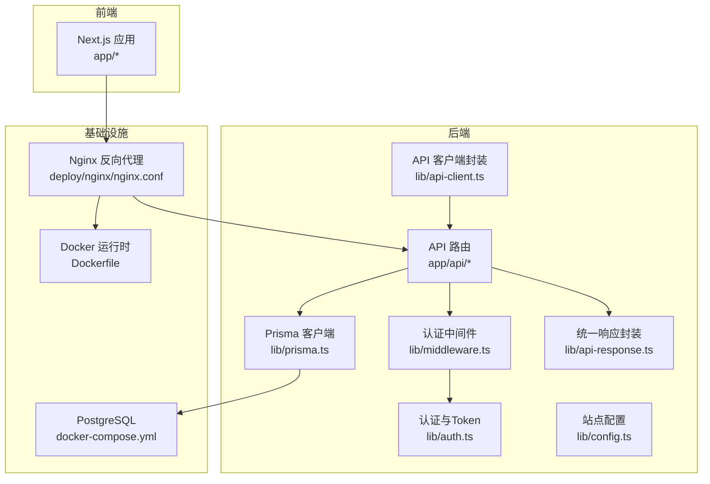
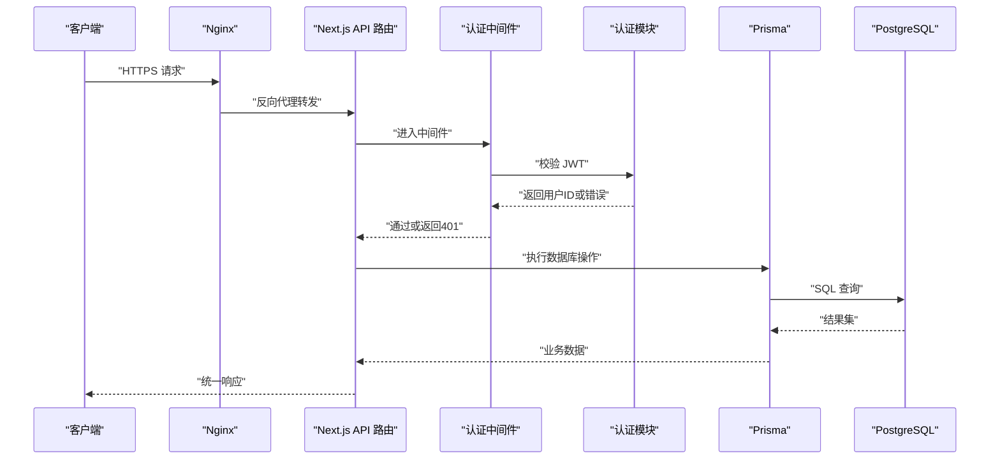
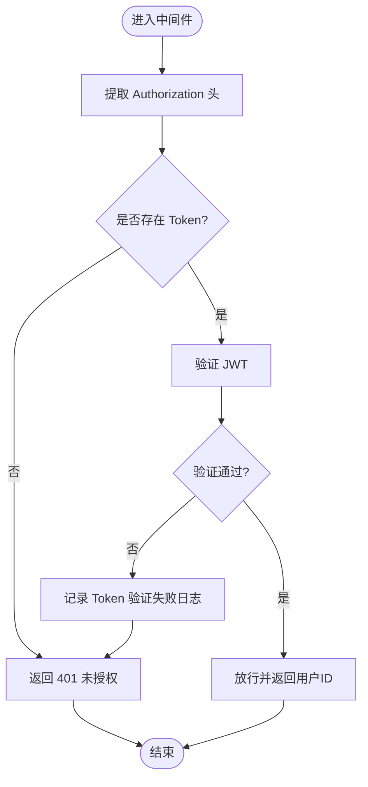
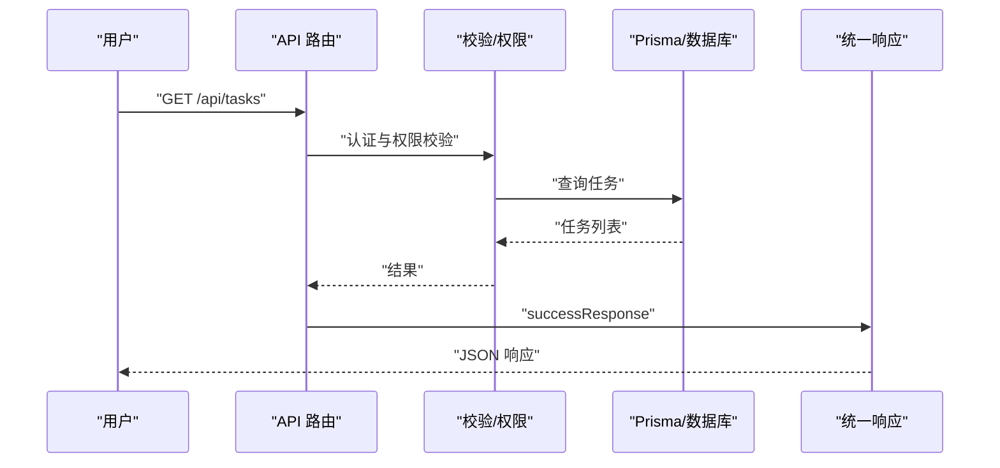
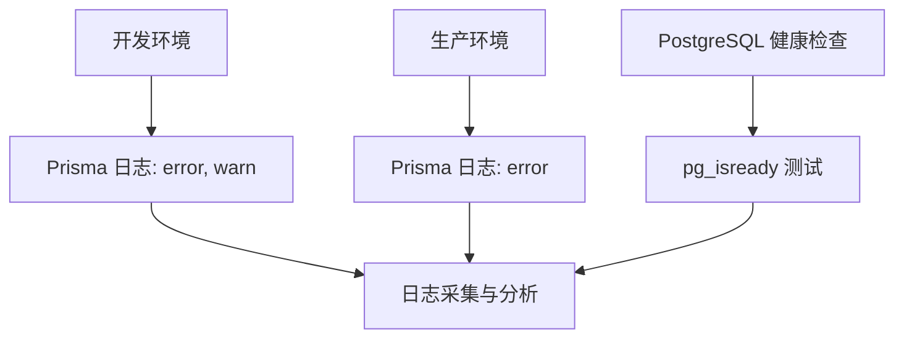
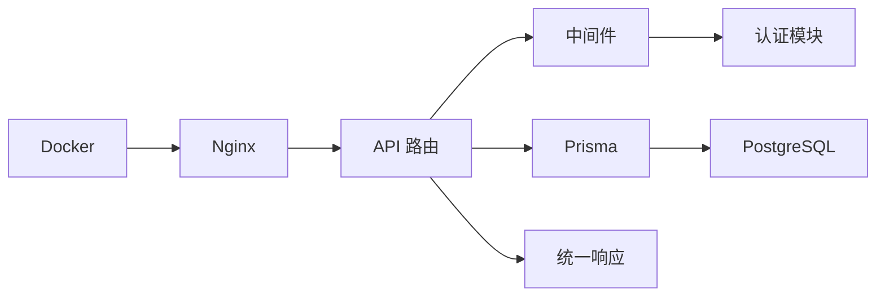

# 监控与日志

<cite>
**本文引用的文件**
- [package.json](file://package.json)
- [next.config.mjs](file://next.config.mjs)
- [Dockerfile](file://Dockerfile)
- [docker-compose.yml](file://docker-compose.yml)
- [lib/prisma.ts](file://lib/prisma.ts)
- [lib/middleware.ts](file://lib/middleware.ts)
- [lib/auth.ts](file://lib/auth.ts)
- [lib/api-response.ts](file://lib/api-response.ts)
- [lib/config.ts](file://lib/config.ts)
- [lib/api-client.ts](file://lib/api-client.ts)
- [app/api/auth/login/route.ts](file://app/api/auth/login/route.ts)
- [app/api/tasks/route.ts](file://app/api/tasks/route.ts)
- [app/api/users/me/route.ts](file://app/api/users/me/route.ts)
- [app/api/organizations/route.ts](file://app/api/organizations/route.ts)
- [deploy/nginx/nginx.conf](file://deploy/nginx/nginx.conf)
- [NOTIFICATION_SYSTEM.md](file://NOTIFICATION_SYSTEM.md)
- [SITE_CONFIGURATION.md](file://SITE_CONFIGURATION.md)
</cite>

## 目录
1. [简介](#简介)
2. [项目结构](#项目结构)
3. [核心组件](#核心组件)
4. [架构总览](#架构总览)
5. [详细组件分析](#详细组件分析)
6. [依赖分析](#依赖分析)
7. [性能考量](#性能考量)
8. [故障排查指南](#故障排查指南)
9. [结论](#结论)
10. [附录](#附录)

## 简介
本文件面向日历任务管理系统，提供一套完整的监控与日志管理策略，涵盖应用性能监控（APM）、日志最佳实践、数据库与API监控、用户行为监控、告警与通知、健康检查与可用性、容量规划、日志聚合与可视化、性能优化与瓶颈识别、以及安全监控与合规审计。文档以仓库现有代码为依据，结合部署与配置文件，给出可落地的实施方案。

## 项目结构
系统采用 Next.js 16 前后端一体化架构，API 路由位于 app/api 下，数据库访问通过 Prisma 客户端，认证与中间件统一处理，Nginx 作为反向代理与静态资源前置。容器化通过 Dockerfile 与 docker-compose.yml 实现，PostgreSQL 提供持久化存储。

**图表来源**
- [Dockerfile](file://Dockerfile#L1-L72)
- [docker-compose.yml](file://docker-compose.yml#L1-L77)
- [deploy/nginx/nginx.conf](file://deploy/nginx/nginx.conf#L1-L114)
- [lib/prisma.ts](file://lib/prisma.ts#L1-L12)
- [lib/middleware.ts](file://lib/middleware.ts#L1-L47)
- [lib/auth.ts](file://lib/auth.ts#L1-L78)
- [lib/api-response.ts](file://lib/api-response.ts#L1-L101)
- [lib/config.ts](file://lib/config.ts#L1-L30)
- [lib/api-client.ts](file://lib/api-client.ts#L1-L525)

**章节来源**
- [Dockerfile](file://Dockerfile#L1-L72)
- [docker-compose.yml](file://docker-compose.yml#L1-L77)
- [deploy/nginx/nginx.conf](file://deploy/nginx/nginx.conf#L1-L114)
- [lib/prisma.ts](file://lib/prisma.ts#L1-L12)
- [lib/middleware.ts](file://lib/middleware.ts#L1-L47)
- [lib/auth.ts](file://lib/auth.ts#L1-L78)
- [lib/api-response.ts](file://lib/api-response.ts#L1-L101)
- [lib/config.ts](file://lib/config.ts#L1-L30)
- [lib/api-client.ts](file://lib/api-client.ts#L1-L525)

## 核心组件
- 认证与中间件：统一从请求头提取并校验 JWT，输出结构化日志，拦截未授权访问。
- 数据库访问：Prisma 客户端按环境配置日志级别，便于定位慢查询与错误。
- API 响应：统一 success/error/unauthorized/forbidden 等响应格式，便于监控系统解析。
- Nginx 代理：集中处理 SSL、安全头、超时、缓存与访问/错误日志，作为可观测性的第一入口。
- 配置中心：头像服务等外部依赖通过配置模块集中管理，便于切换与观测。

**章节来源**
- [lib/middleware.ts](file://lib/middleware.ts#L1-L47)
- [lib/prisma.ts](file://lib/prisma.ts#L1-L12)
- [lib/api-response.ts](file://lib/api-response.ts#L1-L101)
- [deploy/nginx/nginx.conf](file://deploy/nginx/nginx.conf#L1-L114)
- [lib/config.ts](file://lib/config.ts#L1-L30)

## 架构总览
系统监控与日志的关键路径如下：
- 认证链路：Nginx → Next.js 中间件 → 认证模块 → API 路由 → Prisma → 数据库
- API 链路：Nginx → Next.js API 路由 → 业务逻辑 → Prisma → 数据库
- 日志链路：应用日志（控制台）+ Nginx 访问/错误日志 + 数据库日志（容器健康检查）

**图表来源**
- [deploy/nginx/nginx.conf](file://deploy/nginx/nginx.conf#L42-L57)
- [lib/middleware.ts](file://lib/middleware.ts#L10-L39)
- [lib/auth.ts](file://lib/auth.ts#L45-L58)
- [app/api/tasks/route.ts](file://app/api/tasks/route.ts#L18-L273)
- [lib/prisma.ts](file://lib/prisma.ts#L7-L9)

## 详细组件分析

### 认证与日志组件
- 中间件在每次认证请求时打印结构化日志，包含路径、方法、是否携带头、Token 截断信息等，便于追踪鉴权失败原因。
- 认证模块对 Token 验证失败进行详细日志记录，包含错误信息、Token 长度与前缀，有助于定位异常。
- API 层在异常时统一返回 serverErrorResponse，便于监控系统识别服务端错误。

**图表来源**
- [lib/middleware.ts](file://lib/middleware.ts#L10-L39)
- [lib/auth.ts](file://lib/auth.ts#L45-L58)

**章节来源**
- [lib/middleware.ts](file://lib/middleware.ts#L1-L47)
- [lib/auth.ts](file://lib/auth.ts#L1-L78)
- [lib/api-response.ts](file://lib/api-response.ts#L86-L90)

### API 路由与日志
- 任务 API 在查询与创建任务时均捕获异常并记录错误日志，返回统一错误响应。
- 登录 API 对必填字段校验、用户查找、密码验证、Token 生成与返回进行完整链路记录。
- 用户与组织 API 同样遵循统一响应与异常处理模式。

**图表来源**
- [app/api/tasks/route.ts](file://app/api/tasks/route.ts#L18-L273)
- [app/api/auth/login/route.ts](file://app/api/auth/login/route.ts#L12-L75)
- [lib/api-response.ts](file://lib/api-response.ts#L19-L32)

**章节来源**
- [app/api/tasks/route.ts](file://app/api/tasks/route.ts#L1-L497)
- [app/api/auth/login/route.ts](file://app/api/auth/login/route.ts#L1-L75)
- [app/api/users/me/route.ts](file://app/api/users/me/route.ts#L1-L115)
- [app/api/organizations/route.ts](file://app/api/organizations/route.ts#L1-L204)
- [lib/api-response.ts](file://lib/api-response.ts#L1-L101)

### 数据库监控与日志
- Prisma 客户端在开发环境开启 error/warn 日志，在生产环境仅 error，便于控制日志体量。
- docker-compose 为 PostgreSQL 配置 healthcheck，测试命令为 pg_isready，可用于容器编排的健康探测。
- 建议在生产环境启用数据库慢查询日志与连接池监控，结合容器日志采集进行统一分析。

**图表来源**
- [lib/prisma.ts](file://lib/prisma.ts#L7-L9)
- [docker-compose.yml](file://docker-compose.yml#L19-L23)

**章节来源**
- [lib/prisma.ts](file://lib/prisma.ts#L1-L12)
- [docker-compose.yml](file://docker-compose.yml#L1-L77)

### Nginx 监控与日志
- Nginx 配置包含 SSL/TLS、安全头、超时、缓存与访问/错误日志路径，适合作为系统边界监控入口。
- 建议启用 gzip/HTTP/2 优化，配合上游 Next.js 的响应时间与错误率监控，形成端到端可观测性。

**章节来源**
- [deploy/nginx/nginx.conf](file://deploy/nginx/nginx.conf#L1-L114)

### 日志最佳实践
- 结构化日志：在认证与关键 API 路由中记录上下文字段（如路径、方法、用户ID、Token 截断），便于检索与聚合。
- 日志级别：区分 info/warn/error，异常场景统一走 serverErrorResponse，便于告警阈值设定。
- 敏感信息过滤：避免在日志中输出完整 Token、密码等，使用截断或脱敏策略；必要时通过白名单字段输出。

**章节来源**
- [lib/middleware.ts](file://lib/middleware.ts#L14-L20)
- [lib/auth.ts](file://lib/auth.ts#L50-L56)
- [lib/api-response.ts](file://lib/api-response.ts#L86-L90)

### 告警规则与通知
- 告警维度建议：错误率、P95/P99 延迟、连接数、数据库慢查询、Nginx 5xx/4xx、未读消息堆积、通知创建速率。
- 通知渠道：邮件/IM/Webhook，结合统一响应状态码与日志关键字触发。
- 故障响应流程：快速降级（如禁用非关键通知）、回滚、扩容、修复后回归测试。

（本节为通用实践说明，不直接分析具体文件）

### 系统健康检查与可用性
- 容器健康检查：PostgreSQL 使用 pg_isready，应用可通过 /health 或 Nginx 返回码判断存活。
- 服务可用性：结合 Nginx 与容器编排的重启策略，确保故障自愈。

**章节来源**
- [docker-compose.yml](file://docker-compose.yml#L19-L23)

### 容量规划
- 观察点：API QPS、响应时间分布、数据库连接数、内存/CPU 使用率、磁盘空间。
- 规划步骤：峰值预测、压力测试、资源扩容预案、缓存与异步化改造。

（本节为通用实践说明，不直接分析具体文件）

### 日志聚合、分析与可视化
- 日志采集：容器标准输出 + Nginx 访问/错误日志文件。
- 聚合与分析：ELK/EFK 或云日志服务，建立索引与仪表板。
- 可视化：错误趋势、Top 路径、用户会话追踪、慢查询热力图。

（本节为通用实践说明，不直接分析具体文件）

### 性能优化与瓶颈识别
- 前端：静态资源缓存、CDN、骨架屏与懒加载。
- 后端：数据库索引优化、批量查询、连接池配置、缓存命中率。
- API：参数校验前置、并发限制、超时与熔断、异步通知。

（本节为通用实践说明，不直接分析具体文件）

### 安全监控与合规审计
- 安全监控：异常登录、频繁 401、异常路径访问、敏感接口调用。
- 合规审计：用户操作日志（登录、创建/修改任务、删除）、数据导出与访问记录。
- 数据保护：日志脱敏、最小化采集、访问控制与加密传输。

（本节为通用实践说明，不直接分析具体文件）

## 依赖分析
- 组件耦合：API 路由依赖中间件与 Prisma；中间件依赖认证模块；统一响应封装贯穿各层。
- 外部依赖：PostgreSQL（数据库）、Nginx（反向代理）、Docker（运行时）。
- 潜在循环：当前结构清晰，无明显循环依赖。

**图表来源**
- [app/api/tasks/route.ts](file://app/api/tasks/route.ts#L1-L497)
- [lib/middleware.ts](file://lib/middleware.ts#L1-L47)
- [lib/auth.ts](file://lib/auth.ts#L1-L78)
- [lib/api-response.ts](file://lib/api-response.ts#L1-L101)
- [lib/prisma.ts](file://lib/prisma.ts#L1-L12)
- [deploy/nginx/nginx.conf](file://deploy/nginx/nginx.conf#L1-L114)
- [Dockerfile](file://Dockerfile#L1-L72)

**章节来源**
- [app/api/tasks/route.ts](file://app/api/tasks/route.ts#L1-L497)
- [lib/middleware.ts](file://lib/middleware.ts#L1-L47)
- [lib/auth.ts](file://lib/auth.ts#L1-L78)
- [lib/api-response.ts](file://lib/api-response.ts#L1-L101)
- [lib/prisma.ts](file://lib/prisma.ts#L1-L12)
- [deploy/nginx/nginx.conf](file://deploy/nginx/nginx.conf#L1-L114)
- [Dockerfile](file://Dockerfile#L1-L72)

## 性能考量
- 日志开销控制：生产环境仅记录 error，避免高频 warn 影响 IO。
- 数据库性能：合理索引、批量写入、事务边界控制；慢查询日志与 Top SQL 分析。
- 网络与缓存：Nginx 缓存静态资源，合理设置过期与 ETag；CDN 加速图片与静态资源。
- 前端体验：骨架屏、懒加载、预取与分页策略降低首屏延迟。

（本节为通用实践说明，不直接分析具体文件）

## 故障排查指南
- 认证失败：检查中间件日志与认证模块错误日志，核对 Token 格式与过期时间。
- API 500：查看统一错误响应与堆栈日志，定位具体路由与数据库调用。
- 数据库不可达：检查 PostgreSQL 健康检查与容器日志，确认连接参数与网络连通。
- Nginx 异常：检查访问/错误日志，确认 SSL、超时与代理头配置。

**章节来源**
- [lib/middleware.ts](file://lib/middleware.ts#L14-L20)
- [lib/auth.ts](file://lib/auth.ts#L50-L56)
- [lib/api-response.ts](file://lib/api-response.ts#L86-L90)
- [docker-compose.yml](file://docker-compose.yml#L19-L23)
- [deploy/nginx/nginx.conf](file://deploy/nginx/nginx.conf#L34-L36)

## 结论
本系统具备良好的监控与日志基础：统一的认证中间件、结构化日志、统一响应格式、Nginx 边界监控与 PostgreSQL 健康检查。建议在此基础上完善日志聚合与可视化、建立告警规则与通知机制、持续进行性能优化与安全审计，以支撑业务稳定增长与合规要求。

## 附录
- 环境变量与配置：站点配置模块集中管理外部服务地址，便于切换与观测。
- API 客户端：统一的请求封装与错误处理，便于前端侧埋点与监控。

**章节来源**
- [lib/config.ts](file://lib/config.ts#L1-L30)
- [lib/api-client.ts](file://lib/api-client.ts#L1-L525)
- [package.json](file://package.json#L1-L75)
- [next.config.mjs](file://next.config.mjs#L1-L20)