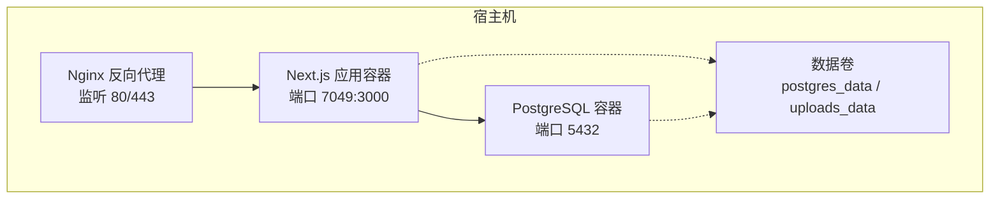
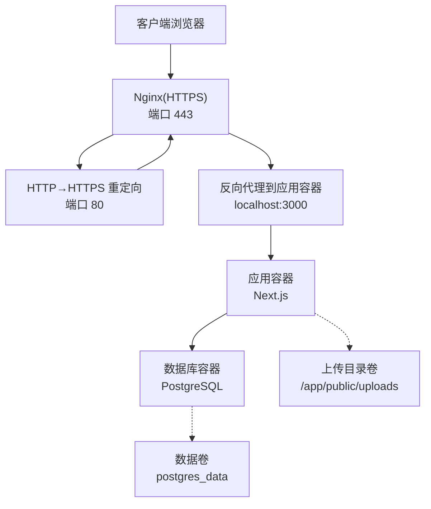
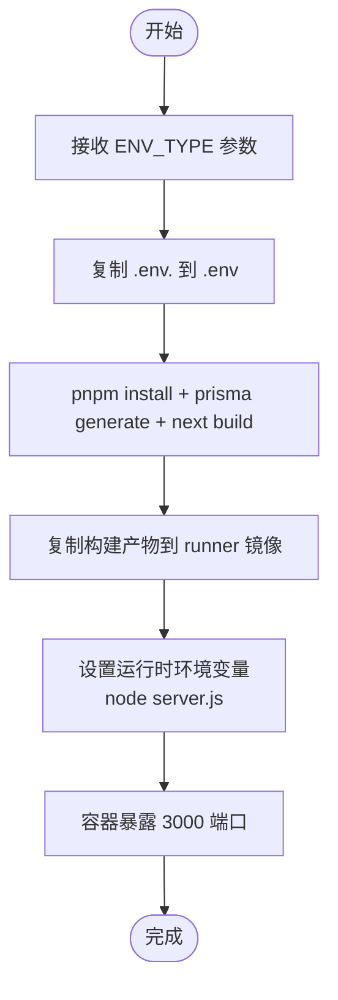
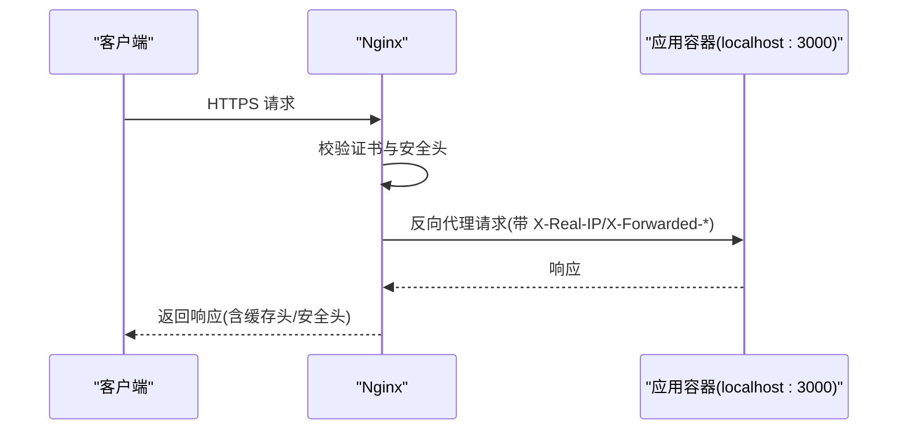
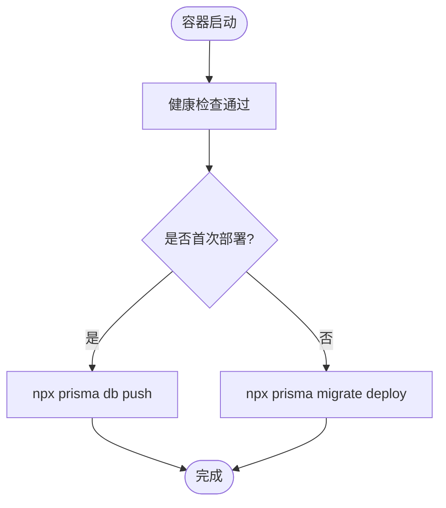
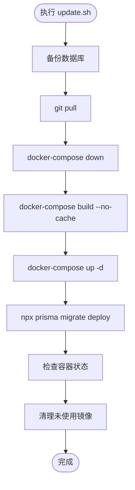
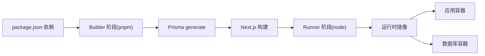

# 部署配置

<cite>
**本文引用的文件**
- [DEPLOYMENT.md](file://deploy/DEPLOYMENT.md)
- [DOCKER_DEPLOYMENT.md](file://DOCKER_DEPLOYMENT.md)
- [FRESH_SERVER_DEPLOYMENT.md](file://FRESH_SERVER_DEPLOYMENT.md)
- [MULTI_ENV_DEPLOYMENT.md](file://MULTI_ENV_DEPLOYMENT.md)
- [QUICK_DEPLOY.md](file://QUICK_DEPLOY.md)
- [DEPLOY_CHECKLIST.md](file://DEPLOY_CHECKLIST.md)
- [docker-compose.yml](file://docker-compose.yml)
- [Dockerfile](file://Dockerfile)
- [setup-server.sh](file://deploy/setup-server.sh)
- [update.sh](file://deploy/update.sh)
- [nginx.conf](file://deploy/nginx/nginx.conf)
- [deploy.sh](file://scripts/deploy.sh)
- [.env](file://.env)
- [package.json](file://package.json)
- [next.config.mjs](file://next.config.mjs)
</cite>

## 目录
1. [简介](#简介)
2. [项目结构](#项目结构)
3. [核心组件](#核心组件)
4. [架构总览](#架构总览)
5. [详细组件分析](#详细组件分析)
6. [依赖关系分析](#依赖关系分析)
7. [性能考虑](#性能考虑)
8. [故障排除指南](#故障排除指南)
9. [结论](#结论)
10. [附录](#附录)

## 简介
本文件面向运维与开发团队，提供日历任务管理系统的完整部署配置与操作手册，覆盖 Docker 容器化部署、全新服务器一次性部署、多环境配置、反向代理与 SSL、自动化与 CI/CD、监控与日志、安全加固等主题。文档同时给出可视化图示与操作步骤，帮助快速落地生产环境。

## 项目结构
- 应用采用前后端一体化的 Next.js 应用，使用 Prisma 作为 ORM，PostgreSQL 作为持久化存储。
- 部署通过 Docker Compose 编排应用与数据库，支持反向代理（Nginx）、健康检查、卷挂载与网络隔离。
- 提供多种部署路径：一键初始化脚本、离线镜像导入、多环境构建、自动化流水线等。

图表来源
- [docker-compose.yml](file://docker-compose.yml#L1-L77)
- [nginx.conf](file://deploy/nginx/nginx.conf#L1-L114)

章节来源
- [docker-compose.yml](file://docker-compose.yml#L1-L77)
- [Dockerfile](file://Dockerfile#L1-L72)
- [nginx.conf](file://deploy/nginx/nginx.conf#L1-L114)

## 核心组件
- 应用容器（Next.js）
  - 运行时环境：生产模式，暴露端口 3000，容器内用户非 root。
  - 通过环境变量注入数据库连接、站点配置与头像服务地址。
  - 依赖数据库健康就绪后启动。
- 数据库容器（PostgreSQL）
  - 健康检查基于 pg_isready；持久化数据卷。
- 反向代理（Nginx）
  - 提供 HTTPS 终端、HTTP→HTTPS 重定向、安全头、静态资源缓存与超时控制。
- 配置与脚本
  - 多环境构建脚本、一键初始化脚本、更新脚本、Nginx 配置模板。

章节来源
- [docker-compose.yml](file://docker-compose.yml#L25-L48)
- [Dockerfile](file://Dockerfile#L32-L72)
- [nginx.conf](file://deploy/nginx/nginx.conf#L4-L113)
- [deploy.sh](file://scripts/deploy.sh#L1-L56)
- [setup-server.sh](file://deploy/setup-server.sh#L1-L148)
- [update.sh](file://deploy/update.sh#L1-L61)

## 架构总览
下图展示生产环境典型拓扑：Nginx 作为入口，负责 SSL、静态缓存与反向代理；应用容器提供 API 与页面；数据库容器提供数据持久化。

图表来源
- [nginx.conf](file://deploy/nginx/nginx.conf#L4-L113)
- [docker-compose.yml](file://docker-compose.yml#L25-L48)

## 详细组件分析

### Docker 编排与镜像构建
- docker-compose.yml
  - 定义应用与数据库服务、网络、卷与健康检查。
  - 环境变量注入数据库连接、站点配置与头像服务地址。
  - 应用容器命令为直接启动 server.js，便于 Standalone 部署。
- Dockerfile
  - 多阶段构建：builder 阶段安装 pnpm、复制 .env.<ENV_TYPE>、生成 Prisma 客户端并构建 Next.js；runner 阶段复制构建产物与依赖，设置非 root 用户与运行时环境变量。
  - CMD 启动 node server.js，暴露端口 3000。
- 多环境构建脚本
  - scripts/deploy.sh：根据传入 ENV_TYPE（company/personal/team/custom）复制对应 .env 文件，构建镜像并启动容器。
  - QUICK_DEPLOY.md 说明 NEXT_PUBLIC_* 在构建期注入，需重新构建以生效。

图表来源
- [Dockerfile](file://Dockerfile#L1-L72)
- [deploy.sh](file://scripts/deploy.sh#L1-L56)

章节来源
- [docker-compose.yml](file://docker-compose.yml#L25-L48)
- [Dockerfile](file://Dockerfile#L1-L72)
- [deploy.sh](file://scripts/deploy.sh#L1-L56)
- [QUICK_DEPLOY.md](file://QUICK_DEPLOY.md#L1-L124)

### 反向代理与 SSL 配置
- Nginx 配置要点
  - 监听 80/443，开启 HTTP/2，配置 SSL 证书与协议/加密套件。
  - 设置安全头（HSTS、X-Frame-Options、X-Content-Type-Options、X-XSS-Protection）。
  - 对静态资源与图片设置缓存策略与超时。
  - 代理到 localhost:3000，透传真实 IP 与协议头。
- 部署方式
  - 一键初始化脚本会复制模板至 sites-available 并启用。
  - 也可参考阿里云部署指南的手工配置步骤。

图表来源
- [nginx.conf](file://deploy/nginx/nginx.conf#L4-L113)
- [setup-server.sh](file://deploy/setup-server.sh#L114-L119)

章节来源
- [nginx.conf](file://deploy/nginx/nginx.conf#L1-L114)
- [setup-server.sh](file://deploy/setup-server.sh#L114-L119)
- [DEPLOYMENT.md](file://DEPLOYMENT.md#L64-L76)

### 数据库与持久化
- docker-compose.yml
  - 数据库服务使用 postgres:16-alpine，设置 POSTGRES_USER/PASSWORD/DB。
  - 健康检查基于 pg_isready；端口 5432 暴露。
  - 持久化卷 postgres_data，避免容器重建丢失数据。
- 初始化与迁移
  - 首次部署可使用 Prisma db push 或 migrate deploy。
  - 自动化脚本在启动后执行迁移，确保表结构与数据一致。

图表来源
- [docker-compose.yml](file://docker-compose.yml#L19-L23)
- [update.sh](file://deploy/update.sh#L44-L46)

章节来源
- [docker-compose.yml](file://docker-compose.yml#L5-L23)
- [update.sh](file://deploy/update.sh#L44-L46)

### 多环境与头像服务配置
- 多环境部署
  - 通过 .env.company/.env.personal/.env.team 等文件区分站点名称、标语、页面标题等 NEXT_PUBLIC_* 配置。
  - 使用 scripts/deploy.sh 切换环境，构建期注入变量。
- 头像服务地址
  - AVATAR_API_URL 可在宿主 .env 中配置，支持公网或内网服务。
  - 无需重新构建镜像，修改后重启应用容器即可生效。

章节来源
- [QUICK_DEPLOY.md](file://QUICK_DEPLOY.md#L94-L124)
- [MULTI_ENV_DEPLOYMENT.md](file://MULTI_ENV_DEPLOYMENT.md#L1-L153)
- [.env](file://.env#L10-L17)

### 一键初始化与更新脚本
- 初始化脚本（阿里云）
  - 自动安装 Docker/Docker Compose/Nginx，配置防火墙，克隆项目，生成 .env，创建 SSL 目录，复制并启用 Nginx 配置，启动应用并检查状态。
- 更新脚本
  - 自动备份数据库、拉取代码、停止服务、重建镜像、启动服务、执行迁移、清理镜像。

图表来源
- [update.sh](file://deploy/update.sh#L1-L61)
- [setup-server.sh](file://deploy/setup-server.sh#L1-L148)

章节来源
- [setup-server.sh](file://deploy/setup-server.sh#L1-L148)
- [update.sh](file://deploy/update.sh#L1-L61)

### 全新服务器离线部署（FTP/SCP）
- 本地打包：构建镜像并导出为 tar，压缩包约 450-550MB。
- 服务器端：安装 Docker 与 Compose，加载镜像，拉取数据库镜像，配置 .env，启动服务，等待数据库就绪，执行 Prisma 迁移，验证登录与任务创建。
- 可选：配置 Nginx 反向代理与 SSL 证书，设置防火墙放行 80/443/3000。

章节来源
- [FRESH_SERVER_DEPLOYMENT.md](file://FRESH_SERVER_DEPLOYMENT.md#L73-L457)

### 生产环境优化与安全
- 端口与网络
  - 仅暴露必要端口；使用 Docker 网络隔离服务。
- 防火墙
  - UFW 放行 22/80/443/3000，启用并检查状态。
- 安全加固
  - 禁用 root SSH 登录、安装 fail2ban、定期系统更新。
  - Nginx 配置安全头与 HTTPS 优化。
- 资源限制
  - 在 docker-compose.yml 中为应用容器设置 CPU/内存限制与保留。

章节来源
- [DEPLOYMENT.md](file://DEPLOYMENT.md#L288-L324)
- [FRESH_SERVER_DEPLOYMENT.md](file://FRESH_SERVER_DEPLOYMENT.md#L460-L483)
- [DOCKER_DEPLOYMENT.md](file://DOCKER_DEPLOYMENT.md#L205-L233)

### CI/CD 与自动化部署
- GitHub Actions（阿里云示例）
  - 在服务器生成 SSH 密钥对，将公钥加入 authorized_keys，将私钥配置为 Actions Secret。
  - 推送代码到 main 分支后自动触发部署脚本。
- 快速部署清单
  - 包含自动/手动部署命令与验证清单，便于回归测试与快速回滚。

章节来源
- [DEPLOYMENT.md](file://DEPLOYMENT.md#L112-L151)
- [DEPLOY_CHECKLIST.md](file://DEPLOY_CHECKLIST.md#L1-L97)

## 依赖关系分析
- 构建期依赖
  - pnpm、Prisma CLI、Next.js 构建工具链。
- 运行期依赖
  - Node.js 运行时、PostgreSQL 客户端、Nginx（可选）。
- 镜像与体积
  - 多阶段构建减少最终镜像体积；runner 镜像仅包含运行所需文件与依赖。

图表来源
- [package.json](file://package.json#L11-L74)
- [Dockerfile](file://Dockerfile#L1-L72)
- [next.config.mjs](file://next.config.mjs#L1-L20)

章节来源
- [package.json](file://package.json#L11-L74)
- [Dockerfile](file://Dockerfile#L1-L72)
- [next.config.mjs](file://next.config.mjs#L1-L20)

## 性能考虑
- 构建优化
  - 使用多阶段构建与缓存，避免重复安装依赖。
- 运行时优化
  - Nginx 对静态资源与图片设置缓存与长 TTL。
  - 应用容器设置资源上限，避免资源争用。
- 日志与监控
  - 使用 docker stats 与日志轮转，结合 Nginx 访问/错误日志定位性能瓶颈。

章节来源
- [DOCKER_DEPLOYMENT.md](file://DOCKER_DEPLOYMENT.md#L205-L249)
- [nginx.conf](file://deploy/nginx/nginx.conf#L59-L71)

## 故障排除指南
- 容器无法启动
  - 查看 docker-compose logs，检查端口占用与环境变量。
- 数据库连接失败
  - 进入数据库容器检查连接与表结构；核对 .env 中 DATABASE_URL。
- 端口冲突
  - 修改 docker-compose.yml 中端口映射；或调整宿主防火墙。
- SSL 证书问题
  - 检查证书文件存在与有效期；重新加载 Nginx。
- 更新失败
  - 使用 update.sh 自动备份与重建；若迁移异常，进入容器执行 prisma migrate status 诊断。

章节来源
- [DEPLOYMENT.md](file://DEPLOYMENT.md#L221-L284)
- [FRESH_SERVER_DEPLOYMENT.md](file://FRESH_SERVER_DEPLOYMENT.md#L757-L798)
- [update.sh](file://deploy/update.sh#L1-L61)

## 结论
本部署配置文档提供了从零到一的完整路径：Docker 容器化、Nginx 反向代理、多环境构建、自动化与安全加固、监控与日志、以及常见问题排查。按照本文档逐步实施，可在生产环境中稳定运行日历任务管理系统。

## 附录

### 环境变量与配置文件说明
- .env（开发/示例）
  - 包含数据库连接、JWT 密钥、站点配置与头像服务地址。
- .env.company/.env.personal/.env.team
  - 区分不同站点的 NEXT_PUBLIC_* 配置，用于多环境构建。
- docker-compose.yml
  - 定义服务、端口映射、环境变量、卷与健康检查。
- next.config.mjs
  - 生产模式启用 standalone 输出，关闭字体优化以适配 Docker 构建环境。

章节来源
- [.env](file://.env#L1-L17)
- [docker-compose.yml](file://docker-compose.yml#L36-L39)
- [next.config.mjs](file://next.config.mjs#L1-L20)

### 常用命令速查
- 启动/停止/重启
  - docker-compose up -d / down / restart app
- 查看日志
  - docker-compose logs -f / logs -f app / logs -f postgres
- 运行迁移
  - docker exec calendar-app npx prisma migrate deploy
- 备份/恢复
  - pg_dump / psql 导入；或使用 update.sh 自动备份脚本

章节来源
- [DEPLOYMENT.md](file://DEPLOYMENT.md#L155-L217)
- [update.sh](file://deploy/update.sh#L15-L21)