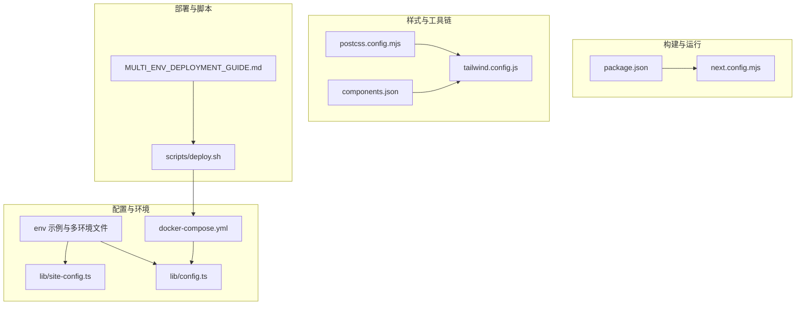
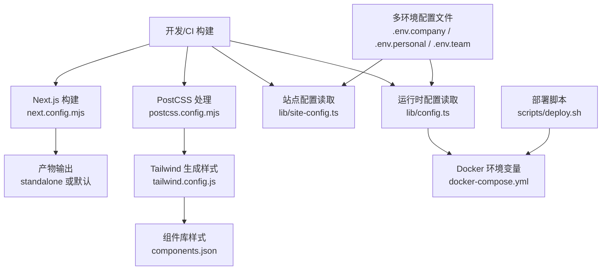
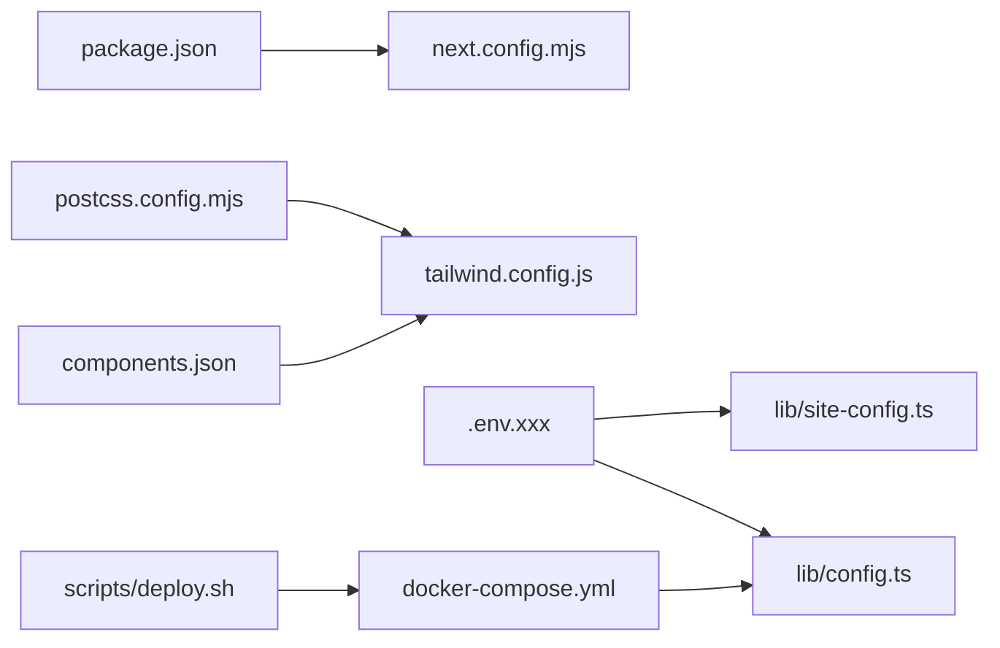

# 配置管理

<cite>
**本文引用的文件**
- [next.config.mjs](file://next.config.mjs)
- [tailwind.config.js](file://tailwind.config.js)
- [postcss.config.mjs](file://postcss.config.mjs)
- [components.json](file://components.json)
- [package.json](file://package.json)
- [lib/site-config.ts](file://lib/site-config.ts)
- [lib/config.ts](file://lib/config.ts)
- [SITE_CONFIGURATION.md](file://SITE_CONFIGURATION.md)
- [MULTI_ENV_DEPLOYMENT_GUIDE.md](file://MULTI_ENV_DEPLOYMENT_GUIDE.md)
- [scripts/deploy.sh](file://scripts/deploy.sh)
- [docker-compose.yml](file://docker-compose.yml)
- [.env.example](file://.env.example)
</cite>

## 目录
1. [简介](#简介)
2. [项目结构](#项目结构)
3. [核心组件](#核心组件)
4. [架构总览](#架构总览)
5. [详细组件分析](#详细组件分析)
6. [依赖分析](#依赖分析)
7. [性能考量](#性能考量)
8. [故障排查指南](#故障排查指南)
9. [结论](#结论)
10. [附录](#附录)

## 简介
本文件系统性梳理日历任务管理系统中的配置体系，覆盖 Next.js 构建与运行配置、Tailwind CSS 与 PostCSS 的样式管线、组件库配置（shadcn/ui）、站点配置与环境变量管理、以及多环境部署策略与最佳实践。文档同时提供动态配置加载、热重载与版本控制建议，并给出开发、测试、生产三类环境的差异化配置策略。

## 项目结构
围绕配置相关的文件分布如下：
- 构建与运行配置：next.config.mjs、package.json
- 样式与工具链：tailwind.config.js、postcss.config.mjs、components.json
- 站点配置与运行时配置：lib/site-config.ts、lib/config.ts、.env.example、docker-compose.yml
- 多环境与部署：MULTI_ENV_DEPLOYMENT_GUIDE.md、scripts/deploy.sh
- 文档与说明：SITE_CONFIGURATION.md

图表来源
- [next.config.mjs](file://next.config.mjs#L1-L20)
- [package.json](file://package.json#L1-L75)
- [tailwind.config.js](file://tailwind.config.js#L1-L12)
- [postcss.config.mjs](file://postcss.config.mjs#L1-L10)
- [components.json](file://components.json#L1-L22)
- [lib/site-config.ts](file://lib/site-config.ts#L1-L34)
- [lib/config.ts](file://lib/config.ts#L1-L30)
- [docker-compose.yml](file://docker-compose.yml#L1-L77)
- [scripts/deploy.sh](file://scripts/deploy.sh#L1-L56)
- [MULTI_ENV_DEPLOYMENT_GUIDE.md](file://MULTI_ENV_DEPLOYMENT_GUIDE.md#L1-L309)

章节来源
- [next.config.mjs](file://next.config.mjs#L1-L20)
- [tailwind.config.js](file://tailwind.config.js#L1-L12)
- [postcss.config.mjs](file://postcss.config.mjs#L1-L10)
- [components.json](file://components.json#L1-L22)
- [package.json](file://package.json#L1-L75)
- [lib/site-config.ts](file://lib/site-config.ts#L1-L34)
- [lib/config.ts](file://lib/config.ts#L1-L30)
- [docker-compose.yml](file://docker-compose.yml#L1-L77)
- [scripts/deploy.sh](file://scripts/deploy.sh#L1-L56)
- [MULTI_ENV_DEPLOYMENT_GUIDE.md](file://MULTI_ENV_DEPLOYMENT_GUIDE.md#L1-L309)
- [.env.example](file://.env.example#L1-L33)

## 核心组件
- Next.js 构建与运行配置：控制输出模式、TypeScript 行为、图片处理、实验性优化等。
- Tailwind CSS 与 PostCSS：内容扫描路径、主题扩展、插件与自动前缀。
- 组件库配置（shadcn/ui）：风格、RSC/TSX 支持、Tailwind 集成、别名与图标库。
- 站点配置与运行时配置：统一从环境变量读取，提供默认值与派生属性。
- 多环境与部署：通过 .env.xxx 文件与部署脚本实现一键切换与验证。

章节来源
- [next.config.mjs](file://next.config.mjs#L1-L20)
- [tailwind.config.js](file://tailwind.config.js#L1-L12)
- [postcss.config.mjs](file://postcss.config.mjs#L1-L10)
- [components.json](file://components.json#L1-L22)
- [lib/site-config.ts](file://lib/site-config.ts#L1-L34)
- [lib/config.ts](file://lib/config.ts#L1-L30)
- [MULTI_ENV_DEPLOYMENT_GUIDE.md](file://MULTI_ENV_DEPLOYMENT_GUIDE.md#L1-L309)

## 架构总览
下图展示配置在系统中的作用与交互关系：

图表来源
- [next.config.mjs](file://next.config.mjs#L1-L20)
- [postcss.config.mjs](file://postcss.config.mjs#L1-L10)
- [tailwind.config.js](file://tailwind.config.js#L1-L12)
- [components.json](file://components.json#L1-L22)
- [lib/site-config.ts](file://lib/site-config.ts#L1-L34)
- [lib/config.ts](file://lib/config.ts#L1-L30)
- [docker-compose.yml](file://docker-compose.yml#L1-L77)
- [scripts/deploy.sh](file://scripts/deploy.sh#L1-L56)

## 详细组件分析

### Next.js 配置（next.config.mjs）
- 输出模式：生产环境采用独立输出模式，便于容器部署。
- TypeScript：构建错误忽略，提升 CI 容错。
- 图片：禁用优化，适配静态资源或自托管场景。
- 实验特性：按需导入优化，减少包体积与构建时间。
- 适用场景：Docker 构建、多环境打包、性能优化。

章节来源
- [next.config.mjs](file://next.config.mjs#L1-L20)

### Tailwind CSS 配置（tailwind.config.js）
- 内容扫描：覆盖 pages、components、app 目录，确保按需生成样式。
- 主题扩展：当前为空，便于集中扩展主题变量与工具类。
- 插件：当前为空，预留扩展空间（如动画、forms 等）。
- 与 PostCSS 协同：通过 postcss.config.mjs 加载 Tailwind 与 autoprefixer。

章节来源
- [tailwind.config.js](file://tailwind.config.js#L1-L12)
- [postcss.config.mjs](file://postcss.config.mjs#L1-L10)

### 组件库配置（components.json）
- 风格与语法：New York 风格、RSC/TSX 支持。
- Tailwind 集成：CSS 变量启用、基础色、前缀等。
- 别名映射：components、utils、ui、lib、hooks 指向 @/ 路径，统一导入。
- 图标库：Lucide 图标库。
- 用途：保证组件库安装与使用的一致性与可维护性。

章节来源
- [components.json](file://components.json#L1-L22)

### 站点配置（lib/site-config.ts）
- 来源：从 NEXT_PUBLIC_* 环境变量读取，提供默认值。
- 派生属性：页面 SEO 描述、Logo Alt 文本、完整标题等。
- 使用：在布局、页面与元数据中统一引用，避免硬编码。

章节来源
- [lib/site-config.ts](file://lib/site-config.ts#L1-L34)
- [SITE_CONFIGURATION.md](file://SITE_CONFIGURATION.md#L1-L267)

### 运行时配置（lib/config.ts）
- 头像服务：支持公网 DiceBear API 与内网自定义地址。
- 路径模板：头像 API 路径与查询参数。
- 工具函数：根据用户名生成头像 URL。
- 环境变量：AVATAR_API_URL 控制服务地址。

章节来源
- [lib/config.ts](file://lib/config.ts#L1-L30)
- [.env.example](file://.env.example#L1-L33)

### 多环境与部署（MULTI_ENV_DEPLOYMENT_GUIDE.md、scripts/deploy.sh、docker-compose.yml）
- 环境文件：.env.company、.env.personal、.env.team 等，分别对应企业版、个人版、团队版。
- 部署脚本：自动检查环境文件、显示配置、构建镜像、启动容器、验证服务。
- Docker Compose：定义数据库、应用容器、健康检查与命令；应用容器读取运行时环境变量。
- 验证：通过日志与页面标题、Logo 文案核对配置是否生效。

章节来源
- [MULTI_ENV_DEPLOYMENT_GUIDE.md](file://MULTI_ENV_DEPLOYMENT_GUIDE.md#L1-L309)
- [scripts/deploy.sh](file://scripts/deploy.sh#L1-L56)
- [docker-compose.yml](file://docker-compose.yml#L1-L77)

### 环境变量与配置组织（.env.example）
- 数据库连接：DATABASE_URL、POSTGRES_PASSWORD。
- JWT 密钥：JWT_SECRET。
- 头像服务：AVATAR_API_URL。
- 运行环境：NODE_ENV。
- 站点配置：NEXT_PUBLIC_*（应用名称、副标题、标语、页面标题）。

章节来源
- [.env.example](file://.env.example#L1-L33)

### 构建与运行依赖（package.json）
- 依赖：Next.js、React、Tailwind、Radix UI、Recharts、Prisma 等。
- 开发依赖：Tailwind、PostCSS、TypeScript、Prisma 等。
- 脚本：dev、build、start、lint。

章节来源
- [package.json](file://package.json#L1-L75)

## 依赖分析
- Next.js 与构建：next.config.mjs 影响输出模式与图片处理，影响最终镜像大小与启动行为。
- 样式管线：postcss.config.mjs 引入 Tailwind 与 autoprefixer，tailwind.config.js 控制内容扫描与主题扩展。
- 组件库：components.json 规范组件库风格与别名，确保一致性。
- 配置来源：站点配置来自 NEXT_PUBLIC_*，运行时配置来自进程环境变量与 .env 文件。
- 部署链路：scripts/deploy.sh 选择 .env.xxx 并传入 docker-compose，后者注入环境变量至容器。

图表来源
- [package.json](file://package.json#L1-L75)
- [next.config.mjs](file://next.config.mjs#L1-L20)
- [postcss.config.mjs](file://postcss.config.mjs#L1-L10)
- [tailwind.config.js](file://tailwind.config.js#L1-L12)
- [components.json](file://components.json#L1-L22)
- [lib/site-config.ts](file://lib/site-config.ts#L1-L34)
- [lib/config.ts](file://lib/config.ts#L1-L30)
- [docker-compose.yml](file://docker-compose.yml#L1-L77)
- [scripts/deploy.sh](file://scripts/deploy.sh#L1-L56)

章节来源
- [package.json](file://package.json#L1-L75)
- [next.config.mjs](file://next.config.mjs#L1-L20)
- [postcss.config.mjs](file://postcss.config.mjs#L1-L10)
- [tailwind.config.js](file://tailwind.config.js#L1-L12)
- [components.json](file://components.json#L1-L22)
- [lib/site-config.ts](file://lib/site-config.ts#L1-L34)
- [lib/config.ts](file://lib/config.ts#L1-L30)
- [docker-compose.yml](file://docker-compose.yml#L1-L77)
- [scripts/deploy.sh](file://scripts/deploy.sh#L1-L56)

## 性能考量
- 构建优化
  - 独立输出模式：生产环境使用独立输出，减少容器启动时间与 IO 开销。
  - 忽略 TS 构建错误：提升 CI 容错，但需在本地严格校验。
  - 图片优化关闭：适用于静态资源或自托管场景，避免额外处理成本。
  - 包导入优化：按需导入减少包体积与构建时间。
- 样式优化
  - Tailwind 内容扫描仅限必要目录，避免无谓扫描。
  - 插件与主题扩展保持最小化，降低编译复杂度。
- 运行时优化
  - 头像服务走内网地址可显著降低延迟与外网依赖风险。
  - Docker 环境变量集中管理，避免重复构建。

章节来源
- [next.config.mjs](file://next.config.mjs#L1-L20)
- [tailwind.config.js](file://tailwind.config.js#L1-L12)
- [lib/config.ts](file://lib/config.ts#L1-L30)

## 故障排查指南
- 环境变量未生效
  - 检查是否以 NEXT_PUBLIC_ 前缀导出（客户端可见）。
  - 修改 NEXT_PUBLIC_* 后需重新构建镜像；开发环境可自动热重载。
- Docker 部署后配置未生效
  - 确认 docker-compose.yml 中环境变量已注入。
  - 重新构建镜像并重启容器。
- 生产环境显示默认值
  - 确认环境变量已正确设置并包含在构建上下文。
  - 重新构建并检查构建日志。
- 部署脚本报错
  - 检查 .env.xxx 是否存在，查看构建日志与容器状态。
  - 使用 docker-compose ps/logs 排查服务启动问题。

章节来源
- [SITE_CONFIGURATION.md](file://SITE_CONFIGURATION.md#L190-L231)
- [MULTI_ENV_DEPLOYMENT_GUIDE.md](file://MULTI_ENV_DEPLOYMENT_GUIDE.md#L202-L276)
- [scripts/deploy.sh](file://scripts/deploy.sh#L1-L56)
- [docker-compose.yml](file://docker-compose.yml#L1-L77)

## 结论
本项目的配置体系以“环境变量驱动 + 统一配置模块 + 多环境部署脚本”为核心，结合 Next.js、Tailwind 与组件库配置，形成可移植、可扩展且易于维护的前端工程化方案。通过明确区分站点配置与运行时配置、规范环境文件命名与注入方式、以及提供一键部署脚本，能够高效支撑开发、测试与生产的多场景需求。

## 附录

### 动态配置加载与热重载
- 站点配置：NEXT_PUBLIC_* 在构建时注入，修改后需重新构建；开发环境可自动刷新。
- 运行时配置：容器启动时读取，修改后仅需重启容器。
- 建议：将频繁变更的 UI 文案放入 NEXT_PUBLIC_*，将数据库、密钥等放入运行时环境变量。

章节来源
- [SITE_CONFIGURATION.md](file://SITE_CONFIGURATION.md#L171-L175)
- [MULTI_ENV_DEPLOYMENT_GUIDE.md](file://MULTI_ENV_DEPLOYMENT_GUIDE.md#L118-L127)

### 配置热重载与版本控制
- 热重载：开发环境自动监听 NEXT_PUBLIC_* 变化并刷新页面。
- 版本控制：.env.xxx 文件纳入版本控制，配合脚本进行环境切换与验证。
- 建议：为每个环境的镜像打标签，便于回滚与审计。

章节来源
- [scripts/deploy.sh](file://scripts/deploy.sh#L251-L276)
- [docker-compose.yml](file://docker-compose.yml#L27-L28)

### 开发/测试/生产环境策略
- 开发环境：使用 .env.example 初始化，启用调试与本地数据库。
- 测试环境：使用 .env.team 或自定义 .env.xxx，模拟生产依赖。
- 生产环境：通过 docker-compose.yml 注入运行时变量，使用独立输出模式与内网头像服务。

章节来源
- [.env.example](file://.env.example#L1-L33)
- [docker-compose.yml](file://docker-compose.yml#L1-L77)
- [MULTI_ENV_DEPLOYMENT_GUIDE.md](file://MULTI_ENV_DEPLOYMENT_GUIDE.md#L128-L172)

### 配置迁移、备份与审计
- 迁移：新增 .env.xxx 后，通过部署脚本一键切换与验证。
- 备份：定期打包 .env.* 文件，保留历史快照。
- 审计：记录镜像标签、构建参数与部署日志，便于追踪变更。

章节来源
- [MULTI_ENV_DEPLOYMENT_GUIDE.md](file://MULTI_ENV_DEPLOYMENT_GUIDE.md#L259-L276)