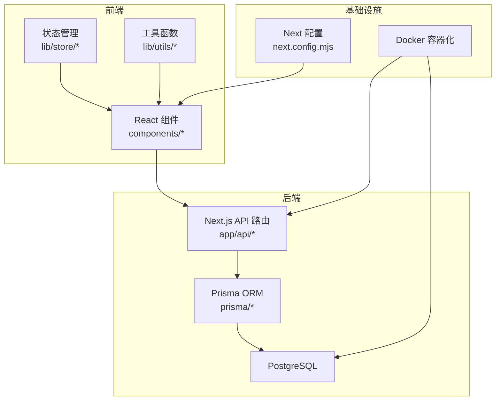
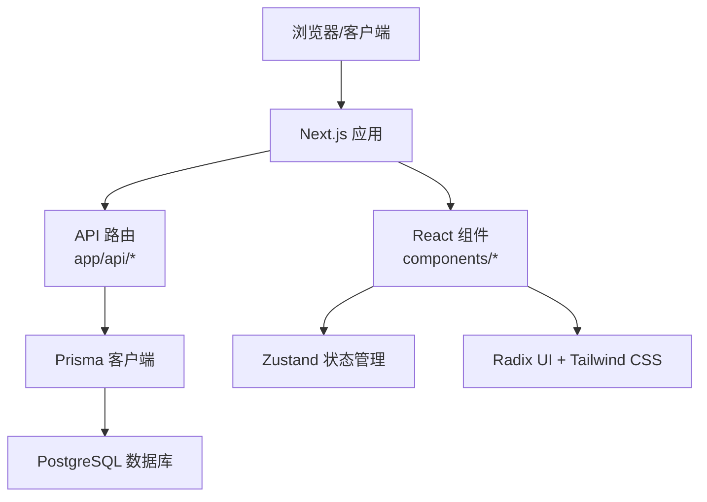
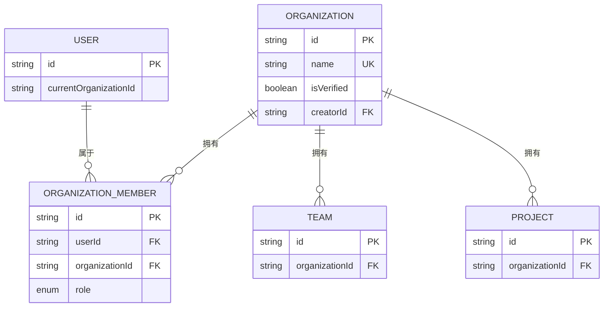
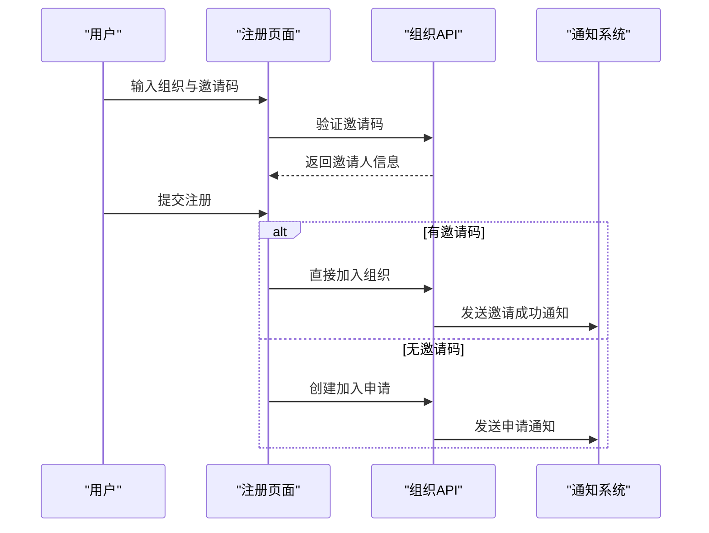
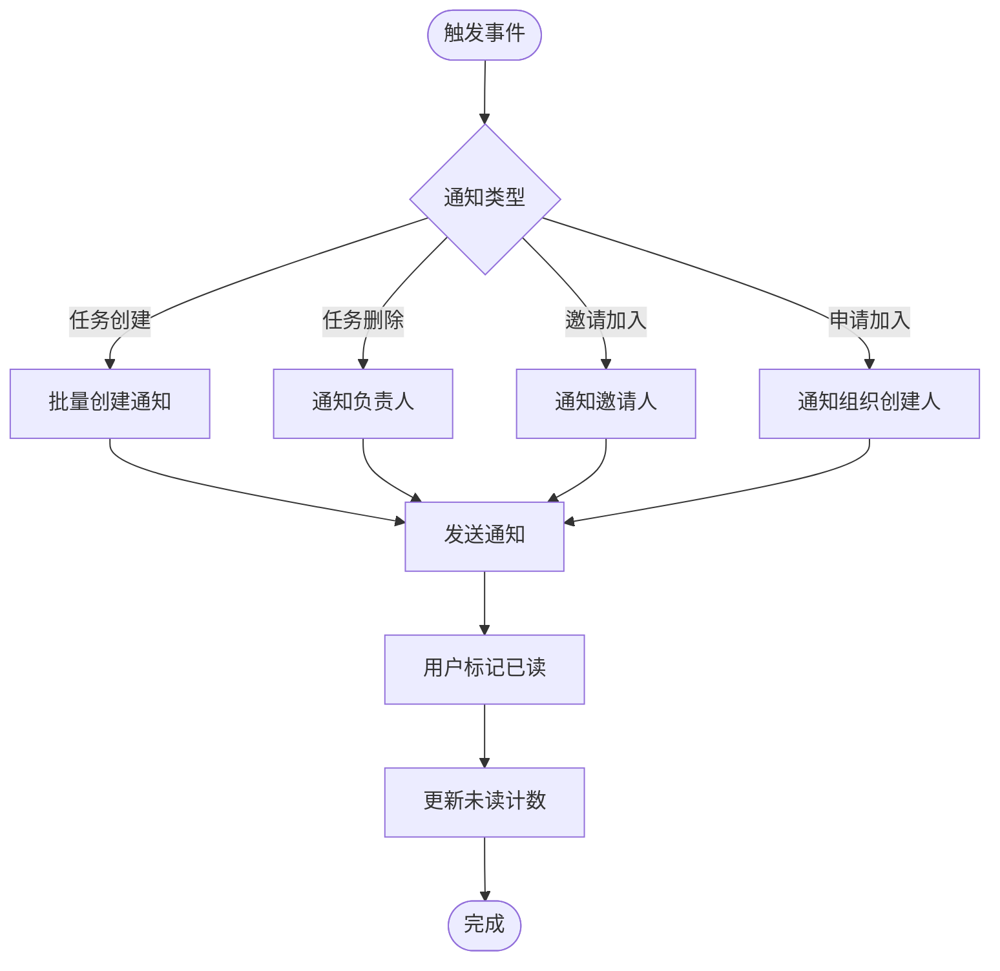
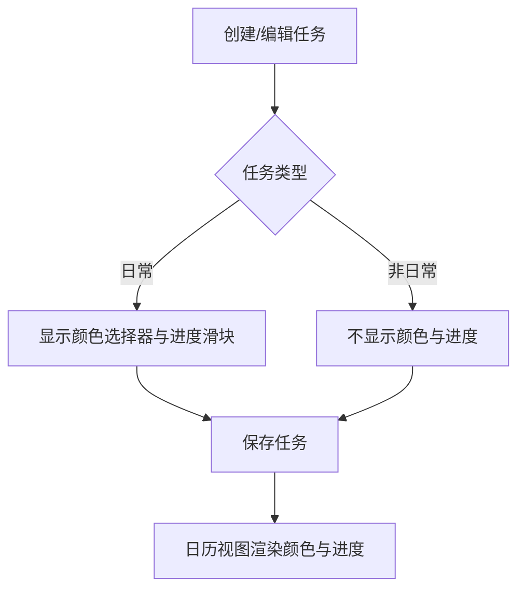
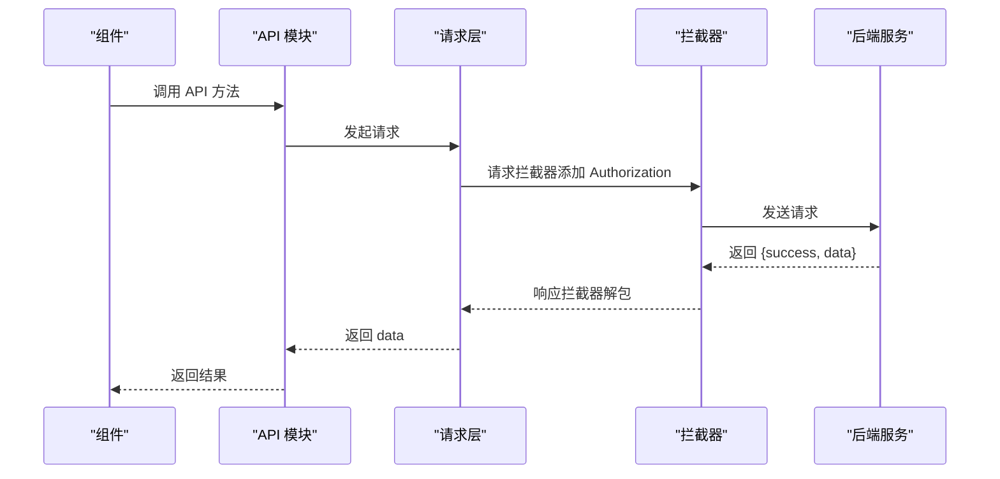
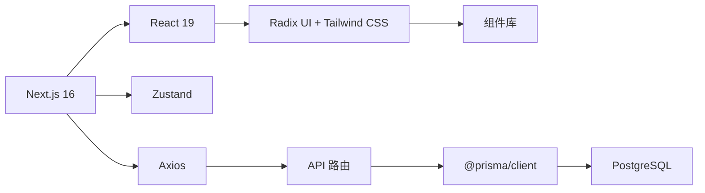

# 发展历程

<cite>
**本文引用的文件**
- [README.md](file://README.md)
- [ARCHITECTURE_DECISION_RECORD.md](file://ARCHITECTURE_DECISION_RECORD.md)
- [DEPLOY_2025.11.19.md](file://DEPLOY_2025.11.19.md)
- [DEPLOY_2025.11.26_TASK_FEATURES.md](file://DEPLOY_2025.11.26_TASK_FEATURES.md)
- [oldDes/README.md](file://oldDes/README.md)
- [oldDes/开发规划.md](file://oldDes/开发规划.md)
- [oldDes/系统设计.md](file://oldDes/系统设计.md)
- [NOTIFICATION_SYSTEM.md](file://NOTIFICATION_SYSTEM.md)
- [ORGANIZATION_FEATURE.md](file://ORGANIZATION_FEATURE.md)
- [INVITE_CODE_SYSTEM.md](file://INVITE_CODE_SYSTEM.md)
- [MIGRATION_PROGRESS.md](file://MIGRATION_PROGRESS.md)
- [CONVERSATION_HISTORY.md](file://CONVERSATION_HISTORY.md)
- [prisma/migrations/20251115201512_add_organization_model/migration.sql](file://prisma/migrations/20251115201512_add_organization_model/migration.sql)
- [prisma/migrations/20251125165512_add_task_color_and_progress/migration.sql](file://prisma/migrations/20251125165512_add_task_color_and_progress/migration.sql)
- [package.json](file://package.json)
- [next.config.mjs](file://next.config.mjs)
</cite>

## 目录
1. [引言](#引言)
2. [项目结构](#项目结构)
3. [核心组件](#核心组件)
4. [架构总览](#架构总览)
5. [详细组件分析](#详细组件分析)
6. [依赖分析](#依赖分析)
7. [性能考量](#性能考量)
8. [故障排查指南](#故障排查指南)
9. [结论](#结论)
10. [附录](#附录)

## 引言
本项目“日历任务管理系统”旨在提供一个现代化、可扩展的日历任务管理平台，支持个人、团队与项目三层视图，覆盖任务创建、拖拽调整、进度跟踪、团队协作与通知体系等核心能力。本文档从需求分析、技术选型、架构设计、功能迭代与版本发布、技术挑战与解决方案、时间线与关键节点、开发团队的设计哲学等多个维度，系统梳理项目的发展历程，帮助读者理解系统演进轨迹与设计思路。

## 项目结构
项目采用 Next.js App Router 的单体仓库结构，前端与后端 API 路由在同一工程中，配合 Prisma ORM 与 PostgreSQL 数据库，结合 Docker 容器化部署。核心目录与职责如下：
- app/api：Next.js API 路由，承载认证、组织、团队、项目、任务、通知等后端接口
- components：React 组件库，包含日历视图、侧边栏、任务表单、UI 基础组件等
- lib：工具库与业务逻辑，包含状态管理、工具函数、API 客户端、类型定义等
- prisma：数据库模型与迁移文件，驱动数据层演进
- scripts：数据库初始化、迁移与维护脚本
- deploy：部署相关文档与脚本
- docs：架构决策记录、功能文档与部署指南

图表来源
- [README.md](file://README.md#L139-L166)
- [next.config.mjs](file://next.config.mjs#L1-L20)

章节来源
- [README.md](file://README.md#L139-L166)
- [next.config.mjs](file://next.config.mjs#L1-L20)

## 核心组件
- 日历与视图：月视图、周视图、个人/团队/项目导航、任务条与布局算法
- 任务管理：拖拽创建/移动、进度调整、颜色自定义、跨天任务处理
- 团队协作：组织/团队/项目三层结构、成员管理、权限与可见性
- 通知系统：站内消息、类型化通知、未读计数与批量操作
- 邀请码系统：邀请码生成与验证、直接加入与审批流程
- API 请求层：统一请求封装、拦截器、类型安全与错误处理

章节来源
- [README.md](file://README.md#L7-L86)
- [NOTIFICATION_SYSTEM.md](file://NOTIFICATION_SYSTEM.md#L1-L35)
- [INVITE_CODE_SYSTEM.md](file://INVITE_CODE_SYSTEM.md#L1-L20)

## 架构总览
系统采用“前端组件 + Next.js API 路由 + Prisma ORM + PostgreSQL”的轻量级全栈架构。前端使用 React 19 与 Next.js 16，状态管理采用 Zustand，UI 基于 Radix UI 与 Tailwind CSS。后端 API 通过 Prisma 访问数据库，遵循 REST 风格，配合中间件进行认证与鉴权。部署采用 Docker 容器化，支持离线与在线部署。

图表来源
- [README.md](file://README.md#L81-L104)
- [package.json](file://package.json#L11-L61)

章节来源
- [README.md](file://README.md#L81-L104)
- [package.json](file://package.json#L11-L61)

## 详细组件分析

### 组织与多空间架构
- 功能概述：实现组织、组织成员与用户之间的三层关系，支持用户在多个组织中切换，数据完全隔离
- 数据模型：新增 Organization、OrganizationMember 模型，User 增加 currentOrganizationId，Team/Project 增加 organizationId
- API 升级：新增组织管理与成员管理接口，现有团队/项目/用户接口均按当前组织过滤
- 权限系统：角色 OWNER/ADMIN/MEMBER，支持组织切换与管理面板

图表来源
- [ORGANIZATION_FEATURE.md](file://ORGANIZATION_FEATURE.md#L15-L30)
- [prisma/migrations/20251115201512_add_organization_model/migration.sql](file://prisma/migrations/20251115201512_add_organization_model/migration.sql#L31-L53)

章节来源
- [ORGANIZATION_FEATURE.md](file://ORGANIZATION_FEATURE.md#L1-L120)
- [prisma/migrations/20251115201512_add_organization_model/migration.sql](file://prisma/migrations/20251115201512_add_organization_model/migration.sql#L1-L99)

### 邀请码与成员管理
- 邀请码生成：用户唯一 8 位十六进制邀请码，永久有效
- 三种注册路径：通过邀请码直接加入、申请加入（审批）、创建新组织
- 通知联动：邀请成功与加入申请通知，记录邀请关系
- 前端组件：组织管理弹窗显示邀请码并支持复制，注册页面自动验证邀请码

图表来源
- [INVITE_CODE_SYSTEM.md](file://INVITE_CODE_SYSTEM.md#L150-L169)
- [NOTIFICATION_SYSTEM.md](file://NOTIFICATION_SYSTEM.md#L470-L528)

章节来源
- [INVITE_CODE_SYSTEM.md](file://INVITE_CODE_SYSTEM.md#L1-L120)
- [NOTIFICATION_SYSTEM.md](file://NOTIFICATION_SYSTEM.md#L470-L528)

### 通知系统
- 数据模型：Notification 表，支持 JSON 元数据、已读追踪、复合索引
- 通知类型：组织加入申请、审批结果、任务创建/更新/删除、任务分配等
- API 接口：获取列表、未读计数、标记已读
- 前端组件：通知铃铛、通知列表、单项通知项
- 性能优化：索引优化、查询限制、轮询与可选缓存

图表来源
- [NOTIFICATION_SYSTEM.md](file://NOTIFICATION_SYSTEM.md#L530-L577)
- [NOTIFICATION_SYSTEM.md](file://NOTIFICATION_SYSTEM.md#L354-L392)

章节来源
- [NOTIFICATION_SYSTEM.md](file://NOTIFICATION_SYSTEM.md#L1-L120)
- [NOTIFICATION_SYSTEM.md](file://NOTIFICATION_SYSTEM.md#L277-L464)

### 任务颜色与进度功能
- 新增字段：Task.color（颜色）、Task.progress（进度）
- UI 交互：颜色选择器、进度圆环、hover 切换、统一 TaskBar 组件
- 数据库迁移：Prisma 迁移文件自动执行
- 兼容性：旧任务默认 color=null、progress=0，支持编辑更新

图表来源
- [DEPLOY_2025.11.26_TASK_FEATURES.md](file://DEPLOY_2025.11.26_TASK_FEATURES.md#L11-L37)
- [prisma/migrations/20251125165512_add_task_color_and_progress/migration.sql](file://prisma/migrations/20251125165512_add_task_color_and_progress/migration.sql#L1-L4)

章节来源
- [DEPLOY_2025.11.26_TASK_FEATURES.md](file://DEPLOY_2025.11.26_TASK_FEATURES.md#L1-L120)
- [prisma/migrations/20251125165512_add_task_color_and_progress/migration.sql](file://prisma/migrations/20251125165512_add_task_color_and_progress/migration.sql#L1-L4)

### API 请求层重构
- 统一请求层：lib/request.ts，Axios 实例 + 请求/响应拦截器
- 自动 Token 管理：自动附加 Bearer token，401 统一重定向
- 类型安全：完整 TypeScript 接口定义，响应解包
- 迁移成果：21 处手动 Bearer token 管理迁移完成，代码减少 85-90%

图表来源
- [MIGRATION_PROGRESS.md](file://MIGRATION_PROGRESS.md#L32-L60)
- [MIGRATION_PROGRESS.md](file://MIGRATION_PROGRESS.md#L16-L29)

章节来源
- [MIGRATION_PROGRESS.md](file://MIGRATION_PROGRESS.md#L1-L120)

### 设计决策与架构权衡
- 保持 Next.js API Routes 的理由：开发效率高、部署简单、无跨域问题、Server Actions 可平滑迁移
- 不迁移至 NestJS 的结论：投入产出比低、Next.js 已足够强大、Redis+BullMQ 优化路径可行
- 折中方案：在 Next.js 中采用“模块化”架构，引入服务层与中间件，兼顾开发便捷与代码组织

章节来源
- [ARCHITECTURE_DECISION_RECORD.md](file://ARCHITECTURE_DECISION_RECORD.md#L1-L94)

## 依赖分析
- 前端依赖：Next.js 16、React 19、Radix UI、Tailwind CSS、Zustand、Axios、date-fns、Lucide React、Recharts 等
- 后端依赖：Prisma、PostgreSQL、bcryptjs、jsonwebtoken
- 开发与构建：TypeScript、Tailwind CSS、Docker

图表来源
- [package.json](file://package.json#L11-L61)

章节来源
- [package.json](file://package.json#L11-L75)

## 性能考量
- 数据库层面：为通知表建立复合索引与时间索引，限制查询范围与数量，减少扫描行数
- API 层面：批量创建通知减少数据库往返，可选分页与缓存策略
- 前端层面：轮询间隔控制、虚拟滚动（可选）、组件渲染优化
- 部署层面：Docker 离线部署减少网络依赖，Standalone 输出模式优化生产环境

章节来源
- [NOTIFICATION_SYSTEM.md](file://NOTIFICATION_SYSTEM.md#L641-L743)
- [next.config.mjs](file://next.config.mjs#L1-L20)

## 故障排查指南
- 邀请码相关
  - 邀请码重复：生成时检查唯一性，必要时重新生成
  - 邀请码复制：HTTPS 环境使用 Clipboard API，HTTP/IP 环境降级为 document.execCommand
- 通知系统
  - 迁移失败：查看应用日志，手动执行 npx prisma migrate deploy，检查数据库连接
  - 未读计数异常：检查 Redis 缓存（如启用）与查询逻辑
- API 请求层
  - 401 未登录：拦截器自动重定向到登录页，检查 Token 生命周期
  - 类型错误：确认 TypeScript 类型定义与 API 返回结构一致

章节来源
- [INVITE_CODE_SYSTEM.md](file://INVITE_CODE_SYSTEM.md#L477-L503)
- [NOTIFICATION_SYSTEM.md](file://NOTIFICATION_SYSTEM.md#L266-L280)
- [MIGRATION_PROGRESS.md](file://MIGRATION_PROGRESS.md#L561-L589)

## 结论
项目从最初的概念与规划逐步演进为功能完备的日历任务管理平台。通过引入组织与多空间架构、邀请码系统、通知体系与任务颜色/进度功能，系统在协作与体验上实现了关键跃升。在技术选型上坚持“Next.js API Routes + 服务层 + 中间件”的折中方案，在保证开发效率的同时提升了代码质量与可维护性。未来可在通知实时化、性能监控与可观测性、权限精细化与审计等方面继续演进。

## 附录

### 时间线与关键节点
- 2025-11-14：对话记录与功能规划（任务条大小切换、周视图适配、个人周视图优化）
- 2025-11-15：组织与多空间架构数据库迁移（新增组织、成员、隔离字段）
- 2025-11-16：组织功能实现文档（组织管理、API 升级、数据隔离）
- 2025-11-19：积分与注册增强部署（积分系统、职业选项、Bug 修复）
- 2025-11-19：邀请码系统上线（邀请码生成、注册流程、通知联动）
- 2025-11-19：API 请求层重构完成（统一请求封装、拦截器、类型安全）
- 2025-11-25：任务颜色与进度功能上线（颜色选择器、进度圆环、UI 优化）
- 2025-11-26：任务颜色与进度功能部署指南（迁移流程、验证清单、回滚方案）

章节来源
- [CONVERSATION_HISTORY.md](file://CONVERSATION_HISTORY.md#L7-L67)
- [ORGANIZATION_FEATURE.md](file://ORGANIZATION_FEATURE.md#L3-L6)
- [DEPLOY_2025.11.19.md](file://DEPLOY_2025.11.19.md#L1-L30)
- [INVITE_CODE_SYSTEM.md](file://INVITE_CODE_SYSTEM.md#L7-L10)
- [MIGRATION_PROGRESS.md](file://MIGRATION_PROGRESS.md#L158-L159)
- [DEPLOY_2025.11.26_TASK_FEATURES.md](file://DEPLOY_2025.11.26_TASK_FEATURES.md#L3-L6)

### 开发团队的思考与设计哲学
- 以“可用性优先”为核心：从用户视角出发，简化注册与加入流程，提供即时反馈与通知
- 以“渐进式演进”为路径：先实现核心功能，再通过小步快跑的方式持续迭代，降低风险
- 以“可维护性”为导向：在 Next.js 中引入服务层与中间件，避免“脚本式”代码堆积
- 以“数据安全”为基础：组织隔离、权限验证、敏感操作二次确认
- 以“开发效率”为目标：统一请求层、类型安全、自动迁移与部署脚本

章节来源
- [ARCHITECTURE_DECISION_RECORD.md](file://ARCHITECTURE_DECISION_RECORD.md#L43-L94)
- [ORGANIZATION_FEATURE.md](file://ORGANIZATION_FEATURE.md#L226-L248)