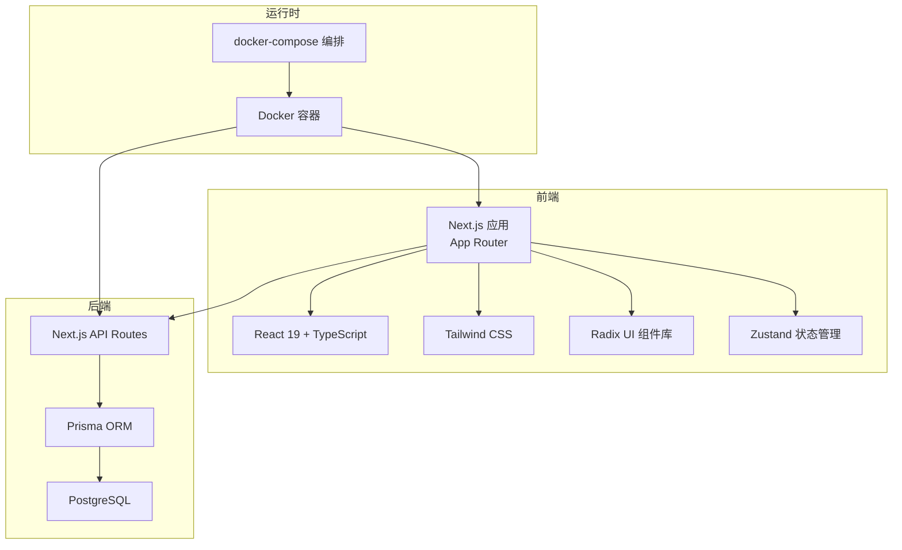
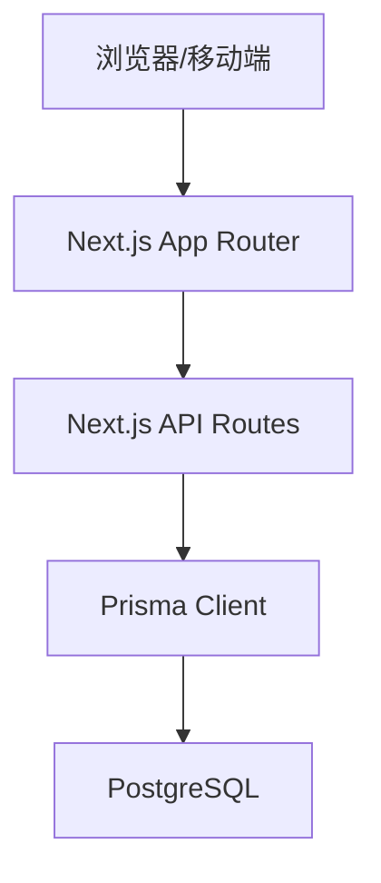
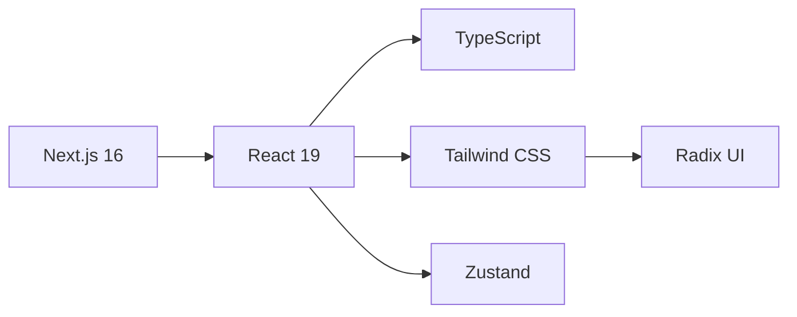
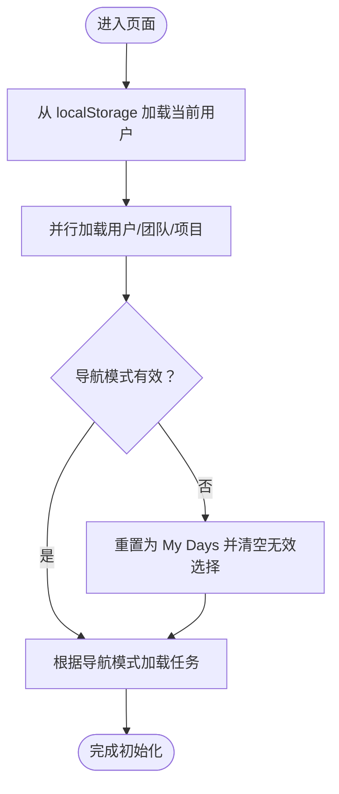
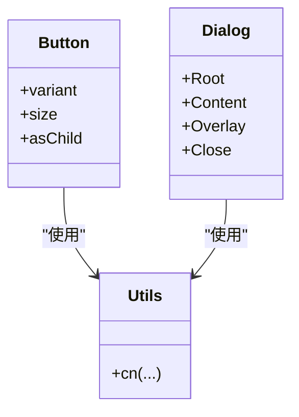
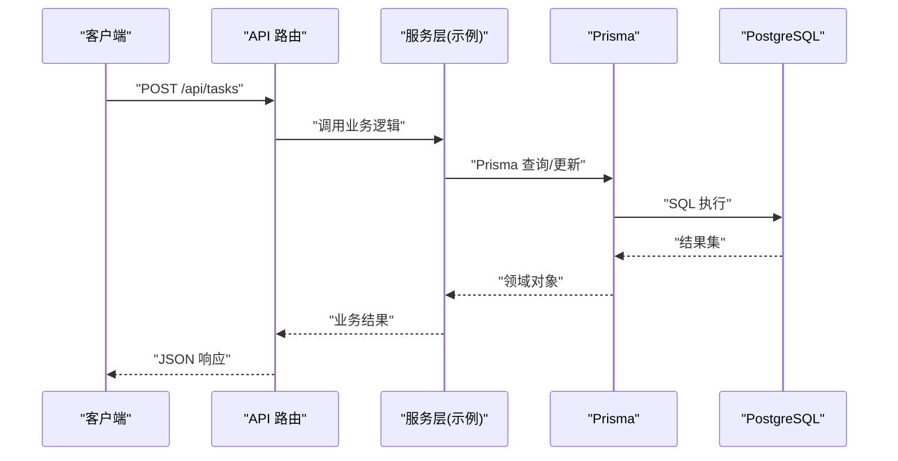
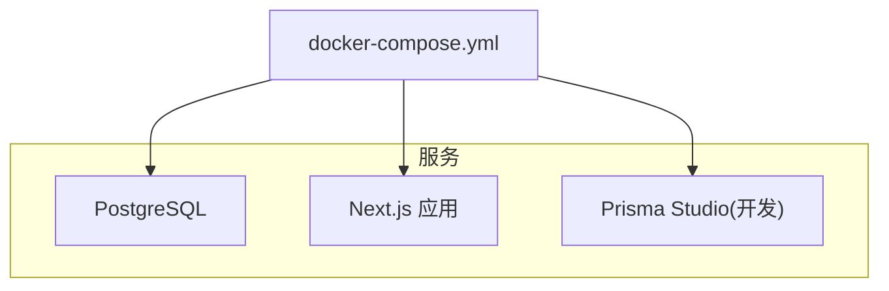
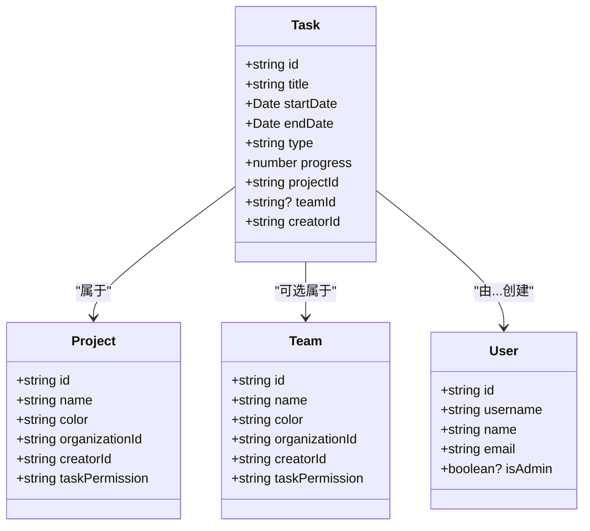
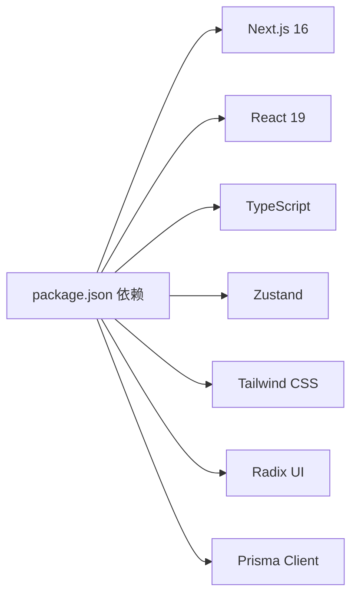

# 技术栈

<cite>
**本文引用的文件**   
- [package.json](file://package.json)
- [next.config.mjs](file://next.config.mjs)
- [tsconfig.json](file://tsconfig.json)
- [tailwind.config.js](file://tailwind.config.js)
- [prisma\schema.prisma](file://prisma/schema.prisma)
- [Dockerfile](file://Dockerfile)
- [docker-compose.yml](file://docker-compose.yml)
- [lib\store\calendar-store.ts](file://lib/store/calendar-store.ts)
- [lib\api-client.ts](file://lib/api-client.ts)
- [lib\prisma.ts](file://lib/prisma.ts)
- [lib\types.ts](file://lib/types.ts)
- [components\ui\button.tsx](file://components/ui/button.tsx)
- [components\ui\dialog.tsx](file://components/ui/dialog.tsx)
- [app\layout.tsx](file://app/layout.tsx)
- [components.json](file://components.json)
- [ARCHITECTURE_DECISION_RECORD.md](file://ARCHITECTURE_DECISION_RECORD.md)
</cite>

## 目录
1. [引言](#引言)
2. [项目结构](#项目结构)
3. [核心组件](#核心组件)
4. [架构总览](#架构总览)
5. [详细组件分析](#详细组件分析)
6. [依赖分析](#依赖分析)
7. [性能考量](#性能考量)
8. [故障排查指南](#故障排查指南)
9. [结论](#结论)
10. [附录](#附录)

## 引言
本技术栈文档面向日历任务管理系统，系统采用“前端 Next.js + 后端 Next.js API 路由 + 数据库 PostgreSQL + ORM Prisma”的全栈组合，并通过 Docker 容器化部署。前端以 React 19、TypeScript、Tailwind CSS 以及 Radix UI 为核心，配合 Zustand 实现轻量状态管理；后端通过 Prisma 提供类型安全的数据库访问与迁移能力。本文将从技术选型背景、架构权衡、组件职责、数据流与依赖关系等方面进行系统化阐述，帮助开发者快速理解并高效迭代。

## 项目结构
系统采用 Next.js App Router 结构，前端组件与 UI 基于 Radix UI + Tailwind CSS，状态管理采用 Zustand，API 层通过 Next.js API Routes 提供 REST 接口，数据库使用 PostgreSQL，ORM 使用 Prisma。容器化通过 Dockerfile 与 docker-compose.yml 实现一键部署。

图表来源
- [package.json](file://package.json#L11-L61)
- [next.config.mjs](file://next.config.mjs#L1-L20)
- [tailwind.config.js](file://tailwind.config.js#L1-L12)
- [prisma\schema.prisma](file://prisma/schema.prisma#L7-L14)
- [Dockerfile](file://Dockerfile#L1-L72)
- [docker-compose.yml](file://docker-compose.yml#L1-L77)

章节来源
- [package.json](file://package.json#L11-L61)
- [next.config.mjs](file://next.config.mjs#L1-L20)
- [tailwind.config.js](file://tailwind.config.js#L1-L12)
- [prisma\schema.prisma](file://prisma/schema.prisma#L7-L14)
- [Dockerfile](file://Dockerfile#L1-L72)
- [docker-compose.yml](file://docker-compose.yml#L1-L77)

## 核心组件
- 前端核心
  - Next.js 16：提供 App Router、SSR/SSG、Image 优化、Turbopack 优化开关等能力，生产环境采用 standalone 输出模式，便于容器化部署。
  - React 19：最新版本 React，提升渲染性能与并发特性。
  - TypeScript：严格类型检查，统一前后端契约，类型共享于 lib/types.ts。
  - Tailwind CSS：实用优先的 CSS 框架，结合 tailwind.config.js 配置 content 范围，实现按需构建。
  - Radix UI：语义化、无障碍、可组合的基础 UI 组件库，与 Tailwind CSS 协同良好。
  - Zustand：轻量状态管理，支持持久化中间件，用于日历视图、任务、项目、团队等状态管理。
- 后端核心
  - Next.js API Routes：REST 接口集中于 app/api 下，统一鉴权与错误处理。
  - Prisma ORM：类型安全的数据库访问与迁移，支持 PostgreSQL。
  - PostgreSQL：关系型数据库，配合 Prisma schema 定义实体与关系。
- 容器化与部署
  - Dockerfile：多阶段构建，生成 standalone 产物，运行时以非 root 用户执行。
  - docker-compose.yml：编排数据库、应用与 Prisma Studio，支持健康检查与卷挂载。

章节来源
- [package.json](file://package.json#L11-L61)
- [next.config.mjs](file://next.config.mjs#L1-L20)
- [tsconfig.json](file://tsconfig.json#L1-L44)
- [tailwind.config.js](file://tailwind.config.js#L1-L12)
- [prisma\schema.prisma](file://prisma/schema.prisma#L7-L14)
- [Dockerfile](file://Dockerfile#L1-L72)
- [docker-compose.yml](file://docker-compose.yml#L1-L77)

## 架构总览
系统采用“前端 SPA + Next.js API Routes 后端 + PostgreSQL + Prisma”的一体化架构。前端通过 lib/api-client.ts 统一封装 API 调用，状态管理由 Zustand 管理，数据库访问通过 lib/prisma.ts 初始化 PrismaClient。容器化通过 Dockerfile 与 docker-compose.yml 实现一键部署与扩展。

图表来源
- [lib\api-client.ts](file://lib/api-client.ts#L1-L100)
- [lib\prisma.ts](file://lib/prisma.ts#L1-L12)
- [prisma\schema.prisma](file://prisma/schema.prisma#L7-L14)

章节来源
- [lib\api-client.ts](file://lib/api-client.ts#L1-L100)
- [lib\prisma.ts](file://lib/prisma.ts#L1-L12)
- [prisma\schema.prisma](file://prisma/schema.prisma#L7-L14)

## 详细组件分析

### 前端技术栈与选型
- Next.js 16
  - 采用 standalone 输出模式，减少生产包体积，便于容器部署。
  - 关闭 images.unoptimized 以适配 Docker 构建环境。
  - 通过 optimizePackageImports 优化导入，减少包体积。
- React 19
  - 最新版本 React，提升并发渲染与性能。
- TypeScript
  - 严格模式、ESM、bundler 解析、路径别名等配置，保证类型安全与工程化体验。
- Tailwind CSS
  - content 范围限定在 pages/components/app，按需生成样式，避免冗余。
- Radix UI
  - 与 Tailwind CSS 协同，提供高质量基础组件，支持无障碍与可组合性。
- Zustand
  - 轻量、易用、可持久化，适合前端状态管理与本地缓存。

图表来源
- [package.json](file://package.json#L51-L55)
- [package.json](file://package.json#L11-L61)
- [next.config.mjs](file://next.config.mjs#L14-L16)
- [tsconfig.json](file://tsconfig.json#L1-L44)
- [tailwind.config.js](file://tailwind.config.js#L1-L12)
- [lib\store\calendar-store.ts](file://lib/store/calendar-store.ts#L1-L32)

章节来源
- [package.json](file://package.json#L51-L55)
- [package.json](file://package.json#L11-L61)
- [next.config.mjs](file://next.config.mjs#L14-L16)
- [tsconfig.json](file://tsconfig.json#L1-L44)
- [tailwind.config.js](file://tailwind.config.js#L1-L12)
- [lib\store\calendar-store.ts](file://lib/store/calendar-store.ts#L1-L32)

### 状态管理方案：Zustand
- 设计目标
  - 在前端侧聚合日历视图、任务、项目、团队、用户等状态，支持持久化与跨组件共享。
- 关键特性
  - 使用 persist 中间件实现 localStorage 持久化，避免刷新丢失。
  - 提供批量数据加载、权限校验、拖拽交互、视图切换等动作。
  - 与 API 客户端解耦，通过异步 action 触发网络请求与本地状态更新。
- 数据流
  - Store 初始化默认值与加载状态。
  - 通过 fetchAllData 并行加载用户、团队、项目数据，再根据导航模式加载任务。
  - 增删改操作后触发后台刷新，避免阻塞用户操作。

图表来源
- [lib\store\calendar-store.ts](file://lib/store/calendar-store.ts#L455-L546)

章节来源
- [lib\store\calendar-store.ts](file://lib/store/calendar-store.ts#L1-L198)
- [lib\store\calendar-store.ts](file://lib/store/calendar-store.ts#L271-L283)
- [lib\store\calendar-store.ts](file://lib/store/calendar-store.ts#L455-L546)

### UI 框架：Tailwind CSS 与 Radix UI
- Tailwind CSS
  - 通过 tailwind.config.js 指定 content 范围，确保按需构建。
  - 与 class-variance-authority、tailwind-merge 协作，实现组件变体与类名合并。
- Radix UI
  - 提供语义化、无障碍、可组合的基础组件，如 Button、Dialog 等。
  - 与 Tailwind CSS 结合，通过 data-slot 与 className 组合实现一致风格。

图表来源
- [components\ui\button.tsx](file://components/ui/button.tsx#L1-L61)
- [components\ui\dialog.tsx](file://components/ui/dialog.tsx#L1-L144)
- [lib\utils.ts](file://lib/utils.ts#L1-L7)

章节来源
- [tailwind.config.js](file://tailwind.config.js#L1-L12)
- [components\ui\button.tsx](file://components/ui/button.tsx#L1-L61)
- [components\ui\dialog.tsx](file://components/ui/dialog.tsx#L1-L144)
- [lib\utils.ts](file://lib/utils.ts#L1-L7)
- [components.json](file://components.json#L1-L22)

### 后端技术栈：Next.js API Routes + Prisma + PostgreSQL
- Next.js API Routes
  - API 路由集中于 app/api，统一鉴权、错误处理与响应格式。
  - 通过 lib/api-client.ts 封装请求方法，支持 Bearer Token 与错误解析。
- Prisma ORM
  - 在 lib/prisma.ts 中初始化 PrismaClient，开发环境输出 error/warn 日志。
  - prisma/schema.prisma 定义组织、用户、团队、项目、任务、通知等模型与关系。
- PostgreSQL
  - 通过 docker-compose.yml 提供数据库服务，支持健康检查与卷挂载。

图表来源
- [lib\api-client.ts](file://lib/api-client.ts#L112-L182)
- [lib\prisma.ts](file://lib/prisma.ts#L1-L12)
- [prisma\schema.prisma](file://prisma/schema.prisma#L17-L164)

章节来源
- [lib\api-client.ts](file://lib/api-client.ts#L1-L100)
- [lib\prisma.ts](file://lib/prisma.ts#L1-L12)
- [prisma\schema.prisma](file://prisma/schema.prisma#L17-L164)
- [docker-compose.yml](file://docker-compose.yml#L4-L24)

### 容器化与部署：Docker 与 docker-compose
- Dockerfile
  - 多阶段构建：安装 pnpm，复制依赖与源码，生成 Prisma Client，构建 Next.js。
  - 运行阶段：非 root 用户，暴露 3000 端口，CMD 启动 node server.js。
- docker-compose.yml
  - 编排 postgres、app、prisma-studio 服务，设置环境变量、健康检查与卷挂载。
  - 支持开发环境启动 Prisma Studio，生产环境仅运行应用与数据库。

图表来源
- [Dockerfile](file://Dockerfile#L1-L72)
- [docker-compose.yml](file://docker-compose.yml#L1-L77)

章节来源
- [Dockerfile](file://Dockerfile#L1-L72)
- [docker-compose.yml](file://docker-compose.yml#L1-L77)

### API 客户端与类型契约
- API 客户端
  - 统一基地址、Token 管理、错误处理与响应格式兼容。
  - 提供任务、用户、项目、团队、认证等模块化 API。
- 类型契约
  - lib/types.ts 定义 Task、User、Project、Team、Notification 等核心类型，前后端共享。

图表来源
- [lib\types.ts](file://lib/types.ts#L61-L120)

章节来源
- [lib\api-client.ts](file://lib/api-client.ts#L1-L100)
- [lib\types.ts](file://lib/types.ts#L1-L141)

## 依赖分析
- 前端依赖
  - Next.js 16、React 19、TypeScript：核心运行时与类型系统。
  - Tailwind CSS、Radix UI：UI 基础与组件库。
  - Zustand：状态管理。
- 后端依赖
  - @prisma/client、Prisma：ORM 与客户端生成。
  - Next.js API Routes：后端接口。
- 开发与构建
  - pnpm、TypeScript、TailwindCSS、PostCSS 等工具链。

图表来源
- [package.json](file://package.json#L11-L61)

章节来源
- [package.json](file://package.json#L11-L61)

## 性能考量
- 前端
  - 使用 Next.js Image 优化与 content 配置，减少无关 CSS。
  - Zustand 持久化与最小化加载延迟，避免阻塞首屏。
- 后端
  - 通过 Prisma 类型安全与索引优化查询性能。
  - API Routes 与 Prisma 的组合在当前业务规模下具备良好性能。
- 容器化
  - 多阶段构建与非 root 运行，提升安全性与镜像体积控制。

## 故障排查指南
- API 错误处理
  - API 客户端统一处理 401、4xx、5xx，必要时清理 Token 并抛出错误。
- 状态管理
  - Zustand store 提供 setError 与错误提示，便于定位问题。
- 数据库
  - 通过 Prisma Client 初始化日志级别，开发环境输出 error/warn。
- 容器化
  - docker-compose 健康检查确保数据库可用；端口映射与卷挂载确认正确。

章节来源
- [lib\api-client.ts](file://lib/api-client.ts#L72-L100)
- [lib\store\calendar-store.ts](file://lib/store/calendar-store.ts#L548-L548)
- [lib\prisma.ts](file://lib/prisma.ts#L7-L9)
- [docker-compose.yml](file://docker-compose.yml#L19-L23)

## 结论
本系统在当前业务规模下，采用“Next.js + Radix UI + Tailwind CSS + Zustand + Prisma + PostgreSQL”的技术栈组合，兼顾开发效率、部署简便与性能表现。通过 API 客户端与类型契约统一前后端交互，通过 Zustand 管理前端状态，通过 Prisma 提供类型安全的数据库访问，通过 Docker 与 docker-compose 实现一键部署。架构决策记录表明，在当前阶段无需迁移到独立后端框架，后续可通过服务层模式进一步优化代码组织与可维护性。

## 附录
- 架构决策背景与权衡参考：ARCHITECTURE_DECISION_RECORD.md
- UI 组件配置：components.json
- 全局样式入口：app/globals.css（由 layout.tsx 引入）

章节来源
- [ARCHITECTURE_DECISION_RECORD.md](file://ARCHITECTURE_DECISION_RECORD.md#L1-L94)
- [components.json](file://components.json#L1-L22)
- [app\layout.tsx](file://app/layout.tsx#L1-L45)