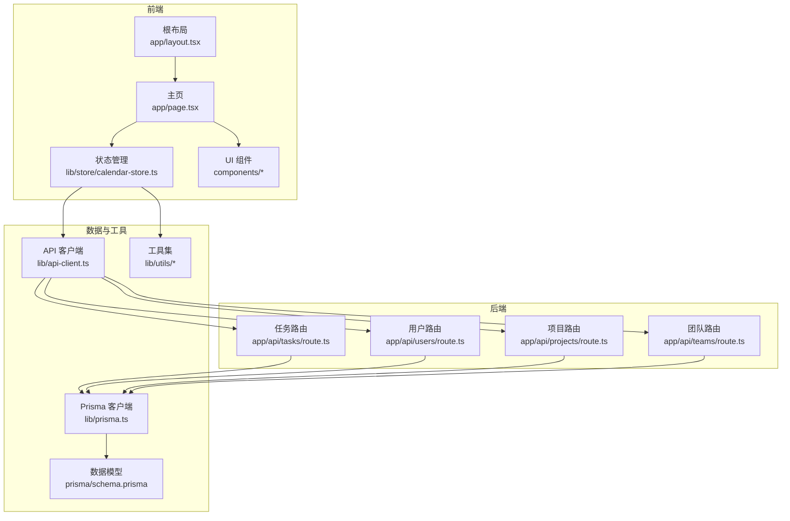
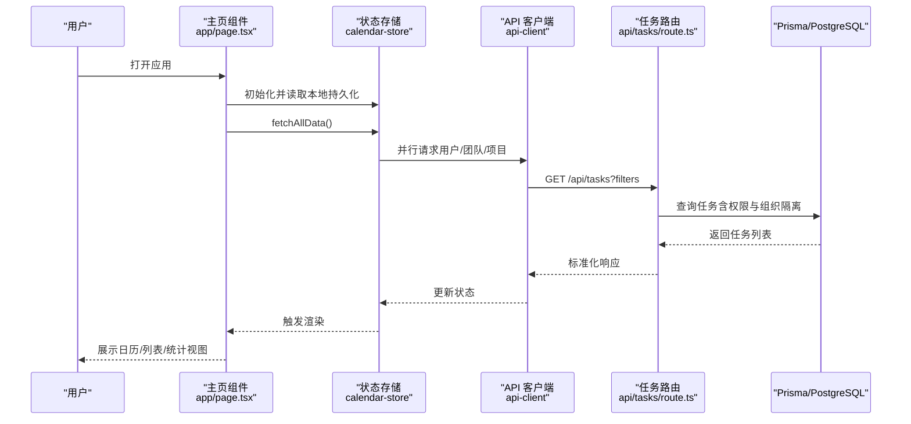
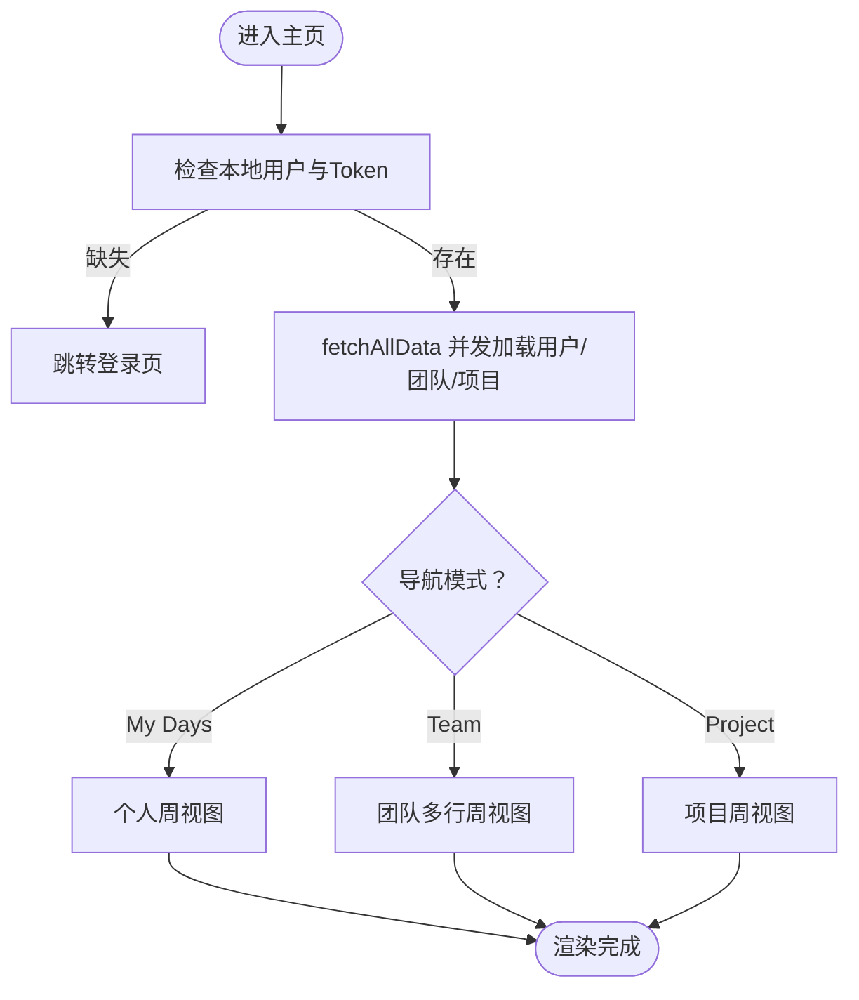
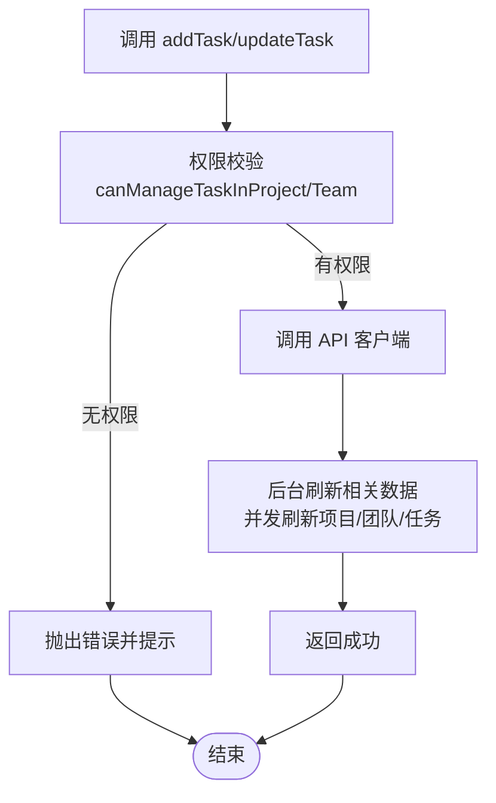
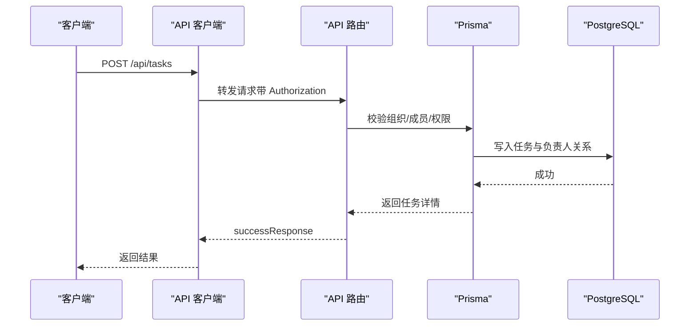
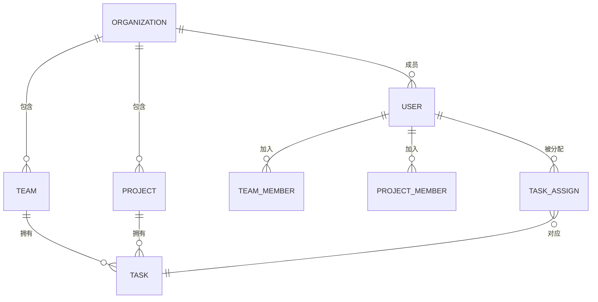
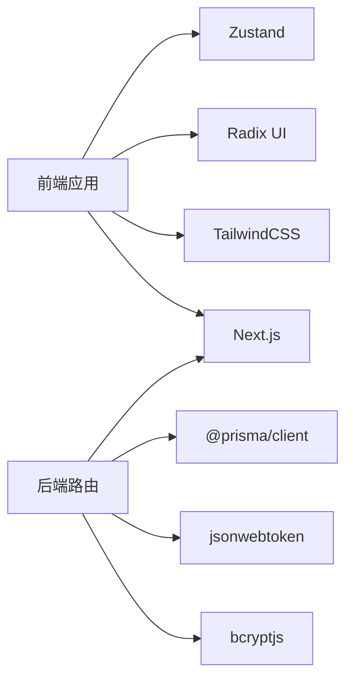

# 架构概览

<cite>
**本文引用的文件**
- [app/layout.tsx](file://app/layout.tsx)
- [app/page.tsx](file://app/page.tsx)
- [lib/store/calendar-store.ts](file://lib/store/calendar-store.ts)
- [lib/api-client.ts](file://lib/api-client.ts)
- [lib/types.ts](file://lib/types.ts)
- [lib/utils/permission-utils.ts](file://lib/utils/permission-utils.ts)
- [lib/utils/date-utils.ts](file://lib/utils/date-utils.ts)
- [lib/prisma.ts](file://lib/prisma.ts)
- [app/api/tasks/route.ts](file://app/api/tasks/route.ts)
- [app/api/users/route.ts](file://app/api/users/route.ts)
- [app/api/projects/route.ts](file://app/api/projects/route.ts)
- [app/api/teams/route.ts](file://app/api/teams/route.ts)
- [prisma/schema.prisma](file://prisma/schema.prisma)
- [package.json](file://package.json)
- [next.config.mjs](file://next.config.mjs)
</cite>

## 目录
1. [引言](#引言)
2. [项目结构](#项目结构)
3. [核心组件](#核心组件)
4. [架构总览](#架构总览)
5. [详细组件分析](#详细组件分析)
6. [依赖分析](#依赖分析)
7. [性能考量](#性能考量)
8. [故障排查指南](#故障排查指南)
9. [结论](#结论)
10. [附录](#附录)

## 引言
本项目是一个基于 Next.js 的日历任务管理系统，采用 App Router 架构组织前端页面与路由，后端通过 Next.js API 路由对接 Prisma 数据库，实现组织、团队、项目、任务与用户等核心业务实体的统一管理。系统通过 Zustand 实现前端状态管理，并结合本地持久化中间件进行数据缓存；后端采用严格的鉴权与权限控制，确保数据隔离与安全。

## 项目结构
项目采用“按功能域划分”的模块化组织方式：
- 前端层：app 目录下的页面与组件，按功能域拆分（如 calendar、sidebar、task、views 等），配合 lib/store 管理全局状态。
- 后端层：app/api 下的各领域路由（tasks、users、projects、teams 等），每个路由文件封装对应资源的 CRUD 与业务逻辑。
- 数据层：prisma/schema 定义数据模型与关系，lib/prisma 提供 PrismaClient 实例。
- 工具与配置：lib/utils 提供日期、权限等工具；next.config.mjs、package.json 等提供构建与运行配置。

**图表来源**
- [app/layout.tsx](file://app/layout.tsx#L1-L45)
- [app/page.tsx](file://app/page.tsx#L1-L234)
- [lib/store/calendar-store.ts](file://lib/store/calendar-store.ts#L1-L200)
- [lib/api-client.ts](file://lib/api-client.ts#L1-L120)
- [app/api/tasks/route.ts](file://app/api/tasks/route.ts#L1-L120)
- [app/api/users/route.ts](file://app/api/users/route.ts#L1-L88)
- [app/api/projects/route.ts](file://app/api/projects/route.ts#L1-L114)
- [app/api/teams/route.ts](file://app/api/teams/route.ts#L1-L117)
- [lib/prisma.ts](file://lib/prisma.ts#L1-L12)
- [prisma/schema.prisma](file://prisma/schema.prisma#L1-L120)

**章节来源**
- [app/layout.tsx](file://app/layout.tsx#L1-L45)
- [app/page.tsx](file://app/page.tsx#L1-L234)
- [package.json](file://package.json#L1-L75)
- [next.config.mjs](file://next.config.mjs#L1-L20)

## 核心组件
- 前端状态管理：Zustand + persist 中间件，集中管理任务、项目、用户、团队、视图状态与拖拽交互状态，并提供统一的增删改查与筛选能力。
- API 客户端：封装统一的请求方法与错误处理，自动注入 Authorization 头，兼容新旧接口返回格式。
- 权限工具：基于项目/团队的 taskPermission 与成员关系，判断用户是否具备任务管理权限。
- 日期工具：提供周/月视图所需的日期计算与格式化能力。
- 后端 API：按领域拆分路由，统一鉴权、参数校验、组织隔离与权限控制。
- 数据模型：Prisma 定义组织、用户、团队、项目、任务、通知等实体及关系。

**章节来源**
- [lib/store/calendar-store.ts](file://lib/store/calendar-store.ts#L1-L200)
- [lib/api-client.ts](file://lib/api-client.ts#L1-L120)
- [lib/utils/permission-utils.ts](file://lib/utils/permission-utils.ts#L1-L72)
- [lib/utils/date-utils.ts](file://lib/utils/date-utils.ts#L1-L86)
- [app/api/tasks/route.ts](file://app/api/tasks/route.ts#L1-L120)
- [prisma/schema.prisma](file://prisma/schema.prisma#L16-L192)

## 架构总览
系统采用前后端分离但紧密协作的架构：
- 前端：Next.js App Router + React 组件 + Zustand 状态管理 + Radix UI 组件库。
- 后端：Next.js API 路由 + Prisma ORM + PostgreSQL。
- 数据流：前端通过 API 客户端发起请求，后端路由进行鉴权与权限校验，访问 Prisma 数据库，返回标准化响应。
- 状态流：Zustand 管理应用状态，支持本地持久化，组件订阅状态变化并触发 UI 更新。

**图表来源**
- [app/page.tsx](file://app/page.tsx#L26-L145)
- [lib/store/calendar-store.ts](file://lib/store/calendar-store.ts#L455-L546)
- [lib/api-client.ts](file://lib/api-client.ts#L44-L100)
- [app/api/tasks/route.ts](file://app/api/tasks/route.ts#L18-L273)
- [lib/prisma.ts](file://lib/prisma.ts#L1-L12)

**章节来源**
- [app/page.tsx](file://app/page.tsx#L26-L145)
- [lib/store/calendar-store.ts](file://lib/store/calendar-store.ts#L455-L546)
- [lib/api-client.ts](file://lib/api-client.ts#L44-L100)
- [app/api/tasks/route.ts](file://app/api/tasks/route.ts#L18-L273)

## 详细组件分析

### 前端 App Router 架构
- 根布局负责全局样式与通用 UI（如 Toaster）。
- 主页作为入口，负责认证检查、数据加载、视图切换与任务表单面板的条件渲染。
- 侧边栏与顶部导航提供空间切换、视图切换、通知与用户菜单。
- 日历视图根据导航模式（My Days/Team/Project）与视图模式（月/周/个人周）动态渲染。

**图表来源**
- [app/layout.tsx](file://app/layout.tsx#L25-L44)
- [app/page.tsx](file://app/page.tsx#L46-L145)
- [lib/store/calendar-store.ts](file://lib/store/calendar-store.ts#L455-L546)

**章节来源**
- [app/layout.tsx](file://app/layout.tsx#L1-L45)
- [app/page.tsx](file://app/page.tsx#L1-L234)

### Zustand 状态管理与数据持久化
- Store 结构：包含数据集合（tasks、projects、users、teams）、加载与错误状态、视图与导航状态、拖拽与任务编辑状态、设置项等。
- 数据加载：fetchAllData 并发加载用户、团队、项目，再根据导航模式加载对应任务；每个数据加载动作包含最小加载时长保障与错误处理。
- 权限控制：新增/更新任务前，依据项目/团队的 taskPermission 与成员关系进行权限校验，必要时刷新项目/团队数据。
- 本地持久化：persist 中间件将关键状态写入 localStorage，重启后恢复用户信息与部分设置。

**图表来源**
- [lib/store/calendar-store.ts](file://lib/store/calendar-store.ts#L550-L748)
- [lib/utils/permission-utils.ts](file://lib/utils/permission-utils.ts#L11-L59)

**章节来源**
- [lib/store/calendar-store.ts](file://lib/store/calendar-store.ts#L1-L200)
- [lib/store/calendar-store.ts](file://lib/store/calendar-store.ts#L270-L546)
- [lib/utils/permission-utils.ts](file://lib/utils/permission-utils.ts#L1-L72)

### API 客户端与后端路由
- API 客户端：统一的 fetchAPI 方法，自动注入 Authorization 头，处理 401 清理 Token，兼容新旧返回格式。
- 任务路由：GET 支持按用户/项目/团队/日期范围过滤，严格校验组织隔离与成员关系；POST 创建任务时自动将负责人加入项目/团队并发送通知。
- 用户/项目/团队路由：均包含组织隔离与成员校验，GET 返回格式化后的成员列表，POST 创建时进行重复性检查与权限设置。

**图表来源**
- [lib/api-client.ts](file://lib/api-client.ts#L44-L100)
- [app/api/tasks/route.ts](file://app/api/tasks/route.ts#L275-L496)
- [lib/prisma.ts](file://lib/prisma.ts#L1-L12)

**章节来源**
- [lib/api-client.ts](file://lib/api-client.ts#L1-L120)
- [app/api/tasks/route.ts](file://app/api/tasks/route.ts#L18-L273)
- [app/api/users/route.ts](file://app/api/users/route.ts#L1-L88)
- [app/api/projects/route.ts](file://app/api/projects/route.ts#L1-L114)
- [app/api/teams/route.ts](file://app/api/teams/route.ts#L1-L117)

### 数据库设计与关系
- 实体与关系：组织（Organization）包含多个团队与项目；用户可属于多个组织/团队/项目；任务关联创建者、项目与可选团队，负责人通过多对多关系维护。
- 关键索引：任务在 startDate/endDate 上建立复合索引，便于范围查询；多对多关系表建立唯一与索引约束保证一致性。
- 权限与安全：通过组织隔离与成员关系查询，确保用户只能访问其所在组织与有权限的资源。

**图表来源**
- [prisma/schema.prisma](file://prisma/schema.prisma#L16-L192)

**章节来源**
- [prisma/schema.prisma](file://prisma/schema.prisma#L1-L314)

### 组件化与模块化组织
- 页面与布局：app/layout.tsx 提供全局布局，app/page.tsx 作为应用入口，组织导航、侧边栏、日历视图与任务表单。
- 功能组件：calendar、sidebar、task、views、ui 等目录按功能域划分，职责清晰，便于复用与测试。
- 工具与类型：lib/utils 提供日期与权限工具，lib/types 定义统一的数据类型与枚举，提升类型安全与可维护性。

**章节来源**
- [app/layout.tsx](file://app/layout.tsx#L1-L45)
- [app/page.tsx](file://app/page.tsx#L1-L234)
- [lib/types.ts](file://lib/types.ts#L1-L141)

## 依赖分析
- 前端依赖：Next.js、React、Radix UI、TailwindCSS、Zustand、date-fns、recharts 等。
- 后端依赖：Prisma、@prisma/client、jsonwebtoken、bcryptjs 等。
- 构建配置：next.config.mjs 在生产环境启用 standalone 输出，禁用图片优化以适配部署环境。

**图表来源**
- [package.json](file://package.json#L11-L75)
- [next.config.mjs](file://next.config.mjs#L1-L20)

**章节来源**
- [package.json](file://package.json#L1-L75)
- [next.config.mjs](file://next.config.mjs#L1-L20)

## 性能考量
- 前端性能
  - 并发加载：fetchAllData 使用 Promise.all 并发加载用户、团队、项目，减少首屏等待。
  - 最小加载时长：loadingDelay 确保加载动画至少显示指定时间，改善用户体验。
  - 本地持久化：persist 中间件减少重复网络请求，提升启动速度。
- 后端性能
  - 组织隔离与成员校验：在路由层完成，避免越权查询导致的多余扫描。
  - 任务范围查询：使用 startDate/endDate 复合索引，降低大范围查询成本。
  - 异步通知与积分：在任务创建/项目/团队创建后异步执行，不影响主流程响应。
- 构建与部署
  - 生产输出：standalone 模式便于容器化部署，减少体积与启动时间。
  - 图片优化：关闭 Next.js 图片优化以适配离线/内网部署。

**章节来源**
- [lib/store/calendar-store.ts](file://lib/store/calendar-store.ts#L455-L546)
- [app/api/tasks/route.ts](file://app/api/tasks/route.ts#L18-L273)
- [next.config.mjs](file://next.config.mjs#L1-L20)

## 故障排查指南
- 认证失败
  - 现象：出现“认证失败/Token 无效/登录”类错误。
  - 处理：API 客户端在 401 时清理本地 Token；前端捕获错误并跳转登录页。
- 权限不足
  - 现象：尝试创建/编辑任务时报权限不足。
  - 处理：检查项目/团队的 taskPermission 与当前用户成员关系；必要时调整权限或加入相应团队/项目。
- 数据加载异常
  - 现象：任务/项目/用户/团队加载失败或为空。
  - 处理：确认当前组织是否正确；检查组织成员关系与路由参数；查看后端返回的错误信息。
- 本地状态异常
  - 现象：刷新后状态丢失或不一致。
  - 处理：检查 localStorage 中的持久化数据；必要时清理后重试；确认 persist 配置。

**章节来源**
- [lib/api-client.ts](file://lib/api-client.ts#L72-L100)
- [lib/store/calendar-store.ts](file://lib/store/calendar-store.ts#L320-L342)
- [lib/utils/permission-utils.ts](file://lib/utils/permission-utils.ts#L11-L59)

## 结论
本系统通过清晰的前端 App Router 与 Zustand 状态管理、严谨的后端 API 路由与 Prisma 数据模型，实现了组织、团队、项目、任务与用户的核心业务闭环。系统在权限控制、数据隔离与用户体验方面做了充分设计，具备良好的可扩展性与可维护性。后续可在缓存策略、分页查询与实时通知等方面进一步优化。

## 附录
- 关键类型与枚举：Task、Project、Team、User、TaskPermission、TaskType、NotificationType 等。
- 日期与权限工具：getWeekDays、getMonthDays、isSameDay、canManageTaskInProject、canManageTaskInTeam 等。
- 部署建议：使用 standalone 构建产物，结合 Docker 与 Nginx 进行容器化部署；生产环境配置 DATABASE_URL 与认证相关环境变量。

**章节来源**
- [lib/types.ts](file://lib/types.ts#L1-L141)
- [lib/utils/date-utils.ts](file://lib/utils/date-utils.ts#L1-L86)
- [lib/utils/permission-utils.ts](file://lib/utils/permission-utils.ts#L1-L72)
- [next.config.mjs](file://next.config.mjs#L1-L20)