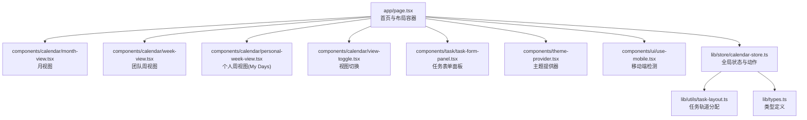
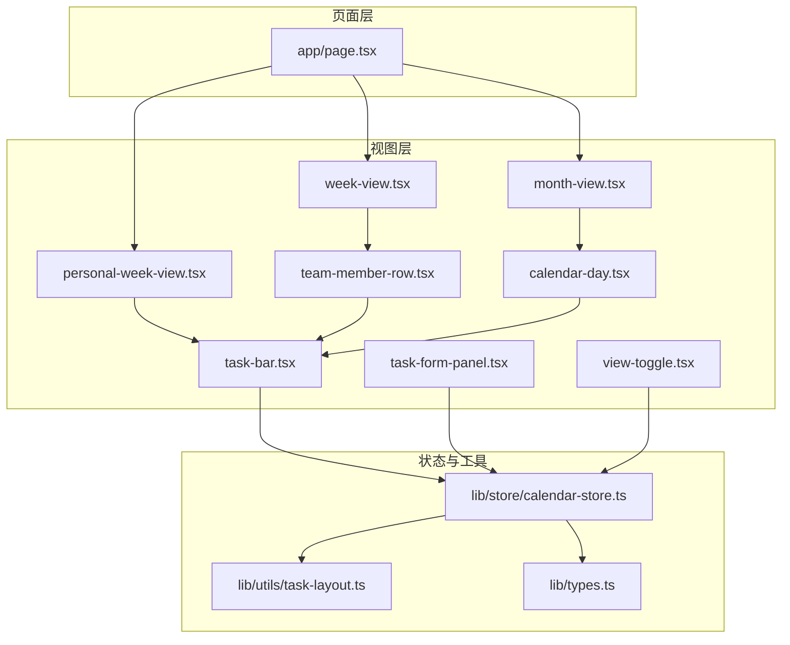
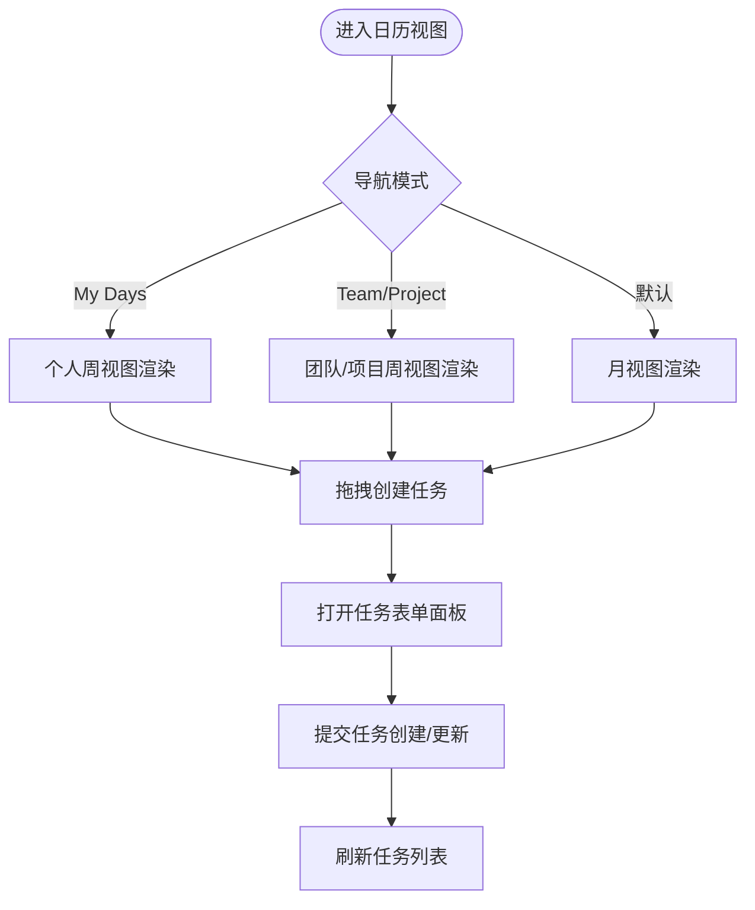
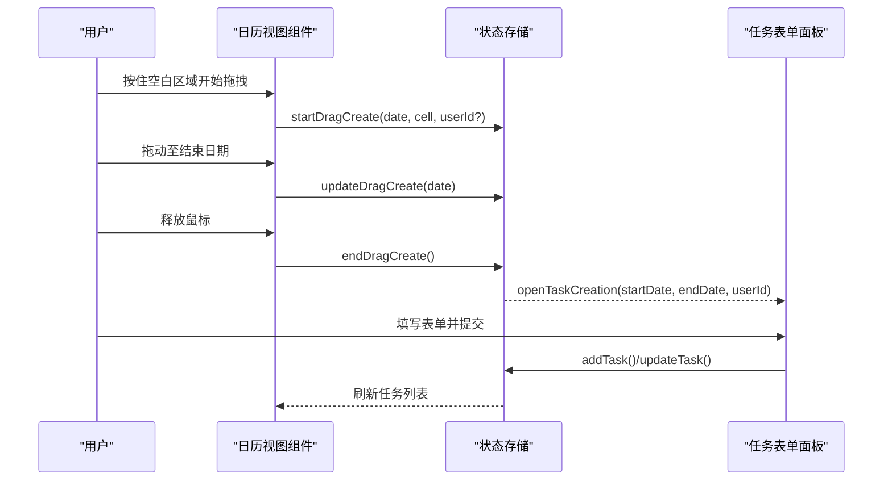
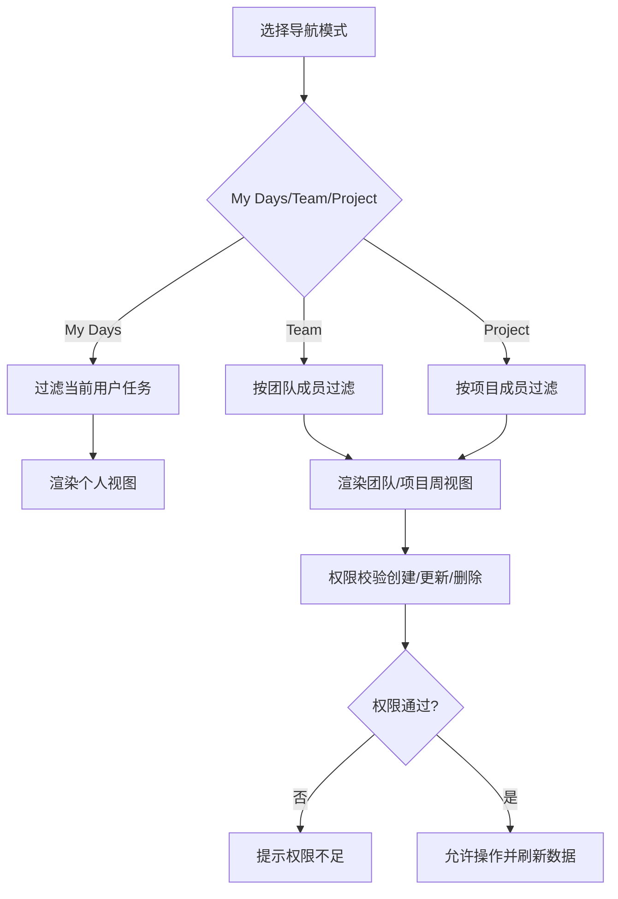
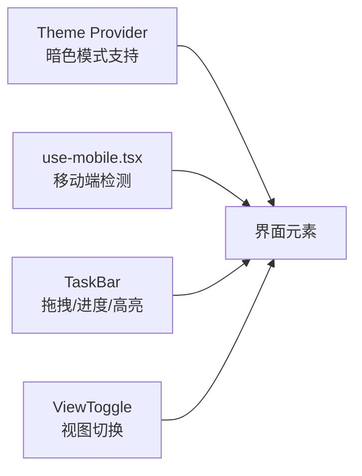
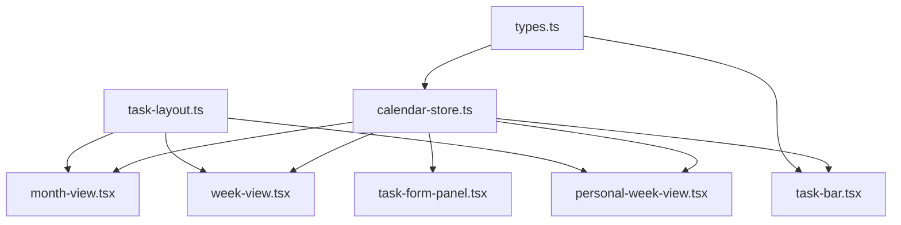

# 核心特性

<cite>
**本文引用的文件**
- [app/page.tsx](file://app/page.tsx)
- [components/calendar/month-view.tsx](file://components/calendar/month-view.tsx)
- [components/calendar/week-view.tsx](file://components/calendar/week-view.tsx)
- [components/calendar/personal-week-view.tsx](file://components/calendar/personal-week-view.tsx)
- [components/calendar/calendar-day.tsx](file://components/calendar/calendar-day.tsx)
- [components/calendar/team-member-row.tsx](file://components/calendar/team-member-row.tsx)
- [components/calendar/task-bar.tsx](file://components/calendar/task-bar.tsx)
- [components/calendar/view-toggle.tsx](file://components/calendar/view-toggle.tsx)
- [components/task/task-form-panel.tsx](file://components/task/task-form-panel.tsx)
- [components/theme-provider.tsx](file://components/theme-provider.tsx)
- [components/ui/use-mobile.tsx](file://components/ui/use-mobile.tsx)
- [lib/store/calendar-store.ts](file://lib/store/calendar-store.ts)
- [lib/utils/task-layout.ts](file://lib/utils/task-layout.ts)
- [lib/types.ts](file://lib/types.ts)
</cite>

## 目录
1. [简介](#简介)
2. [项目结构](#项目结构)
3. [核心组件](#核心组件)
4. [架构总览](#架构总览)
5. [详细组件分析](#详细组件分析)
6. [依赖关系分析](#依赖关系分析)
7. [性能考量](#性能考量)
8. [故障排查指南](#故障排查指南)
9. [结论](#结论)
10. [附录](#附录)

## 简介
本文件面向日历任务管理系统的核心特性说明，重点覆盖：
- 多视图日历系统：月视图、周视图、个人视图（My Days）及其适用场景
- 任务管理交互：拖拽创建、拖拽移动、进度调整
- 团队协作能力：团队/项目维度的导航与权限控制
- 用户界面设计：响应式布局、暗色模式支持与流畅动画
- 使用示例与最佳实践：帮助用户快速掌握系统

## 项目结构
系统采用前端单页应用架构，页面入口位于应用根目录，核心视图由页面组件组合而成；日历相关视图与交互逻辑集中在组件目录；状态管理采用轻量状态库，统一管理任务、项目、用户、团队与视图状态。

**图表来源**
- [app/page.tsx](file://app/page.tsx#L147-L233)
- [components/calendar/month-view.tsx](file://components/calendar/month-view.tsx#L9-L305)
- [components/calendar/week-view.tsx](file://components/calendar/week-view.tsx#L9-L108)
- [components/calendar/personal-week-view.tsx](file://components/calendar/personal-week-view.tsx#L10-L199)
- [components/calendar/view-toggle.tsx](file://components/calendar/view-toggle.tsx#L7-L51)
- [components/task/task-form-panel.tsx](file://components/task/task-form-panel.tsx#L49-L626)
- [components/theme-provider.tsx](file://components/theme-provider.tsx#L9-L11)
- [components/ui/use-mobile.tsx](file://components/ui/use-mobile.tsx#L5-L18)
- [lib/store/calendar-store.ts](file://lib/store/calendar-store.ts#L200-L800)
- [lib/utils/task-layout.ts](file://lib/utils/task-layout.ts#L28-L76)
- [lib/types.ts](file://lib/types.ts#L61-L141)

**章节来源**
- [app/page.tsx](file://app/page.tsx#L1-L234)

## 核心组件
- 页面与布局：首页负责加载认证、拉取数据、渲染侧边栏、顶部导航与主内容区，并根据视图模式与导航模式决定展示的视图。
- 日历视图：
  - 月视图：按周网格渲染，支持周末隐藏、任务轨道分配、拖拽创建、展开日期查看更多。
  - 周视图：团队/项目模式下按成员行渲染，支持拖拽创建与移动。
  - 个人周视图：My Days模式下的单行视图，聚焦当前用户任务。
- 任务条与表单：任务条支持拖拽移动、进度拖拽调整、悬停高亮与跨段高亮；任务表单支持创建/编辑、项目/团队选择、权限校验与提交。
- 状态与工具：Zustand 状态存储统一管理任务、项目、用户、团队、视图与拖拽状态；任务轨道分配算法保障重叠任务不遮挡。

**章节来源**
- [app/page.tsx](file://app/page.tsx#L104-L145)
- [components/calendar/month-view.tsx](file://components/calendar/month-view.tsx#L50-L101)
- [components/calendar/week-view.tsx](file://components/calendar/week-view.tsx#L29-L51)
- [components/calendar/personal-week-view.tsx](file://components/calendar/personal-week-view.tsx#L31-L47)
- [components/calendar/task-bar.tsx](file://components/calendar/task-bar.tsx#L98-L130)
- [components/task/task-form-panel.tsx](file://components/task/task-form-panel.tsx#L124-L210)
- [lib/store/calendar-store.ts](file://lib/store/calendar-store.ts#L233-L262)
- [lib/utils/task-layout.ts](file://lib/utils/task-layout.ts#L28-L68)

## 架构总览
系统采用“页面容器 + 组件视图 + 状态存储”的分层架构。页面容器负责路由与认证检查、数据加载与视图渲染；各日历视图通过状态存储读取数据并触发动作；任务条与表单组件通过状态存储进行数据更新与权限校验。

**图表来源**
- [app/page.tsx](file://app/page.tsx#L104-L145)
- [components/calendar/month-view.tsx](file://components/calendar/month-view.tsx#L25-L31)
- [components/calendar/week-view.tsx](file://components/calendar/week-view.tsx#L25-L26)
- [components/calendar/personal-week-view.tsx](file://components/calendar/personal-week-view.tsx#L11-L12)
- [components/calendar/calendar-day.tsx](file://components/calendar/calendar-day.tsx#L34-L35)
- [components/calendar/team-member-row.tsx](file://components/calendar/team-member-row.tsx#L19-L20)
- [components/calendar/task-bar.tsx](file://components/calendar/task-bar.tsx#L27-L39)
- [components/task/task-form-panel.tsx](file://components/task/task-form-panel.tsx#L49-L64)
- [components/calendar/view-toggle.tsx](file://components/calendar/view-toggle.tsx#L8-L9)
- [lib/store/calendar-store.ts](file://lib/store/calendar-store.ts#L200-L201)
- [lib/utils/task-layout.ts](file://lib/utils/task-layout.ts#L28-L68)
- [lib/types.ts](file://lib/types.ts#L61-L141)

## 详细组件分析

### 多视图日历系统
- 月视图（Month View）
  - 特点：按周网格渲染，支持周末隐藏、任务轨道分配、拖拽创建范围高亮、展开日期查看更多。
  - 交互：支持全局鼠标抬起结束拖拽；按导航模式过滤任务；每周独立分配轨道并计算行高。
  - 场景：适合宏观查看整月任务分布与堆积情况。
- 周视图（Team/Project）
  - 特点：按成员行渲染，支持按团队/项目过滤显示用户；拖拽创建与移动。
  - 场景：团队协作与项目管理，便于观察成员任务负载。
- 个人周视图（My Days）
  - 特点：单行视图，聚焦当前用户任务；支持拖拽创建与移动；按导航模式过滤任务。
  - 场景：个人任务管理与快速安排。

**图表来源**
- [app/page.tsx](file://app/page.tsx#L104-L117)
- [components/calendar/month-view.tsx](file://components/calendar/month-view.tsx#L38-L48)
- [components/calendar/week-view.tsx](file://components/calendar/week-view.tsx#L53-L68)
- [components/calendar/personal-week-view.tsx](file://components/calendar/personal-week-view.tsx#L16-L29)
- [components/task/task-form-panel.tsx](file://components/task/task-form-panel.tsx#L124-L210)

**章节来源**
- [components/calendar/month-view.tsx](file://components/calendar/month-view.tsx#L50-L174)
- [components/calendar/week-view.tsx](file://components/calendar/week-view.tsx#L29-L68)
- [components/calendar/personal-week-view.tsx](file://components/calendar/personal-week-view.tsx#L31-L144)

### 任务管理交互（拖拽创建、拖拽移动、进度调整）
- 拖拽创建
  - 月/周/个人视图均支持在空白区域按住并拖动以选择日期范围，释放后弹出任务表单。
  - 团队视图中，拖拽创建会限定目标用户（当前行用户）。
- 拖拽移动
  - 点击任务条并按住可开始拖拽移动；移动过程中实时更新任务条位置与跨段高亮；释放后提交更新。
- 进度调整
  - 日常任务支持在任务条上拖拽进度手柄，按“段内进度”映射到“总进度”，并使用乐观更新减少回弹。

**图表来源**
- [components/calendar/calendar-day.tsx](file://components/calendar/calendar-day.tsx#L88-L115)
- [components/calendar/team-member-row.tsx](file://components/calendar/team-member-row.tsx#L109-L141)
- [components/calendar/personal-week-view.tsx](file://components/calendar/personal-week-view.tsx#L113-L144)
- [lib/store/calendar-store.ts](file://lib/store/calendar-store.ts#L158-L183)
- [components/task/task-form-panel.tsx](file://components/task/task-form-panel.tsx#L124-L210)

**章节来源**
- [components/calendar/calendar-day.tsx](file://components/calendar/calendar-day.tsx#L88-L115)
- [components/calendar/team-member-row.tsx](file://components/calendar/team-member-row.tsx#L109-L141)
- [components/calendar/personal-week-view.tsx](file://components/calendar/personal-week-view.tsx#L113-L144)
- [components/calendar/task-bar.tsx](file://components/calendar/task-bar.tsx#L102-L130)
- [lib/store/calendar-store.ts](file://lib/store/calendar-store.ts#L158-L183)

### 团队协作与权限控制
- 导航模式
  - My Days：仅显示当前用户任务（负责人或创建人）。
  - Team：显示团队成员任务。
  - Project：显示项目成员任务。
- 权限控制
  - 任务权限策略：项目/团队可配置“全部成员”或“仅创建者”，系统在创建/更新/删除时进行权限校验并提示。
  - 任务移动与移出提醒：当任务被移出当前视图（如项目变更、负责人变更），系统会提示用户。

**图表来源**
- [components/calendar/month-view.tsx](file://components/calendar/month-view.tsx#L50-L101)
- [components/calendar/week-view.tsx](file://components/calendar/week-view.tsx#L29-L51)
- [lib/store/calendar-store.ts](file://lib/store/calendar-store.ts#L550-L748)

**章节来源**
- [components/calendar/month-view.tsx](file://components/calendar/month-view.tsx#L50-L101)
- [components/calendar/week-view.tsx](file://components/calendar/week-view.tsx#L29-L51)
- [lib/store/calendar-store.ts](file://lib/store/calendar-store.ts#L550-L748)

### 用户界面设计（响应式、暗色模式、动画）
- 响应式布局：移动端检测 Hook 在小屏设备上自动适配交互与显示密度。
- 暗色模式：通过主题提供器启用系统级明暗主题切换。
- 动画与交互：任务条拖拽移动具备阴影与层级提升；进度拖拽手柄使用 CSS hover 控制显示；跨段高亮通过全局 hover 状态实现。

**图表来源**
- [components/theme-provider.tsx](file://components/theme-provider.tsx#L9-L11)
- [components/ui/use-mobile.tsx](file://components/ui/use-mobile.tsx#L5-L18)
- [components/calendar/task-bar.tsx](file://components/calendar/task-bar.tsx#L462-L699)
- [components/calendar/view-toggle.tsx](file://components/calendar/view-toggle.tsx#L7-L51)

**章节来源**
- [components/theme-provider.tsx](file://components/theme-provider.tsx#L9-L11)
- [components/ui/use-mobile.tsx](file://components/ui/use-mobile.tsx#L5-L18)
- [components/calendar/task-bar.tsx](file://components/calendar/task-bar.tsx#L462-L699)

## 依赖关系分析
- 组件耦合
  - 日历视图组件依赖状态存储读取任务与设置；任务条组件依赖状态存储进行拖拽移动与进度更新。
  - 任务表单组件依赖状态存储进行创建/更新/删除，并进行权限校验。
- 状态管理
  - 状态存储集中管理任务、项目、用户、团队、视图模式、拖拽状态与设置；提供批量数据加载与刷新。
- 工具函数
  - 任务轨道分配算法保障重叠任务在同一日期不互相遮挡；类型定义统一前后端数据结构。

**图表来源**
- [lib/store/calendar-store.ts](file://lib/store/calendar-store.ts#L200-L800)
- [lib/utils/task-layout.ts](file://lib/utils/task-layout.ts#L28-L76)
- [lib/types.ts](file://lib/types.ts#L61-L141)
- [components/calendar/month-view.tsx](file://components/calendar/month-view.tsx#L25-L31)
- [components/calendar/week-view.tsx](file://components/calendar/week-view.tsx#L25-L26)
- [components/calendar/personal-week-view.tsx](file://components/calendar/personal-week-view.tsx#L11-L12)
- [components/calendar/task-bar.tsx](file://components/calendar/task-bar.tsx#L27-L39)
- [components/task/task-form-panel.tsx](file://components/task/task-form-panel.tsx#L49-L64)

**章节来源**
- [lib/store/calendar-store.ts](file://lib/store/calendar-store.ts#L200-L800)
- [lib/utils/task-layout.ts](file://lib/utils/task-layout.ts#L28-L76)
- [lib/types.ts](file://lib/types.ts#L61-L141)

## 性能考量
- 数据加载与延迟显示：状态存储对数据加载增加最小显示时长，避免闪烁；并发加载用户、团队、项目与任务。
- 任务轨道计算：按周/按日计算最大轨道数，动态设置容器高度，避免频繁重排。
- 拖拽优化：拖拽创建与移动使用全局 mouseup 事件收尾，避免状态悬挂；进度拖拽使用乐观更新减少回弹。
- 渲染优化：使用 useMemo 缓存过滤结果与轨道分配，降低重复计算。

**章节来源**
- [lib/store/calendar-store.ts](file://lib/store/calendar-store.ts#L289-L342)
- [components/calendar/month-view.tsx](file://components/calendar/month-view.tsx#L142-L174)
- [components/calendar/task-bar.tsx](file://components/calendar/task-bar.tsx#L358-L377)

## 故障排查指南
- 认证失败
  - 现象：加载时提示认证失败并跳转登录。
  - 排查：确认本地存储中的用户信息与 Token 是否存在；检查后端接口返回的错误消息。
- 权限不足
  - 现象：创建/更新/删除任务时报错。
  - 排查：确认项目/团队的权限策略（全部成员/仅创建者）；确认当前用户是否为创建者或项目/团队成员。
- 拖拽异常
  - 现象：拖拽创建/移动后未弹出表单或未更新任务。
  - 排查：检查全局 mouseup 事件是否正确绑定；确认 endDragCreate 返回的日期范围有效；确认 openTaskCreation 参数传递正确。
- 任务未显示
  - 现象：任务在预期视图中缺失。
  - 排查：检查导航模式与项目过滤；确认任务的负责人或创建人是否匹配当前用户；检查任务时间范围与视图日期范围重叠。

**章节来源**
- [app/page.tsx](file://app/page.tsx#L79-L92)
- [lib/store/calendar-store.ts](file://lib/store/calendar-store.ts#L550-L748)
- [components/calendar/month-view.tsx](file://components/calendar/month-view.tsx#L38-L48)
- [components/calendar/personal-week-view.tsx](file://components/calendar/personal-week-view.tsx#L113-L144)

## 结论
本系统围绕“多视图日历 + 任务交互 + 团队协作 + 界面体验”构建，通过清晰的组件分层与状态管理，实现了高效的任务编排与团队协同。月/周/个人视图满足不同场景需求；拖拽创建与移动、进度调整等交互提升了效率；权限控制与导航模式保障了协作边界；响应式与暗色模式增强了可用性与可访问性。

## 附录
- 使用示例与最佳实践
  - 快速创建：在月视图或周视图空白处按住并拖动选择日期范围，释放后填写任务表单并提交。
  - 快速移动：在任务条上按住并拖动到目标日期，释放后自动更新任务时间。
  - 进度调整：在日常任务条上拖动进度手柄，按段内进度映射到总进度，实时更新。
  - 视图切换：顶部“月度/周度”切换按钮可在不同视图间快速切换。
  - 导航模式：通过侧边栏切换 My Days、Team、Project，聚焦不同视角的任务。
  - 权限注意：若项目/团队设置为“仅创建者”，非创建者无法编辑或删除他人任务。