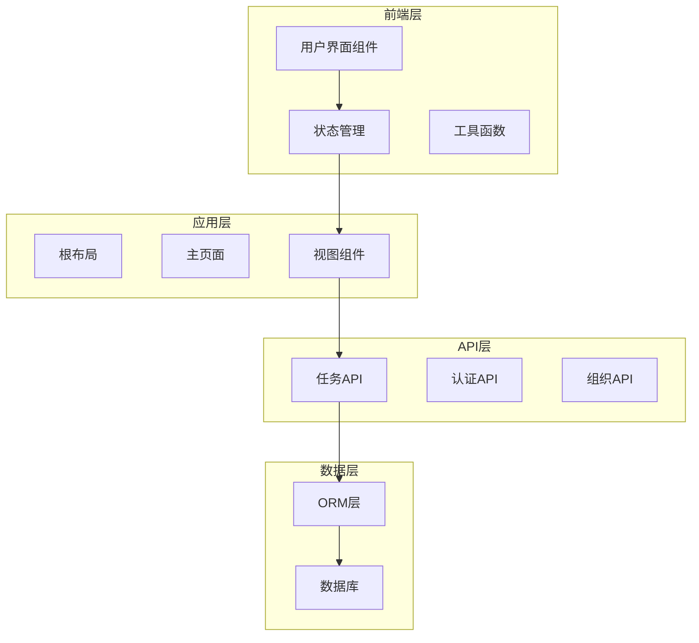
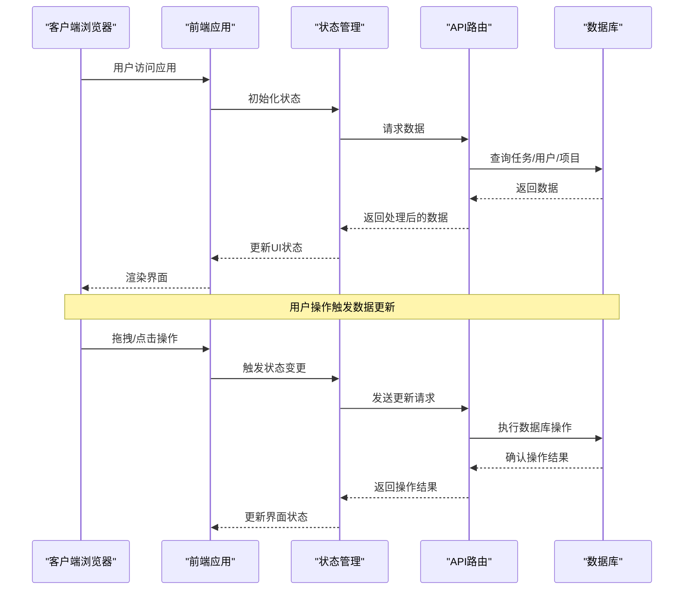
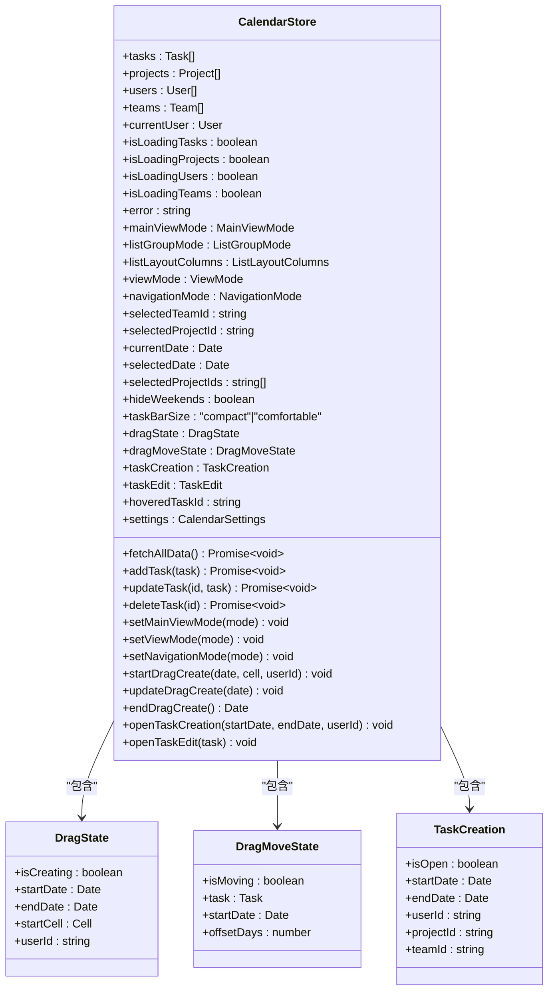
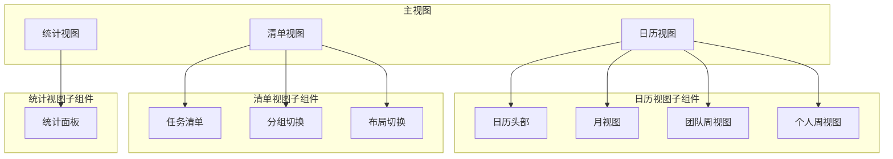
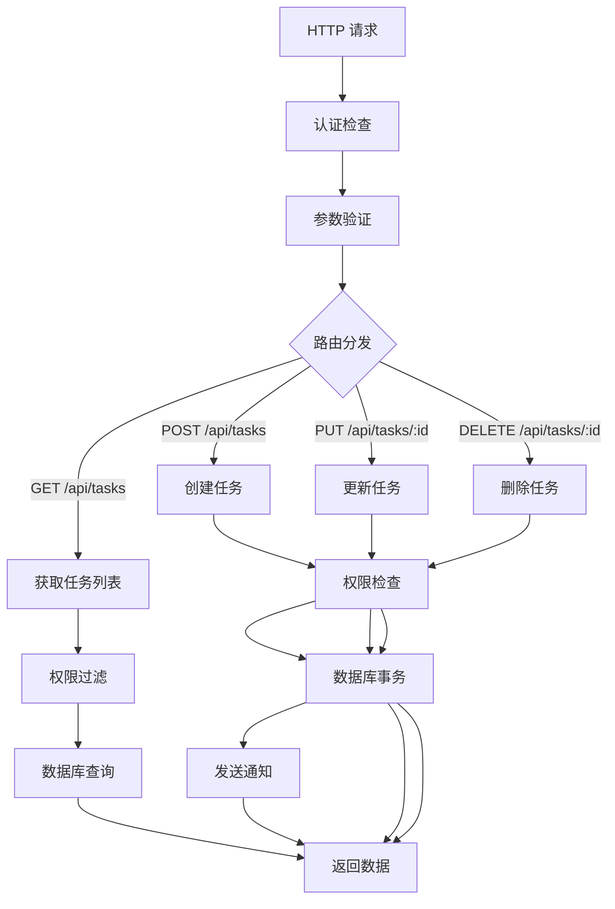
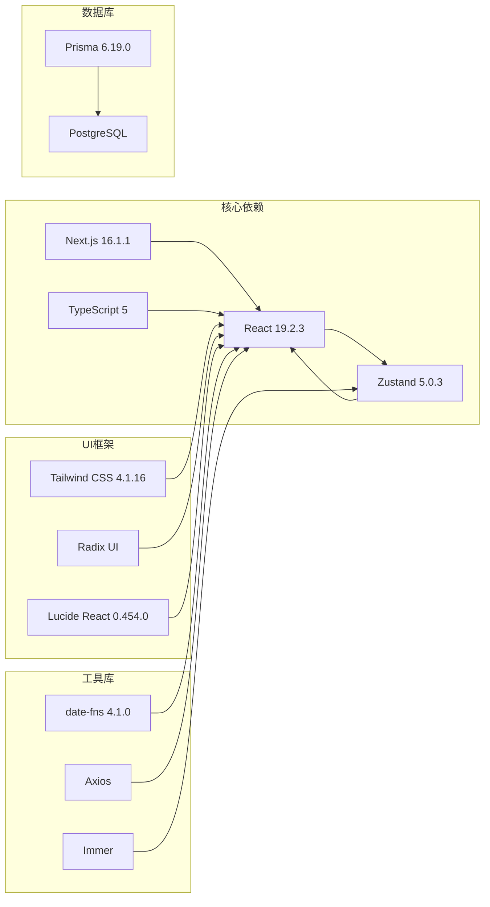

# 系统介绍

<cite>
**本文引用的文件**
- [README.md](file://README.md)
- [package.json](file://package.json)
- [app/layout.tsx](file://app/layout.tsx)
- [app/page.tsx](file://app/page.tsx)
- [lib/types.ts](file://lib/types.ts)
- [lib/store/calendar-store.ts](file://lib/store/calendar-store.ts)
- [lib/site-config.ts](file://lib/site-config.ts)
- [components/calendar/calendar-header.tsx](file://components/calendar/calendar-header.tsx)
- [components/calendar/month-view.tsx](file://components/calendar/month-view.tsx)
- [components/calendar/week-view.tsx](file://components/calendar/week-view.tsx)
- [components/calendar/personal-week-view.tsx](file://components/calendar/personal-week-view.tsx)
- [components/views/list-view.tsx](file://components/views/list-view.tsx)
- [components/views/stats-view.tsx](file://components/views/stats-view.tsx)
- [app/api/tasks/route.ts](file://app/api/tasks/route.ts)
</cite>

## 目录
1. [简介](#简介)
2. [项目结构](#项目结构)
3. [核心组件](#核心组件)
4. [架构概览](#架构概览)
5. [详细组件分析](#详细组件分析)
6. [依赖关系分析](#依赖关系分析)
7. [性能考虑](#性能考虑)
8. [故障排除指南](#故障排除指南)
9. [结论](#结论)

## 简介

OxHorse Planner 是一个功能完善的现代化日历任务管理系统，专为提升个人、团队和项目的工作效率而设计。该系统基于 Next.js 16+ 和 React 19+ 构建，采用 TypeScript 提供类型安全保障，支持多视图日历系统、智能任务管理、团队协作和丰富的可视化功能。

### 核心价值主张

**统一工作平台**：将传统的日历应用升级为综合性的任务管理平台，让用户在一个界面中完成所有工作安排。

**多维度视图切换**：提供月视图、周视图和个人周视图三种核心视图模式，满足不同场景下的任务管理需求。

**智能协作体验**：支持团队协作、项目管理和权限控制，确保信息共享的同时保护数据安全。

**直观的交互设计**：通过拖拽操作、实时预览和流畅动画，提供现代化的用户体验。

### 设计理念

系统采用"以任务为中心"的设计理念，将传统的日历概念扩展为任务调度平台。通过智能布局算法和多视图切换机制，用户可以灵活选择最适合当前工作场景的视图模式。

### 目标用户群体

- **个人用户**：需要管理个人事务、学习计划和生活安排的用户
- **团队管理者**：需要协调团队成员任务分配和进度跟踪的管理者
- **项目经理**：需要统筹项目进度、资源分配和里程碑管理的项目负责人
- **企业用户**：寻求统一工作平台来提升整体工作效率的组织

## 项目结构

系统采用现代前端架构，主要分为以下层次：

**图表来源**
- [app/layout.tsx](file://app/layout.tsx#L1-L45)
- [app/page.tsx](file://app/page.tsx#L1-L234)
- [lib/store/calendar-store.ts](file://lib/store/calendar-store.ts#L1-L800)

### 技术栈特色

- **Next.js 16.0.1**：支持 App Router 和 Turbopack，提供最佳的开发体验
- **React 19.0.2**：最新 React 版本，支持并发特性
- **TypeScript 5**：提供完整的类型安全保障
- **Zustand 5.0.3**：轻量级状态管理，替代 Redux
- **Tailwind CSS 4.1.16**：实用优先的 CSS 框架
- **Radix UI**：无样式的可访问组件库
- **PostgreSQL + Prisma**：下一代 ORM，提供强大的数据管理能力

**章节来源**
- [README.md](file://README.md#L81-L104)
- [package.json](file://package.json#L1-L75)

## 核心组件

### 多视图日历系统

系统提供三种核心视图模式，每种视图都有其特定的使用场景：

**月视图 (Month View)**
- 展示整个月的任务安排
- 支持跨天任务的智能布局
- 适合宏观任务规划和时间安排

**周视图 (Week View)**
- **个人周视图**：单行显示个人任务，自动计算行高
- **团队周视图**：多行显示团队成员任务，每人一行
- 适合详细的任务安排和进度跟踪

**智能导航**
- My Days（个人）/ My Teams（团队）/ My Projects（项目）三级导航
- 实时切换视图模式和导航模式
- 数据实时过滤和更新

### 任务管理功能

**拖拽操作**
- 拖拽创建：在日历上拖拽选择日期范围快速创建任务
- 拖拽移动：直接拖拽任务条调整日期，实时预览无占位符
- 进度调整：直接在任务条上拖拽调整进度（0-100%）

**任务类型**
- 📋 日常任务 (Daily) - 蓝色
- 📞 会议 (Meeting) - 黄色  
- 🏖️ 休假 (Vacation) - 红色

**跨天任务处理**
- 自动计算任务跨度
- 支持周截断显示
- 智能布局避免任务重叠

### 团队协作系统

**团队管理**
- 创建团队，设置名称、描述、颜色
- 多选成员添加到团队
- 查看团队所有成员的任务
- 默认团队：用户可设置默认团队，登录后自动标记

**项目管理**
- 创建项目，关联团队（可选）
- 多选项目成员
- 查看项目所有成员的任务

**权限控制**
- My Days：仅显示个人任务
- Team 模式：显示团队所有成员任务
- Project 模式：显示项目所有成员任务

**成员信息展示**
- 月视图任务条显示负责人头像+姓名
- 周视图通过行区分成员
- DiceBear API 生成个性化头像

**章节来源**
- [README.md](file://README.md#L7-L80)

## 架构概览

系统采用前后端分离架构，前端使用 Next.js 构建，后端通过 API 路由提供服务。

**图表来源**
- [app/page.tsx](file://app/page.tsx#L26-L234)
- [lib/store/calendar-store.ts](file://lib/store/calendar-store.ts#L455-L546)
- [app/api/tasks/route.ts](file://app/api/tasks/route.ts#L18-L273)

### 数据流设计

系统采用单向数据流设计，确保状态的一致性和可预测性：

1. **初始化阶段**：应用启动时加载用户信息和基础数据
2. **用户交互**：用户通过界面操作触发状态变更
3. **状态更新**：Zustand 状态管理器更新应用状态
4. **数据同步**：异步与后端 API 同步数据变更
5. **界面渲染**：React 组件根据状态变化重新渲染

**章节来源**
- [lib/store/calendar-store.ts](file://lib/store/calendar-store.ts#L200-L270)

## 详细组件分析

### 状态管理架构

系统使用 Zustand 作为状态管理解决方案，提供了轻量级但功能强大的状态管理能力。

**图表来源**
- [lib/store/calendar-store.ts](file://lib/store/calendar-store.ts#L33-L198)

### 视图组件体系

系统实现了完整的视图组件体系，支持多种视图模式的无缝切换。

**图表来源**
- [app/page.tsx](file://app/page.tsx#L103-L145)
- [components/calendar/calendar-header.tsx](file://components/calendar/calendar-header.tsx#L12-L127)
- [components/views/list-view.tsx](file://components/views/list-view.tsx#L22-L374)
- [components/views/stats-view.tsx](file://components/views/stats-view.tsx#L12-L309)

### API 服务架构

系统通过 Next.js App Router 提供 RESTful API 服务，支持完整的 CRUD 操作。

**图表来源**
- [app/api/tasks/route.ts](file://app/api/tasks/route.ts#L18-L497)

**章节来源**
- [lib/store/calendar-store.ts](file://lib/store/calendar-store.ts#L200-L800)
- [app/api/tasks/route.ts](file://app/api/tasks/route.ts#L18-L273)

## 依赖关系分析

系统采用模块化设计，各组件之间保持低耦合高内聚的关系。

**图表来源**
- [package.json](file://package.json#L11-L75)

### 组件依赖关系

系统组件之间的依赖关系清晰明确，遵循单一职责原则：

- **页面组件**：依赖于状态管理器和视图组件
- **视图组件**：依赖于工具函数和数据模型
- **工具函数**：提供通用的功能支持
- **状态管理**：集中管理应用状态

**章节来源**
- [package.json](file://package.json#L11-L75)

## 性能考虑

系统在设计时充分考虑了性能优化，采用了多种策略来提升用户体验：

### 状态管理优化
- 使用 Zustand 替代 Redux，减少不必要的重渲染
- 采用分片状态管理，避免全局状态更新
- 实现状态持久化，提升用户体验

### 数据加载优化
- 实现懒加载和按需加载
- 使用缓存策略减少重复请求
- 优化数据结构，提升查询效率

### UI渲染优化
- 实现虚拟滚动，处理大量数据
- 采用防抖和节流技术
- 优化重排重绘，提升渲染性能

## 故障排除指南

### 常见问题及解决方案

**认证失败**
- 检查本地存储中的用户信息和 token
- 确认服务器端认证服务正常运行
- 验证用户权限和组织成员身份

**数据加载异常**
- 检查网络连接和 API 服务状态
- 验证数据库连接和查询语句
- 查看浏览器开发者工具中的错误信息

**视图渲染问题**
- 确认状态管理器中的数据完整性
- 检查组件的 props 传递
- 验证 CSS 样式冲突

**章节来源**
- [lib/store/calendar-store.ts](file://lib/store/calendar-store.ts#L320-L342)
- [app/page.tsx](file://app/page.tsx#L79-L92)

## 结论

OxHorse Planner 作为一个现代化的日历任务管理系统，在以下几个方面表现出色：

**技术创新**：采用最新的前端技术栈，提供优秀的开发体验和用户体验。

**功能完善**：涵盖个人、团队和项目管理的全方位需求，支持多视图切换和智能协作。

**架构合理**：采用模块化设计和清晰的依赖关系，便于维护和扩展。

**性能优秀**：通过多种优化策略，确保系统的高效运行。

该系统特别适合需要统一工作平台的企业和个人用户，能够显著提升工作效率和协作质量。通过持续的功能迭代和技术优化，OxHorse Planner 有望成为日历任务管理领域的标杆产品。