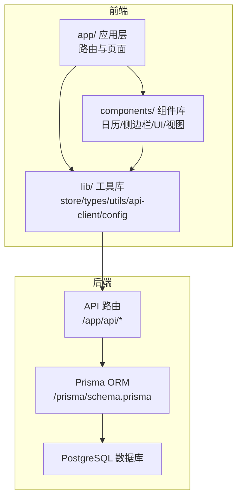
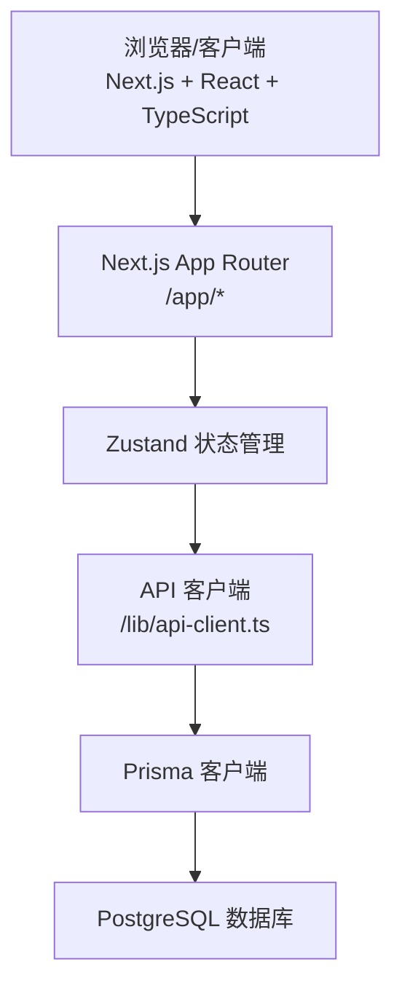
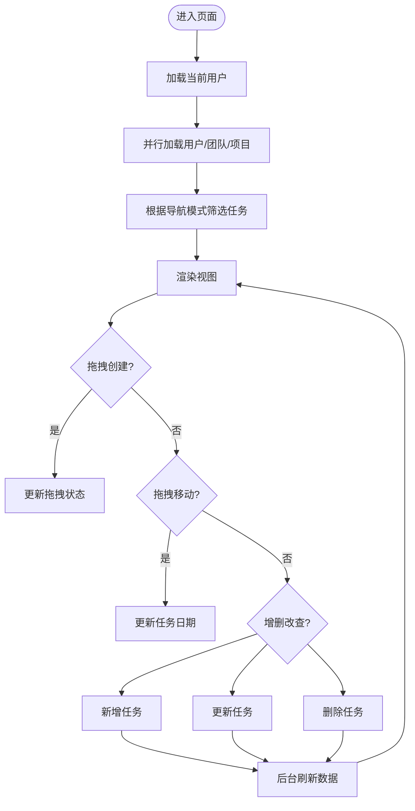
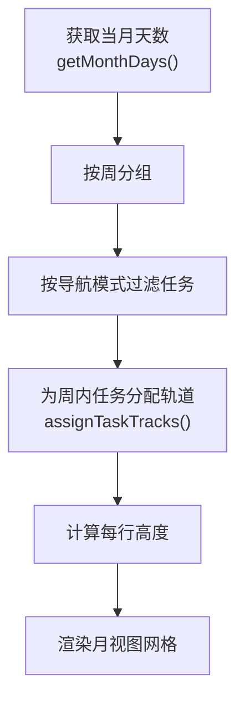
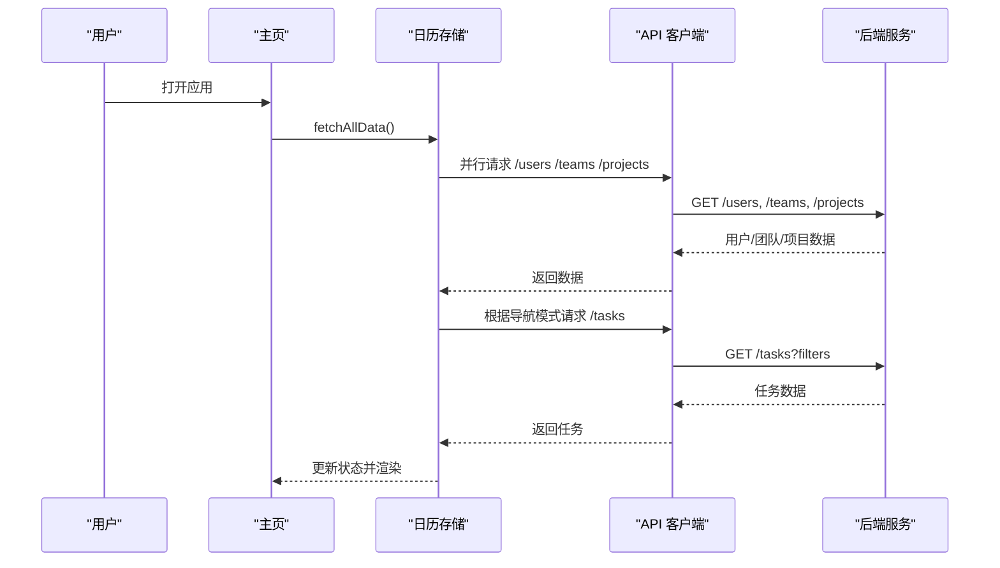
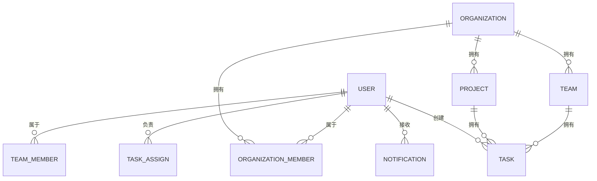
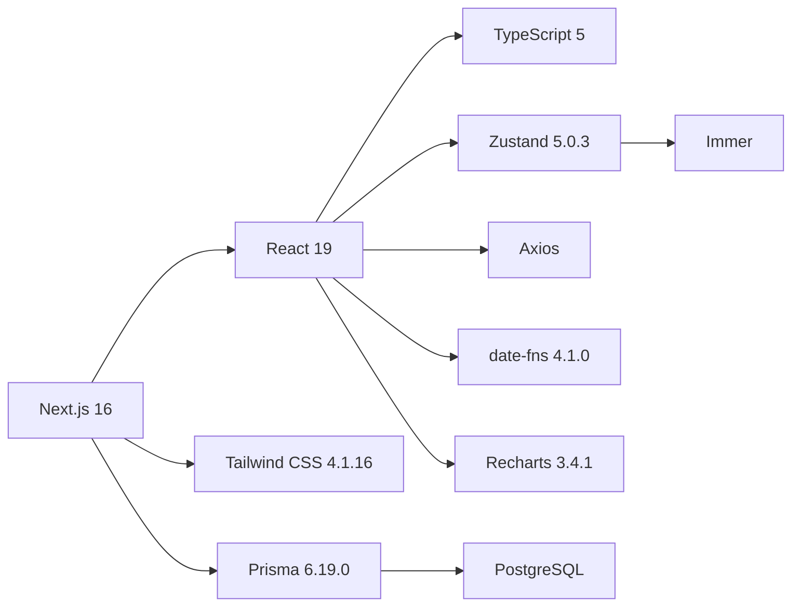

# 项目概述

<cite>
**本文档引用的文件**
- [README.md](file://README.md)
- [package.json](file://package.json)
- [prisma/schema.prisma](file://prisma/schema.prisma)
- [next.config.mjs](file://next.config.mjs)
- [tailwind.config.js](file://tailwind.config.js)
- [lib/store/calendar-store.ts](file://lib/store/calendar-store.ts)
- [lib/types.ts](file://lib/types.ts)
- [lib/utils/date-utils.ts](file://lib/utils/date-utils.ts)
- [app/layout.tsx](file://app/layout.tsx)
- [app/page.tsx](file://app/page.tsx)
- [components/calendar/calendar-header.tsx](file://components/calendar/calendar-header.tsx)
- [components/calendar/month-view.tsx](file://components/calendar/month-view.tsx)
- [components/calendar/week-view.tsx](file://components/calendar/week-view.tsx)
- [lib/api-client.ts](file://lib/api-client.ts)
- [lib/config.ts](file://lib/config.ts)
</cite>

## 目录
1. [简介](#简介)
2. [项目结构](#项目结构)
3. [核心组件](#核心组件)
4. [架构总览](#架构总览)
5. [详细组件分析](#详细组件分析)
6. [依赖分析](#依赖分析)
7. [性能考虑](#性能考虑)
8. [故障排除指南](#故障排除指南)
9. [结论](#结论)
10. [附录](#附录)

## 简介
OxHorse Planner 是一个现代化的日历任务管理系统，支持个人、团队与项目三层视图模式，提供多视图日历、任务管理、团队协作与权限控制等能力。系统基于 Next.js 16 与 React 19 构建，采用 TypeScript 提供类型安全，前端状态管理使用 Zustand，数据库采用 PostgreSQL + Prisma。

- 核心价值主张
  - 一体化日历与任务管理：月视图、周视图与个人/团队/项目导航模式无缝切换，支持拖拽创建与移动、进度调整、跨天任务与智能布局。
  - 团队协作与权限：支持团队/项目成员管理、任务权限策略（所有成员/仅创建者）、组织空间与邀请机制。
  - 高可用与易部署：Docker 化部署、离线镜像打包、多环境配置与自动化脚本，满足企业内网与公网部署需求。

- 目标用户
  - 个人用户：管理日常任务、会议与休假，快速查看与调整日程。
  - 团队与项目管理者：统一安排任务、追踪进度、控制任务可见性与权限。
  - IT/运维团队：通过 Docker 与自动化脚本进行标准化部署与维护。

- 应用场景
  - 个人日程规划与任务追踪
  - 跨部门项目协作与里程碑管理
  - 团队工作流编排与可视化排班

**章节来源**
- [README.md](file://README.md#L1-L175)

## 项目结构
项目采用 Next.js App Router 目录结构，核心目录说明如下：
- app/: 应用入口与路由，包含根布局、主页与 API 路由
- components/: 可复用 UI 组件，按功能域划分（calendar、sidebar、task、ui、views）
- lib/: 工具库与业务逻辑，包含状态管理（store）、类型定义（types）、工具函数（utils）、API 客户端（api-client）、配置（config）等
- prisma/: 数据库模型与迁移文件
- public/: 静态资源
- deploy/: 部署相关脚本与文档
- scripts/: 数据库迁移、清理与诊断脚本

**图表来源**
- [app/layout.tsx](file://app/layout.tsx#L25-L44)
- [app/page.tsx](file://app/page.tsx#L26-L234)
- [lib/api-client.ts](file://lib/api-client.ts#L1-L525)
- [prisma/schema.prisma](file://prisma/schema.prisma#L1-L314)

**章节来源**
- [README.md](file://README.md#L139-L166)

## 核心组件
- 状态管理（Zustand）
  - 全局状态集中于日历存储，包含任务、项目、用户、团队、视图模式、导航模式、拖拽状态、设置等。
  - 支持数据加载、增删改查、权限校验、拖拽交互与设置持久化。
- 日历视图
  - 月视图：智能布局算法为跨天任务分配轨道，支持周末隐藏、任务条大小切换、周截断显示。
  - 周视图：团队/项目模式下按成员行展示，个人模式下单行展示。
- 任务管理
  - 拖拽创建/移动、进度滑块、任务类型（日常/会议/休假）、负责人与项目归属。
- 团队与项目
  - 团队/项目创建、成员管理、默认团队/项目设置、权限策略（所有成员/仅创建者）。
- UI 与交互
  - 响应式设计、暗色模式、流畅动画、Toast 通知、头像服务集成。

**章节来源**
- [lib/store/calendar-store.ts](file://lib/store/calendar-store.ts#L1-L800)
- [lib/types.ts](file://lib/types.ts#L1-L141)
- [components/calendar/month-view.tsx](file://components/calendar/month-view.tsx#L1-L306)
- [components/calendar/week-view.tsx](file://components/calendar/week-view.tsx#L1-L109)
- [README.md](file://README.md#L7-L80)

## 架构总览
系统采用前后端分离的架构，前端通过 API 客户端与后端 API 路由通信，数据持久化由 Prisma 管理，数据库为 PostgreSQL。部署支持 Docker 与离线镜像打包，适配多环境。

**图表来源**
- [app/page.tsx](file://app/page.tsx#L26-L234)
- [lib/api-client.ts](file://lib/api-client.ts#L1-L525)
- [prisma/schema.prisma](file://prisma/schema.prisma#L1-L314)

**章节来源**
- [README.md](file://README.md#L81-L104)
- [package.json](file://package.json#L1-L75)

## 详细组件分析

### 状态管理与数据流（Zustand）
- 状态结构
  - 数据：任务、项目、用户、团队、当前用户
  - 视图：主视图模式（日历/清单/统计）、列表分组与布局、视图模式（月/周/个人）、导航模式（我的/团队/项目）、当前日期与选中日期、周末隐藏、任务条大小
  - 拖拽：创建与移动状态、悬停任务 ID
  - 设置：记住最后项目、最后选中项目 ID
- 行为
  - 数据加载：fetchAllData 并行加载用户、团队、项目与任务；根据导航模式筛选任务
  - 任务 CRUD：addTask/updateTask/deleteTask，含权限校验与后台刷新
  - 视图切换：setMainViewMode/setViewMode/setNavigationMode/toggleWeekends/setTaskBarSize
  - 拖拽：startDragCreate/updateDragCreate/endDragCreate/cancelDragCreate；startDragMove/updateDragMove/endDragMove/cancelDragMove
  - 设置：updateSettings、setCurrentUserFromStorage
- 错误处理
  - 统一错误处理与 Toast 提示；认证失败时清空本地用户并跳转登录

**图表来源**
- [lib/store/calendar-store.ts](file://lib/store/calendar-store.ts#L270-L546)

**章节来源**
- [lib/store/calendar-store.ts](file://lib/store/calendar-store.ts#L1-L800)

### 日历视图与布局算法
- 月视图
  - 通过日期工具生成当月天数（支持隐藏周末），按周分组并为每周末任务分配轨道，计算行高以避免重叠。
  - 支持拖拽创建与移动、展开日期查看详情、自动滚动到本周。
- 周视图
  - 根据导航模式过滤显示用户（团队/项目/全部），按成员行展示任务。
- 日期工具
  - 提供月/周日期序列生成、同日判断、格式化与星期名称映射。

**图表来源**
- [components/calendar/month-view.tsx](file://components/calendar/month-view.tsx#L104-L174)
- [lib/utils/date-utils.ts](file://lib/utils/date-utils.ts#L1-L86)

**章节来源**
- [components/calendar/month-view.tsx](file://components/calendar/month-view.tsx#L1-L306)
- [components/calendar/week-view.tsx](file://components/calendar/week-view.tsx#L1-L109)
- [lib/utils/date-utils.ts](file://lib/utils/date-utils.ts#L1-L86)

### API 客户端与认证流程
- API 客户端
  - 统一封装 fetch 请求，自动注入 Authorization 头，处理 401 清除 token，兼容新旧返回格式。
  - 提供任务、用户、项目、团队、认证等模块接口。
- 认证流程
  - 登录/注册成功后保存 token，后续请求自动携带；401 自动跳转登录页。

**图表来源**
- [app/page.tsx](file://app/page.tsx#L46-L60)
- [lib/store/calendar-store.ts](file://lib/store/calendar-store.ts#L455-L546)
- [lib/api-client.ts](file://lib/api-client.ts#L44-L100)

**章节来源**
- [lib/api-client.ts](file://lib/api-client.ts#L1-L525)
- [app/page.tsx](file://app/page.tsx#L26-L234)

### 数据模型与权限策略
- 数据模型
  - 组织（Organization）、组织成员（OrganizationMember）、用户（User）、团队（Team）、项目（Project）、任务（Task）、通知（Notification）、邀请与加入请求等。
- 权限策略
  - 任务权限：ALL_MEMBERS（所有成员）或 CREATOR_ONLY（仅创建者）。
  - 任务 CRUD 前进行权限校验，不满足条件时提示“权限不足”。

**图表来源**
- [prisma/schema.prisma](file://prisma/schema.prisma#L16-L314)

**章节来源**
- [prisma/schema.prisma](file://prisma/schema.prisma#L1-L314)
- [lib/store/calendar-store.ts](file://lib/store/calendar-store.ts#L550-L776)

## 依赖分析
- 前端依赖
  - Next.js 16、React 19、TypeScript 5、Tailwind CSS 4.1.16、Radix UI、Lucide React、Zustand、Immer、Axios、date-fns、Recharts 等。
- 后端与数据库
  - Prisma 6.19.0、PostgreSQL、Docker。
- 构建与运行
  - Next.js standalone 输出、禁用部分字体优化以适配 Docker 构建、Tailwind 内容路径配置。

**图表来源**
- [package.json](file://package.json#L11-L75)
- [next.config.mjs](file://next.config.mjs#L1-L20)
- [tailwind.config.js](file://tailwind.config.js#L1-L12)

**章节来源**
- [package.json](file://package.json#L1-L75)
- [next.config.mjs](file://next.config.mjs#L1-L20)
- [tailwind.config.js](file://tailwind.config.js#L1-L12)

## 性能考虑
- 状态与渲染
  - 使用 Zustand 轻量状态管理，避免不必要的重渲染；月视图按周分配轨道并计算最小行高，减少 DOM 重排。
- 数据加载
  - fetchAllData 并行加载用户、团队、项目，降低首屏等待；使用 loading 延迟与过渡动画提升体验。
- 拖拽交互
  - 全局 mouseup 事件清理拖拽状态，避免内存泄漏；拖拽移动采用乐观更新，结束后异步刷新数据。
- 部署与缓存
  - Next.js standalone 输出与 Docker 化部署，减少冷启动；静态资源与字体优化适配生产环境。

[本节为通用性能建议，无需特定文件引用]

## 故障排除指南
- 认证失败
  - 现象：出现“认证失败，请重新登录”提示并跳转登录页。
  - 处理：检查本地 token 是否存在与有效，必要时重新登录。
- 数据加载异常
  - 现象：任务/项目/用户加载失败或空白。
  - 处理：查看网络面板与控制台错误，确认 API 可达与返回格式；检查本地存储的用户信息是否有效。
- 拖拽状态异常
  - 现象：拖拽创建/移动后状态未恢复。
  - 处理：确保全局 mouseup 事件正确触发；检查拖拽状态初始化与清理逻辑。
- 头像加载问题
  - 现象：头像无法显示或加载缓慢。
  - 处理：检查 AVATAR_API_URL 环境变量配置，确认内网/公网可达；必要时切换为 DiceBear 公网服务。

**章节来源**
- [lib/api-client.ts](file://lib/api-client.ts#L72-L82)
- [app/page.tsx](file://app/page.tsx#L80-L92)
- [lib/store/calendar-store.ts](file://lib/store/calendar-store.ts#L388-L452)
- [lib/config.ts](file://lib/config.ts#L1-L30)

## 结论
OxHorse Planner 通过现代化前端技术栈与清晰的数据模型，提供了高效、直观的日历与任务管理体验。其模块化组件、状态管理与权限控制，既适合个人使用，也能支撑团队与项目的协作需求。结合 Docker 化与多环境部署方案，能够稳定落地于不同规模的组织环境中。

[本节为总结性内容，无需特定文件引用]

## 附录
- 部署与开发
  - Docker 离线部署与开发环境启动步骤详见项目文档与脚本。
- 版本与演进
  - 项目持续迭代中，数据库迁移与 API 改进在迁移脚本与文档中有详细记录。

**章节来源**
- [README.md](file://README.md#L105-L138)