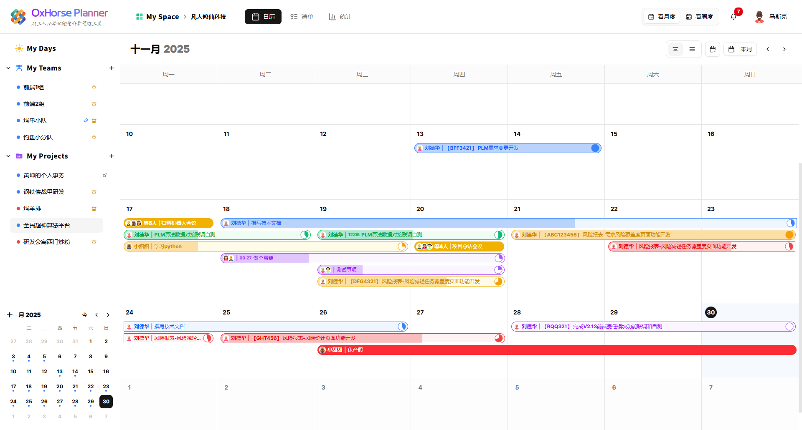

# OxHorse Planner




一个面向个人、团队和项目协作的日历任务管理系统，支持任务排期、团队协同、项目视图、计划面板和离线部署升级。

访问地址：https://souxy.com

## 本版本新增

- 团队列表和项目列表支持拖拽排序，顺序可持久化保存。
- 项目归档升级为成员维度，每个成员都可以归档或取消归档自己的项目视图。
- 任务支持定时任务和重复生成，可按周、按月或按指定天数生成后续事项。
- 周视图和月视图支持法定节假日展示，并在首次访问接口时自动写入节假日数据。
- 计划面板中的事项支持通过左侧拖拽把手进行上下排序，并处理了 hover 残影、插入指示线和同步 loading 的交互细节。
- 补充了内网离线升级文档，包含 `_prisma_migrations` 补齐、Prisma 迁移恢复和手工 SQL 升级说明。

## 核心能力

### 日历与任务

- 支持月视图、个人周视图、团队周视图和项目视图。
- 支持拖拽创建、拖拽移动、跨天显示和进度调整。
- 任务可设置类型、负责人、项目归属、描述和时间范围。
- 编辑定时任务时可以终止未来未发生的后续事项。

### 团队与项目协作

- 支持团队创建、成员分配、默认团队设置和团队任务聚合展示。
- 支持项目创建、项目成员选择、项目视图切换和成员级项目归档。
- 侧边栏支持团队、项目排序和常用组织结构管理。

### 计划面板

- 支持计划分类、卡片和事项管理。
- 事项支持勾选、删除、双击编辑和拖拽排序。
- 自定义数据更新 loading 以右下角悬浮方式展示，减少对内容区域的干扰。

### 部署与运维

- 支持 Docker 容器化部署。
- 支持内网离线镜像导入、数据库迁移和生产库升级。
- 针对 `_prisma_migrations` 不完整的生产环境，提供 `prisma migrate resolve --applied` 的标准补齐方案。

## 技术栈

- Next.js 16
- React 19
- TypeScript 5
- Zustand
- Tailwind CSS 4
- Radix UI
- Prisma
- PostgreSQL
- Docker

## 文档入口

- 离线升级实操：[docs/deployment/2026-05-12-offline-upgrade-to-2026-05-07-runbook.md](./docs/deployment/2026-05-12-offline-upgrade-to-2026-05-07-runbook.md)
- 版本更新与数据库说明：[docs/deployment/2026-05-07-post-2026-04-15-update.md](./docs/deployment/2026-05-07-post-2026-04-15-update.md)
- 手工 SQL 同步脚本：[release/2026-05-07-post-2026-04-15/database-sync-post-2026-04-15.sql](./release/2026-05-07-post-2026-04-15/database-sync-post-2026-04-15.sql)

## 开发启动

```bash
pnpm install
docker compose up -d postgres
npx prisma migrate dev
pnpm dev
```

默认开发访问地址：

- `http://localhost:3000`

## 许可证

MIT License
